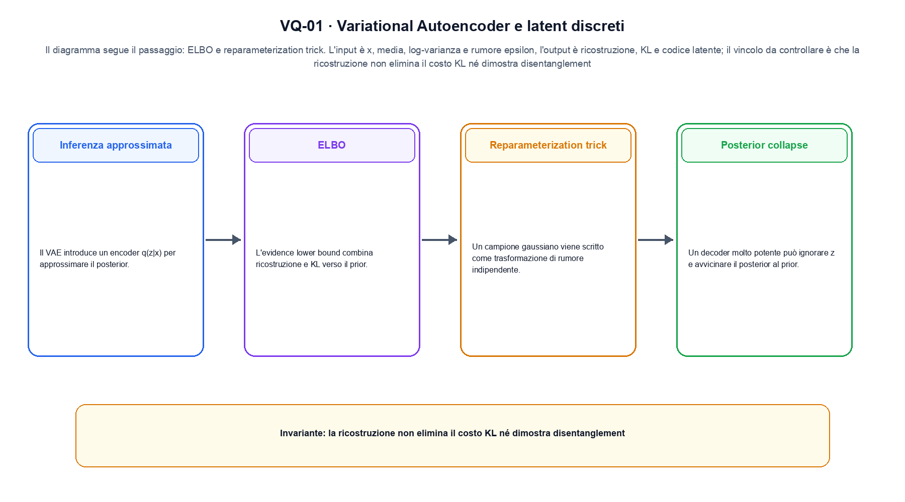
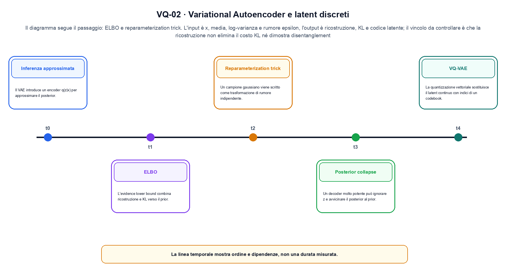

<!--
chapter_id: CH-P05-VAE-VQ
part_id: P05
order_key: 220
title: Variational Autoencoder e latent discreti
maturity: CORE
status: candidatura completa in revisione autoriale
version: 0.4.0-draft2
last_source_check: 3 agosto 2026
environment: Python 3.13.12, CPU
deferred: benchmark applicativi, varianti non necessarie al contratto centrale e approvazione autoriale
-->

# Capitolo 22. Variational Autoencoder e latent discreti

Il risultato precedente non è ancora una soluzione completa. Partiamo da una variabile osservata e il suo codice latente e dalla richiesta «Il pacco non è arrivato» come esempio comune; per arrivare all'output «ricostruzione, KL e codice latente» isoliamo il passaggio «ELBO e reparameterization trick» e ne misuriamo il limite prima di passare a Generative Adversarial Network.

## Inferenza approssimata

Il VAE introduce un encoder q(z|x) per approssimare il posterior. Il decoder modella p(x|z). [SRC-22-001]

Il caso minimo di «Inferenza approssimata» si presenta così: un caso minimo con input x, media, log-varianza e rumore epsilon e output «ricostruzione, KL e codice latente». Non lo usiamo come decorazione: serve a rendere osservabile la frase «Il VAE introduce un encoder q(z|x) per approssimare il posterior».

Per ricostruire «Inferenza approssimata» annotiamo l'input «x, media, log-varianza e rumore epsilon», poi l'operazione «ELBO e reparameterization trick», infine l'output «ricostruzione, KL e codice latente». Questa sequenza impedisce di scambiare una forma compatibile per il comportamento descritto dalla fonte. Il controllo parte da «Il VAE introduce un encoder q(z|x) per approssimare il posterior».

Il passaggio da seguire in «Inferenza approssimata» è quello descritto dalla frase «Il VAE introduce un encoder q(z|x) per approssimare il posterior»: l'esempio rende osservabile la trasformazione, mentre il contratto del capitolo ne delimita l'interpretazione. Per «Inferenza approssimata» il controllo cambia una sola premessa della frase «Il VAE introduce un encoder q(z|x) per approssimare il posterior» e conserva input, output e criterio di successo, così la differenza resta attribuibile. La verifica resta ancorata a «Il VAE introduce un encoder q(z|x) per approssimare il posterior». [SRC-22-001]

Il punto didattico di «Inferenza approssimata» è separare ciò che la fonte afferma da ciò che il piccolo caso illustra. L'output «ricostruzione, KL e codice latente» mostra il contratto locale, ma non sostituisce una misura sul sistema completo.

Il controllo minimo di «Inferenza approssimata» confronta il caso dichiarato con una variazione che rompe la sua ipotesi. Se la failure non è distinguibile dall'esito valido, manca un'osservazione nel contratto del rapporto tra distribuzione e campione. Da «Inferenza approssimata» portiamo l'output «ricostruzione, KL e codice latente»; non portiamo invece una conclusione oltre il caso locale.

## ELBO

L'evidence lower bound combina ricostruzione e KL verso il prior. Massimizzare l'ELBO non coincide necessariamente con massimizzare qualità percettiva. [SRC-22-002]

Prima del nome tecnico fissiamo la situazione: consideriamo un dato trasformato e ricostruito con la quantità di probabilità o di errore dichiarata. Da qui possiamo leggere la conseguenza dichiarata da «L'evidence lower bound combina ricostruzione e KL verso il prior».

Nel contratto locale, l'input «x, media, log-varianza e rumore epsilon» entra, l'operazione «ELBO e reparameterization trick» modifica il percorso e l'output «ricostruzione, KL e codice latente» è ciò che osserviamo. Qui cambia soprattutto il passaggio «ELBO»; resta da controllare che la ricostruzione non elimina il costo KL né dimostra disentanglement. La domanda locale è «L'evidence lower bound combina ricostruzione e KL verso il prior».

Il latent collega encoder e decoder, mentre il termine di ricostruzione e quello di regolarizzazione spingono in direzioni diverse. Il campionamento resta addestrabile soltanto quando il percorso del gradiente è dichiarato. Per «ELBO» il controllo cambia una sola premessa della frase «L'evidence lower bound combina ricostruzione e KL verso il prior» e conserva input, output e criterio di successo, così la differenza resta attribuibile. La verifica resta ancorata a «L'evidence lower bound combina ricostruzione e KL verso il prior». [SRC-22-002]

La lettura va fatta in ordine: prima il caso, poi la trasformazione, quindi la conseguenza. Massimizzare l'ELBO non coincide necessariamente con massimizzare qualità percettiva. Il piccolo risultato resta un'illustrazione di «L'evidence lower bound combina ricostruzione e KL verso il prior», non una promessa generale.

La prova di «ELBO» conserva input, operazione e output; poi esplicita quale parte di «L'evidence lower bound combina ricostruzione e KL verso il prior» non è stata misurata. Così il test separa l'evidenza dall'inferenza. Il passaggio successivo, «Reparameterization trick», potrà cambiare una sola condizione, dichiarando il nuovo setup prima di interpretare il risultato.

## Reparameterization trick

Un campione gaussiano viene scritto come trasformazione di rumore indipendente. Questo consente gradienti pathwise. [SRC-22-003]

Per capire «Reparameterization trick» partiamo da questo caso: un caso in cui la ricostruzione non elimina il costo KL né dimostra disentanglement. Il caso rende osservabile il punto centrale: «Un campione gaussiano viene scritto come trasformazione di rumore indipendente».

La sezione usa l'input «x, media, log-varianza e rumore epsilon» come punto di partenza e l'output «ricostruzione, KL e codice latente» come traccia d'uscita. La trasformazione concreta è «ELBO e reparameterization trick»; il caso non è completo se non dichiariamo anche che la ricostruzione non elimina il costo KL né dimostra disentanglement. La condizione da isolare è «Un campione gaussiano viene scritto come trasformazione di rumore indipendente».

Il latent collega encoder e decoder, mentre il termine di ricostruzione e quello di regolarizzazione spingono in direzioni diverse. Il campionamento resta addestrabile soltanto quando il percorso del gradiente è dichiarato. Per «Reparameterization trick» il controllo cambia una sola premessa della frase «Un campione gaussiano viene scritto come trasformazione di rumore indipendente» e conserva input, output e criterio di successo, così la differenza resta attribuibile. La verifica resta ancorata a «Un campione gaussiano viene scritto come trasformazione di rumore indipendente». [SRC-22-003]

Se cambiamo una premessa, dobbiamo riaprire l'interpretazione. Per «Reparameterization trick» conserviamo l'osservazione collegata a «Un campione gaussiano viene scritto come trasformazione di rumore indipendente» e lasciamo esplicitamente fuori ciò che non è stato misurato.

Per verificare «Reparameterization trick» cambiamo una sola condizione vicina alla frase «Un campione gaussiano viene scritto come trasformazione di rumore indipendente», teniamo fermo il resto e registriamo l'output «ricostruzione, KL e codice latente». Il caso negativo deve rendere riconoscibile la failure, non soltanto produrre un numero diverso. La sezione successiva, «Posterior collapse», riceve l'output «ricostruzione, KL e codice latente» come base, ma dovrà formulare e verificare la propria distinzione.

La figura VQ-01 usa la famiglia pipeline. Il diagramma segue il passaggio: ELBO e reparameterization trick. L'input è x, media, log-varianza e rumore epsilon, l'output è ricostruzione, KL e codice latente; il vincolo da controllare è che la ricostruzione non elimina il costo KL né dimostra disentanglement.

## Posterior collapse

Un decoder molto potente può ignorare z e avvicinare il posterior al prior. KL annealing e architettura possono modificare il fenomeno. [SRC-22-004]

Il caso minimo di «Posterior collapse» si presenta così: un termine di ricostruzione alto e una KL bassa possono descrivere un decoder che ignora il latent; i due termini vanno osservati separatamente. Non lo usiamo come decorazione: serve a rendere osservabile la frase «Un decoder molto potente può ignorare z e avvicinare il posterior al prior».

Per ricostruire «Posterior collapse» annotiamo l'input «x, media, log-varianza e rumore epsilon», poi l'operazione «ELBO e reparameterization trick», infine l'output «ricostruzione, KL e codice latente». Questa sequenza impedisce di scambiare una forma compatibile per il comportamento descritto dalla fonte. Il controllo parte da «Un decoder molto potente può ignorare z e avvicinare il posterior al prior».

Il latent collega encoder e decoder, mentre il termine di ricostruzione e quello di regolarizzazione spingono in direzioni diverse. Il campionamento resta addestrabile soltanto quando il percorso del gradiente è dichiarato. Per «Posterior collapse» il controllo cambia una sola premessa della frase «Un decoder molto potente può ignorare z e avvicinare il posterior al prior» e conserva input, output e criterio di successo, così la differenza resta attribuibile. La verifica resta ancorata a «Un decoder molto potente può ignorare z e avvicinare il posterior al prior». [SRC-22-004]

Il punto didattico di «Posterior collapse» è separare ciò che la fonte afferma da ciò che il piccolo caso illustra. L'output «ricostruzione, KL e codice latente» mostra il contratto locale, ma non sostituisce una misura sul sistema completo.

Il controllo minimo di «Posterior collapse» confronta il caso dichiarato con una variazione che rompe la sua ipotesi. Se la failure non è distinguibile dall'esito valido, manca un'osservazione nel contratto del rapporto tra distribuzione e campione. Da «Posterior collapse» portiamo l'output «ricostruzione, KL e codice latente»; non portiamo invece una conclusione oltre il caso locale.

## VQ-VAE

La quantizzazione vettoriale sostituisce il latent continuo con indici di un codebook. Commitment loss e aggiornamento del codebook richiedono controlli dedicati. [SRC-22-001]

Prima del nome tecnico fissiamo la situazione: consideriamo tre probabilità che sommano a 1 prima del campionamento, distinguendo plausibilità del campione e copertura. Da qui possiamo leggere la conseguenza dichiarata da «La quantizzazione vettoriale sostituisce il latent continuo con indici di un codebook».

Nel contratto locale, l'input «x, media, log-varianza e rumore epsilon» entra, l'operazione «ELBO e reparameterization trick» modifica il percorso e l'output «ricostruzione, KL e codice latente» è ciò che osserviamo. Qui cambia soprattutto il passaggio «VQ-VAE»; resta da controllare che la ricostruzione non elimina il costo KL né dimostra disentanglement. La domanda locale è «La quantizzazione vettoriale sostituisce il latent continuo con indici di un codebook».

Il latent collega encoder e decoder, mentre il termine di ricostruzione e quello di regolarizzazione spingono in direzioni diverse. Il campionamento resta addestrabile soltanto quando il percorso del gradiente è dichiarato. Per «VQ-VAE» il controllo cambia una sola premessa della frase «La quantizzazione vettoriale sostituisce il latent continuo con indici di un codebook» e conserva input, output e criterio di successo, così la differenza resta attribuibile. La verifica resta ancorata a «La quantizzazione vettoriale sostituisce il latent continuo con indici di un codebook». [SRC-22-001]

La lettura va fatta in ordine: prima il caso, poi la trasformazione, quindi la conseguenza. Commitment loss e aggiornamento del codebook richiedono controlli dedicati. Il piccolo risultato resta un'illustrazione di «La quantizzazione vettoriale sostituisce il latent continuo con indici di un codebook», non una promessa generale.

La prova di «VQ-VAE» conserva input, operazione e output; poi esplicita quale parte di «La quantizzazione vettoriale sostituisce il latent continuo con indici di un codebook» non è stata misurata. Così il test separa l'evidenza dall'inferenza. Il caso finale consegna l'output «ricostruzione, KL e codice latente» come evidenza locale e conserva il passaggio dal latente all'osservabile come domanda aperta.

## Il contratto in un caso piccolo: Inferenza approssimata

Il caso intero parte dall'input «x, media, log-varianza e rumore epsilon», applica l'operazione «ELBO e reparameterization trick» e osserva l'output «ricostruzione, KL e codice latente». Un esempio controllato: una media, una deviazione e un campione z calcolato con epsilon. La formula locale è:

$$
ELBO=E_q[log p(x|z)]-KL(q(z|x)||p(z))
$$

Ricostruzione e regolarizzazione del latent entrano nello stesso obiettivo. [SRC-22-001]

La figura VQ-02 cambia composizione rispetto alla prima. Il diagramma segue il passaggio: ELBO e reparameterization trick. L'input è x, media, log-varianza e rumore epsilon, l'output è ricostruzione, KL e codice latente; il vincolo da controllare è che la ricostruzione non elimina il costo KL né dimostra disentanglement.

## Dalla trasformazione al test: ELBO

Lo snippet locale mette in esecuzione questo caso: una media, una deviazione e un campione z calcolato con epsilon. Il test associato controlla determinismo, output e invariante e rifiuta una shape o condizione incoerente; il risultato è conservato in `code/outputs/SNIP-22-001.txt`, come evidenza locale e non come benchmark di produzione.

## Il perimetro della conclusione: VQ-VAE

Il caso di «Variational Autoencoder e latent discreti» non certifica un servizio completo. La ricostruzione non elimina il costo kl né dimostra disentanglement. La domanda successiva è se «La quantizzazione vettoriale sostituisce il latent continuo con indici di un codebook» regga quando cambiano dati, scala, hardware o criteri di decisione.

## Una sintesi operativa: Variational Autoencoder e latent discreti

Il filo della lezione va dall'input «x, media, log-varianza e rumore epsilon» all'output «ricostruzione, KL e codice latente». Nei passaggi «Inferenza approssimata», «ELBO», «VQ-VAE» abbiamo usato esempi e controlli negativi per rendere il contratto controllabile e delimitare la conclusione. L'invariante da portare avanti è: la ricostruzione non elimina il costo KL né dimostra disentanglement. Il Capitolo 23, Generative Adversarial Network, può partire da questo output e dichiarare la propria domanda.

### Domande per il lettore: Inferenza approssimata

1. Ricostruisci l'oggetto continuo a partire da «Inferenza approssimata» e indica quale parte della frase «Il VAE introduce un encoder q(z|x) per approssimare il posterior» entra nel caso.
2. Spiega quale trasformazione collega «Inferenza approssimata» a «VQ-VAE» e quale output osserviamo nel passaggio.
3. Usa lo snippet per controllare l'invariante del contratto: la ricostruzione non elimina il costo KL né dimostra disentanglement.
4. Separa una definizione sostenuta da una fonte, un esempio illustrativo e un risultato locale del caso guida.
5. Indica quale parte della frase «La quantizzazione vettoriale sostituisce il latent continuo con indici di un codebook» richiederebbe una misura nuova prima di essere estesa oltre il caso osservato.

### Esercizi di ricostruzione: VQ-VAE

1. Ricostruisci input e output di «Inferenza approssimata» usando un esempio di tre righe.
2. Modifica una sola variabile in «ELBO» e anticipa l'invariante che dovrebbe restare.
3. Metti «Reparameterization trick» a confronto con il caso base e descrivi il failure mode più vicino.
4. Scrivi un test minimo per rendere osservabile il confine di «Posterior collapse».
5. Formula per «VQ-VAE» una domanda che separi meccanismo e qualità del sistema.

## Materiali, fonti e codice verificato: Variational Autoencoder e latent discreti

Per ricontrollare «Variational Autoencoder e latent discreti», partire da `FONTI_PRIMARIE.md` e poi dal codice: la domanda aperta è come trasferire il passaggio dal latente all'osservabile oltre il caso locale, con la data di consultazione dichiarata. `CLAIMS.md` separa definizioni e risultati locali; codice, ambiente, test e output sono nella cartella `code/`, con attenzione al rapporto tra distribuzione e campione.
