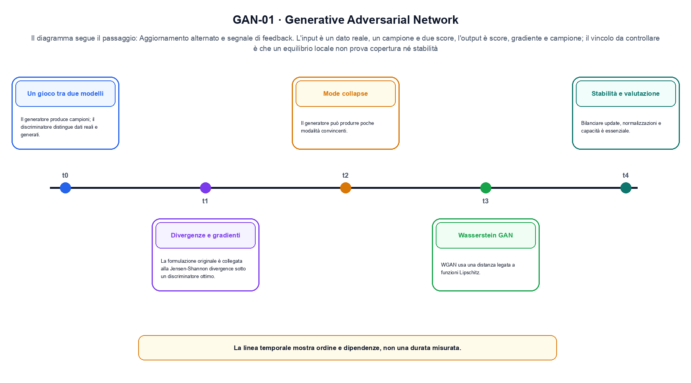
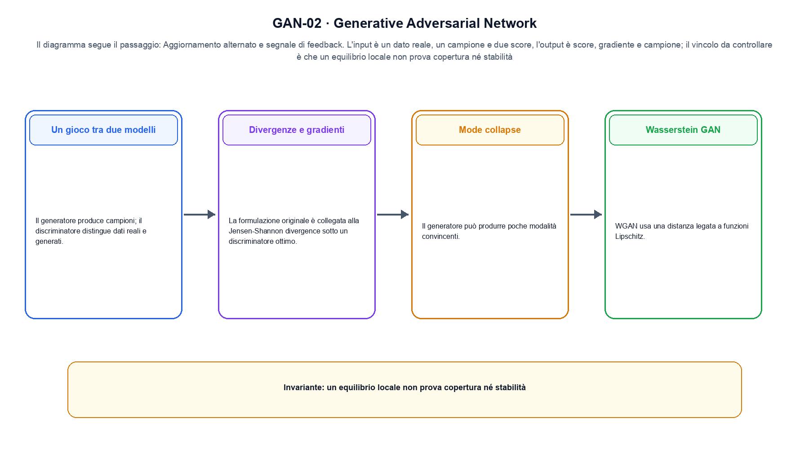

<!--
chapter_id: CH-P05-GAN
part_id: P05
order_key: 230
title: Generative Adversarial Network
maturity: CORE
status: candidatura completa in revisione autoriale
version: 0.4.0-draft2
last_source_check: 3 agosto 2026
environment: Python 3.13.12, CPU
deferred: benchmark applicativi, varianti non necessarie al contratto centrale e approvazione autoriale
-->

# Capitolo 23. Generative Adversarial Network

La richiesta «Il pacco non è arrivato» resta il caso guida. In questo capitolo la usiamo per distinguere la partita tra generatore e discriminatore, trasformazione e risultato, senza nascondere i dettagli tecnici.

## Un gioco tra due modelli

Il generatore produce campioni; il discriminatore distingue dati reali e generati. L'obiettivo è un gioco, non una loss singola ottimizzata congiuntamente. [SRC-23-001]

Prima del nome tecnico fissiamo la situazione: consideriamo un caso minimo con input un dato reale, un campione e due score e output «score, gradiente e campione». Da qui possiamo leggere la conseguenza dichiarata da «Il generatore produce campioni; il discriminatore distingue dati reali e generati».

La sezione usa l'input «un dato reale, un campione e due score» come punto di partenza e l'output «score, gradiente e campione» come traccia d'uscita. La trasformazione concreta è «aggiornamento alternato e segnale di feedback»; il caso non è completo se non dichiariamo anche che un equilibrio locale non prova copertura né stabilità. La condizione da isolare è «Il generatore produce campioni; il discriminatore distingue dati reali e generati».

Un flow rende esplicito il percorso invertibile tra spazio semplice e dati. La densità deve tenere conto del Jacobiano, mentre il costo dipende dalla trasformazione o dalla soluzione numerica scelta. Per «Un gioco tra due modelli» il controllo cambia una sola premessa della frase «Il generatore produce campioni; il discriminatore distingue dati reali e generati» e conserva input, output e criterio di successo, così la differenza resta attribuibile. La verifica resta ancorata a «Il generatore produce campioni; il discriminatore distingue dati reali e generati». [SRC-23-001]

Se cambiamo una premessa, dobbiamo riaprire l'interpretazione. Per «Un gioco tra due modelli» conserviamo l'osservazione collegata a «Il generatore produce campioni; il discriminatore distingue dati reali e generati» e lasciamo esplicitamente fuori ciò che non è stato misurato.

La prova di «Un gioco tra due modelli» conserva input, operazione e output; poi esplicita quale parte di «Il generatore produce campioni; il discriminatore distingue dati reali e generati» non è stata misurata. Così il test separa l'evidenza dall'inferenza. Il passaggio successivo, «Divergenze e gradienti», potrà cambiare una sola condizione, dichiarando il nuovo setup prima di interpretare il risultato.

## Divergenze e gradienti

La formulazione originale è collegata alla Jensen-Shannon divergence sotto un discriminatore ottimo. I gradienti pratici dipendono dalla loss scelta. [SRC-23-002]

Per capire «Divergenze e gradienti» partiamo da questo caso: due vettori con shape compatibile confrontati prima e dopo il blocco, osservando separatamente scala e percorso residuale in «Divergenze e gradienti». Il caso rende osservabile il punto centrale: «La formulazione originale è collegata alla Jensen-Shannon divergence sotto un discriminatore ottimo».

Per ricostruire «Divergenze e gradienti» annotiamo l'input «un dato reale, un campione e due score», poi l'operazione «aggiornamento alternato e segnale di feedback», infine l'output «score, gradiente e campione». Questa sequenza impedisce di scambiare una forma compatibile per il comportamento descritto dalla fonte. Il controllo parte da «La formulazione originale è collegata alla Jensen-Shannon divergence sotto un discriminatore ottimo».

Il passaggio da seguire in «Divergenze e gradienti» è quello descritto dalla frase «La formulazione originale è collegata alla Jensen-Shannon divergence sotto un discriminatore ottimo»: l'esempio rende osservabile la trasformazione, mentre il contratto del capitolo ne delimita l'interpretazione. Per «Divergenze e gradienti» il controllo cambia una sola premessa della frase «La formulazione originale è collegata alla Jensen-Shannon divergence sotto un discriminatore ottimo» e conserva input, output e criterio di successo, così la differenza resta attribuibile. La verifica resta ancorata a «La formulazione originale è collegata alla Jensen-Shannon divergence sotto un discriminatore ottimo». [SRC-23-002]

Il punto didattico di «Divergenze e gradienti» è separare ciò che la fonte afferma da ciò che il piccolo caso illustra. L'output «score, gradiente e campione» mostra il contratto locale, ma non sostituisce una misura sul sistema completo.

Per verificare «Divergenze e gradienti» cambiamo una sola condizione vicina alla frase «La formulazione originale è collegata alla Jensen-Shannon divergence sotto un discriminatore ottimo», teniamo fermo il resto e registriamo l'output «score, gradiente e campione». Il caso negativo deve rendere riconoscibile la failure, non soltanto produrre un numero diverso. La sezione successiva, «Mode collapse», riceve l'output «score, gradiente e campione» come base, ma dovrà formulare e verificare la propria distinzione.

## Mode collapse

Il generatore può produrre poche modalità convincenti. Diversità e fedeltà devono essere misurate separatamente. [SRC-23-003]

Il caso minimo di «Mode collapse» si presenta così: un caso in cui un equilibrio locale non prova copertura né stabilità. Non lo usiamo come decorazione: serve a rendere osservabile la frase «Il generatore può produrre poche modalità convincenti».

Nel contratto locale, l'input «un dato reale, un campione e due score» entra, l'operazione «aggiornamento alternato e segnale di feedback» modifica il percorso e l'output «score, gradiente e campione» è ciò che osserviamo. Qui cambia soprattutto il passaggio «Mode collapse»; resta da controllare che un equilibrio locale non prova copertura né stabilità. La domanda locale è «Il generatore può produrre poche modalità convincenti».

Nel gioco adversarial il generatore e il discriminatore cambiano il segnale l'uno dell'altro. Un discriminatore efficace non garantisce da solo varietà dei campioni, perciò fedeltà e copertura vanno misurate separatamente. Per «Mode collapse» il controllo cambia una sola premessa della frase «Il generatore può produrre poche modalità convincenti» e conserva input, output e criterio di successo, così la differenza resta attribuibile. La verifica resta ancorata a «Il generatore può produrre poche modalità convincenti». [SRC-23-003]

La lettura va fatta in ordine: prima il caso, poi la trasformazione, quindi la conseguenza. Diversità e fedeltà devono essere misurate separatamente. Il piccolo risultato resta un'illustrazione di «Il generatore può produrre poche modalità convincenti», non una promessa generale.

Il controllo minimo di «Mode collapse» confronta il caso dichiarato con una variazione che rompe la sua ipotesi. Se la failure non è distinguibile dall'esito valido, manca un'osservazione nel contratto del rapporto tra distribuzione e campione. Da «Mode collapse» portiamo l'output «score, gradiente e campione»; non portiamo invece una conclusione oltre il caso locale.

## Wasserstein GAN

WGAN usa una distanza legata a funzioni Lipschitz. Weight clipping e gradient penalty sono implementazioni differenti del vincolo. [SRC-23-004]

Prima del nome tecnico fissiamo la situazione: consideriamo un dato trasformato e ricostruito con la quantità di probabilità o di errore dichiarata. Da qui possiamo leggere la conseguenza dichiarata da «WGAN usa una distanza legata a funzioni Lipschitz».

La sezione usa l'input «un dato reale, un campione e due score» come punto di partenza e l'output «score, gradiente e campione» come traccia d'uscita. La trasformazione concreta è «aggiornamento alternato e segnale di feedback»; il caso non è completo se non dichiariamo anche che un equilibrio locale non prova copertura né stabilità. La condizione da isolare è «WGAN usa una distanza legata a funzioni Lipschitz».

Nel gioco adversarial il generatore e il discriminatore cambiano il segnale l'uno dell'altro. Un discriminatore efficace non garantisce da solo varietà dei campioni, perciò fedeltà e copertura vanno misurate separatamente. Per «Wasserstein GAN» il controllo cambia una sola premessa della frase «WGAN usa una distanza legata a funzioni Lipschitz» e conserva input, output e criterio di successo, così la differenza resta attribuibile. La verifica resta ancorata a «WGAN usa una distanza legata a funzioni Lipschitz». [SRC-23-004]

Se cambiamo una premessa, dobbiamo riaprire l'interpretazione. Per «Wasserstein GAN» conserviamo l'osservazione collegata a «WGAN usa una distanza legata a funzioni Lipschitz» e lasciamo esplicitamente fuori ciò che non è stato misurato.

La prova di «Wasserstein GAN» conserva input, operazione e output; poi esplicita quale parte di «WGAN usa una distanza legata a funzioni Lipschitz» non è stata misurata. Così il test separa l'evidenza dall'inferenza. Il passaggio successivo, «Stabilità e valutazione», potrà cambiare una sola condizione, dichiarando il nuovo setup prima di interpretare il risultato.

La figura GAN-01 usa la famiglia timeline. Il diagramma segue il passaggio: Aggiornamento alternato e segnale di feedback. L'input è un dato reale, un campione e due score, l'output è score, gradiente e campione; il vincolo da controllare è che un equilibrio locale non prova copertura né stabilità.

## Stabilità e valutazione

Bilanciare update, normalizzazioni e capacità è essenziale. FID è una metrica su feature e non sostituisce l'analisi dei campioni. [SRC-23-001]

Per capire «Stabilità e valutazione» partiamo da questo caso: se il discriminatore diventa perfetto troppo presto, il gradiente utile al generatore può ridursi. La metrica non è soltanto la loss di un singolo update. Il caso rende osservabile il punto centrale: «Bilanciare update, normalizzazioni e capacità è essenziale».

Per ricostruire «Stabilità e valutazione» annotiamo l'input «un dato reale, un campione e due score», poi l'operazione «aggiornamento alternato e segnale di feedback», infine l'output «score, gradiente e campione». Questa sequenza impedisce di scambiare una forma compatibile per il comportamento descritto dalla fonte. Il controllo parte da «Bilanciare update, normalizzazioni e capacità è essenziale».

Una valutazione deve collegare claim, popolazione, protocollo e decisione. Media, slice, failure, giudice e incertezza misurano aspetti diversi e non diventano intercambiabili perché condividono una tabella. Il controllo separa raccolta di traiettorie e confronto delle policy, riportando ritorno, dispersione e vincoli come misure diverse. La verifica resta ancorata a «Bilanciare update, normalizzazioni e capacità è essenziale». [SRC-23-001]

Il punto didattico di «Stabilità e valutazione» è separare ciò che la fonte afferma da ciò che il piccolo caso illustra. L'output «score, gradiente e campione» mostra il contratto locale, ma non sostituisce una misura sul sistema completo.

Per verificare «Stabilità e valutazione» cambiamo una sola condizione vicina alla frase «Bilanciare update, normalizzazioni e capacità è essenziale», teniamo fermo il resto e registriamo l'output «score, gradiente e campione». Il caso negativo deve rendere riconoscibile la failure, non soltanto produrre un numero diverso. Il percorso si chiude lasciando espliciti la misura locale e ciò che richiederebbe una prova ulteriore.

## Una traiettoria controllata: Un gioco tra due modelli

Il caso intero parte dall'input «un dato reale, un campione e due score», applica l'operazione «aggiornamento alternato e segnale di feedback» e osserva l'output «score, gradiente e campione». Un esempio controllato: due score reali e sintetici con un aggiornamento alternato. La formula locale è:

$$
min_G max_D V(D,G)
$$

Generatore e discriminatore partecipano a un gioco a due obiettivi. [SRC-23-001]

La figura GAN-02 cambia composizione rispetto alla prima. Il diagramma segue il passaggio: Aggiornamento alternato e segnale di feedback. L'input è un dato reale, un campione e due score, l'output è score, gradiente e campione; il vincolo da controllare è che un equilibrio locale non prova copertura né stabilità.

## Il passaggio eseguito in Python: Divergenze e gradienti

Il file `code/snip_23_contract.py` collega il contratto del capitolo alla frase «Bilanciare update, normalizzazioni e capacità è essenziale». Il test controlla l'invariante, la risposta valida e il caso negativo; `code/outputs/SNIP-23-001.txt` conserva il risultato ripetibile del caso locale.

## Prima di generalizzare: Stabilità e valutazione

Il meccanismo di «Generative Adversarial Network» resta legato al contratto locale. Un equilibrio locale non prova copertura né stabilità. Prima di generalizzare la frase «Bilanciare update, normalizzazioni e capacità è essenziale», servono un nuovo setup, un protocollo dichiarato e una misura ripetibile.

## Dalla lezione al capitolo seguente: Generative Adversarial Network

Abbiamo seguito la partita tra generatore e discriminatore, partendo dall'input «un dato reale, un campione e due score» e arrivando all'output «score, gradiente e campione». Le sezioni «Un gioco tra due modelli», «Divergenze e gradienti», «Stabilità e valutazione» hanno isolato le proprie frasi chiave senza confondere il meccanismo con il risultato applicativo. L'invariante da portare avanti è: un equilibrio locale non prova copertura né stabilità. Il Capitolo 24, Normalizing flow e trasformazioni invertibili, può partire da questo output e dichiarare la propria domanda.

### Domande per ricostruire il percorso: Un gioco tra due modelli

1. Ricostruisci l'oggetto continuo a partire da «Un gioco tra due modelli» e indica quale parte della frase «Il generatore produce campioni; il discriminatore distingue dati reali e generati» entra nel caso.
2. Spiega quale trasformazione collega «Un gioco tra due modelli» a «Stabilità e valutazione» e quale output osserviamo nel passaggio.
3. Usa lo snippet per controllare l'invariante del contratto: un equilibrio locale non prova copertura né stabilità.
4. Separa una definizione sostenuta da una fonte, un esempio illustrativo e un risultato locale del caso guida.
5. Indica quale parte della frase «Bilanciare update, normalizzazioni e capacità è essenziale» richiederebbe una misura nuova prima di essere estesa oltre il caso osservato.

### Esercizi sul failure mode: Stabilità e valutazione

1. Ricostruisci «Un gioco tra due modelli» senza usare il nome della tecnica, soltanto con input, operazione e output.
2. Sostituisci una condizione di «Divergenze e gradienti» e prevedi che cosa non dovrebbe cambiare.
3. Cerca un controesempio per «Mode collapse» e annota quale ipotesi viene rotta.
4. Trasforma il limite di «Wasserstein GAN» in un test ripetibile.
5. Spiega come trasferire «Stabilità e valutazione» senza portare con sé una promessa non misurata.

## Dossier delle fonti e materiali: Generative Adversarial Network

Il dossier di «Generative Adversarial Network» in `FONTI_PRIMARIE.md` separa definizioni, risultati e plausibilità e copertura dei dati; la data di consultazione è registrata accanto ai riferimenti. `CLAIMS.md` separa definizioni e risultati locali; codice, ambiente, test e output sono nella cartella `code/`, con attenzione al rapporto tra distribuzione e campione.
