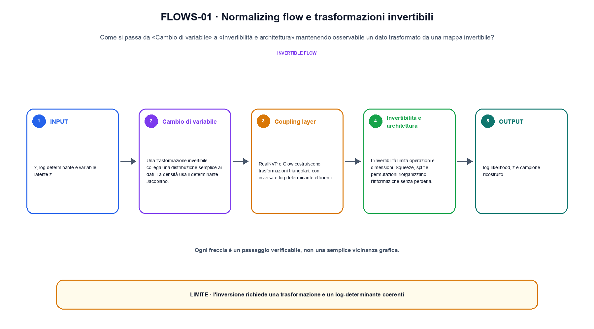
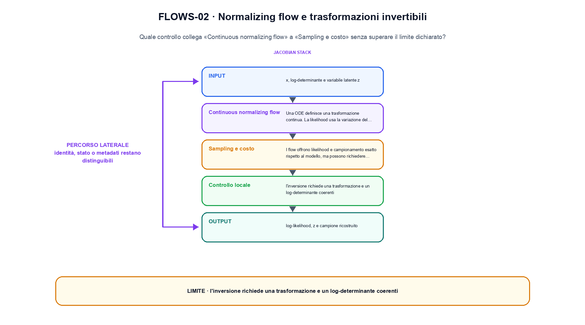

<!--
chapter_id: CH-P05-FLOWS
part_id: P05
order_key: 240
title: Normalizing flow e trasformazioni invertibili
maturity: ESTABLISHED
status: revisione editoriale v2, approvazione autoriale aperta
version: 0.5.0-draft3
last_source_check: 4 agosto 2026
environment: Python 3.13.12, CPU
code_policy: reference
deferred: benchmark applicativi non eseguiti e approvazione autoriale delle visuali
-->

# Capitolo 24. Normalizing flow e trasformazioni invertibili

La domanda guida di questa lezione è come collegare «Cambio di variabile» e «Sampling e costo» senza perdere il contratto tecnico di normalizing flow e trasformazioni invertibili. L'oggetto osservato è un dato trasformato da una mappa invertibile. Il contratto locale è: input, x, log-determinante e variabile latente z; operazione, coupling, cambio di variabile e inversione; output, log-likelihood, z e campione ricostruito. Il caso guida è questo: Un caso minimo con input x, log-determinante e variabile latente z e output «log-likelihood, z e campione ricostruito». Il confine da mantenere esplicito è: l'inversione richiede una trasformazione e un log-determinante coerenti.

## Cambio di variabile

Una trasformazione invertibile collega una distribuzione semplice ai dati. La densità usa il determinante Jacobiano. [SRC-24-001]

Il cambio di variabile richiede trasformazione invertibile e Jacobiano.

**Caso da seguire.** Un caso minimo con input x, log-determinante e variabile latente z e output «log-likelihood, z e campione ricostruito».

**Controllo.** Scrivi il risultato atteso prima del calcolo, modifica una sola quantità e localizza il primo passaggio che cambia. Il vincolo da conservare è: La densità usa il determinante Jacobiano.


## Coupling layer

RealNVP e Glow costruiscono trasformazioni triangolari, con inversa e log-determinante efficienti. [SRC-24-002]

**Caso da seguire.** Due vettori con shape compatibile confrontati prima e dopo il blocco, osservando separatamente scala e percorso residuale in «Coupling layer».

**Controllo.** Ricalcola il caso a mano e con lo snippet. Se i risultati divergono, confronta prima i valori intermedi e soltanto dopo l'output finale.


La relazione centrale può essere scritta come:

$$
log p_x(x)=log p_z(f(x))+log|det J_f(x)|
$$

Il cambio di variabile richiede trasformazione invertibile e Jacobiano. [SRC-24-001]




La prima figura segue il percorso da «Cambio di variabile» a «Invertibilità e architettura».


## Invertibilità e architettura

L'invertibilità limita operazioni e dimensioni. Squeeze, split e permutazioni riorganizzano l'informazione senza perderla. [SRC-24-003]

**Caso da seguire.** Un caso in cui l'inversione richiede una trasformazione e un log-determinante coerenti.

**Controllo.** Aggiungi un valore limite e verifica separatamente forma, valore e ipotesi. Una shape valida non dimostra da sola «Invertibilità e architettura».


## Continuous normalizing flow

Una ODE definisce una trasformazione continua. La likelihood usa la variazione del log-density lungo il flusso. [SRC-24-004]

**Caso da seguire.** Un dato trasformato e ricostruito con la quantità di probabilità o di errore dichiarata.

**Controllo.** Mantieni fisso l'input e sostituisci soltanto il meccanismo discusso nella sezione. Il confronto deve attribuire la differenza a quel passaggio, non al setup.


## Esempio Python eseguito

Il frammento seguente è lo stesso conservato nel repository. Usa valori piccoli perché l'obiettivo è osservare il meccanismo, non simulare una scala che non abbiamo eseguito.

```python
def contract():
    scale = [2.0, 0.5]
    log_det = sum(math.log(value) for value in scale)
    inverse = [1.0 / value for value in scale]
    return {"log_det": round(log_det, 6), "inverse_scale": inverse, "invariant": "the transform exposes both an inverse and a log determinant"}
```

Esecuzione con `python snip_24_contract.py`:

```text
{"invariant": "the transform exposes both an inverse and a log determinant", "inverse_scale": [0.5, 2.0], "log_det": 0.0}
```

Il test associato è [`code/test_24_contract.py`](code/test_24_contract.py); l'output versionato è [`code/outputs/SNIP-24-001.txt`](code/outputs/SNIP-24-001.txt).


## Sampling e costo

I flow offrono likelihood e campionamento esatto rispetto al modello, ma possono richiedere molte trasformazioni o solve numerici. [SRC-24-001]

**Caso da seguire.** Un prefisso corretto confrontato con lo stesso prefisso dopo che il modello ha prodotto il token precedente.

**Controllo.** Costruisci un controesempio che rispetti il tipo di dato ma violi l'ipotesi centrale. Il test deve rendere riconoscibile perché «Sampling e costo» non si applica.




La seconda figura mette a confronto «Continuous normalizing flow» e il limite discusso in «Sampling e costo».


## Come si collegano i passaggi

- **Da «Cambio di variabile» a «Coupling layer».** Una trasformazione invertibile collega una distribuzione semplice ai dati. RealNVP e Glow costruiscono trasformazioni triangolari, con inversa e log-determinante efficienti. Il primo passaggio definisce che cosa entra nel calcolo; il secondo stabilisce la regola che produce il valore osservabile. [SRC-24-001; SRC-24-002]

- **Da «Coupling layer» a «Invertibilità e architettura».** RealNVP e Glow costruiscono trasformazioni triangolari, con inversa e log-determinante efficienti. L'invertibilità limita operazioni e dimensioni. La regola generale viene poi letta dentro il componente: questa separazione permette di localizzare un errore prima di attribuirlo all'intero modello. [SRC-24-002; SRC-24-003]

- **Da «Invertibilità e architettura» a «Continuous normalizing flow».** L'invertibilità limita operazioni e dimensioni. Una ODE definisce una trasformazione continua. Dopo avere reso visibile il componente, il percorso introduce la variante o l'ottimizzazione senza cambiare di nascosto il caso di partenza. [SRC-24-003; SRC-24-004]

- **Da «Continuous normalizing flow» a «Sampling e costo».** Una ODE definisce una trasformazione continua. I flow offrono likelihood e campionamento esatto rispetto al modello, ma possono richiedere molte trasformazioni o solve numerici. L'ultimo passaggio sposta l'attenzione dal funzionamento locale alla misura: correttezza del calcolo e qualità applicativa restano domande distinte. [SRC-24-004; SRC-24-001]

La catena completa produce log-likelihood, z e campione ricostruito a partire da x, log-determinante e variabile latente z. Ogni collegamento conserva un oggetto osservabile diverso; per questo il risultato non può essere esteso oltre il limite dichiarato: l'inversione richiede una trasformazione e un log-determinante coerenti.


## Esercizi sul meccanismo

1. Ricostruisci «Cambio di variabile» con un esempio diverso da quello mostrato e indica l'output atteso prima del calcolo.
2. Nel passaggio «Coupling layer», cambia una sola ipotesi e spiega quale risultato non è più confrontabile.
3. Collega «Invertibilità e architettura» a una riga dello snippet oppure motiva perché la prova deve essere documentale.
4. Progetta un caso limite per «Continuous normalizing flow» che produca una failure riconoscibile.
5. Per «Sampling e costo», separa una conclusione sostenuta dal caso locale da una che richiederebbe nuovi dati o un benchmark.


## Che cosa deve restare chiaro

La lezione parte da «x, log-determinante e variabile latente z» e arriva fino a «log-likelihood, z e campione ricostruito». Il limite da conservare è questo: l'inversione richiede una trasformazione e un log-determinante coerenti. Definizioni e risultati citati sono rintracciabili in [`FONTI_PRIMARIE.md`](FONTI_PRIMARIE.md); la mappa dei claim è in [`CLAIMS.md`](CLAIMS.md).
