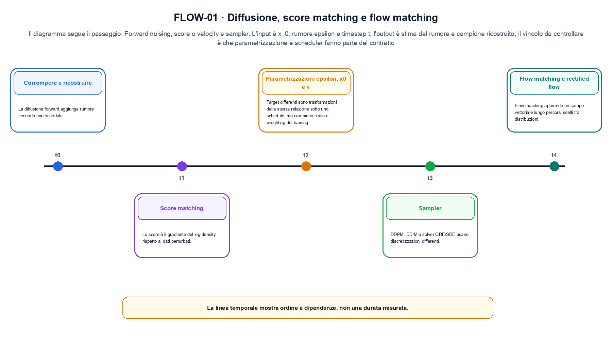
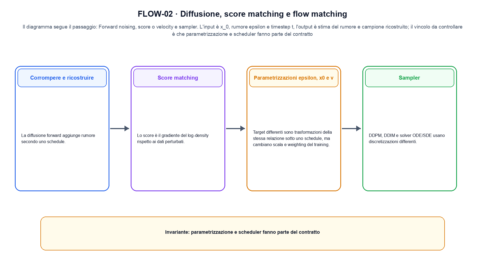

<!--
chapter_id: CH-P05-DIFFUSION-FLOW
part_id: P05
order_key: 250
title: Diffusione, score matching e flow matching
maturity: CORE
status: candidatura completa in revisione autoriale
version: 0.4.0-draft2
last_source_check: 3 agosto 2026
environment: Python 3.13.12, CPU
deferred: benchmark applicativi, varianti non necessarie al contratto centrale e approvazione autoriale
-->

# Capitolo 25. Diffusione, score matching e flow matching

Il Capitolo 24, Normalizing flow e trasformazioni invertibili, ha lasciato disponibile un dato corrotto e il percorso di denoising. Manteniamo come filo comune la richiesta «Il pacco non è arrivato» e qui la traduciamo nell'oggetto della lezione. La domanda diventa operativa: rendiamo osservabile il passaggio «forward noising, score o velocity e sampler» e verifichiamo che parametrizzazione e scheduler fanno parte del contratto.

## Corrompere e ricostruire

La diffusione forward aggiunge rumore secondo uno schedule. Il modello impara a invertire o a stimare una quantità equivalente. [SRC-25-001]

Il caso minimo di «Corrompere e ricostruire» si presenta così: un caso minimo con input x_0, rumore epsilon e timestep t e output «stima del rumore e campione ricostruito». Non lo usiamo come decorazione: serve a rendere osservabile la frase «La diffusione forward aggiunge rumore secondo uno schedule».

Per ricostruire «Corrompere e ricostruire» annotiamo l'input «x_0, rumore epsilon e timestep t», poi l'operazione «forward noising, score o velocity e sampler», infine l'output «stima del rumore e campione ricostruito». Questa sequenza impedisce di scambiare una forma compatibile per il comportamento descritto dalla fonte. Il controllo parte da «La diffusione forward aggiunge rumore secondo uno schedule».

Il passaggio da seguire in «Corrompere e ricostruire» è quello descritto dalla frase «La diffusione forward aggiunge rumore secondo uno schedule»: l'esempio rende osservabile la trasformazione, mentre il contratto del capitolo ne delimita l'interpretazione. Per «Corrompere e ricostruire» il controllo cambia una sola premessa della frase «La diffusione forward aggiunge rumore secondo uno schedule» e conserva input, output e criterio di successo, così la differenza resta attribuibile. La verifica resta ancorata a «La diffusione forward aggiunge rumore secondo uno schedule». [SRC-25-001]

Il punto didattico di «Corrompere e ricostruire» è separare ciò che la fonte afferma da ciò che il piccolo caso illustra. L'output «stima del rumore e campione ricostruito» mostra il contratto locale, ma non sostituisce una misura sul sistema completo.

Il controllo minimo di «Corrompere e ricostruire» confronta il caso dichiarato con una variazione che rompe la sua ipotesi. Se la failure non è distinguibile dall'esito valido, manca un'osservazione nel contratto del rapporto tra distribuzione e campione. Da «Corrompere e ricostruire» portiamo l'output «stima del rumore e campione ricostruito»; non portiamo invece una conclusione oltre il caso locale.

## Score matching

Lo score è il gradiente del log-density rispetto ai dati perturbati. Denoising score matching evita di conoscere la densità normale completa. [SRC-25-002]

Prima del nome tecnico fissiamo la situazione: consideriamo un dato trasformato e ricostruito con la quantità di probabilità o di errore dichiarata. Da qui possiamo leggere la conseguenza dichiarata da «Lo score è il gradiente del log-density rispetto ai dati perturbati».

Nel contratto locale, l'input «x_0, rumore epsilon e timestep t» entra, l'operazione «forward noising, score o velocity e sampler» modifica il percorso e l'output «stima del rumore e campione ricostruito» è ciò che osserviamo. Qui cambia soprattutto il passaggio «Score matching»; resta da controllare che parametrizzazione e scheduler fanno parte del contratto. La domanda locale è «Lo score è il gradiente del log-density rispetto ai dati perturbati».

La diffusione separa corruzione e ricostruzione attraverso uno schedule. Target, parametrizzazione e sampler descrivono punti diversi dello stesso percorso e una riduzione degli step non conserva automaticamente ogni proprietà. Per «Score matching» il controllo cambia una sola premessa della frase «Lo score è il gradiente del log-density rispetto ai dati perturbati» e conserva input, output e criterio di successo, così la differenza resta attribuibile. La verifica resta ancorata a «Lo score è il gradiente del log-density rispetto ai dati perturbati». [SRC-25-002]

La lettura va fatta in ordine: prima il caso, poi la trasformazione, quindi la conseguenza. Denoising score matching evita di conoscere la densità normale completa. Il piccolo risultato resta un'illustrazione di «Lo score è il gradiente del log-density rispetto ai dati perturbati», non una promessa generale.

La prova di «Score matching» conserva input, operazione e output; poi esplicita quale parte di «Lo score è il gradiente del log-density rispetto ai dati perturbati» non è stata misurata. Così il test separa l'evidenza dall'inferenza. Il passaggio successivo, «Parametrizzazioni epsilon, x0 e v», potrà cambiare una sola condizione, dichiarando il nuovo setup prima di interpretare il risultato.

## Parametrizzazioni epsilon, x0 e v

Target differenti sono trasformazioni della stessa relazione sotto uno schedule, ma cambiano scala e weighting del training. [SRC-25-003]

Per capire «Parametrizzazioni epsilon, x0 e v» partiamo da questo caso: un caso in cui parametrizzazione e scheduler fanno parte del contratto. Il caso rende osservabile il punto centrale: «Target differenti sono trasformazioni della stessa relazione sotto uno schedule, ma cambiano scala e weighting del training».

La sezione usa l'input «x_0, rumore epsilon e timestep t» come punto di partenza e l'output «stima del rumore e campione ricostruito» come traccia d'uscita. La trasformazione concreta è «forward noising, score o velocity e sampler»; il caso non è completo se non dichiariamo anche che parametrizzazione e scheduler fanno parte del contratto. La condizione da isolare è «Target differenti sono trasformazioni della stessa relazione sotto uno schedule, ma cambiano scala e weighting del training».

La diffusione separa corruzione e ricostruzione attraverso uno schedule. Target, parametrizzazione e sampler descrivono punti diversi dello stesso percorso e una riduzione degli step non conserva automaticamente ogni proprietà. Per «Parametrizzazioni epsilon, x0 e v» il controllo cambia una sola premessa della frase «Target differenti sono trasformazioni della stessa relazione sotto uno schedule, ma cambiano scala e weighting del training» e conserva input, output e criterio di successo, così la differenza resta attribuibile. La verifica resta ancorata a «Target differenti sono trasformazioni della stessa relazione sotto uno schedule, ma cambiano scala e weighting del training». [SRC-25-003]

Se cambiamo una premessa, dobbiamo riaprire l'interpretazione. Per «Parametrizzazioni epsilon, x0 e v» conserviamo l'osservazione collegata a «Target differenti sono trasformazioni della stessa relazione sotto uno schedule, ma cambiano scala e weighting del training» e lasciamo esplicitamente fuori ciò che non è stato misurato.

Per verificare «Parametrizzazioni epsilon, x0 e v» cambiamo una sola condizione vicina alla frase «Target differenti sono trasformazioni della stessa relazione sotto uno schedule, ma cambiano scala e weighting del training», teniamo fermo il resto e registriamo l'output «stima del rumore e campione ricostruito». Il caso negativo deve rendere riconoscibile la failure, non soltanto produrre un numero diverso. La sezione successiva, «Sampler», riceve l'output «stima del rumore e campione ricostruito» come base, ma dovrà formulare e verificare la propria distinzione.

La figura FLOW-01 usa la famiglia timeline. Il diagramma segue il passaggio: Forward noising, score o velocity e sampler. L'input è x_0, rumore epsilon e timestep t, l'output è stima del rumore e campione ricostruito; il vincolo da controllare è che parametrizzazione e scheduler fanno parte del contratto.

## Sampler

DDPM, DDIM e solver ODE/SDE usano discretizzazioni differenti. Meno step non garantiscono stessa distribuzione o qualità. [SRC-25-004]

Il caso minimo di «Sampler» si presenta così: aumentando `t`, il coefficiente del dato diminuisce e quello del rumore cresce secondo lo schedule. Il sampler deve rispettare lo stesso contratto. Non lo usiamo come decorazione: serve a rendere osservabile la frase «DDPM, DDIM e solver ODE/SDE usano discretizzazioni differenti».

Per ricostruire «Sampler» annotiamo l'input «x_0, rumore epsilon e timestep t», poi l'operazione «forward noising, score o velocity e sampler», infine l'output «stima del rumore e campione ricostruito». Questa sequenza impedisce di scambiare una forma compatibile per il comportamento descritto dalla fonte. Il controllo parte da «DDPM, DDIM e solver ODE/SDE usano discretizzazioni differenti».

La diffusione separa corruzione e ricostruzione attraverso uno schedule. Target, parametrizzazione e sampler descrivono punti diversi dello stesso percorso e una riduzione degli step non conserva automaticamente ogni proprietà. Per «Sampler» il controllo cambia una sola premessa della frase «DDPM, DDIM e solver ODE/SDE usano discretizzazioni differenti» e conserva input, output e criterio di successo, così la differenza resta attribuibile. La verifica resta ancorata a «DDPM, DDIM e solver ODE/SDE usano discretizzazioni differenti». [SRC-25-004]

Il punto didattico di «Sampler» è separare ciò che la fonte afferma da ciò che il piccolo caso illustra. L'output «stima del rumore e campione ricostruito» mostra il contratto locale, ma non sostituisce una misura sul sistema completo.

Il controllo minimo di «Sampler» confronta il caso dichiarato con una variazione che rompe la sua ipotesi. Se la failure non è distinguibile dall'esito valido, manca un'osservazione nel contratto del rapporto tra distribuzione e campione. Da «Sampler» portiamo l'output «stima del rumore e campione ricostruito»; non portiamo invece una conclusione oltre il caso locale.

## Flow matching e rectified flow

Flow matching apprende un campo vettoriale lungo percorsi scelti tra distribuzioni. Rectified flow cerca traiettorie più rettilinee in setup specifici. [SRC-25-001]

Prima del nome tecnico fissiamo la situazione: consideriamo un dato trasformato e ricostruito con la quantità di probabilità o di errore dichiarata. Da qui possiamo leggere la conseguenza dichiarata da «Flow matching apprende un campo vettoriale lungo percorsi scelti tra distribuzioni».

Nel contratto locale, l'input «x_0, rumore epsilon e timestep t» entra, l'operazione «forward noising, score o velocity e sampler» modifica il percorso e l'output «stima del rumore e campione ricostruito» è ciò che osserviamo. Qui cambia soprattutto il passaggio «Flow matching e rectified flow»; resta da controllare che parametrizzazione e scheduler fanno parte del contratto. La domanda locale è «Flow matching apprende un campo vettoriale lungo percorsi scelti tra distribuzioni».

Un flow rende esplicito il percorso invertibile tra spazio semplice e dati. La densità deve tenere conto del Jacobiano, mentre il costo dipende dalla trasformazione o dalla soluzione numerica scelta. Per «Flow matching e rectified flow» il controllo cambia una sola premessa della frase «Flow matching apprende un campo vettoriale lungo percorsi scelti tra distribuzioni» e conserva input, output e criterio di successo, così la differenza resta attribuibile. La verifica resta ancorata a «Flow matching apprende un campo vettoriale lungo percorsi scelti tra distribuzioni». [SRC-25-001]

La lettura va fatta in ordine: prima il caso, poi la trasformazione, quindi la conseguenza. Rectified flow cerca traiettorie più rettilinee in setup specifici. Il piccolo risultato resta un'illustrazione di «Flow matching apprende un campo vettoriale lungo percorsi scelti tra distribuzioni», non una promessa generale.

La prova di «Flow matching e rectified flow» conserva input, operazione e output; poi esplicita quale parte di «Flow matching apprende un campo vettoriale lungo percorsi scelti tra distribuzioni» non è stata misurata. Così il test separa l'evidenza dall'inferenza. Il caso finale consegna l'output «stima del rumore e campione ricostruito» come evidenza locale e conserva il passaggio dal latente all'osservabile come domanda aperta.

## Un caso dall'input all'output: Corrompere e ricostruire

Il caso intero parte dall'input «x_0, rumore epsilon e timestep t», applica l'operazione «forward noising, score o velocity e sampler» e osserva l'output «stima del rumore e campione ricostruito». Un esempio controllato: un singolo timestep con rumore noto e stima separata. La formula locale è:

$$
x_t=\sqrt{\bar\alpha_t}x_0+\sqrt{1-\bar\alpha_t}\epsilon
$$

Il forward process rende osservabile il livello di rumore. [SRC-25-001]

La figura FLOW-02 cambia composizione rispetto alla prima. Il diagramma segue il passaggio: Forward noising, score o velocity e sampler. L'input è x_0, rumore epsilon e timestep t, l'output è stima del rumore e campione ricostruito; il vincolo da controllare è che parametrizzazione e scheduler fanno parte del contratto.

## Dal meccanismo alla prova locale: Score matching

Nel run Python rendiamo osservabile la frase «La diffusione forward aggiunge rumore secondo uno schedule» con valori piccoli e leggibili. Il test associato verifica determinismo, output e rifiuto di una condizione incoerente; il file di output `code/outputs/SNIP-25-001.txt` documenta il caso senza pretendere una misura generale.

## Dove il risultato si ferma: Flow matching e rectified flow

Il meccanismo di «Diffusione, score matching e flow matching» non garantisce da solo che il sistema funzioni fuori dal caso guida. Parametrizzazione e scheduler fanno parte del contratto. Il limite osservato riguarda la frase «La diffusione forward aggiunge rumore secondo uno schedule»; per trasferire il concetto occorre riaprire la verifica quando cambiano dati, scala o ambiente.

## Che cosa portiamo avanti: Diffusione, score matching e flow matching

Il percorso ha tenuto insieme un dato corrotto e il percorso di denoising, l'operazione «forward noising, score o velocity e sampler» e l'output «stima del rumore e campione ricostruito». Le sezioni «Corrompere e ricostruire», «Score matching», «Flow matching e rectified flow» mostrano come il protocollo osservato delimiti ciò che il capitolo può sostenere. L'invariante da portare avanti è: parametrizzazione e scheduler fanno parte del contratto. Il Capitolo 26, Il testo come dato, può partire da questo output e dichiarare la propria domanda.

### Verifica di comprensione: Corrompere e ricostruire

1. Ricostruisci l'oggetto continuo a partire da «Corrompere e ricostruire» e indica quale parte della frase «La diffusione forward aggiunge rumore secondo uno schedule» entra nel caso.
2. Spiega quale trasformazione collega «Corrompere e ricostruire» a «Flow matching e rectified flow» e quale output osserviamo nel passaggio.
3. Usa lo snippet per controllare l'invariante del contratto: parametrizzazione e scheduler fanno parte del contratto.
4. Separa una definizione sostenuta da una fonte, un esempio illustrativo e un risultato locale del caso guida.
5. Indica quale parte della frase «Flow matching apprende un campo vettoriale lungo percorsi scelti tra distribuzioni» richiederebbe una misura nuova prima di essere estesa oltre il caso osservato.

### Esercizi di trasferimento: Flow matching e rectified flow

1. Disegna il percorso di «Corrompere e ricostruire» indicando dati in ingresso e risultato.
2. Ripeti «Score matching» cambiando soltanto un valore dichiarato.
3. Trova in «Parametrizzazioni epsilon, x0 e v» una condizione che, se rimossa, produrrebbe una failure leggibile.
4. Aggiungi a «Sampler» un controllo negativo e spiega che cosa protegge.
5. Indica quale claim su «Flow matching e rectified flow» richiederebbe un benchmark ulteriore.

## Fonti, codice e materiali: Diffusione, score matching e flow matching

Per «Diffusione, score matching e flow matching», le fonti portanti, i limiti dei claim e la data di consultazione sono raccolti in `FONTI_PRIMARIE.md`; la ricerca riguarda soprattutto il rapporto tra distribuzione e campione. `CLAIMS.md` separa definizioni e risultati locali; codice, ambiente, test e output sono nella cartella `code/`, con attenzione al rapporto tra distribuzione e campione.
