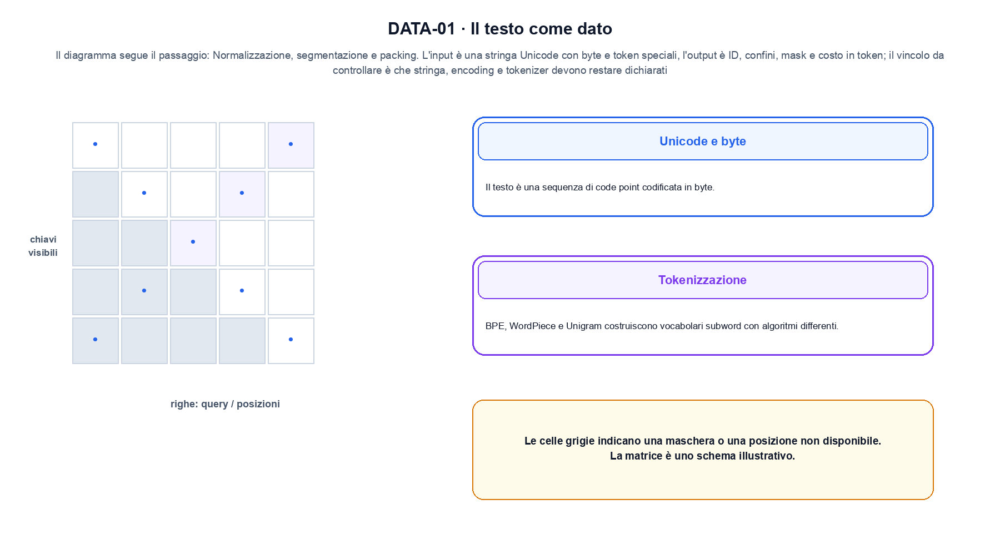
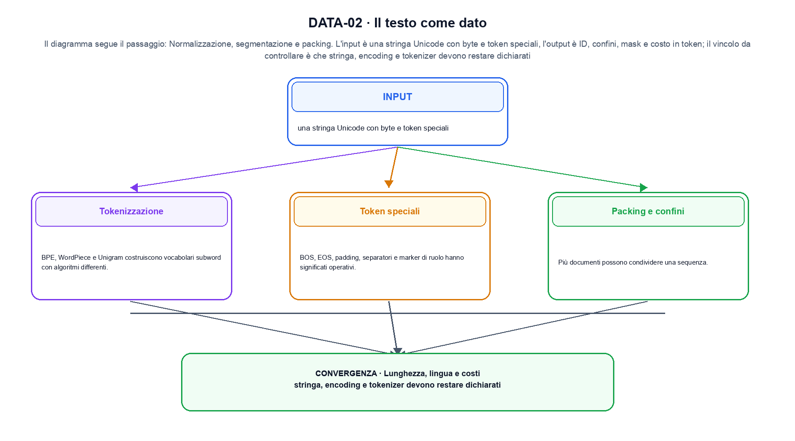

<!--
chapter_id: CH-P06-TEXT-DATA
part_id: P06
order_key: 260
title: Il testo come dato
maturity: CORE
status: candidatura completa in revisione autoriale
version: 0.4.0-draft2
last_source_check: 3 agosto 2026
environment: Python 3.13.12, CPU
deferred: benchmark applicativi, varianti non necessarie al contratto centrale e approvazione autoriale
-->

# Capitolo 26. Il testo come dato

Finora abbiamo potuto descrivere il testo prima e dopo la tokenizzazione. La richiesta «Il pacco non è arrivato» resta lo scenario condiviso: nel Capitolo 26 prendiamo l'input «una stringa Unicode con byte e token speciali» e lo seguiamo fino all'output «ID, confini, mask e costo in token», dichiarando prima il contratto e poi il limite.

## Unicode e byte

Il testo è una sequenza di code point codificata in byte. Normalizzazione Unicode e decoding devono essere dichiarati. [SRC-26-001]

Prima del nome tecnico fissiamo la situazione: consideriamo la stessa stringa convertita prima in code point e poi in byte UTF-8, conservando la reversibilità. Da qui possiamo leggere la conseguenza dichiarata da «Il testo è una sequenza di code point codificata in byte».

La sezione usa l'input «una stringa Unicode con byte e token speciali» come punto di partenza e l'output «ID, confini, mask e costo in token» come traccia d'uscita. La trasformazione concreta è «normalizzazione, segmentazione e packing»; il caso non è completo se non dichiariamo anche che stringa, encoding e tokenizer devono restare dichiarati. La condizione da isolare è «Il testo è una sequenza di code point codificata in byte».

Un flow rende esplicito il percorso invertibile tra spazio semplice e dati. La densità deve tenere conto del Jacobiano, mentre il costo dipende dalla trasformazione o dalla soluzione numerica scelta. Per «Unicode e byte» il controllo cambia una sola premessa della frase «Il testo è una sequenza di code point codificata in byte» e conserva input, output e criterio di successo, così la differenza resta attribuibile. La verifica resta ancorata a «Il testo è una sequenza di code point codificata in byte». [SRC-26-001]

Se cambiamo una premessa, dobbiamo riaprire l'interpretazione. Per «Unicode e byte» conserviamo l'osservazione collegata a «Il testo è una sequenza di code point codificata in byte» e lasciamo esplicitamente fuori ciò che non è stato misurato.

La prova di «Unicode e byte» conserva input, operazione e output; poi esplicita quale parte di «Il testo è una sequenza di code point codificata in byte» non è stata misurata. Così il test separa l'evidenza dall'inferenza. Il passaggio successivo, «Tokenizzazione», potrà cambiare una sola condizione, dichiarando il nuovo setup prima di interpretare il risultato.

## Tokenizzazione

BPE, WordPiece e Unigram costruiscono vocabolari subword con algoritmi differenti. Il tokenizer fa parte dell'interfaccia del checkpoint. [SRC-26-002]

Per capire «Tokenizzazione» partiamo da questo caso: un prefisso corto con ID, lunghezza, posizione e output del token successivo dichiarati. Il caso rende osservabile il punto centrale: «BPE, WordPiece e Unigram costruiscono vocabolari subword con algoritmi differenti».

Per ricostruire «Tokenizzazione» annotiamo l'input «una stringa Unicode con byte e token speciali», poi l'operazione «normalizzazione, segmentazione e packing», infine l'output «ID, confini, mask e costo in token». Questa sequenza impedisce di scambiare una forma compatibile per il comportamento descritto dalla fonte. Il controllo parte da «BPE, WordPiece e Unigram costruiscono vocabolari subword con algoritmi differenti».

Prima del modello, il testo diventa una sequenza di unità con una convenzione precisa. Encoding, tokenizer, token speciali, mask e packing modificano l'input effettivo e quindi fanno parte del contratto del checkpoint. Per «Tokenizzazione» il controllo cambia una sola premessa della frase «BPE, WordPiece e Unigram costruiscono vocabolari subword con algoritmi differenti» e conserva input, output e criterio di successo, così la differenza resta attribuibile. La verifica resta ancorata a «BPE, WordPiece e Unigram costruiscono vocabolari subword con algoritmi differenti». [SRC-26-002]

Il punto didattico di «Tokenizzazione» è separare ciò che la fonte afferma da ciò che il piccolo caso illustra. L'output «ID, confini, mask e costo in token» mostra il contratto locale, ma non sostituisce una misura sul sistema completo.

Per verificare «Tokenizzazione» cambiamo una sola condizione vicina alla frase «BPE, WordPiece e Unigram costruiscono vocabolari subword con algoritmi differenti», teniamo fermo il resto e registriamo l'output «ID, confini, mask e costo in token». Il caso negativo deve rendere riconoscibile la failure, non soltanto produrre un numero diverso. La sezione successiva, «Token speciali», riceve l'output «ID, confini, mask e costo in token» come base, ma dovrà formulare e verificare la propria distinzione.

## Token speciali

BOS, EOS, padding, separatori e marker di ruolo hanno significati operativi. ID uguali richiedono la stessa convenzione. [SRC-26-003]

Il caso minimo di «Token speciali» si presenta così: un prefisso corto con ID, lunghezza, posizione e output del token successivo dichiarati. Non lo usiamo come decorazione: serve a rendere osservabile la frase «BOS, EOS, padding, separatori e marker di ruolo hanno significati operativi».

Nel contratto locale, l'input «una stringa Unicode con byte e token speciali» entra, l'operazione «normalizzazione, segmentazione e packing» modifica il percorso e l'output «ID, confini, mask e costo in token» è ciò che osserviamo. Qui cambia soprattutto il passaggio «Token speciali»; resta da controllare che stringa, encoding e tokenizer devono restare dichiarati. La domanda locale è «BOS, EOS, padding, separatori e marker di ruolo hanno significati operativi».

Prima del modello, il testo diventa una sequenza di unità con una convenzione precisa. Encoding, tokenizer, token speciali, mask e packing modificano l'input effettivo e quindi fanno parte del contratto del checkpoint. Per «Token speciali» il controllo cambia una sola premessa della frase «BOS, EOS, padding, separatori e marker di ruolo hanno significati operativi» e conserva input, output e criterio di successo, così la differenza resta attribuibile. La verifica resta ancorata a «BOS, EOS, padding, separatori e marker di ruolo hanno significati operativi». [SRC-26-003]

La lettura va fatta in ordine: prima il caso, poi la trasformazione, quindi la conseguenza. ID uguali richiedono la stessa convenzione. Il piccolo risultato resta un'illustrazione di «BOS, EOS, padding, separatori e marker di ruolo hanno significati operativi», non una promessa generale.

Il controllo minimo di «Token speciali» confronta il caso dichiarato con una variazione che rompe la sua ipotesi. Se la failure non è distinguibile dall'esito valido, manca un'osservazione nel contratto di ordine, posizione e memoria contestuale. Da «Token speciali» portiamo l'output «ID, confini, mask e costo in token»; non portiamo invece una conclusione oltre il caso locale.

## Packing e confini

Più documenti possono condividere una sequenza. Attention mask e loss mask devono impedire dipendenze non desiderate. [SRC-26-004]

Prima del nome tecnico fissiamo la situazione: consideriamo due record con ID, testo, licenza e timestamp che attraversano una sola trasformazione registrata. Da qui possiamo leggere la conseguenza dichiarata da «Più documenti possono condividere una sequenza».

La sezione usa l'input «una stringa Unicode con byte e token speciali» come punto di partenza e l'output «ID, confini, mask e costo in token» come traccia d'uscita. La trasformazione concreta è «normalizzazione, segmentazione e packing»; il caso non è completo se non dichiariamo anche che stringa, encoding e tokenizer devono restare dichiarati. La condizione da isolare è «Più documenti possono condividere una sequenza».

Prima del modello, il testo diventa una sequenza di unità con una convenzione precisa. Encoding, tokenizer, token speciali, mask e packing modificano l'input effettivo e quindi fanno parte del contratto del checkpoint. Per «Packing e confini» il controllo cambia una sola premessa della frase «Più documenti possono condividere una sequenza» e conserva input, output e criterio di successo, così la differenza resta attribuibile. La verifica resta ancorata a «Più documenti possono condividere una sequenza». [SRC-26-004]

Se cambiamo una premessa, dobbiamo riaprire l'interpretazione. Per «Packing e confini» conserviamo l'osservazione collegata a «Più documenti possono condividere una sequenza» e lasciamo esplicitamente fuori ciò che non è stato misurato.

La prova di «Packing e confini» conserva input, operazione e output; poi esplicita quale parte di «Più documenti possono condividere una sequenza» non è stata misurata. Così il test separa l'evidenza dall'inferenza. Il passaggio successivo, «Lunghezza, lingua e costi», potrà cambiare una sola condizione, dichiarando il nuovo setup prima di interpretare il risultato.

La figura DATA-01 usa la famiglia matrix. Il diagramma segue il passaggio: Normalizzazione, segmentazione e packing. L'input è una stringa Unicode con byte e token speciali, l'output è ID, confini, mask e costo in token; il vincolo da controllare è che stringa, encoding e tokenizer devono restare dichiarati.

## Lunghezza, lingua e costi

Token per carattere variano tra lingue e formati. La lunghezza in token influenza contesto, costo e valutazione. [SRC-26-001]

Per capire «Lunghezza, lingua e costi» partiamo da questo caso: un confronto tra due prefissi con la stessa stringa, tokenizer dichiarato e mask causale esplicita. Il caso rende osservabile il punto centrale: «Token per carattere variano tra lingue e formati».

Per ricostruire «Lunghezza, lingua e costi» annotiamo l'input «una stringa Unicode con byte e token speciali», poi l'operazione «normalizzazione, segmentazione e packing», infine l'output «ID, confini, mask e costo in token». Questa sequenza impedisce di scambiare una forma compatibile per il comportamento descritto dalla fonte. Il controllo parte da «Token per carattere variano tra lingue e formati».

Prima del modello, il testo diventa una sequenza di unità con una convenzione precisa. Encoding, tokenizer, token speciali, mask e packing modificano l'input effettivo e quindi fanno parte del contratto del checkpoint. Per «Lunghezza, lingua e costi» il controllo cambia una sola premessa della frase «Token per carattere variano tra lingue e formati» e conserva input, output e criterio di successo, così la differenza resta attribuibile. La verifica resta ancorata a «Token per carattere variano tra lingue e formati». [SRC-26-001]

Il punto didattico di «Lunghezza, lingua e costi» è separare ciò che la fonte afferma da ciò che il piccolo caso illustra. L'output «ID, confini, mask e costo in token» mostra il contratto locale, ma non sostituisce una misura sul sistema completo.

Per verificare «Lunghezza, lingua e costi» cambiamo una sola condizione vicina alla frase «Token per carattere variano tra lingue e formati», teniamo fermo il resto e registriamo l'output «ID, confini, mask e costo in token». Il caso negativo deve rendere riconoscibile la failure, non soltanto produrre un numero diverso. Il percorso si chiude lasciando espliciti la misura locale e ciò che richiederebbe una prova ulteriore.

## Il caso minimo e la sua variante: Unicode e byte

Il caso intero parte dall'input «una stringa Unicode con byte e token speciali», applica l'operazione «normalizzazione, segmentazione e packing» e osserva l'output «ID, confini, mask e costo in token». Un esempio controllato: la stessa parola con carattere accentato osservata a livello di byte. La formula locale è:

$$
tokens = tokenizer(text)
$$

Il tokenizer è parte dell'interfaccia del checkpoint, non un dettaglio esterno. [SRC-26-001]

La figura DATA-02 cambia composizione rispetto alla prima. Il diagramma segue il passaggio: Normalizzazione, segmentazione e packing. L'input è una stringa Unicode con byte e token speciali, l'output è ID, confini, mask e costo in token; il vincolo da controllare è che stringa, encoding e tokenizer devono restare dichiarati.

## Che cosa osserva lo snippet: Tokenizzazione

Il file `code/snip_26_contract.py` collega il contratto del capitolo alla frase «Token per carattere variano tra lingue e formati». Il test controlla l'invariante, la risposta valida e il caso negativo; `code/outputs/SNIP-26-001.txt` conserva il risultato ripetibile del caso locale.

## Che cosa non dimostra: Lunghezza, lingua e costi

Il meccanismo di «Il testo come dato» resta legato al contratto locale. Stringa, encoding e tokenizer devono restare dichiarati. Prima di generalizzare la frase «Token per carattere variano tra lingue e formati», servono un nuovo setup, un protocollo dichiarato e una misura ripetibile.

## La mappa delle condizioni: Il testo come dato

Abbiamo seguito il testo prima e dopo la tokenizzazione, partendo dall'input «una stringa Unicode con byte e token speciali» e arrivando all'output «ID, confini, mask e costo in token». Le sezioni «Unicode e byte», «Tokenizzazione», «Lunghezza, lingua e costi» hanno isolato le proprie frasi chiave senza confondere il meccanismo con il risultato applicativo. L'invariante da portare avanti è: stringa, encoding e tokenizer devono restare dichiarati. Il Capitolo 27, Embedding e spazio semantico, può partire da questo output e dichiarare la propria domanda.

### Cinque domande di controllo: Unicode e byte

1. Ricostruisci l'oggetto continuo a partire da «Unicode e byte» e indica quale parte della frase «Il testo è una sequenza di code point codificata in byte» entra nel caso.
2. Spiega quale trasformazione collega «Unicode e byte» a «Lunghezza, lingua e costi» e quale output osserviamo nel passaggio.
3. Usa lo snippet per controllare l'invariante del contratto: stringa, encoding e tokenizer devono restare dichiarati.
4. Separa una definizione sostenuta da una fonte, un esempio illustrativo e un risultato locale del caso guida.
5. Indica quale parte della frase «Token per carattere variano tra lingue e formati» richiederebbe una misura nuova prima di essere estesa oltre il caso osservato.

### Esercizi per cambiare una condizione: Lunghezza, lingua e costi

1. Ricostruisci input e output di «Unicode e byte» usando un esempio di tre righe.
2. Modifica una sola variabile in «Tokenizzazione» e anticipa l'invariante che dovrebbe restare.
3. Metti «Token speciali» a confronto con il caso base e descrivi il failure mode più vicino.
4. Scrivi un test minimo per rendere osservabile il confine di «Packing e confini».
5. Formula per «Lunghezza, lingua e costi» una domanda che separi meccanismo e qualità del sistema.

## Fonti e risultati locali: Il testo come dato

Il dossier di «Il testo come dato» in `FONTI_PRIMARIE.md` separa definizioni, risultati e la storia disponibile a ogni passo; la data di consultazione è registrata accanto ai riferimenti. `CLAIMS.md` separa definizioni e risultati locali; codice, ambiente, test e output sono nella cartella `code/`, con attenzione a ordine, posizione e memoria contestuale.
