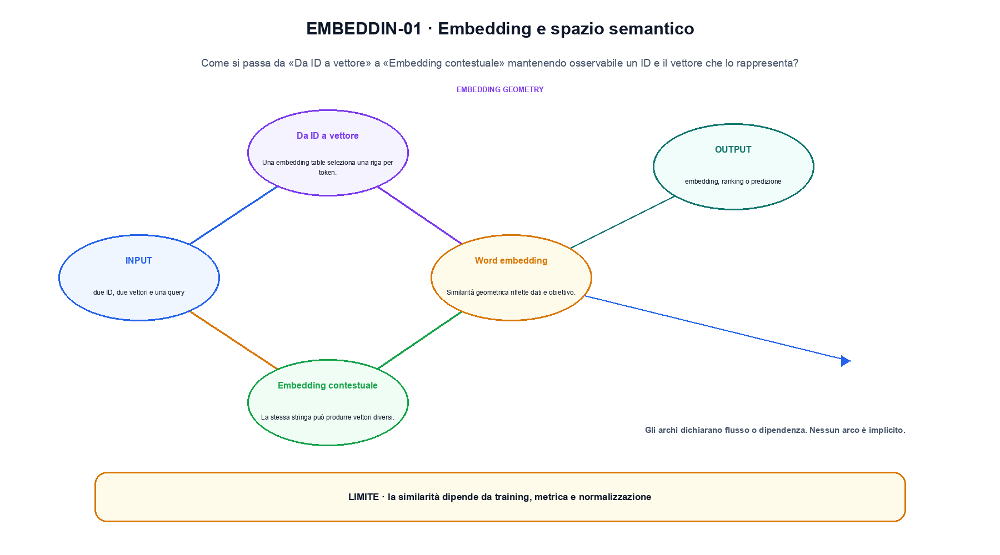

<!--
chapter_id: CH-P06-EMBEDDINGS
part_id: P06
order_key: 270
title: Embedding e spazio semantico
maturity: CORE
status: revisione editoriale v2, approvazione autoriale aperta
version: 0.5.0-draft3
last_source_check: 4 agosto 2026
environment: Python 3.13.12, CPU
code_policy: reference
deferred: benchmark applicativi non eseguiti e approvazione autoriale delle visuali
-->

# Capitolo 27. Embedding e spazio semantico

Per entrare in embedding e spazio semantico, seguiamo il passaggio che unisce «Da ID a vettore» a «Ricerca e anisotropia». L'oggetto osservato è un ID e il vettore che lo rappresenta. Il contratto locale dichiara input, due ID, due vettori e una query; operazione, lookup, pooling, similarità e normalizzazione; output, embedding, ranking o predizione. Il primo esempio osservabile è Un caso minimo con input due ID, due vettori e una query e output «embedding, ranking o predizione». Il limite da non nascondere è: la similarità dipende da training, metrica e normalizzazione.

## Da ID a vettore

Una embedding table seleziona una riga per token. La dimensione del vettore è una scelta architetturale. [SRC-27-001]

Un ID seleziona una riga della tabella di embedding.

**Caso da seguire.** Un caso minimo con input due ID, due vettori e una query e output «embedding, ranking o predizione».

**Controllo.** Per «Da ID a vettore», scrivi il risultato atteso prima del calcolo, modifica una sola quantità e localizza il primo passaggio che cambia. Nel caso «Da ID a vettore», il vincolo da conservare è: La dimensione del vettore è una scelta architetturale.


## Word embedding

Word2vec e GloVe usano statistiche distributive con obiettivi differenti. Similarità geometrica riflette dati e obiettivo. [SRC-27-002]

**Caso da seguire.** Due ID che selezionano righe diverse dalla stessa embedding table, prima di aggiungere il contesto.

**Controllo.** Per «Word embedding», ricalcola il caso a mano e con lo snippet. Nel caso «Word embedding», se i risultati divergono, confronta prima i valori intermedi e soltanto dopo l'output finale.


La relazione centrale può essere scritta come:

$$
E[i]=W[i]
$$

Un ID seleziona una riga della tabella di embedding. [SRC-27-001]




La prima figura segue il percorso da «Da ID a vettore» a «Embedding contestuale».


## Embedding contestuale

In un Transformer, la rappresentazione di un token cambia con il contesto. La stessa stringa può produrre vettori diversi. [SRC-27-003]

**Caso da seguire.** Per «Embedding contestuale» si mantiene l'input del capitolo e si isola questa condizione: In un Transformer, la rappresentazione di un token cambia con il contesto.

**Controllo.** Per «Embedding contestuale», aggiungi un valore limite e verifica separatamente forma, valore e ipotesi. Una shape valida non dimostra da sola «Embedding contestuale».


## Sentence embedding

Pooling o training contrastivo producono vettori per frasi e documenti. La metrica deve corrispondere all'uso previsto. [SRC-27-004]

**Caso da seguire.** Per «Sentence embedding» si mantiene l'input del capitolo e si isola questa condizione: Pooling o training contrastivo producono vettori per frasi e documenti.

**Controllo.** Per «Sentence embedding», mantieni fisso l'input e sostituisci soltanto il meccanismo discusso nella sezione. Nel caso «Sentence embedding», il confronto deve attribuire la differenza a quel passaggio, non al setup.


## Esempio Python eseguito

La prova locale di embedding e spazio semantico parte da un esempio minimo, registrato nel repository insieme ai suoi test. Per «Embedding e spazio semantico», il caso di default usa valori piccoli per isolare il meccanismo. La prova negativa riguarda proprio «embedding e spazio semantico» e interrompe l'interpretazione prima dell'output.

```python
def contract(case: str = "default"):
    if case != "default":
        raise ValueError("only the documented default case is supported")
    embedding_table = {1: [1.0, 0.0], 2: [0.0, 1.0]}
    static = embedding_table[1]
    contextual = [static[0] + 0.2, static[1] + 0.8]
    return {"static": static, "contextual": contextual, "invariant": "an embedding lookup is distinct from later contextualization"}
```

Esecuzione con `python snip_27_contract.py`:

```text
{"contextual": [1.2, 0.8], "invariant": "an embedding lookup is distinct from later contextualization", "static": [1.0, 0.0]}
```

Il test associato è [`code/test_27_contract.py`](code/test_27_contract.py); l'output versionato è [`code/outputs/SNIP-27-001.txt`](code/outputs/SNIP-27-001.txt).


## Ricerca e anisotropia

Cosine similarity è una convenzione, non una misura universale di significato. Normalizzazione e distribuzione dello spazio influenzano il ranking. [SRC-27-001]

**Caso da seguire.** Un confronto tra due prefissi con la stessa stringa, tokenizer dichiarato e mask causale esplicita.

**Controllo.** Per «Ricerca e anisotropia», costruisci un controesempio che rispetti il tipo di dato ma violi l'ipotesi centrale. Il test deve rendere riconoscibile perché «Ricerca e anisotropia» non si applica.


La seconda figura mette a confronto «Sentence embedding» e il limite discusso in «Ricerca e anisotropia».


## Come si collegano i passaggi

- **Da «Da ID a vettore» a «Word embedding».** Una embedding table seleziona una riga per token. Word2vec e GloVe usano statistiche distributive con obiettivi differenti. Tra «Da ID a vettore» e «Word embedding» l'ingresso viene fissato prima della regola che produce il valore. Da «Da ID a vettore» a «Word embedding» cambia la domanda osservabile. [SRC-27-001; SRC-27-002]

- **Da «Word embedding» a «Embedding contestuale».** Word2vec e GloVe usano statistiche distributive con obiettivi differenti. In un Transformer, la rappresentazione di un token cambia con il contesto. Nel caso «Embedding contestuale» il componente diventa il punto in cui localizzare l'errore. Il passaggio successivo rende misurabile «Embedding contestuale». [SRC-27-002; SRC-27-003]

- **Da «Embedding contestuale» a «Sentence embedding».** In un Transformer, la rappresentazione di un token cambia con il contesto. Pooling o training contrastivo producono vettori per frasi e documenti. Dopo «Embedding contestuale», la variante di «Sentence embedding» cambia una proprietà alla volta. Da «Embedding contestuale» a «Sentence embedding» cambia la domanda osservabile. [SRC-27-003; SRC-27-004]

- **Da «Sentence embedding» a «Ricerca e anisotropia».** Pooling o training contrastivo producono vettori per frasi e documenti. Cosine similarity è una convenzione, non una misura universale di significato. Da «Ricerca e anisotropia» in poi la misura resta distinta dalla correttezza locale del calcolo. Il passaggio successivo rende misurabile «Ricerca e anisotropia». [SRC-27-004; SRC-27-001]

La catena completa produce embedding, ranking o predizione a partire da due ID, due vettori e una query. Ogni collegamento conserva un oggetto osservabile diverso; per questo il risultato non può essere esteso oltre il limite dichiarato: la similarità dipende da training, metrica e normalizzazione.


## Esercizi sul meccanismo

1. Ricostruisci «Da ID a vettore» con un esempio diverso da quello mostrato e indica l'output atteso prima del calcolo.
2. Nel passaggio «Word embedding», cambia una sola ipotesi e spiega quale risultato non è più confrontabile.
3. Collega «Embedding contestuale» a una riga dello snippet oppure motiva perché la prova deve essere documentale.
4. Progetta un caso limite per «Sentence embedding» che produca una failure riconoscibile.
5. Per «Ricerca e anisotropia», separa una conclusione sostenuta dal caso locale da una che richiederebbe nuovi dati o un benchmark.


## Che cosa deve restare chiaro

La lezione parte da «due ID, due vettori e una query» e arriva fino a «embedding, ranking o predizione». Il limite da conservare è questo: la similarità dipende da training, metrica e normalizzazione. La formula e il codice collegati a «Ricerca e anisotropia» sono rintracciabili in [`FONTI_PRIMARIE.md`](FONTI_PRIMARIE.md), [`CLAIMS.md`](CLAIMS.md) e `code/`.
