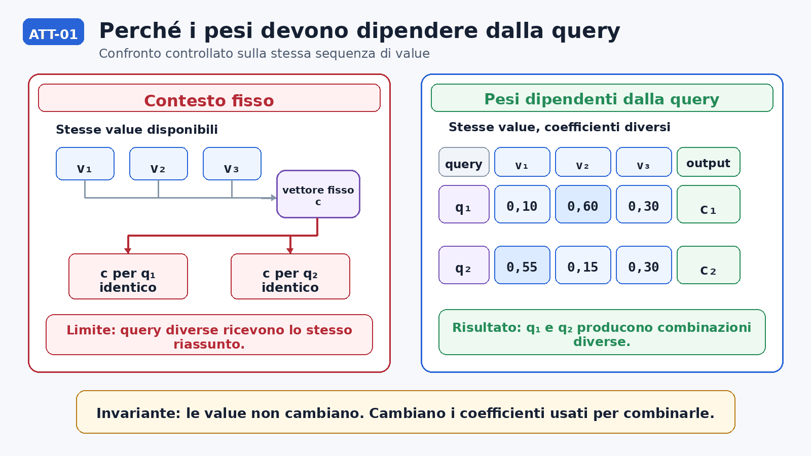
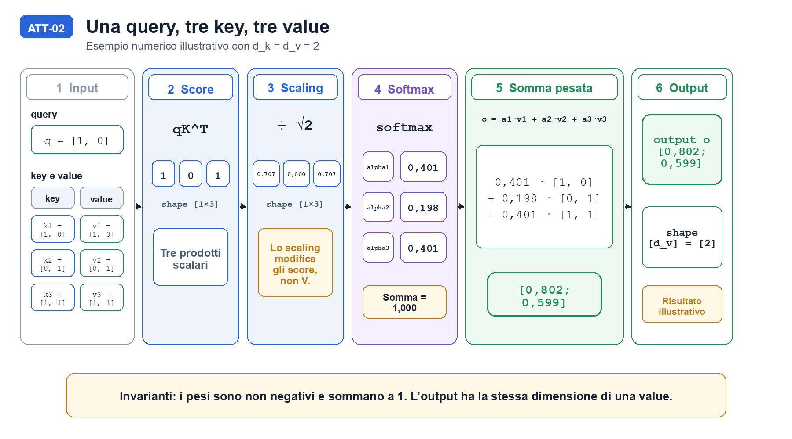

<!--
chapter_id: CH-P06-ATTENTION
part_id: P06
order_key: 280
title: Il meccanismo di attention
maturity: CORE
status: revisione di accessibilità per lettore non esperto completata, controllo visuale riaperto
version: 0.5.0-rc5
opened: 2026-07-30
last_web_research: 2026-07-30
last_source_check: 2026-07-30
environment: Python 3.13.5, PyTorch 2.10.0+cpu
deferred: informazione posizionale, multi-head attention, varianti KV, KV cache, implementazioni hardware-aware
-->

# Capitolo 28. Il meccanismo di attention

Per intuire il problema, torniamo alla frase «Il pacco non è arrivato». Quando il modello aggiorna la rappresentazione della parte finale della frase, la parola `non` può essere molto importante, mentre altre parole possono contribuire meno. In un'altra posizione della stessa frase, i contributi utili possono cambiare. Per semplicità parleremo di parole, anche se un modello lavora normalmente con unità chiamate **token**, che possono coincidere con una parola o con una sua parte.

Un unico riassunto della sequenza, costruito una volta e riutilizzato in ogni posizione, non può adattarsi a queste differenze. L'**attention** risolve il problema calcolando una combinazione specifica per ogni posizione. Il meccanismo confronta l'elemento corrente con gli elementi disponibili, trasforma i confronti in coefficienti e usa quei coefficienti per costruire un nuovo vettore.

Seguiremo tutto il calcolo con vettori di soli due numeri. I valori sono illustrativi e non rappresentano il significato reale di parole specifiche. Servono a rendere visibile ogni passaggio prima di arrivare alla formula generale e all'implementazione PyTorch.

## Perché una combinazione fissa non basta

In un modello, una posizione della sequenza viene rappresentata da un **vettore**, cioè da una lista di numeri. Consideriamo tre vettori disponibili:

$$
v_1=[1,0],\qquad v_2=[0,1],\qquad v_3=[1,1].
$$

Supponiamo che due posizioni debbano usare questi stessi vettori. Se entrambe ricevono un unico riassunto `c`, ottengono la stessa combinazione. Una posizione potrebbe invece aver bisogno di

$$
c_1=0{,}10v_1+0{,}60v_2+0{,}30v_3=[0{,}40,0{,}90],
$$

mentre l'altra potrebbe aver bisogno di

$$
c_2=0{,}05v_1+0{,}15v_2+0{,}80v_3=[0{,}85,0{,}95].
$$

I tre vettori disponibili sono gli stessi. Cambiano soltanto i coefficienti con cui vengono combinati, e per questo cambiano anche i risultati. Il problema dell'attention è calcolare coefficienti diversi per posizioni diverse.

La figura seguente confronta le due possibilità. Nel pannello sinistro, `v1`, `v2` e `v3` confluiscono in un solo vettore `c`, riutilizzato da entrambe le posizioni, chiamate `consumer 1` e `consumer 2` nella figura. Nel pannello destro, gli stessi vettori restano disponibili, ma ogni posizione usa coefficienti propri.



La figura mostra il risultato che vogliamo ottenere, ma non spiega ancora come ricavare i coefficienti. Per farlo dobbiamo separare tre ruoli.

## I tre ruoli: query, key e value

La **query** è il vettore della posizione che stiamo aggiornando. Le **key** sono i vettori usati per misurare quanto ogni posizione disponibile è compatibile con la query. Le **value** sono i vettori che verranno effettivamente combinati per costruire l'output.

Query, key e value non indicano tre tipi diversi di parole. Sono tre ruoli matematici. La stessa posizione della sequenza può produrre una key e una value differenti attraverso proiezioni apprese.

Nel nostro esempio useremo

$$
q=[1,0],
$$

$$
K=
\begin{bmatrix}
1&0\\
0&1\\
1&1
\end{bmatrix},
\qquad
V=
\begin{bmatrix}
1&0\\
0&1\\
1&1
\end{bmatrix}.
$$

`K` e `V` hanno tre righe perché abbiamo tre posizioni disponibili. Ogni riga contiene due numeri. Per questo la loro shape è `[3,2]`: tre righe, due valori per riga. La query contiene due numeri e ha shape `[2]`.

In questo esempio `K` e `V` contengono gli stessi valori soltanto per rendere brevi i conti. I ruoli restano diversi. `K` serve a calcolare i coefficienti; `V` contiene i vettori che quei coefficienti combineranno.

La corrispondenza tra le righe è essenziale. La prima key appartiene alla prima value, la seconda key alla seconda value e così via. Se cambiassimo l'ordine di una sola matrice, applicheremmo un coefficiente alla value sbagliata.

## Il calcolo completo su una query

Il primo passo confronta la query con ogni key. Usiamo il **prodotto scalare**: moltiplichiamo i numeri nella stessa posizione e sommiamo i risultati.

$$
[1,0]\cdot[1,0]=1,
$$

$$
[1,0]\cdot[0,1]=0,
$$

$$
[1,0]\cdot[1,1]=1.
$$

Otteniamo tre **score**, uno per ogni key:

$$
qK^T=[1,0,1].
$$

Uno score più alto indica, nel confronto definito da questi vettori, una compatibilità maggiore con la query. Gli score non sono ancora coefficienti. Possono essere negativi e non devono sommare a uno. Le value, inoltre, non sono ancora entrate nel calcolo.

Nel Transformer originale gli score vengono divisi per la radice della dimensione delle key. Qui ogni key contiene due numeri, quindi `d_k=2`:

$$
\frac{[1,0,1]}{\sqrt{2}}
=
[0{,}7071,0,0{,}7071].
$$

Questa divisione non cambia il numero degli score e non cambia quale score è maggiore. Ne riduce la scala prima della softmax. Il fattore `1/\sqrt{d_k}` serve a evitare che, quando i vettori diventano più grandi, i prodotti scalari crescano troppo e rendano la softmax poco favorevole al calcolo dei gradienti [Vaswani et al., 2017, §3.2.1].

> **Approfondimento matematico.** In un caso idealizzato, se le componenti di query e key sono indipendenti, con media zero e varianza uno, il prodotto scalare somma `d_k` termini e la sua varianza cresce come `d_k`. Dividere per `\sqrt{d_k}` riporta la varianza a ordine unitario. Questa derivazione dipende dalle ipotesi dichiarate e non descrive necessariamente le rappresentazioni apprese da un modello reale.

Ora applichiamo la **softmax**. La softmax trasforma gli score in coefficienti non negativi che sommano a uno. In questo modo possiamo leggerli come quote della combinazione finale:

$$
\alpha_j=\frac{e^{s_j}}{\sum_{m=1}^{S}e^{s_m}}.
$$

Con gli score del nostro esempio otteniamo, arrotondando a tre decimali,

$$
\alpha=[0{,}401,0{,}198,0{,}401].
$$

Il primo e il terzo vettore ricevono lo stesso coefficiente perché avevano lo stesso score. Il secondo riceve un coefficiente più piccolo. Ogni numero continua a riferirsi alla stessa coppia key-value.

Soltanto adesso usiamo `V`. Moltiplichiamo ogni value per il coefficiente corrispondente e sommiamo:

$$
0{,}401[1,0]+0{,}198[0,1]+0{,}401[1,1]
=
[0{,}802,0{,}599].
$$

L'output contiene due numeri, quindi ha shape `[2]`, la stessa dimensione delle value. Le righe di `V` non vengono modificate. Il calcolo crea un nuovo vettore combinandole. La query non viene sommata direttamente alle value: serve a scegliere, attraverso il confronto con le key, quanto ciascuna value deve contribuire.

La figura seguente ripercorre lo stesso calcolo da sinistra a destra: input, prodotti scalari, divisione per `\sqrt{d_k}`, softmax, somma pesata e output.



Possiamo riassumere l'algoritmo in forma compatta:

```text
ricevi una query, S key e S value
calcola uno score tra la query e ogni key
dividi gli score per sqrt(d_k)
trasforma gli score in coefficienti con la softmax
moltiplica ogni value per il coefficiente corrispondente
somma i vettori pesati
restituisci un vettore di dimensione d_v
```

Il numero dei coefficienti coincide con il numero di coppie key-value. La dimensione dell'output coincide con la dimensione delle value.

## Dall'esempio alla forma matriciale

La trasformazione appena costruita si chiama **scaled dot-product attention**. Per una sola query si scrive

$$
\mathrm{Attention}(q,K,V)
=
\mathrm{softmax}\left(\frac{qK^T}{\sqrt{d_k}}\right)V.
$$

La formula compatta contiene gli stessi passaggi eseguiti a mano. `qK^T` produce gli score, la divisione ne controlla la scala, la softmax produce i coefficienti e il prodotto finale con `V` combina le value.

Quando le query sono più di una, le raccogliamo nelle righe di una matrice `Q`. Usiamo `L` per il numero delle query e `S` per il numero delle coppie key-value:

$$
\mathrm{Attention}(Q,K,V)
=
\mathrm{softmax}\left(\frac{QK^T}{\sqrt{d_k}}\right)V.
$$

La softmax viene applicata riga per riga. Ogni riga appartiene a una query e contiene uno score per ciascuna key [Vaswani et al., 2017, §3.2.1].

| Oggetto | Shape | Significato |
|---|---:|---|
| `Q` | `[L,d_k]` | `L` query, ciascuna con `d_k` valori |
| `K` | `[S,d_k]` | `S` key, ciascuna con `d_k` valori |
| `V` | `[S,d_v]` | `S` value, ciascuna con `d_v` valori |
| `QK^T` | `[L,S]` | uno score per ogni coppia query-key |
| `A` | `[L,S]` | coefficienti normalizzati per ogni query |
| `O=AV` | `[L,d_v]` | un vettore di output per ogni query |

Ogni query può produrre coefficienti diversi e quindi una combinazione diversa delle stesse value. Il numero di righe di `K` deve coincidere con quello di `V`, perché a ogni key deve corrispondere una value.

Nella **self-attention**, query, key e value derivano dalla stessa sequenza. Nella **cross-attention**, le query derivano da una sequenza e le coppie key-value da un'altra. Nella **causal self-attention**, tutti e tre derivano dalla stessa sequenza, ma ogni posizione può usare soltanto sé stessa e le posizioni precedenti.

## Escludere le posizioni future

Un modello autoregressivo genera una sequenza da sinistra a destra. Quando calcola la rappresentazione della posizione `i`, non deve leggere elementi che, in quel momento, appartengono ancora al futuro.

Il vincolo viene applicato agli score prima della softmax. Introduciamo una **mask** additiva `M`:

$$
A=\mathrm{softmax}\left(\frac{QK^T}{\sqrt{d_k}}+M\right).
$$

Nel caso causale quadrato,

$$
M_{ij}=
\begin{cases}
0 & \text{se } j\le i,\\
-\infty & \text{se } j>i.
\end{cases}
$$

Le posizioni ammesse ricevono `0`, quindi il loro score resta invariato. Le posizioni future ricevono `-\infty`; dopo la softmax, il loro coefficiente diventa zero. In questo modo non contribuiscono all'output.

La mask non viene applicata direttamente alle value. Farlo cambierebbe i dati trasportati. Il vincolo causale deve invece impedire che alcune coppie query-key ricevano peso, e per questo interviene sugli score prima della softmax.

## Dalla formula a PyTorch

Il seguente snippet ripete l'esempio numerico. Le tre righe centrali corrispondono ai tre passaggi principali: score scalati, softmax e combinazione delle value.

```python
from __future__ import annotations

import math
import torch

q = torch.tensor([1.0, 0.0], dtype=torch.float64)
k = torch.tensor([[1.0, 0.0], [0.0, 1.0], [1.0, 1.0]], dtype=torch.float64)
v = torch.tensor([[1.0, 0.0], [0.0, 1.0], [1.0, 1.0]], dtype=torch.float64)

scores = (q @ k.transpose(0, 1)) / math.sqrt(q.numel())
weights = torch.softmax(scores, dim=-1)
output = weights @ v

assert scores.shape == (3,)
assert output.shape == (2,)
torch.testing.assert_close(weights.sum(), torch.tensor(1.0, dtype=weights.dtype))
```

`q @ k.transpose(0, 1)` calcola i tre prodotti scalari. `torch.softmax` produce i coefficienti. `weights @ v` costruisce il vettore finale. Le asserzioni controllano che le shape e la somma dei coefficienti siano quelle attese.

Il file completo è [`code/snip_att_001_single_query.py`](code/snip_att_001_single_query.py); l'output registrato è in [`code/outputs/SNIP-ATT-001.txt`](code/outputs/SNIP-ATT-001.txt).

Il repository contiene anche due controlli aggiuntivi. [`code/snip_att_002_matrix_api.py`](code/snip_att_002_matrix_api.py) confronta l'implementazione diretta con `torch.nn.functional.scaled_dot_product_attention`. [`code/snip_att_003_causal_mask.py`](code/snip_att_003_causal_mask.py) verifica che i coefficienti delle posizioni future diventino nulli.

> **Nota sulle API.** Le API PyTorch non usano sempre la stessa convenzione per le mask booleane. Il significato esatto di `True` deve quindi essere controllato nella documentazione della funzione usata. Nel confronto del capitolo `dropout_p=0.0`, così il dropout non modifica i coefficienti [PyTorch 2.13 Docs].

## Costo, limiti e passaggio alla multi-head attention

Con `L` query e `S` key, la matrice degli score contiene `L\times S` celle. Nella self-attention, se la sequenza contiene `n` posizioni, la matrice contiene `n^2` celle. Questo è il motivo essenziale per cui sequenze più lunghe possono richiedere molta memoria e molto calcolo.

In termini asintotici, il prodotto `QK^T` richiede ordine `O(LSd_k)` operazioni e il prodotto con `V` richiede ordine `O(LSd_v)`. Le implementazioni hardware-aware possono eseguire lo stesso operatore con strategie diverse di memoria e ricomputazione, ma non cambiano il meccanismo matematico spiegato qui.

L'attention, da sola, non aggiunge informazioni esterne e non stabilisce se un contenuto sia corretto. Inoltre non conosce automaticamente l'ordine delle posizioni. L'ordine deve essere rappresentato nei dati o nel calcolo attraverso informazione posizionale, che verrà studiata più avanti.

Il caso visto finora usa un solo insieme di proiezioni. La **multi-head attention** ripete lo stesso meccanismo con più proiezioni, mantiene separati i risultati e poi li ricompone. Concatenazione, proiezione finale e shape delle singole head appartengono al passo successivo.

## Riepilogo

L'attention nasce da un problema semplice: posizioni diverse della stessa sequenza possono aver bisogno di combinazioni diverse delle informazioni disponibili. Un riassunto fisso non basta.

Per ogni posizione, la query viene confrontata con le key. I prodotti scalari producono score, gli score vengono ridimensionati e la softmax li trasforma in coefficienti. Quei coefficienti combinano le value e producono un nuovo vettore.

Con più query, lo stesso calcolo viene eseguito riga per riga. Una causal mask può impedire l'uso delle posizioni future azzerandone i coefficienti prima della combinazione finale.

### Verifica della comprensione

1. Spiega con parole semplici perché un unico vettore di contesto non basta per tutte le posizioni.
2. Descrivi il ruolo di query, key e value senza usare la formula.
3. Ricostruisci l'ordine di prodotto scalare, scaling, softmax e combinazione delle value.
4. Spiega perché la causal mask agisce sugli score e non direttamente sulle value.
5. Determina la shape dell'output con `L=5`, `S=7`, `d_k=64` e `d_v=32`.

### Esercizi

1. Calcola a mano score, coefficienti e output per `q=[0,1]` usando le stesse `K` e `V`.
2. Modifica `SNIP-ATT-002` usando `d_v=3` e verifica la nuova shape dell'output.
3. Sostituisci la mask booleana con una mask additiva contenente `0` e `-inf`.
4. Costruisci un caso in cui tutte le key producano lo stesso score e spiega il risultato della softmax.
5. Verifica con un test che una permutazione coerente di query, key e value permuti nello stesso modo l'output quando non è presente informazione posizionale.

## Fonti e materiali verificabili

La definizione portante deriva da Vaswani et al., *Attention Is All You Need* (2017). Il contesto storico comprende Bahdanau, Cho e Bengio (2015) e Luong, Pham e Manning (2015). Le convenzioni implementative sono verificate sulla documentazione ufficiale PyTorch.

Le schede complete e i limiti d'uso sono in [`FONTI_PRIMARIE.md`](FONTI_PRIMARIE.md). Codice, test, output e ambiente sono raccolti nella cartella [`code/`](code/).
