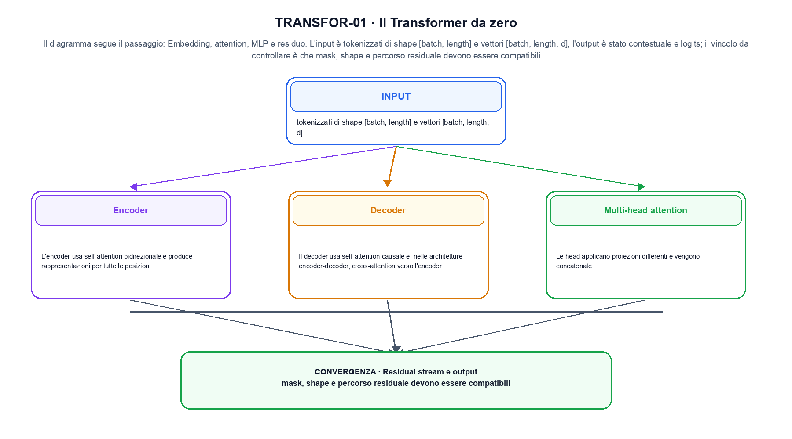
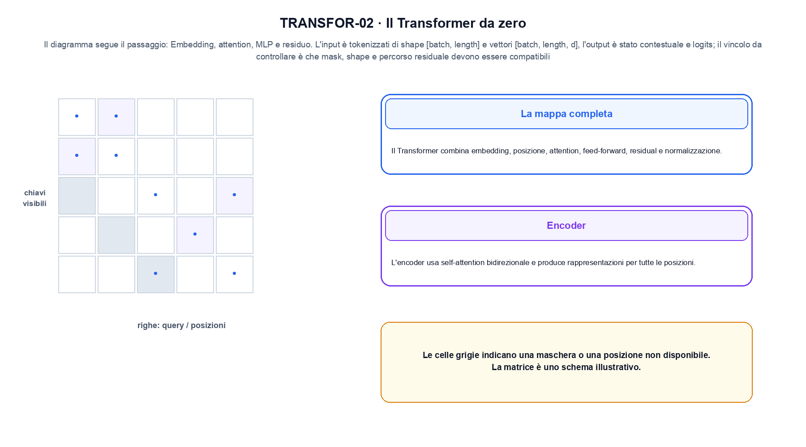

<!--
chapter_id: CH-P06-TRANSFORMER
part_id: P06
order_key: 290
title: Il Transformer da zero
maturity: CORE
status: candidatura completa in revisione autoriale
version: 0.4.0-draft2
last_source_check: 3 agosto 2026
environment: Python 3.13.12, CPU
deferred: benchmark applicativi, varianti non necessarie al contratto centrale e approvazione autoriale
-->

# Capitolo 29. Il Transformer da zero

Una frase plausibile non basta a spiegare il transformer da zero. L'oggetto è lo stato nascosto che attraversa il blocco Transformer; riprendiamo la richiesta «Il pacco non è arrivato» come contesto comune, partiamo da un input piccolo, rendiamo visibile l'operazione e fissiamo che cosa non possiamo concludere.

## La mappa completa

Il Transformer combina embedding, posizione, attention, feed-forward, residual e normalizzazione. Ogni componente mantiene un contratto di shape. [SRC-29-001]

Prima del nome tecnico fissiamo la situazione: consideriamo un caso minimo con input tokenizzati di shape [batch, length] e vettori [batch, length, d] e output «stato contestuale e logits». Da qui possiamo leggere la conseguenza dichiarata da «Il Transformer combina embedding, posizione, attention, feed-forward, residual e normalizzazione».

La sezione usa l'input «tokenizzati di shape [batch, length] e vettori [batch, length, d]» come punto di partenza e l'output «stato contestuale e logits» come traccia d'uscita. La trasformazione concreta è «embedding, attention, MLP e residuo»; il caso non è completo se non dichiariamo anche che mask, shape e percorso residuale devono essere compatibili. La condizione da isolare è «Il Transformer combina embedding, posizione, attention, feed-forward, residual e normalizzazione».

Il passaggio da seguire in «La mappa completa» è quello descritto dalla frase «Il Transformer combina embedding, posizione, attention, feed-forward, residual e normalizzazione»: l'esempio rende osservabile la trasformazione, mentre il contratto del capitolo ne delimita l'interpretazione. Per «La mappa completa» il controllo cambia una sola premessa della frase «Il Transformer combina embedding, posizione, attention, feed-forward, residual e normalizzazione» e conserva input, output e criterio di successo, così la differenza resta attribuibile. La verifica resta ancorata a «Il Transformer combina embedding, posizione, attention, feed-forward, residual e normalizzazione». [SRC-29-001]

Se cambiamo una premessa, dobbiamo riaprire l'interpretazione. Per «La mappa completa» conserviamo l'osservazione collegata a «Il Transformer combina embedding, posizione, attention, feed-forward, residual e normalizzazione» e lasciamo esplicitamente fuori ciò che non è stato misurato.

La prova di «La mappa completa» conserva input, operazione e output; poi esplicita quale parte di «Il Transformer combina embedding, posizione, attention, feed-forward, residual e normalizzazione» non è stata misurata. Così il test separa l'evidenza dall'inferenza. Il passaggio successivo, «Encoder», potrà cambiare una sola condizione, dichiarando il nuovo setup prima di interpretare il risultato.

## Encoder

L'encoder usa self-attention bidirezionale e produce rappresentazioni per tutte le posizioni. [SRC-29-002]

Per capire «Encoder» partiamo da questo caso: un blocco con due token e due dimensioni nascoste. Il caso rende osservabile il punto centrale: «L'encoder usa self-attention bidirezionale e produce rappresentazioni per tutte le posizioni».

Per ricostruire «Encoder» annotiamo l'input «tokenizzati di shape [batch, length] e vettori [batch, length, d]», poi l'operazione «embedding, attention, MLP e residuo», infine l'output «stato contestuale e logits». Questa sequenza impedisce di scambiare una forma compatibile per il comportamento descritto dalla fonte. Il controllo parte da «L'encoder usa self-attention bidirezionale e produce rappresentazioni per tutte le posizioni».

Un flow rende esplicito il percorso invertibile tra spazio semplice e dati. La densità deve tenere conto del Jacobiano, mentre il costo dipende dalla trasformazione o dalla soluzione numerica scelta. Per «Encoder» il controllo cambia una sola premessa della frase «L'encoder usa self-attention bidirezionale e produce rappresentazioni per tutte le posizioni» e conserva input, output e criterio di successo, così la differenza resta attribuibile. La verifica resta ancorata a «L'encoder usa self-attention bidirezionale e produce rappresentazioni per tutte le posizioni». [SRC-29-002]

Il punto didattico di «Encoder» è separare ciò che la fonte afferma da ciò che il piccolo caso illustra. L'output «stato contestuale e logits» mostra il contratto locale, ma non sostituisce una misura sul sistema completo.

Per verificare «Encoder» cambiamo una sola condizione vicina alla frase «L'encoder usa self-attention bidirezionale e produce rappresentazioni per tutte le posizioni», teniamo fermo il resto e registriamo l'output «stato contestuale e logits». Il caso negativo deve rendere riconoscibile la failure, non soltanto produrre un numero diverso. La sezione successiva, «Decoder», riceve l'output «stato contestuale e logits» come base, ma dovrà formulare e verificare la propria distinzione.

## Decoder

Il decoder usa self-attention causale e, nelle architetture encoder-decoder, cross-attention verso l'encoder. [SRC-29-003]

Il caso minimo di «Decoder» si presenta così: un caso in cui mask, shape e percorso residuale devono essere compatibili. Non lo usiamo come decorazione: serve a rendere osservabile la frase «Il decoder usa self-attention causale e, nelle architetture encoder-decoder, cross-attention verso l'encoder».

Nel contratto locale, l'input «tokenizzati di shape [batch, length] e vettori [batch, length, d]» entra, l'operazione «embedding, attention, MLP e residuo» modifica il percorso e l'output «stato contestuale e logits» è ciò che osserviamo. Qui cambia soprattutto il passaggio «Decoder»; resta da controllare che mask, shape e percorso residuale devono essere compatibili. La domanda locale è «Il decoder usa self-attention causale e, nelle architetture encoder-decoder, cross-attention verso l'encoder».

Un flow rende esplicito il percorso invertibile tra spazio semplice e dati. La densità deve tenere conto del Jacobiano, mentre il costo dipende dalla trasformazione o dalla soluzione numerica scelta. Per «Decoder» il controllo cambia una sola premessa della frase «Il decoder usa self-attention causale e, nelle architetture encoder-decoder, cross-attention verso l'encoder» e conserva input, output e criterio di successo, così la differenza resta attribuibile. La verifica resta ancorata a «Il decoder usa self-attention causale e, nelle architetture encoder-decoder, cross-attention verso l'encoder». [SRC-29-003]

La lettura va fatta in ordine: prima il caso, poi la trasformazione, quindi la conseguenza. Il piccolo risultato resta un'illustrazione di «Il decoder usa self-attention causale e, nelle architetture encoder-decoder, cross-attention verso l'encoder», non una promessa generale.

Il controllo minimo di «Decoder» confronta il caso dichiarato con una variazione che rompe la sua ipotesi. Se la failure non è distinguibile dall'esito valido, manca un'osservazione nel contratto di ordine, posizione e memoria contestuale. Da «Decoder» portiamo l'output «stato contestuale e logits»; non portiamo invece una conclusione oltre il caso locale.

## Multi-head attention

Le head applicano proiezioni differenti e vengono concatenate. La proiezione finale riporta alla dimensione del modello. [SRC-29-004]

Prima del nome tecnico fissiamo la situazione: consideriamo un confronto tra due prefissi con la stessa stringa, tokenizer dichiarato e mask causale esplicita. Da qui possiamo leggere la conseguenza dichiarata da «Le head applicano proiezioni differenti e vengono concatenate».

La sezione usa l'input «tokenizzati di shape [batch, length] e vettori [batch, length, d]» come punto di partenza e l'output «stato contestuale e logits» come traccia d'uscita. La trasformazione concreta è «embedding, attention, MLP e residuo»; il caso non è completo se non dichiariamo anche che mask, shape e percorso residuale devono essere compatibili. La condizione da isolare è «Le head applicano proiezioni differenti e vengono concatenate».

Il Transformer compone embedding, posizione, attention, MLP, residual e normalizzazione. Il contratto cambia quando cambiano mask, direzione della sequenza o interfaccia tra encoder e decoder, anche se la shape finale resta uguale. La variabile da isolare è il pattern di visibilità o di riuso: la stessa shape può corrispondere a dipendenze e costi diversi. La verifica resta ancorata a «Le head applicano proiezioni differenti e vengono concatenate». [SRC-29-004]

Se cambiamo una premessa, dobbiamo riaprire l'interpretazione. Per «Multi-head attention» conserviamo l'osservazione collegata a «Le head applicano proiezioni differenti e vengono concatenate» e lasciamo esplicitamente fuori ciò che non è stato misurato.

La prova di «Multi-head attention» conserva input, operazione e output; poi esplicita quale parte di «Le head applicano proiezioni differenti e vengono concatenate» non è stata misurata. Così il test separa l'evidenza dall'inferenza. Il passaggio successivo, «Residual stream e output», potrà cambiare una sola condizione, dichiarando il nuovo setup prima di interpretare il risultato.

La figura TRANSFOR-01 usa la famiglia branch. Il diagramma segue il passaggio: Embedding, attention, MLP e residuo. L'input è tokenizzati di shape [batch, length] e vettori [batch, length, d], l'output è stato contestuale e logits; il vincolo da controllare è che mask, shape e percorso residuale devono essere compatibili.

## Residual stream e output

Layer ripetuti aggiornano il residual stream. La head di output trasforma la rappresentazione in logits sul vocabolario. [SRC-29-001]

Per capire «Residual stream e output» partiamo da questo caso: due vettori con shape compatibile confrontati prima e dopo il blocco, osservando separatamente scala e percorso residuale in «Residual stream e output». Il caso rende osservabile il punto centrale: «Layer ripetuti aggiornano il residual stream».

Per ricostruire «Residual stream e output» annotiamo l'input «tokenizzati di shape [batch, length] e vettori [batch, length, d]», poi l'operazione «embedding, attention, MLP e residuo», infine l'output «stato contestuale e logits». Questa sequenza impedisce di scambiare una forma compatibile per il comportamento descritto dalla fonte. Il controllo parte da «Layer ripetuti aggiornano il residual stream».

Il punto operativo è la scala del segnale: inizializzazione, normalizzazione, residual e regolarizzazione intervengono in momenti diversi e non sono sostituti intercambiabili. Shape compatibili e curve osservate servono a controllare il percorso reale. Per «Residual stream e output» il controllo cambia una sola premessa della frase «Layer ripetuti aggiornano il residual stream» e conserva input, output e criterio di successo, così la differenza resta attribuibile. La verifica resta ancorata a «Layer ripetuti aggiornano il residual stream». [SRC-29-001]

Il punto didattico di «Residual stream e output» è separare ciò che la fonte afferma da ciò che il piccolo caso illustra. L'output «stato contestuale e logits» mostra il contratto locale, ma non sostituisce una misura sul sistema completo.

Per verificare «Residual stream e output» cambiamo una sola condizione vicina alla frase «Layer ripetuti aggiornano il residual stream», teniamo fermo il resto e registriamo l'output «stato contestuale e logits». Il caso negativo deve rendere riconoscibile la failure, non soltanto produrre un numero diverso. Il percorso si chiude lasciando espliciti la misura locale e ciò che richiederebbe una prova ulteriore.

## Un caso dall'input all'output: La mappa completa

Il caso intero parte dall'input «tokenizzati di shape [batch, length] e vettori [batch, length, d]», applica l'operazione «embedding, attention, MLP e residuo» e osserva l'output «stato contestuale e logits». Un esempio controllato: un blocco con due token e due dimensioni nascoste. La formula locale è:

$$
Attention(Q,K,V)=softmax(QK^T/\sqrt{d_k})V
$$

La shape esplicita separa score, pesi e combinazione delle value. [SRC-29-001]

La figura TRANSFOR-02 cambia composizione rispetto alla prima. Il diagramma segue il passaggio: Embedding, attention, MLP e residuo. L'input è tokenizzati di shape [batch, length] e vettori [batch, length, d], l'output è stato contestuale e logits; il vincolo da controllare è che mask, shape e percorso residuale devono essere compatibili.

## Dal meccanismo alla prova locale: Encoder

Lo snippet locale mette in esecuzione questo caso: un blocco con due token e due dimensioni nascoste. Il test associato controlla determinismo, output e invariante e rifiuta una shape o condizione incoerente; il risultato è conservato in `code/outputs/SNIP-29-001.txt`, come evidenza locale e non come benchmark di produzione.

## Dove il risultato si ferma: Residual stream e output

Il caso di «Il Transformer da zero» non certifica un servizio completo. Mask, shape e percorso residuale devono essere compatibili. La domanda successiva è se «Layer ripetuti aggiornano il residual stream» regga quando cambiano dati, scala, hardware o criteri di decisione.

## Che cosa portiamo avanti: Il Transformer da zero

Il filo della lezione va dall'input «tokenizzati di shape [batch, length] e vettori [batch, length, d]» all'output «stato contestuale e logits». Nei passaggi «La mappa completa», «Encoder», «Residual stream e output» abbiamo usato esempi e controlli negativi per rendere il contratto controllabile e delimitare la conclusione. L'invariante da portare avanti è: mask, shape e percorso residuale devono essere compatibili. Il Capitolo 30, Famiglie architetturali e obiettivi di pretraining, può partire da questo output e dichiarare la propria domanda.

### Verifica di comprensione: La mappa completa

1. Ricostruisci l'oggetto continuo a partire da «La mappa completa» e indica quale parte della frase «Il Transformer combina embedding, posizione, attention, feed-forward, residual e normalizzazione» entra nel caso.
2. Spiega quale trasformazione collega «La mappa completa» a «Residual stream e output» e quale output osserviamo nel passaggio.
3. Usa lo snippet per controllare l'invariante del contratto: mask, shape e percorso residuale devono essere compatibili.
4. Separa una definizione sostenuta da una fonte, un esempio illustrativo e un risultato locale del caso guida.
5. Indica quale parte della frase «Layer ripetuti aggiornano il residual stream» richiederebbe una misura nuova prima di essere estesa oltre il caso osservato.

### Esercizi di trasferimento: Residual stream e output

1. Racconta «La mappa completa» come una trasformazione: che cosa entra e che cosa esce?
2. Confronta due esecuzioni di «Encoder» mantenendo il resto del setup invariato.
3. Per «Decoder», separa l'esempio locale dal limite che impedisce di generalizzarlo.
4. Progetta una prova per «Multi-head attention» che renda visibile il suo confine.
5. Scrivi una metrica o una domanda per valutare «Residual stream e output» senza confondere livelli diversi.

## Fonti, codice e materiali: Il Transformer da zero

Per ricontrollare «Il Transformer da zero», partire da `FONTI_PRIMARIE.md` e poi dal codice: la domanda aperta è come trasferire il vincolo che impedisce di leggere il futuro oltre il caso locale, con la data di consultazione dichiarata. `CLAIMS.md` separa definizioni e risultati locali; codice, ambiente, test e output sono nella cartella `code/`, con attenzione a ordine, posizione e memoria contestuale.
