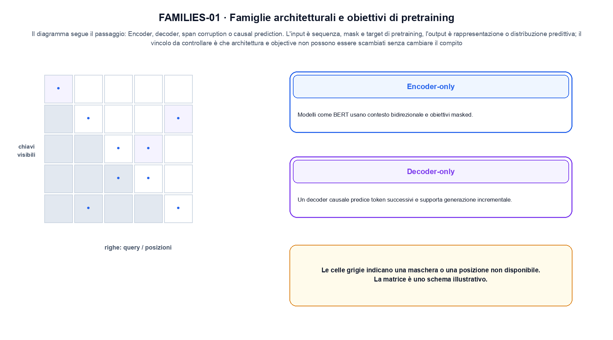
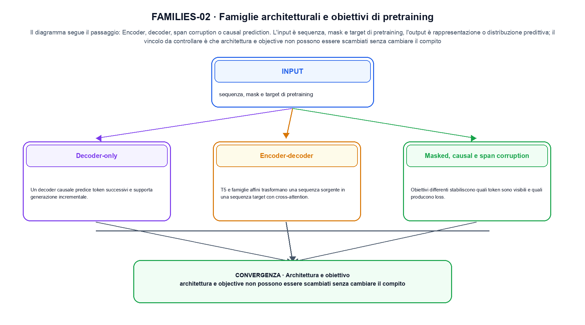

<!--
chapter_id: CH-P06-PRETRAIN-FAMILIES
part_id: P06
order_key: 300
title: Famiglie architetturali e obiettivi di pretraining
maturity: CORE
status: candidatura completa in revisione autoriale
version: 0.4.0-draft2
last_source_check: 3 agosto 2026
environment: Python 3.13.12, CPU
deferred: benchmark applicativi, varianti non necessarie al contratto centrale e approvazione autoriale
-->

# Capitolo 30. Famiglie architetturali e obiettivi di pretraining

Il Capitolo 29, Il Transformer da zero, ha lasciato disponibile una famiglia architetturale legata al proprio obiettivo. Manteniamo come filo comune la richiesta «Il pacco non è arrivato» e qui la traduciamo nell'oggetto della lezione. La domanda diventa operativa: rendiamo osservabile il passaggio «encoder, decoder, span corruption o causal prediction» e verifichiamo che architettura e objective non possono essere scambiati senza cambiare il compito.

## Encoder-only

Modelli come BERT usano contesto bidirezionale e obiettivi masked. Sono naturali per encoding e classificazione. [SRC-30-001]

Per capire «Encoder-only» partiamo da questo caso: un caso minimo con input sequenza, mask e target di pretraining e output «rappresentazione o distribuzione predittiva». Il caso rende osservabile il punto centrale: «Modelli come BERT usano contesto bidirezionale e obiettivi masked».

Nel contratto locale, l'input «sequenza, mask e target di pretraining» entra, l'operazione «encoder, decoder, span corruption o causal prediction» modifica il percorso e l'output «rappresentazione o distribuzione predittiva» è ciò che osserviamo. Qui cambia soprattutto il passaggio «Encoder-only»; resta da controllare che architettura e objective non possono essere scambiati senza cambiare il compito. La domanda locale è «Modelli come BERT usano contesto bidirezionale e obiettivi masked».

Un flow rende esplicito il percorso invertibile tra spazio semplice e dati. La densità deve tenere conto del Jacobiano, mentre il costo dipende dalla trasformazione o dalla soluzione numerica scelta. Per «Encoder-only» il controllo cambia una sola premessa della frase «Modelli come BERT usano contesto bidirezionale e obiettivi masked» e conserva input, output e criterio di successo, così la differenza resta attribuibile. La verifica resta ancorata a «Modelli come BERT usano contesto bidirezionale e obiettivi masked». [SRC-30-001]

La lettura va fatta in ordine: prima il caso, poi la trasformazione, quindi la conseguenza. Sono naturali per encoding e classificazione. Il piccolo risultato resta un'illustrazione di «Modelli come BERT usano contesto bidirezionale e obiettivi masked», non una promessa generale.

Per verificare «Encoder-only» cambiamo una sola condizione vicina alla frase «Modelli come BERT usano contesto bidirezionale e obiettivi masked», teniamo fermo il resto e registriamo l'output «rappresentazione o distribuzione predittiva». Il caso negativo deve rendere riconoscibile la failure, non soltanto produrre un numero diverso. La sezione successiva, «Decoder-only», riceve l'output «rappresentazione o distribuzione predittiva» come base, ma dovrà formulare e verificare la propria distinzione.

## Decoder-only

Un decoder causale predice token successivi e supporta generazione incrementale. [SRC-30-002]

Il caso minimo di «Decoder-only» si presenta così: lo stesso testo con target masked e causal separati. Non lo usiamo come decorazione: serve a rendere osservabile la frase «Un decoder causale predice token successivi e supporta generazione incrementale».

La sezione usa l'input «sequenza, mask e target di pretraining» come punto di partenza e l'output «rappresentazione o distribuzione predittiva» come traccia d'uscita. La trasformazione concreta è «encoder, decoder, span corruption o causal prediction»; il caso non è completo se non dichiariamo anche che architettura e objective non possono essere scambiati senza cambiare il compito. La condizione da isolare è «Un decoder causale predice token successivi e supporta generazione incrementale».

Un flow rende esplicito il percorso invertibile tra spazio semplice e dati. La densità deve tenere conto del Jacobiano, mentre il costo dipende dalla trasformazione o dalla soluzione numerica scelta. Per «Decoder-only» il controllo cambia una sola premessa della frase «Un decoder causale predice token successivi e supporta generazione incrementale» e conserva input, output e criterio di successo, così la differenza resta attribuibile. La verifica resta ancorata a «Un decoder causale predice token successivi e supporta generazione incrementale». [SRC-30-002]

Se cambiamo una premessa, dobbiamo riaprire l'interpretazione. Per «Decoder-only» conserviamo l'osservazione collegata a «Un decoder causale predice token successivi e supporta generazione incrementale» e lasciamo esplicitamente fuori ciò che non è stato misurato.

Il controllo minimo di «Decoder-only» confronta il caso dichiarato con una variazione che rompe la sua ipotesi. Se la failure non è distinguibile dall'esito valido, manca un'osservazione nel contratto di ordine, posizione e memoria contestuale. Da «Decoder-only» portiamo l'output «rappresentazione o distribuzione predittiva»; non portiamo invece una conclusione oltre il caso locale.

La figura FAMILIES-01 usa la famiglia matrix. Il diagramma segue il passaggio: Encoder, decoder, span corruption o causal prediction. L'input è sequenza, mask e target di pretraining, l'output è rappresentazione o distribuzione predittiva; il vincolo da controllare è che architettura e objective non possono essere scambiati senza cambiare il compito.

## Encoder-decoder

T5 e famiglie affini trasformano una sequenza sorgente in una sequenza target con cross-attention. [SRC-30-003]

Prima del nome tecnico fissiamo la situazione: consideriamo un caso in cui architettura e objective non possono essere scambiati senza cambiare il compito. Da qui possiamo leggere la conseguenza dichiarata da «T5 e famiglie affini trasformano una sequenza sorgente in una sequenza target con cross-attention».

Per ricostruire «Encoder-decoder» annotiamo l'input «sequenza, mask e target di pretraining», poi l'operazione «encoder, decoder, span corruption o causal prediction», infine l'output «rappresentazione o distribuzione predittiva». Questa sequenza impedisce di scambiare una forma compatibile per il comportamento descritto dalla fonte. Il controllo parte da «T5 e famiglie affini trasformano una sequenza sorgente in una sequenza target con cross-attention».

Un flow rende esplicito il percorso invertibile tra spazio semplice e dati. La densità deve tenere conto del Jacobiano, mentre il costo dipende dalla trasformazione o dalla soluzione numerica scelta. Per «Encoder-decoder» il controllo cambia una sola premessa della frase «T5 e famiglie affini trasformano una sequenza sorgente in una sequenza target con cross-attention» e conserva input, output e criterio di successo, così la differenza resta attribuibile. La verifica resta ancorata a «T5 e famiglie affini trasformano una sequenza sorgente in una sequenza target con cross-attention». [SRC-30-003]

Il punto didattico di «Encoder-decoder» è separare ciò che la fonte afferma da ciò che il piccolo caso illustra. L'output «rappresentazione o distribuzione predittiva» mostra il contratto locale, ma non sostituisce una misura sul sistema completo.

La prova di «Encoder-decoder» conserva input, operazione e output; poi esplicita quale parte di «T5 e famiglie affini trasformano una sequenza sorgente in una sequenza target con cross-attention» non è stata misurata. Così il test separa l'evidenza dall'inferenza. Il passaggio successivo, «Masked, causal e span corruption», potrà cambiare una sola condizione, dichiarando il nuovo setup prima di interpretare il risultato.

## Masked, causal e span corruption

Obiettivi differenti stabiliscono quali token sono visibili e quali producono loss. [SRC-30-004]

Per capire «Masked, causal e span corruption» partiamo da questo caso: una matrice di visibilità in cui la posizione futura resta esclusa anche se la shape dei tensori è compatibile. Il caso rende osservabile il punto centrale: «Obiettivi differenti stabiliscono quali token sono visibili e quali producono loss».

Nel contratto locale, l'input «sequenza, mask e target di pretraining» entra, l'operazione «encoder, decoder, span corruption o causal prediction» modifica il percorso e l'output «rappresentazione o distribuzione predittiva» è ciò che osserviamo. Qui cambia soprattutto il passaggio «Masked, causal e span corruption»; resta da controllare che architettura e objective non possono essere scambiati senza cambiare il compito. La domanda locale è «Obiettivi differenti stabiliscono quali token sono visibili e quali producono loss».

Interpretare significa dichiarare quale oggetto viene analizzato e quale intervento o misura lo collega al comportamento. Informazione decodificabile, attribuzione e causalità non sono lo stesso risultato. In questa sezione si isola la maschera: a parità di messaggio, si controlla quali posizioni contribuiscono davvero alla loss. La verifica resta ancorata a «Obiettivi differenti stabiliscono quali token sono visibili e quali producono loss». [SRC-30-004]

La lettura va fatta in ordine: prima il caso, poi la trasformazione, quindi la conseguenza. Il piccolo risultato resta un'illustrazione di «Obiettivi differenti stabiliscono quali token sono visibili e quali producono loss», non una promessa generale.

Per verificare «Masked, causal e span corruption» cambiamo una sola condizione vicina alla frase «Obiettivi differenti stabiliscono quali token sono visibili e quali producono loss», teniamo fermo il resto e registriamo l'output «rappresentazione o distribuzione predittiva». Il caso negativo deve rendere riconoscibile la failure, non soltanto produrre un numero diverso. La sezione successiva, «Architettura e obiettivo», riceve l'output «rappresentazione o distribuzione predittiva» come base, ma dovrà formulare e verificare la propria distinzione.

## Architettura e obiettivo

La forma del modello e l'obiettivo sono assi separati. Confrontarli richiede dati, compute e task coerenti. [SRC-30-001]

Il caso minimo di «Architettura e obiettivo» si presenta così: un confronto tra due prefissi con la stessa stringa, tokenizer dichiarato e mask causale esplicita. Non lo usiamo come decorazione: serve a rendere osservabile la frase «La forma del modello e l'obiettivo sono assi separati».

La sezione usa l'input «sequenza, mask e target di pretraining» come punto di partenza e l'output «rappresentazione o distribuzione predittiva» come traccia d'uscita. La trasformazione concreta è «encoder, decoder, span corruption o causal prediction»; il caso non è completo se non dichiariamo anche che architettura e objective non possono essere scambiati senza cambiare il compito. La condizione da isolare è «La forma del modello e l'obiettivo sono assi separati».

Il passaggio da seguire in «Architettura e obiettivo» è quello descritto dalla frase «La forma del modello e l'obiettivo sono assi separati»: l'esempio rende osservabile la trasformazione, mentre il contratto del capitolo ne delimita l'interpretazione. Per «Architettura e obiettivo» il controllo cambia una sola premessa della frase «La forma del modello e l'obiettivo sono assi separati» e conserva input, output e criterio di successo, così la differenza resta attribuibile. La verifica resta ancorata a «La forma del modello e l'obiettivo sono assi separati». [SRC-30-001]

Se cambiamo una premessa, dobbiamo riaprire l'interpretazione. Per «Architettura e obiettivo» conserviamo l'osservazione collegata a «La forma del modello e l'obiettivo sono assi separati» e lasciamo esplicitamente fuori ciò che non è stato misurato.

Il controllo minimo di «Architettura e obiettivo» confronta il caso dichiarato con una variazione che rompe la sua ipotesi. Se la failure non è distinguibile dall'esito valido, manca un'osservazione nel contratto di ordine, posizione e memoria contestuale. La conclusione resta ancorata al protocollo osservato, non al nome della tecnica.

## Un esempio con controllo negativo: Encoder-only

Il caso intero parte dall'input «sequenza, mask e target di pretraining», applica l'operazione «encoder, decoder, span corruption o causal prediction» e osserva l'output «rappresentazione o distribuzione predittiva». Un esempio controllato: lo stesso testo con target masked e causal separati. La formula locale è:

$$
L= -\sum_t log p(x_t|x_{<t})
$$

L'obiettivo stabilisce quali posizioni contribuiscono alla loss. [SRC-30-001]

La figura FAMILIES-02 cambia composizione rispetto alla prima. Il diagramma segue il passaggio: Encoder, decoder, span corruption o causal prediction. L'input è sequenza, mask e target di pretraining, l'output è rappresentazione o distribuzione predittiva; il vincolo da controllare è che architettura e objective non possono essere scambiati senza cambiare il compito.

## Dalla formula al run: Decoder-only

Il file `code/snip_30_contract.py` collega il contratto del capitolo alla frase «La forma del modello e l'obiettivo sono assi separati». Il test controlla l'invariante, la risposta valida e il caso negativo; `code/outputs/SNIP-30-001.txt` conserva il risultato ripetibile del caso locale.

## Limiti, varianti e nuove misure: Architettura e obiettivo

Il meccanismo di «Famiglie architetturali e obiettivi di pretraining» resta legato al contratto locale. Architettura e objective non possono essere scambiati senza cambiare il compito. Prima di generalizzare la frase «La forma del modello e l'obiettivo sono assi separati», servono un nuovo setup, un protocollo dichiarato e una misura ripetibile.

## L'invariante da conservare: Famiglie architetturali e obiettivi di pretraining

Abbiamo seguito una famiglia architetturale legata al proprio obiettivo, partendo dall'input «sequenza, mask e target di pretraining» e arrivando all'output «rappresentazione o distribuzione predittiva». Le sezioni «Encoder-only», «Decoder-only», «Architettura e obiettivo» hanno isolato le proprie frasi chiave senza confondere il meccanismo con il risultato applicativo. L'invariante da portare avanti è: architettura e objective non possono essere scambiati senza cambiare il compito. Il Capitolo 31, Dalla rappresentazione linguistica agli LLM, può partire da questo output e dichiarare la propria domanda.

### Prova di comprensione: Encoder-only

1. Ricostruisci l'oggetto continuo a partire da «Encoder-only» e indica quale parte della frase «Modelli come BERT usano contesto bidirezionale e obiettivi masked» entra nel caso.
2. Spiega quale trasformazione collega «Encoder-only» a «Architettura e obiettivo» e quale output osserviamo nel passaggio.
3. Usa lo snippet per controllare l'invariante del contratto: architettura e objective non possono essere scambiati senza cambiare il compito.
4. Separa una definizione sostenuta da una fonte, un esempio illustrativo e un risultato locale del caso guida.
5. Indica quale parte della frase «La forma del modello e l'obiettivo sono assi separati» richiederebbe una misura nuova prima di essere estesa oltre il caso osservato.

### Esercizi con casi limite: Architettura e obiettivo

1. Racconta «Encoder-only» come una trasformazione: che cosa entra e che cosa esce?
2. Confronta due esecuzioni di «Decoder-only» mantenendo il resto del setup invariato.
3. Per «Encoder-decoder», separa l'esempio locale dal limite che impedisce di generalizzarlo.
4. Progetta una prova per «Masked, causal e span corruption» che renda visibile il suo confine.
5. Scrivi una metrica o una domanda per valutare «Architettura e obiettivo» senza confondere livelli diversi.

## Fonti primarie e artefatti del capitolo: Famiglie architetturali e obiettivi di pretraining

Il dossier di «Famiglie architetturali e obiettivi di pretraining» in `FONTI_PRIMARIE.md` separa definizioni, risultati e la storia disponibile a ogni passo; la data di consultazione è registrata accanto ai riferimenti. `CLAIMS.md` separa definizioni e risultati locali; codice, ambiente, test e output sono nella cartella `code/`, con attenzione a ordine, posizione e memoria contestuale.
