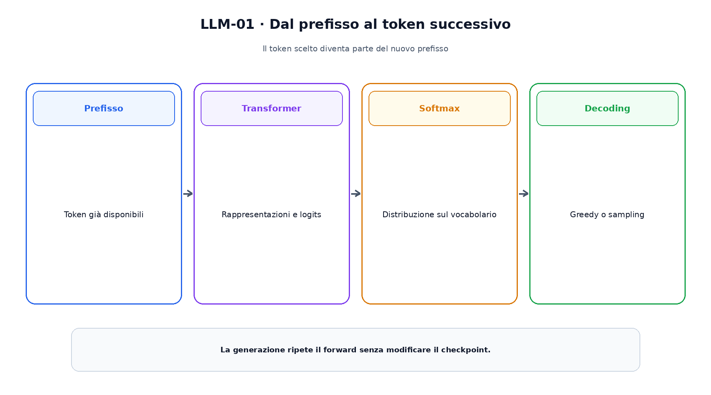
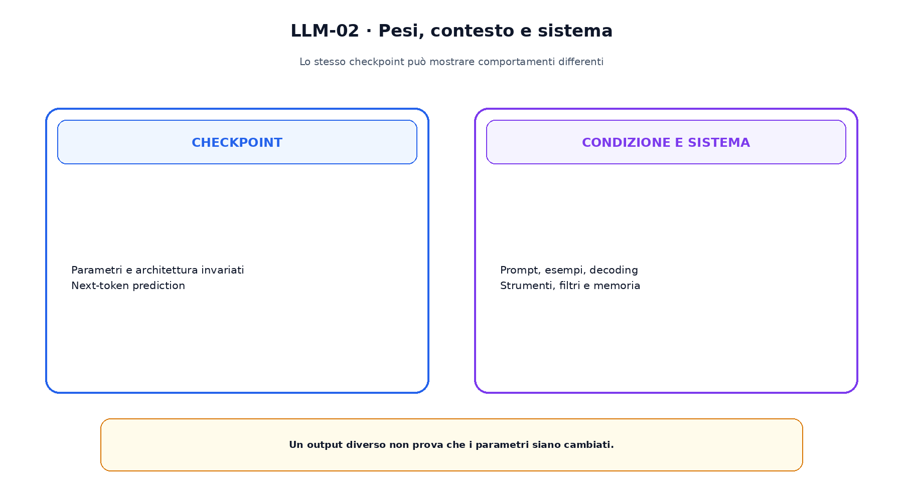

<!--
chapter_id: CH-P06-LLM-BEHAVIOR
part_id: P06
order_key: 310
title: Dalla rappresentazione linguistica agli LLM
maturity: CORE
status: candidatura completa in revisione autoriale
version: 0.2.0-rc1
last_source_check: 2026-07-31
-->

# Capitolo 31. Dalla rappresentazione linguistica agli LLM

Nel Capitolo 30 abbiamo separato architettura e obiettivo di pretraining. Ora osserviamo il risultato della loro combinazione. Un language model autoregressivo assegna una distribuzione al token successivo e ripete il calcolo dopo ogni scelta.

Lo stesso checkpoint può completare una frase, seguire esempi nel prompt o produrre traiettorie diverse quando cambia il decoding. Per leggere questi fenomeni dobbiamo separare pesi, contesto e componenti di sistema.

## La distribuzione del token successivo

Per una sequenza $x_{1:T}$ il modello autoregressivo usa $p(x_{1:T})=\prod_t p(x_t|x_{<t})$. I logits diventano probabilità mediante softmax. La distribuzione non è ancora una risposta: contiene alternative con pesi differenti.

La probabilità è condizionata dal prefisso e dai parametri. Non è una misura diretta di verità; un'espressione frequente può ricevere massa elevata anche quando non descrive il caso reale.

## Prompt e in-context learning

Un prompt può contenere istruzioni, dati, esempi e vincoli. Quando il modello usa questi elementi senza un optimizer step, parliamo di in-context learning. Il checkpoint resta invariato.

Ordine, formulazione ed etichette delle dimostrazioni possono cambiare il risultato. Una dimostrazione efficace non prova che la regola sia stata appresa in modo permanente.

## Meccanismi osservati e spiegazioni

Gli induction heads sono circuiti osservati in Transformer piccoli che possono continuare pattern ripetuti. Costituiscono un meccanismo concreto, non una spiegazione universale di ogni forma di in-context learning.

Altri lavori modellano l'ICL come inferenza implicita. Il capitolo distingue sempre fenomeno, circuito e teoria interpretativa.

La figura attraversa il meccanismo nell'ordine di lettura e mantiene esplicite le dipendenze.

## Il decoding

Greedy decoding sceglie il token più probabile; il sampling estrae dalla distribuzione. La temperatura trasforma i logits come $p_i(T)=\exp(z_i/T)/\sum_j\exp(z_j/T)$.

Top-k e nucleus sampling restringono le alternative. Queste procedure cambiano la traiettoria generata, non i parametri; il Capitolo 76 le tratterà in dettaglio.

## Calibrazione e affidabilità

Probabilità del token, confidenza dichiarata nel testo e correttezza fattuale sono quantità differenti. Prompt e formato possono alterare la distribuzione osservata.

Retrieval, verificatori e astensione possono aggiungere controlli, ma ciascun componente richiede una valutazione propria.

## Base model e sistema

Post-training e preferenze possono modificare il comportamento verso istruzioni e policy. Messaggi di sistema, strumenti, filtri e memoria cambiano ulteriormente l'output.

Attribuire ogni comportamento al base model è quindi troppo ampio. Pesi, contesto, decoding e sistema sono livelli distinti.

Il confronto separa ciò che cambia da ciò che rimane invariato.

## Uno snippet eseguibile

Il file [`code/snip_llm_001.py`](code/snip_llm_001.py) rende osservabile il contratto centrale. I test controllano determinismo, output e invarianti.

## Riepilogo

Un LLM autoregressivo produce una distribuzione condizionata sul prefisso. L'in-context learning usa il contesto senza aggiornare i parametri; il decoding sceglie una traiettoria. Probabilità del token e affidabilità fattuale non coincidono. Il Capitolo 32 sposta l'attenzione sui dati che rendono possibile il pretraining.

### Verifica della comprensione

1. Ricostruisci il problema che apre il capitolo.
2. Indica l'operazione centrale e il suo output.
3. Spiega un limite o failure mode.
4. Collega il risultato al capitolo successivo.
5. Modifica una variabile nello snippet e prevedi l'effetto prima di eseguirlo.

## Fonti e materiali verificabili

Fonti, claim, codice, output e audit sono raccolti nei file del capitolo.
