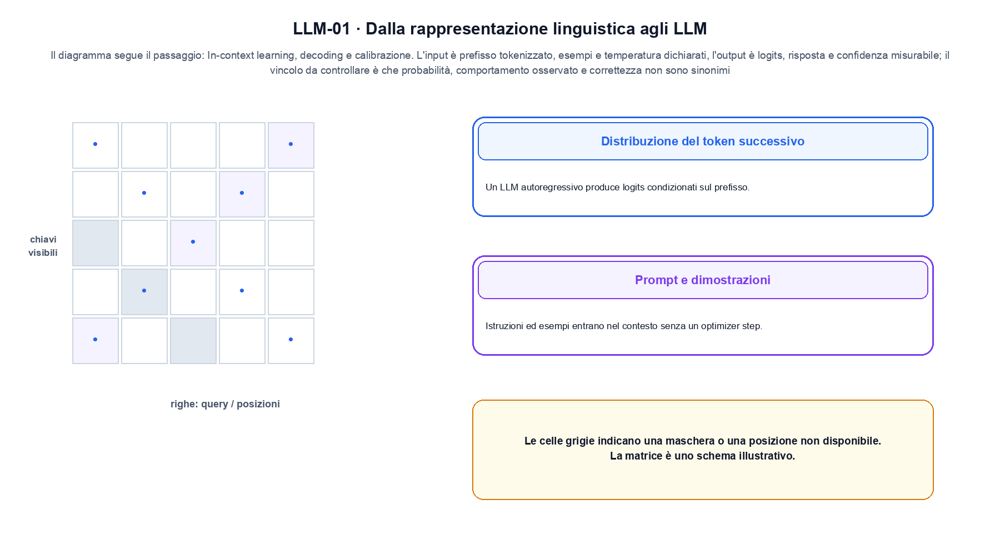
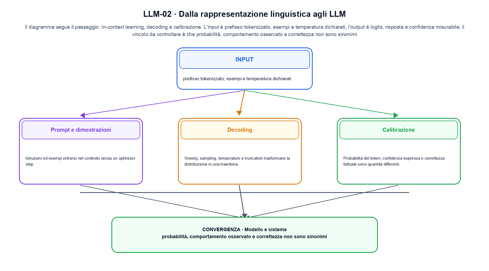

<!--
chapter_id: CH-P06-LLM-BEHAVIOR
part_id: P06
order_key: 310
title: Dalla rappresentazione linguistica agli LLM
maturity: CORE
status: candidatura completa in revisione autoriale
version: 0.4.0-draft2
last_source_check: 3 agosto 2026
environment: Python 3.13.12, CPU
deferred: benchmark applicativi, varianti non necessarie al contratto centrale e approvazione autoriale
-->

# Capitolo 31. Dalla rappresentazione linguistica agli LLM

Finora abbiamo potuto descrivere un prompt e la distribuzione del token successivo. La richiesta «Il pacco non è arrivato» resta lo scenario condiviso: nel Capitolo 31 prendiamo l'input «prefisso tokenizzato, esempi e temperatura dichiarati» e lo seguiamo fino all'output «logits, risposta e confidenza misurabile», dichiarando prima il contratto e poi il limite.

## Distribuzione del token successivo

Un LLM autoregressivo produce logits condizionati sul prefisso. La softmax costruisce una distribuzione, non una risposta già scelta. [SRC-31-001]

Il caso minimo di «Distribuzione del token successivo» si presenta così: un prefisso corto con ID, lunghezza, posizione e output del token successivo dichiarati. Non lo usiamo come decorazione: serve a rendere osservabile la frase «Un LLM autoregressivo produce logits condizionati sul prefisso».

Per ricostruire «Distribuzione del token successivo» annotiamo l'input «prefisso tokenizzato, esempi e temperatura dichiarati», poi l'operazione «in-context learning, decoding e calibrazione», infine l'output «logits, risposta e confidenza misurabile». Questa sequenza impedisce di scambiare una forma compatibile per il comportamento descritto dalla fonte. Il controllo parte da «Un LLM autoregressivo produce logits condizionati sul prefisso».

Un modello generativo può assegnare un punteggio ai dati, definire una densità oppure descrivere direttamente un percorso di campionamento. Likelihood e qualità del campione sono osservazioni diverse e vanno tenute separate. Per «Distribuzione del token successivo» il controllo cambia una sola premessa della frase «Un LLM autoregressivo produce logits condizionati sul prefisso» e conserva input, output e criterio di successo, così la differenza resta attribuibile. La verifica resta ancorata a «Un LLM autoregressivo produce logits condizionati sul prefisso». [SRC-31-001]

Il punto didattico di «Distribuzione del token successivo» è separare ciò che la fonte afferma da ciò che il piccolo caso illustra. L'output «logits, risposta e confidenza misurabile» mostra il contratto locale, ma non sostituisce una misura sul sistema completo.

Il controllo minimo di «Distribuzione del token successivo» confronta il caso dichiarato con una variazione che rompe la sua ipotesi. Se la failure non è distinguibile dall'esito valido, manca un'osservazione nel contratto di ordine, posizione e memoria contestuale. Da «Distribuzione del token successivo» portiamo l'output «logits, risposta e confidenza misurabile»; non portiamo invece una conclusione oltre il caso locale.

## Prompt e dimostrazioni

Istruzioni ed esempi entrano nel contesto senza un optimizer step. Il checkpoint resta invariato durante in-context learning. [SRC-31-002]

Prima del nome tecnico fissiamo la situazione: consideriamo lo stesso prompt con greedy e top-p confrontati. Da qui possiamo leggere la conseguenza dichiarata da «Istruzioni ed esempi entrano nel contesto senza un optimizer step».

Nel contratto locale, l'input «prefisso tokenizzato, esempi e temperatura dichiarati» entra, l'operazione «in-context learning, decoding e calibrazione» modifica il percorso e l'output «logits, risposta e confidenza misurabile» è ciò che osserviamo. Qui cambia soprattutto il passaggio «Prompt e dimostrazioni»; resta da controllare che probabilità, comportamento osservato e correttezza non sono sinonimi. La domanda locale è «Istruzioni ed esempi entrano nel contesto senza un optimizer step».

Il passaggio da seguire in «Prompt e dimostrazioni» è quello descritto dalla frase «Istruzioni ed esempi entrano nel contesto senza un optimizer step»: l'esempio rende osservabile la trasformazione, mentre il contratto del capitolo ne delimita l'interpretazione. Per «Prompt e dimostrazioni» il controllo cambia una sola premessa della frase «Istruzioni ed esempi entrano nel contesto senza un optimizer step» e conserva input, output e criterio di successo, così la differenza resta attribuibile. La verifica resta ancorata a «Istruzioni ed esempi entrano nel contesto senza un optimizer step». [SRC-31-002]

La lettura va fatta in ordine: prima il caso, poi la trasformazione, quindi la conseguenza. Il checkpoint resta invariato durante in-context learning. Il piccolo risultato resta un'illustrazione di «Istruzioni ed esempi entrano nel contesto senza un optimizer step», non una promessa generale.

La prova di «Prompt e dimostrazioni» conserva input, operazione e output; poi esplicita quale parte di «Istruzioni ed esempi entrano nel contesto senza un optimizer step» non è stata misurata. Così il test separa l'evidenza dall'inferenza. Il passaggio successivo, «Decoding», potrà cambiare una sola condizione, dichiarando il nuovo setup prima di interpretare il risultato.

## Decoding

Greedy, sampling, temperature e truncation trasformano la distribuzione in una traiettoria. [SRC-31-003]

Per capire «Decoding» partiamo da questo caso: un prefisso corretto confrontato con lo stesso prefisso dopo che il modello ha prodotto il token precedente. Il caso rende osservabile il punto centrale: «Greedy, sampling, temperature e truncation trasformano la distribuzione in una traiettoria».

La sezione usa l'input «prefisso tokenizzato, esempi e temperatura dichiarati» come punto di partenza e l'output «logits, risposta e confidenza misurabile» come traccia d'uscita. La trasformazione concreta è «in-context learning, decoding e calibrazione»; il caso non è completo se non dichiariamo anche che probabilità, comportamento osservato e correttezza non sono sinonimi. La condizione da isolare è «Greedy, sampling, temperature e truncation trasformano la distribuzione in una traiettoria».

L'inference trasforma logits e richieste in una traiettoria sotto vincoli di memoria e tempo. Decoding, cache, batching e scheduling modificano il servizio osservato e richiedono metriche oltre alla qualità dell'output. Il confronto utile mette accanto il prefisso corretto e quello prodotto dal modello, così il segnale disponibile al training non viene confuso con l'inference. La verifica resta ancorata a «Greedy, sampling, temperature e truncation trasformano la distribuzione in una traiettoria». [SRC-31-003]

Se cambiamo una premessa, dobbiamo riaprire l'interpretazione. Per «Decoding» conserviamo l'osservazione collegata a «Greedy, sampling, temperature e truncation trasformano la distribuzione in una traiettoria» e lasciamo esplicitamente fuori ciò che non è stato misurato.

Per verificare «Decoding» cambiamo una sola condizione vicina alla frase «Greedy, sampling, temperature e truncation trasformano la distribuzione in una traiettoria», teniamo fermo il resto e registriamo l'output «logits, risposta e confidenza misurabile». Il caso negativo deve rendere riconoscibile la failure, non soltanto produrre un numero diverso. La sezione successiva, «Calibrazione», riceve l'output «logits, risposta e confidenza misurabile» come base, ma dovrà formulare e verificare la propria distinzione.

La figura LLM-01 usa la famiglia matrix. Il diagramma segue il passaggio: In-context learning, decoding e calibrazione. L'input è prefisso tokenizzato, esempi e temperatura dichiarati, l'output è logits, risposta e confidenza misurabile; il vincolo da controllare è che probabilità, comportamento osservato e correttezza non sono sinonimi.

## Calibrazione

Probabilità del token, confidenza espressa e correttezza fattuale sono quantità differenti. [SRC-31-004]

Il caso minimo di «Calibrazione» si presenta così: quattro casi con tre esiti corretti e una failure, riportando la media insieme alla slice e al protocollo per «Calibrazione» e all'output logits, risposta e confidenza misurabile. Non lo usiamo come decorazione: serve a rendere osservabile la frase «Probabilità del token, confidenza espressa e correttezza fattuale sono quantità differenti».

Per ricostruire «Calibrazione» annotiamo l'input «prefisso tokenizzato, esempi e temperatura dichiarati», poi l'operazione «in-context learning, decoding e calibrazione», infine l'output «logits, risposta e confidenza misurabile». Questa sequenza impedisce di scambiare una forma compatibile per il comportamento descritto dalla fonte. Il controllo parte da «Probabilità del token, confidenza espressa e correttezza fattuale sono quantità differenti».

Una valutazione deve collegare claim, popolazione, protocollo e decisione. Media, slice, failure, giudice e incertezza misurano aspetti diversi e non diventano intercambiabili perché condividono una tabella. Il controllo confronta valore originale, rappresentazione compressa e ricostruzione, riportando separatamente errore numerico e comportamento sul compito. La verifica resta ancorata a «Probabilità del token, confidenza espressa e correttezza fattuale sono quantità differenti». [SRC-31-004]

Il punto didattico di «Calibrazione» è separare ciò che la fonte afferma da ciò che il piccolo caso illustra. L'output «logits, risposta e confidenza misurabile» mostra il contratto locale, ma non sostituisce una misura sul sistema completo.

Il controllo minimo di «Calibrazione» confronta il caso dichiarato con una variazione che rompe la sua ipotesi. Se la failure non è distinguibile dall'esito valido, manca un'osservazione nel contratto di ordine, posizione e memoria contestuale. Da «Calibrazione» portiamo l'output «logits, risposta e confidenza misurabile»; non portiamo invece una conclusione oltre il caso locale.

## Modello e sistema

Post-training, messaggi di sistema, strumenti e filtri contribuiscono al comportamento osservato. [SRC-31-001]

Prima del nome tecnico fissiamo la situazione: consideriamo un confronto tra due prefissi con la stessa stringa, tokenizer dichiarato e mask causale esplicita. Da qui possiamo leggere la conseguenza dichiarata da «Post-training, messaggi di sistema, strumenti e filtri contribuiscono al comportamento osservato».

Nel contratto locale, l'input «prefisso tokenizzato, esempi e temperatura dichiarati» entra, l'operazione «in-context learning, decoding e calibrazione» modifica il percorso e l'output «logits, risposta e confidenza misurabile» è ciò che osserviamo. Qui cambia soprattutto il passaggio «Modello e sistema»; resta da controllare che probabilità, comportamento osservato e correttezza non sono sinonimi. La domanda locale è «Post-training, messaggi di sistema, strumenti e filtri contribuiscono al comportamento osservato».

Un flow rende esplicito il percorso invertibile tra spazio semplice e dati. La densità deve tenere conto del Jacobiano, mentre il costo dipende dalla trasformazione o dalla soluzione numerica scelta. Per «Modello e sistema» il controllo cambia una sola premessa della frase «Post-training, messaggi di sistema, strumenti e filtri contribuiscono al comportamento osservato» e conserva input, output e criterio di successo, così la differenza resta attribuibile. La verifica resta ancorata a «Post-training, messaggi di sistema, strumenti e filtri contribuiscono al comportamento osservato». [SRC-31-001]

La lettura va fatta in ordine: prima il caso, poi la trasformazione, quindi la conseguenza. Il piccolo risultato resta un'illustrazione di «Post-training, messaggi di sistema, strumenti e filtri contribuiscono al comportamento osservato», non una promessa generale.

La prova di «Modello e sistema» conserva input, operazione e output; poi esplicita quale parte di «Post-training, messaggi di sistema, strumenti e filtri contribuiscono al comportamento osservato» non è stata misurata. Così il test separa l'evidenza dall'inferenza. Il caso finale consegna l'output «logits, risposta e confidenza misurabile» come evidenza locale e conserva il vincolo che impedisce di leggere il futuro come domanda aperta.

## Un caso dall'input all'output: Distribuzione del token successivo

Il caso intero parte dall'input «prefisso tokenizzato, esempi e temperatura dichiarati», applica l'operazione «in-context learning, decoding e calibrazione» e osserva l'output «logits, risposta e confidenza misurabile». Un esempio controllato: lo stesso prompt con greedy e top-p confrontati. La formula locale è:

$$
p(x_t | x_{<t}) = softmax(z_t)
$$

La softmax trasforma logits condizionati in una distribuzione; la scelta del token viene dopo. [SRC-31-001]

La figura LLM-02 cambia composizione rispetto alla prima. Il diagramma segue il passaggio: In-context learning, decoding e calibrazione. L'input è prefisso tokenizzato, esempi e temperatura dichiarati, l'output è logits, risposta e confidenza misurabile; il vincolo da controllare è che probabilità, comportamento osservato e correttezza non sono sinonimi.

## Dal meccanismo alla prova locale: Prompt e dimostrazioni

Il file `code/snip_31_contract.py` collega il contratto del capitolo alla frase «Post-training, messaggi di sistema, strumenti e filtri contribuiscono al comportamento osservato». Il test controlla l'invariante, la risposta valida e il caso negativo; `code/outputs/SNIP-31-001.txt` conserva il risultato ripetibile del caso locale.

## Dove il risultato si ferma: Modello e sistema

Il meccanismo di «Dalla rappresentazione linguistica agli LLM» resta legato al contratto locale. Probabilità, comportamento osservato e correttezza non sono sinonimi. Prima di generalizzare la frase «Post-training, messaggi di sistema, strumenti e filtri contribuiscono al comportamento osservato», servono un nuovo setup, un protocollo dichiarato e una misura ripetibile.

## Che cosa portiamo avanti: Dalla rappresentazione linguistica agli LLM

Abbiamo seguito un prompt e la distribuzione del token successivo, partendo dall'input «prefisso tokenizzato, esempi e temperatura dichiarati» e arrivando all'output «logits, risposta e confidenza misurabile». Le sezioni «Distribuzione del token successivo», «Prompt e dimostrazioni», «Modello e sistema» hanno isolato le proprie frasi chiave senza confondere il meccanismo con il risultato applicativo. L'invariante da portare avanti è: probabilità, comportamento osservato e correttezza non sono sinonimi. Il Capitolo 32, Il ciclo di vita dei dati, può partire da questo output e dichiarare la propria domanda.

### Verifica di comprensione: Distribuzione del token successivo

1. Ricostruisci l'oggetto continuo a partire da «Distribuzione del token successivo» e indica quale parte della frase «Un LLM autoregressivo produce logits condizionati sul prefisso» entra nel caso.
2. Spiega quale trasformazione collega «Distribuzione del token successivo» a «Modello e sistema» e quale output osserviamo nel passaggio.
3. Usa lo snippet per controllare l'invariante del contratto: probabilità, comportamento osservato e correttezza non sono sinonimi.
4. Separa una definizione sostenuta da una fonte, un esempio illustrativo e un risultato locale del caso guida.
5. Indica quale parte della frase «Post-training, messaggi di sistema, strumenti e filtri contribuiscono al comportamento osservato» richiederebbe una misura nuova prima di essere estesa oltre il caso osservato.

### Esercizi di trasferimento: Modello e sistema

1. Disegna il percorso di «Distribuzione del token successivo» indicando dati in ingresso e risultato.
2. Ripeti «Prompt e dimostrazioni» cambiando soltanto un valore dichiarato.
3. Trova in «Decoding» una condizione che, se rimossa, produrrebbe una failure leggibile.
4. Aggiungi a «Calibrazione» un controllo negativo e spiega che cosa protegge.
5. Indica quale claim su «Modello e sistema» richiederebbe un benchmark ulteriore.

## Fonti, codice e materiali: Dalla rappresentazione linguistica agli LLM

Il dossier di «Dalla rappresentazione linguistica agli LLM» in `FONTI_PRIMARIE.md` separa definizioni, risultati e la storia disponibile a ogni passo; la data di consultazione è registrata accanto ai riferimenti. `CLAIMS.md` separa definizioni e risultati locali; codice, ambiente, test e output sono nella cartella `code/`, con attenzione a ordine, posizione e memoria contestuale.
