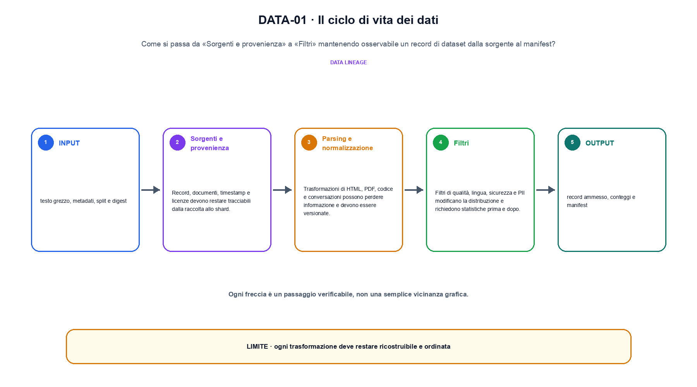
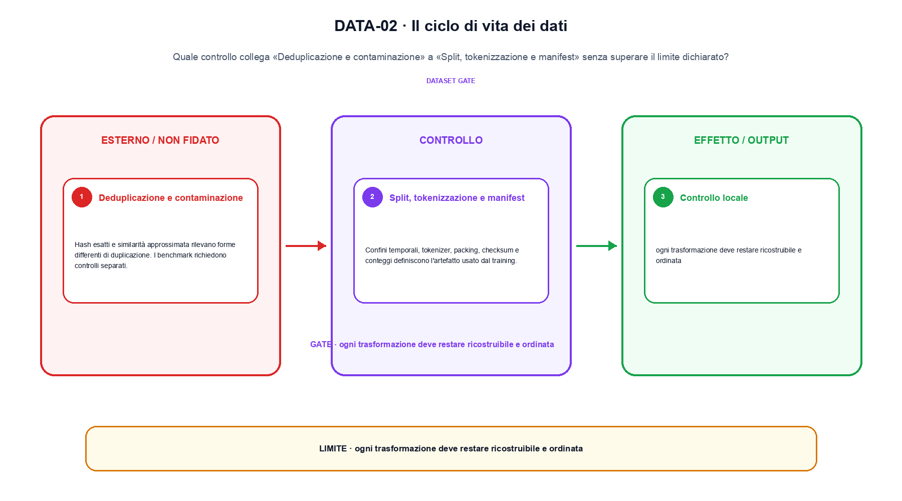

<!--
chapter_id: CH-P07-DATA-LIFECYCLE
part_id: P07
order_key: 320
title: Il ciclo di vita dei dati
maturity: CORE
status: revisione editoriale v2, approvazione autoriale aperta
version: 0.5.0-draft3
last_source_check: 4 agosto 2026
environment: Python 3.13.12, CPU
code_policy: reference
deferred: benchmark applicativi non eseguiti e approvazione autoriale delle visuali
-->

# Capitolo 32. Il ciclo di vita dei dati

La domanda guida di questa lezione è come collegare «Sorgenti e provenienza» e «Split, tokenizzazione e manifest» senza perdere il contratto tecnico di il ciclo di vita dei dati. L'oggetto osservato è un record di dataset dalla sorgente al manifest. Il contratto locale è: input, testo grezzo, metadati, split e digest; operazione, parsing, filtro, deduplicazione e tokenizzazione; output, record ammesso, conteggi e manifest. Il caso guida è questo: Due sorgenti con conteggi diversi confrontate dopo una regola di campionamento dichiarata. Il confine da mantenere esplicito è: ogni trasformazione deve restare ricostruibile e ordinata.

## Sorgenti e provenienza

Record, documenti, timestamp e licenze devono restare tracciabili dalla raccolta allo shard. [SRC-32-001]

Il digest diventa utile soltanto se le trasformazioni incluse sono dichiarate.

**Caso da seguire.** Due sorgenti con conteggi diversi confrontate dopo una regola di campionamento dichiarata.

**Controllo.** Conserva record iniziale, regola applicata e record finale; un conteggio aggregato non basta a spiegare la trasformazione.




La prima figura segue il percorso da «Sorgenti e provenienza» a «Filtri».


## Parsing e normalizzazione

Trasformazioni di HTML, PDF, codice e conversazioni possono perdere informazione e devono essere versionate. [SRC-32-002]

**Caso da seguire.** Due record con ID, testo, licenza e timestamp che attraversano una sola trasformazione registrata.

**Controllo.** Esegui «Parsing e normalizzazione» due volte sullo stesso manifest e confronta identificatori, ordine, split e checksum.


## Filtri

Filtri di qualità, lingua, sicurezza e PII modificano la distribuzione e richiedono statistiche prima e dopo. [SRC-32-003]

**Caso da seguire.** Per «Filtri» si mantiene l'input del capitolo e si isola questa condizione: Filtri di qualità, lingua, sicurezza e PII modificano la distribuzione e richiedono statistiche prima e dopo.

**Controllo.** Aggiungi un record che deve essere escluso e verifica che l'output conservi anche il motivo dell'esclusione.


## Esempio Python eseguito

Il frammento seguente è lo stesso conservato nel repository. Usa valori piccoli perché l'obiettivo è osservare il meccanismo, non simulare una scala che non abbiamo eseguito.

```python
def contract():
    records = [{"id": "a", "source": "mail", "text": "pacco"}, {"id": "b", "source": "crm", "text": "ritardo"}]
    manifest = {"ids": [record["id"] for record in records], "sources": sorted({record["source"] for record in records})}
    return {"manifest": manifest, "invariant": "data transformations retain provenance and a stable record identity"}
```

Esecuzione con `python snip_32_contract.py`:

```text
{"invariant": "data transformations retain provenance and a stable record identity", "manifest": {"ids": ["a", "b"], "sources": ["crm", "mail"]}}
```

Il test associato è [`code/test_32_contract.py`](code/test_32_contract.py); l'output versionato è [`code/outputs/SNIP-32-001.txt`](code/outputs/SNIP-32-001.txt).


## Deduplicazione e contaminazione

Hash esatti e similarità approssimata rilevano forme differenti di duplicazione. I benchmark richiedono controlli separati. [SRC-32-004]

**Caso da seguire.** Due record simili che vengono confrontati con hash esatto e con una regola distinta per la similarità approssimata.

**Controllo.** Modifica una sola regola della pipeline e misura quali record cambiano, evitando di confrontare raccolte di origine diversa.


## Split, tokenizzazione e manifest

Confini temporali, tokenizer, packing, checksum e conteggi definiscono l'artefatto usato dal training. [SRC-32-001]

**Caso da seguire.** Un prefisso corto con ID, lunghezza, posizione e output del token successivo dichiarati.

**Controllo.** Descrivi ciò che la pipeline perde oltre a ciò che produce. Il limite locale è: Confini temporali, tokenizer, packing, checksum e conteggi definiscono l'artefatto usato dal training.




La seconda figura mette a confronto «Deduplicazione e contaminazione» e il limite discusso in «Split, tokenizzazione e manifest».


## Come si collegano i passaggi

- **Da «Sorgenti e provenienza» a «Parsing e normalizzazione».** Record, documenti, timestamp e licenze devono restare tracciabili dalla raccolta allo shard. Trasformazioni di HTML, PDF, codice e conversazioni possono perdere informazione e devono essere versionate. Il primo passaggio identifica il record e la sua provenienza; il secondo dichiara la trasformazione che cambia la popolazione osservata. [SRC-32-001; SRC-32-002]

- **Da «Parsing e normalizzazione» a «Filtri».** Trasformazioni di HTML, PDF, codice e conversazioni possono perdere informazione e devono essere versionate. Filtri di qualità, lingua, sicurezza e PII modificano la distribuzione e richiedono statistiche prima e dopo. La trasformazione diventa confrontabile soltanto quando il passaggio successivo conserva configurazione, conteggi e artefatti intermedi. [SRC-32-002; SRC-32-003]

- **Da «Filtri» a «Deduplicazione e contaminazione».** Filtri di qualità, lingua, sicurezza e PII modificano la distribuzione e richiedono statistiche prima e dopo. Hash esatti e similarità approssimata rilevano forme differenti di duplicazione. Una volta resa tracciabile la pipeline, il quarto passaggio può affrontare selezione o uso senza confondere un cambiamento nei dati con uno nel modello. [SRC-32-003; SRC-32-004]

- **Da «Deduplicazione e contaminazione» a «Split, tokenizzazione e manifest».** Hash esatti e similarità approssimata rilevano forme differenti di duplicazione. Confini temporali, tokenizer, packing, checksum e conteggi definiscono l'artefatto usato dal training. L'ultima sezione porta il risultato alla valutazione e chiede quali record, slice o failure restano fuori dalla media. [SRC-32-004; SRC-32-001]

La catena completa produce record ammesso, conteggi e manifest a partire da testo grezzo, metadati, split e digest. Ogni collegamento conserva un oggetto osservabile diverso; per questo il risultato non può essere esteso oltre il limite dichiarato: ogni trasformazione deve restare ricostruibile e ordinata.


## Esercizi sulla tracciabilità

1. Ricostruisci «Sorgenti e provenienza» con un esempio diverso da quello mostrato e indica l'output atteso prima del calcolo.
2. Nel passaggio «Parsing e normalizzazione», cambia una sola ipotesi e spiega quale risultato non è più confrontabile.
3. Collega «Filtri» a una riga dello snippet oppure motiva perché la prova deve essere documentale.
4. Progetta un caso limite per «Deduplicazione e contaminazione» che produca una failure riconoscibile.
5. Per «Split, tokenizzazione e manifest», separa una conclusione sostenuta dal caso locale da una che richiederebbe nuovi dati o un benchmark.


## L'artefatto che deve sopravvivere

La lezione parte da «testo grezzo, metadati, split e digest» e arriva fino a «record ammesso, conteggi e manifest». Il limite da conservare è questo: ogni trasformazione deve restare ricostruibile e ordinata. Definizioni e risultati citati sono rintracciabili in [`FONTI_PRIMARIE.md`](FONTI_PRIMARIE.md); la mappa dei claim è in [`CLAIMS.md`](CLAIMS.md).
