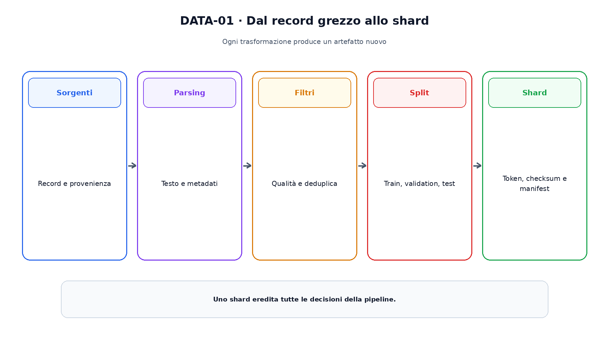
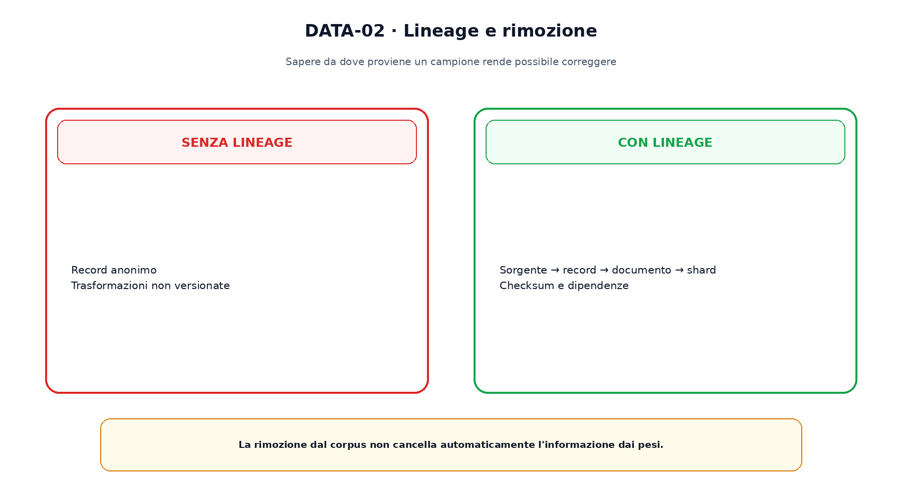

<!--
chapter_id: CH-P07-DATA-LIFECYCLE
part_id: P07
order_key: 320
title: Il ciclo di vita dei dati
maturity: CORE
status: candidatura completa in revisione autoriale
version: 0.2.0-rc1
last_source_check: 2026-07-31
-->

# Capitolo 32. Il ciclo di vita dei dati

Un language model apprende attraverso i dati e gli obiettivi che gli vengono presentati. Dire che un corpus contiene testo dal web non basta a ricostruire il training. Servono sorgenti, date, trasformazioni, filtri, deduplicazione, versioni e regole di separazione tra training e valutazione.

## Sorgenti, record e documenti

Una sorgente può essere un archivio web, codice o libri. Il record è l'unità acquisita; il documento è l'unità semantica scelta per le trasformazioni.

Identificatore, provenienza e timestamp non provano qualità, ma permettono di ricostruire decisioni e rimozioni.

## Parsing e normalizzazione

HTML, PDF, codice e conversazioni richiedono parser differenti. La normalizzazione può rimuovere markup o uniformare caratteri, ma può perdere informazione.

Il testo trasformato deve restare collegato al record sorgente mediante lineage.

## Filtri

Filtri per lingua, spam, PII o qualità modificano la distribuzione. Una soglia aggressiva può ridurre rumore e contemporaneamente eliminare domini rari.

Il manifest registra quantità prima e dopo ogni passaggio e la versione del filtro.

La figura attraversa il meccanismo nell'ordine di lettura e mantiene esplicite le dipendenze.

## Deduplicazione e contaminazione

Hash esatti rimuovono copie normalizzate; metodi approssimati cercano passaggi simili. Granularità e soglia fanno parte del contratto.

La contaminazione dei benchmark può apparire come domanda, risposta o parafrasi e non è interamente rilevabile con hash esatti.

## Split e confini

Training, validation e test devono seguire la domanda sperimentale. Nei dati temporali uno split casuale può trasferire al training informazione futura.

Deduplicare soltanto dentro ogni split può lasciare copie tra train e test.

## Tokenizzazione e shard

Dopo il filtraggio i documenti vengono tokenizzati e raggruppati. Il manifest finale registra tokenizer, token, checksum, packing e ordine.

Cambiare tokenizer o packing produce un nuovo artefatto anche con gli stessi documenti.

## Aggiornamenti e rimozioni

Per correggere o rimuovere dati occorre sapere quali shard e checkpoint dipendono da un record. La cancellazione dal catalogo non modifica automaticamente un modello già addestrato.

Datasheet e data statement rendono revisionabili scopo, composizione e limiti, ma non certificano da soli la qualità.

Il confronto separa ciò che cambia da ciò che rimane invariato.

## Uno snippet eseguibile

Il file [`code/snip_data_001.py`](code/snip_data_001.py) rende osservabile il contratto centrale. I test controllano determinismo, output e invarianti.

## Riepilogo

Il dato usato dal training è il risultato di parsing, filtri, deduplicazione, split e tokenizzazione. Lineage e manifest rendono possibile correggere e confrontare. Il Capitolo 33 decide quanto peso assegnare a ciascuna sorgente.

### Verifica della comprensione

1. Ricostruisci il problema che apre il capitolo.
2. Indica l'operazione centrale e il suo output.
3. Spiega un limite o failure mode.
4. Collega il risultato al capitolo successivo.
5. Modifica una variabile nello snippet e prevedi l'effetto prima di eseguirlo.

## Fonti e materiali verificabili

Fonti, claim, codice, output e audit sono raccolti nei file del capitolo.
