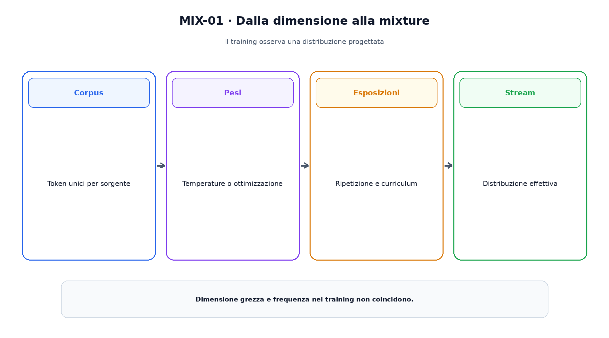
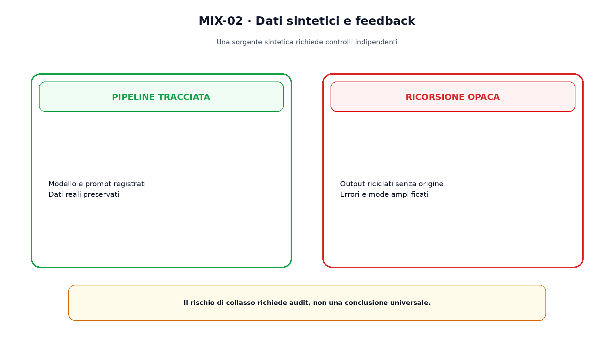

<!--
chapter_id: CH-P07-DATA-MIXTURE
part_id: P07
order_key: 330
title: Dataset mixture, curriculum e dati sintetici
maturity: ESTABLISHED
status: candidatura completa in revisione autoriale
version: 0.2.0-rc1
last_source_check: 2026-07-31
-->

# Capitolo 33. Dataset mixture, curriculum e dati sintetici

Dopo aver costruito un corpus tracciabile dobbiamo decidere come campionarlo. Numero di documenti, lunghezza media e peso interagiscono. Un curriculum modifica inoltre l'ordine nel tempo; i dati sintetici aggiungono una sorgente che può ampliare la copertura oppure riciclare errori.

## Peso effettivo

Se una sorgente contiene una frazione $q_i$ ma viene campionata con peso $w_i$, la frequenza osservata dipende dalla normalizzazione e dalla ripetizione.

Token unici ed esposizioni devono essere registrati separatamente.

## Temperature sampling

Una regola comune usa $p_i=q_i^\alpha/\sum_j q_j^\alpha$. Con $\alpha<1$ le sorgenti piccole ricevono relativamente più peso.

L'esponente è una scelta della mixture, non una misura universale di qualità.

## Pesi appresi

DoReMi aggiorna pesi rispetto a domini di riferimento usando un proxy model. Il risultato dipende da proxy, tokenizer, budget e validation.

Un peso appreso non è una proprietà intrinseca della sorgente.

La figura attraversa il meccanismo nell'ordine di lettura e mantiene esplicite le dipendenze.

## Curriculum

Un curriculum cambia l'ordine degli esempi, per esempio passando da sequenze brevi a lunghe. Questa scelta modifica la traiettoria dell'ottimizzazione.

Definire la difficoltà è già una ipotesi e non garantisce un vantaggio universale.

## Dati sintetici

Self-Instruct e i lavori Phi mostrano usi specifici di istruzioni o testi sintetici e curati. Modello generatore, prompt, filtri e data devono restare nel manifest.

Dati umani e sintetici non vanno mescolati perdendo la provenienza.

## Ricorsione e collasso

Quando modelli successivi usano una quota crescente di output precedenti, gli errori di copertura possono accumularsi. I risultati sul model collapse sono condizionati a ipotesi e setup.

Il rischio richiede sorgenti reali, controlli di diversità e test indipendenti; non rende dannoso ogni dato sintetico.

Il confronto separa ciò che cambia da ciò che rimane invariato.

## Uno snippet eseguibile

Il file [`code/snip_mix_001.py`](code/snip_mix_001.py) rende osservabile il contratto centrale. I test controllano determinismo, output e invarianti.

## Riepilogo

La mixture stabilisce la distribuzione effettiva del training. Peso, ripetizione e ordine sono quantità distinte. Il Capitolo 34 userà modello, token e compute per studiare le scaling law.

### Verifica della comprensione

1. Ricostruisci il problema che apre il capitolo.
2. Indica l'operazione centrale e il suo output.
3. Spiega un limite o failure mode.
4. Collega il risultato al capitolo successivo.
5. Modifica una variabile nello snippet e prevedi l'effetto prima di eseguirlo.

## Fonti e materiali verificabili

Fonti, claim, codice, output e audit sono raccolti nei file del capitolo.
