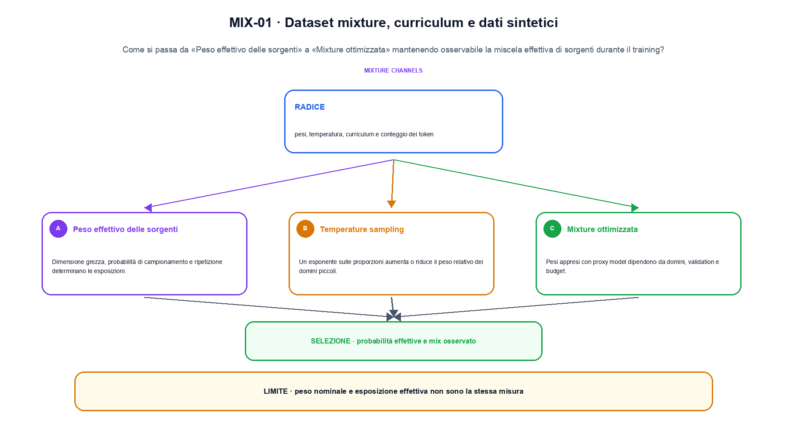
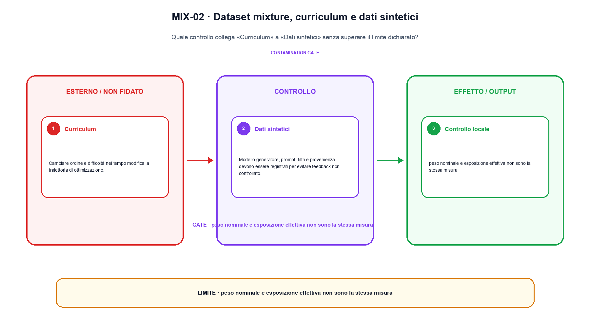

<!--
chapter_id: CH-P07-DATA-MIXTURE
part_id: P07
order_key: 330
title: Dataset mixture, curriculum e dati sintetici
maturity: ESTABLISHED
status: revisione editoriale v2, approvazione autoriale aperta
version: 0.5.0-draft3
last_source_check: 4 agosto 2026
environment: Python 3.13.12, CPU
code_policy: reference
deferred: benchmark applicativi non eseguiti e approvazione autoriale delle visuali
-->

# Capitolo 33. Dataset mixture, curriculum e dati sintetici

La domanda guida di questa lezione è come collegare «Peso effettivo delle sorgenti» e «Dati sintetici» senza perdere il contratto tecnico di dataset mixture, curriculum e dati sintetici. L'oggetto osservato è la miscela effettiva di sorgenti durante il training. Il contratto locale è: input, pesi, temperatura, curriculum e conteggio dei token; operazione, campionamento, ripesatura e generazione controllata; output, probabilità effettive e mix osservato. Il caso guida è questo: Due sorgenti con conteggi diversi confrontate dopo una regola di campionamento dichiarata. Il confine da mantenere esplicito è: peso nominale e esposizione effettiva non sono la stessa misura.

## Peso effettivo delle sorgenti

Dimensione grezza, probabilità di campionamento e ripetizione determinano le esposizioni. [SRC-33-001]

Il campionamento modifica le esposizioni effettive, non la dimensione grezza delle sorgenti.

**Caso da seguire.** Due sorgenti con conteggi diversi confrontate dopo una regola di campionamento dichiarata.

**Controllo.** Conserva record iniziale, regola applicata e record finale; un conteggio aggregato non basta a spiegare la trasformazione.




La prima figura segue il percorso da «Peso effettivo delle sorgenti» a «Mixture ottimizzata».


## Temperature sampling

Un esponente sulle proporzioni aumenta o riduce il peso relativo dei domini piccoli. [SRC-33-002]

**Caso da seguire.** Un prefisso corretto confrontato con lo stesso prefisso dopo che il modello ha prodotto il token precedente.

**Controllo.** Esegui «Temperature sampling» due volte sullo stesso manifest e confronta identificatori, ordine, split e checksum.


## Mixture ottimizzata

Pesi appresi con proxy model dipendono da domini, validation e budget. [SRC-33-003]

**Caso da seguire.** Per «Mixture ottimizzata» si mantiene l'input del capitolo e si isola questa condizione: Pesi appresi con proxy model dipendono da domini, validation e budget.

**Controllo.** Aggiungi un record che deve essere escluso e verifica che l'output conservi anche il motivo dell'esclusione.


## Esempio Python eseguito

Il frammento seguente è lo stesso conservato nel repository. Usa valori piccoli perché l'obiettivo è osservare il meccanismo, non simulare una scala che non abbiamo eseguito.

```python
def contract():
    weights = [0.6, 0.3, 0.1]
    temperature = 0.5
    powered = [weight ** temperature for weight in weights]
    total = sum(powered)
    probabilities = [value / total for value in powered]
    return {"probabilities": [round(value, 6) for value in probabilities], "invariant": "the mixture is normalized after temperature sampling"}
```

Esecuzione con `python snip_33_contract.py`:

```text
{"invariant": "the mixture is normalized after temperature sampling", "probabilities": [0.472734, 0.334273, 0.192993]}
```

Il test associato è [`code/test_33_contract.py`](code/test_33_contract.py); l'output versionato è [`code/outputs/SNIP-33-001.txt`](code/outputs/SNIP-33-001.txt).


## Curriculum

Cambiare ordine e difficoltà nel tempo modifica la traiettoria di ottimizzazione. [SRC-33-004]

**Caso da seguire.** Per «Curriculum» si mantiene l'input del capitolo e si isola questa condizione: Cambiare ordine e difficoltà nel tempo modifica la traiettoria di ottimizzazione.

**Controllo.** Modifica una sola regola della pipeline e misura quali record cambiano, evitando di confrontare raccolte di origine diversa.


## Dati sintetici

Modello generatore, prompt, filtri e provenienza devono essere registrati per evitare feedback non controllato. [SRC-33-001]

**Caso da seguire.** Per «Dati sintetici» si mantiene l'input del capitolo e si isola questa condizione: Modello generatore, prompt, filtri e provenienza devono essere registrati per evitare feedback non controllato.

**Controllo.** Descrivi ciò che la pipeline perde oltre a ciò che produce. Il limite locale è: Modello generatore, prompt, filtri e provenienza devono essere registrati per evitare feedback non controllato.




La seconda figura mette a confronto «Curriculum» e il limite discusso in «Dati sintetici».


## Come si collegano i passaggi

- **Da «Peso effettivo delle sorgenti» a «Temperature sampling».** Dimensione grezza, probabilità di campionamento e ripetizione determinano le esposizioni. Un esponente sulle proporzioni aumenta o riduce il peso relativo dei domini piccoli. Il primo passaggio identifica il record e la sua provenienza; il secondo dichiara la trasformazione che cambia la popolazione osservata. [SRC-33-001; SRC-33-002]

- **Da «Temperature sampling» a «Mixture ottimizzata».** Un esponente sulle proporzioni aumenta o riduce il peso relativo dei domini piccoli. Pesi appresi con proxy model dipendono da domini, validation e budget. La trasformazione diventa confrontabile soltanto quando il passaggio successivo conserva configurazione, conteggi e artefatti intermedi. [SRC-33-002; SRC-33-003]

- **Da «Mixture ottimizzata» a «Curriculum».** Pesi appresi con proxy model dipendono da domini, validation e budget. Cambiare ordine e difficoltà nel tempo modifica la traiettoria di ottimizzazione. Una volta resa tracciabile la pipeline, il quarto passaggio può affrontare selezione o uso senza confondere un cambiamento nei dati con uno nel modello. [SRC-33-003; SRC-33-004]

- **Da «Curriculum» a «Dati sintetici».** Cambiare ordine e difficoltà nel tempo modifica la traiettoria di ottimizzazione. Modello generatore, prompt, filtri e provenienza devono essere registrati per evitare feedback non controllato. L'ultima sezione porta il risultato alla valutazione e chiede quali record, slice o failure restano fuori dalla media. [SRC-33-004; SRC-33-001]

La catena completa produce probabilità effettive e mix osservato a partire da pesi, temperatura, curriculum e conteggio dei token. Ogni collegamento conserva un oggetto osservabile diverso; per questo il risultato non può essere esteso oltre il limite dichiarato: peso nominale e esposizione effettiva non sono la stessa misura.


## Esercizi sulla tracciabilità

1. Ricostruisci «Peso effettivo delle sorgenti» con un esempio diverso da quello mostrato e indica l'output atteso prima del calcolo.
2. Nel passaggio «Temperature sampling», cambia una sola ipotesi e spiega quale risultato non è più confrontabile.
3. Collega «Mixture ottimizzata» a una riga dello snippet oppure motiva perché la prova deve essere documentale.
4. Progetta un caso limite per «Curriculum» che produca una failure riconoscibile.
5. Per «Dati sintetici», separa una conclusione sostenuta dal caso locale da una che richiederebbe nuovi dati o un benchmark.


## L'artefatto che deve sopravvivere

La lezione parte da «pesi, temperatura, curriculum e conteggio dei token» e arriva fino a «probabilità effettive e mix osservato». Il limite da conservare è questo: peso nominale e esposizione effettiva non sono la stessa misura. Definizioni e risultati citati sono rintracciabili in [`FONTI_PRIMARIE.md`](FONTI_PRIMARIE.md); la mappa dei claim è in [`CLAIMS.md`](CLAIMS.md).
