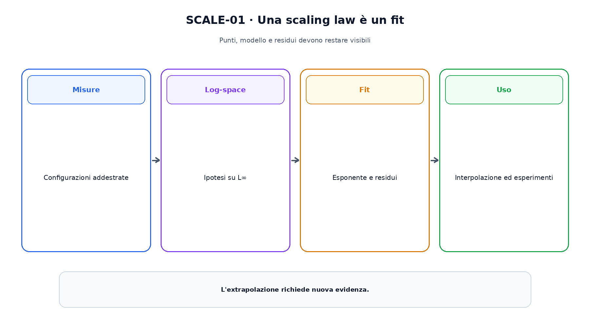
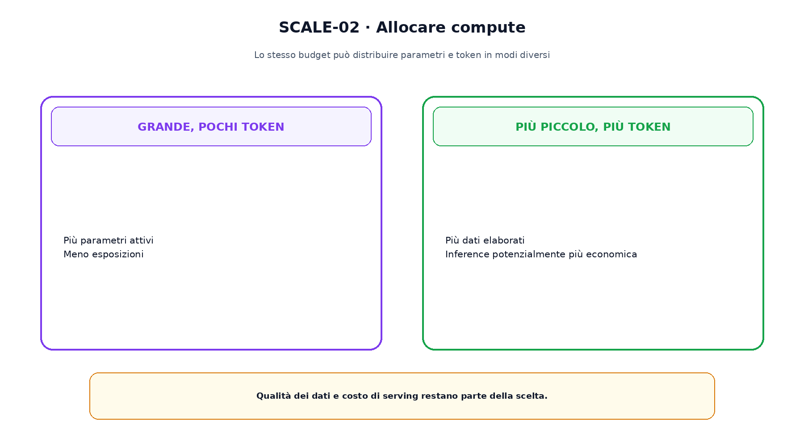

<!--
chapter_id: CH-P07-SCALING
part_id: P07
order_key: 340
title: Scaling law e progettazione del modello
maturity: CORE
status: candidatura completa in revisione autoriale
version: 0.2.0-rc1
last_source_check: 2026-07-31
-->

# Capitolo 34. Scaling law e progettazione del modello

Le scaling law descrivono regolarità empiriche tra loss, parametri, dati e calcolo. Permettono di progettare esperimenti più piccoli, ma non sono leggi fisiche valide senza condizioni.

## Relazioni di potenza

Una forma comune è $L(x)=L_\infty+A x^{-\alpha}$. In scala logaritmica la componente sopra l'asintoto diventa circa lineare.

Il fit dipende da intervallo, dati, tokenizer e ricetta; extrapolare amplia l'incertezza.

## Parametri, dati e compute

A compute fissato, aumentare i parametri riduce i token disponibili. Aumentare i dati con un modello troppo piccolo può lasciare capacità inutilizzata.

Kaplan e Chinchilla ottengono allocazioni differenti nei rispettivi setup e metodi di fit.

## IsoFLOP

Un'analisi isoFLOP confronta configurazioni con budget simile e cerca la loss minima a ogni budget.

La convenzione dei FLOP deve includere chiaramente embedding, attention, padding e optimizer quando pertinenti.

La figura attraversa il meccanismo nell'ordine di lettura e mantiene esplicite le dipendenze.

## Loss irriducibile

$L_\infty$ è un termine del fit, non una entropia universale del linguaggio. Cambiare distribuzione o obiettivo può spostare la curva.

I residui e la sensibilità all'asintoto devono essere mostrati.

## Capacità e soglie

Metriche downstream possono mostrare soglie anche quando la loss migliora regolarmente. La soglia può dipendere dalla metrica o dal prompting.

Una curva di loss non certifica capacità generali o sicurezza.

## Inference-aware scaling

Il training compute-optimal non minimizza necessariamente il costo totale del prodotto. Numero di richieste, contesto e latenza possono favorire un modello differente.

La scelta appartiene al ciclo di vita e non al solo pretraining.

Il confronto separa ciò che cambia da ciò che rimane invariato.

## Uno snippet eseguibile

Il file [`code/snip_scale_001.py`](code/snip_scale_001.py) rende osservabile il contratto centrale. I test controllano determinismo, output e invarianti.

## Riepilogo

Le scaling law sono fit empirici. Parametri, dati e compute devono essere misurati con convenzioni stabili. Il Capitolo 35 traduce l'allocazione in una ricetta di pretraining eseguibile.

### Verifica della comprensione

1. Ricostruisci il problema che apre il capitolo.
2. Indica l'operazione centrale e il suo output.
3. Spiega un limite o failure mode.
4. Collega il risultato al capitolo successivo.
5. Modifica una variabile nello snippet e prevedi l'effetto prima di eseguirlo.

## Fonti e materiali verificabili

Fonti, claim, codice, output e audit sono raccolti nei file del capitolo.
