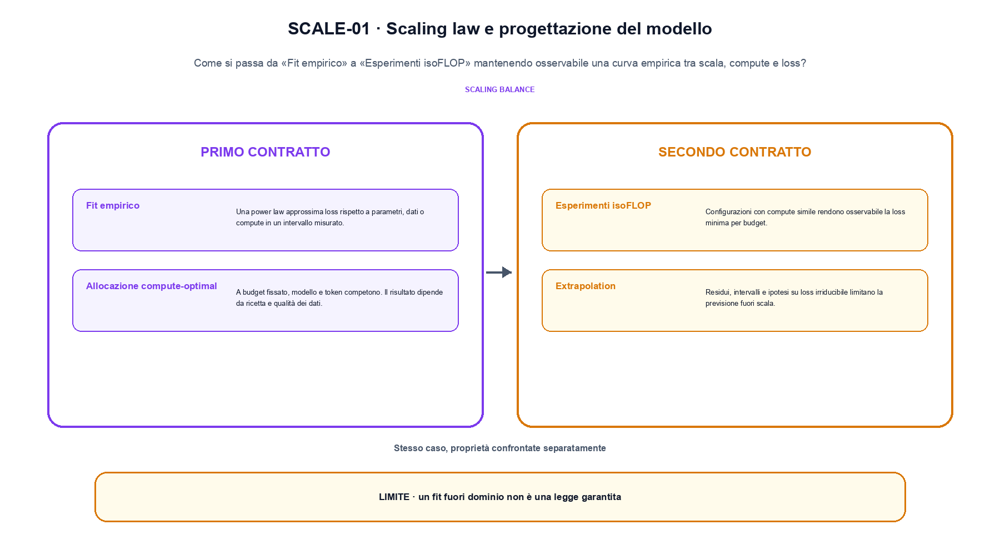
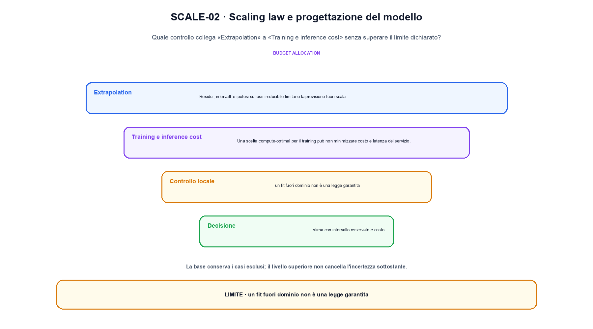

<!--
chapter_id: CH-P07-SCALING
part_id: P07
order_key: 340
title: Scaling law e progettazione del modello
maturity: CORE
status: revisione editoriale v2, approvazione autoriale aperta
version: 0.5.0-draft3
last_source_check: 4 agosto 2026
environment: Python 3.13.12, CPU
code_policy: reference
deferred: benchmark applicativi non eseguiti e approvazione autoriale delle visuali
-->

# Capitolo 34. Scaling law e progettazione del modello

La domanda guida di questa lezione è come collegare «Fit empirico» e «Training e inference cost» senza perdere il contratto tecnico di scaling law e progettazione del modello. L'oggetto osservato è una curva empirica tra scala, compute e loss. Il contratto locale è: input, punti con parametri, token, FLOP e loss; operazione, fit, confronto isoFLOP ed estrapolazione; output, stima con intervallo osservato e costo. Il caso guida è questo: Un caso minimo con input punti con parametri, token, FLOP e loss e output «stima con intervallo osservato e costo». Il confine da mantenere esplicito è: un fit fuori dominio non è una legge garantita.

## Fit empirico

Una power law approssima loss rispetto a parametri, dati o compute in un intervallo misurato. [SRC-34-001]

Un fit empirico vale nell'intervallo e nel setup che lo hanno prodotto.

**Caso da seguire.** Un caso minimo con input punti con parametri, token, FLOP e loss e output «stima con intervallo osservato e costo».

**Controllo.** Scrivi il risultato atteso prima del calcolo, modifica una sola quantità e localizza il primo passaggio che cambia. Il vincolo da conservare è: Una power law approssima loss rispetto a parametri, dati o compute in un intervallo misurato.


## Allocazione compute-optimal

A budget fissato, modello e token competono. Il risultato dipende da ricetta e qualità dei dati. [SRC-34-002]

**Caso da seguire.** Quattro punti, fit lineare locale e intervallo dichiarato.

**Controllo.** Ricalcola il caso a mano e con lo snippet. Se i risultati divergono, confronta prima i valori intermedi e soltanto dopo l'output finale.


La relazione centrale può essere scritta come:

$$
L(N) = L_inf + A N^(-alpha)
$$

Un fit empirico vale nell'intervallo e nel setup che lo hanno prodotto. [SRC-34-001]




La prima figura segue il percorso da «Fit empirico» a «Esperimenti isoFLOP».


## Esperimenti isoFLOP

Configurazioni con compute simile rendono osservabile la loss minima per budget. [SRC-34-003]

**Caso da seguire.** Un caso in cui un fit fuori dominio non è una legge garantita.

**Controllo.** Aggiungi un valore limite e verifica separatamente forma, valore e ipotesi. Una shape valida non dimostra da sola «Esperimenti isoFLOP».


## Extrapolation

Residui, intervalli e ipotesi su loss irriducibile limitano la previsione fuori scala. [SRC-34-004]

**Caso da seguire.** Due ricette con budget di token dichiarato, compute comparabile e loss osservata nello stesso intervallo.

**Controllo.** Mantieni fisso l'input e sostituisci soltanto il meccanismo discusso nella sezione. Il confronto deve attribuire la differenza a quel passaggio, non al setup.


## Esempio Python eseguito

Il frammento seguente è lo stesso conservato nel repository. Usa valori piccoli perché l'obiettivo è osservare il meccanismo, non simulare una scala che non abbiamo eseguito.

```python
def contract():
    tokens = [1000.0, 2000.0, 4000.0, 8000.0]
    losses = [3.10, 2.74, 2.47, 2.29]
    slope = (losses[-1] - losses[0]) / (tokens[-1] - tokens[0])
    return {"points": len(tokens), "slope": round(slope, 8), "interval": [tokens[0], tokens[-1]], "invariant": "the fit is interpreted only on the observed interval"}
```

Esecuzione con `python snip_34_contract.py`:

```text
{"interval": [1000.0, 8000.0], "invariant": "the fit is interpreted only on the observed interval", "points": 4, "slope": -0.00011571}
```

Il test associato è [`code/test_34_contract.py`](code/test_34_contract.py); l'output versionato è [`code/outputs/SNIP-34-001.txt`](code/outputs/SNIP-34-001.txt).


## Training e inference cost

Una scelta compute-optimal per il training può non minimizzare costo e latenza del servizio. [SRC-34-001]

**Caso da seguire.** Due vettori con shape compatibile confrontati prima e dopo il blocco, osservando separatamente scala e percorso residuale in «Training e inference cost».

**Controllo.** Costruisci un controesempio che rispetti il tipo di dato ma violi l'ipotesi centrale. Il test deve rendere riconoscibile perché «Training e inference cost» non si applica.




La seconda figura mette a confronto «Extrapolation» e il limite discusso in «Training e inference cost».


## Come si collegano i passaggi

- **Da «Fit empirico» a «Allocazione compute-optimal».** Una power law approssima loss rispetto a parametri, dati o compute in un intervallo misurato. A budget fissato, modello e token competono. Il primo passaggio definisce che cosa entra nel calcolo; il secondo stabilisce la regola che produce il valore osservabile. [SRC-34-001; SRC-34-002]

- **Da «Allocazione compute-optimal» a «Esperimenti isoFLOP».** A budget fissato, modello e token competono. Configurazioni con compute simile rendono osservabile la loss minima per budget. La regola generale viene poi letta dentro il componente: questa separazione permette di localizzare un errore prima di attribuirlo all'intero modello. [SRC-34-002; SRC-34-003]

- **Da «Esperimenti isoFLOP» a «Extrapolation».** Configurazioni con compute simile rendono osservabile la loss minima per budget. Residui, intervalli e ipotesi su loss irriducibile limitano la previsione fuori scala. Dopo avere reso visibile il componente, il percorso introduce la variante o l'ottimizzazione senza cambiare di nascosto il caso di partenza. [SRC-34-003; SRC-34-004]

- **Da «Extrapolation» a «Training e inference cost».** Residui, intervalli e ipotesi su loss irriducibile limitano la previsione fuori scala. Una scelta compute-optimal per il training può non minimizzare costo e latenza del servizio. L'ultimo passaggio sposta l'attenzione dal funzionamento locale alla misura: correttezza del calcolo e qualità applicativa restano domande distinte. [SRC-34-004; SRC-34-001]

La catena completa produce stima con intervallo osservato e costo a partire da punti con parametri, token, FLOP e loss. Ogni collegamento conserva un oggetto osservabile diverso; per questo il risultato non può essere esteso oltre il limite dichiarato: un fit fuori dominio non è una legge garantita.


## Esercizi sul meccanismo

1. Ricostruisci «Fit empirico» con un esempio diverso da quello mostrato e indica l'output atteso prima del calcolo.
2. Nel passaggio «Allocazione compute-optimal», cambia una sola ipotesi e spiega quale risultato non è più confrontabile.
3. Collega «Esperimenti isoFLOP» a una riga dello snippet oppure motiva perché la prova deve essere documentale.
4. Progetta un caso limite per «Extrapolation» che produca una failure riconoscibile.
5. Per «Training e inference cost», separa una conclusione sostenuta dal caso locale da una che richiederebbe nuovi dati o un benchmark.


## Che cosa deve restare chiaro

La lezione parte da «punti con parametri, token, FLOP e loss» e arriva fino a «stima con intervallo osservato e costo». Il limite da conservare è questo: un fit fuori dominio non è una legge garantita. Definizioni e risultati citati sono rintracciabili in [`FONTI_PRIMARIE.md`](FONTI_PRIMARIE.md); la mappa dei claim è in [`CLAIMS.md`](CLAIMS.md).
