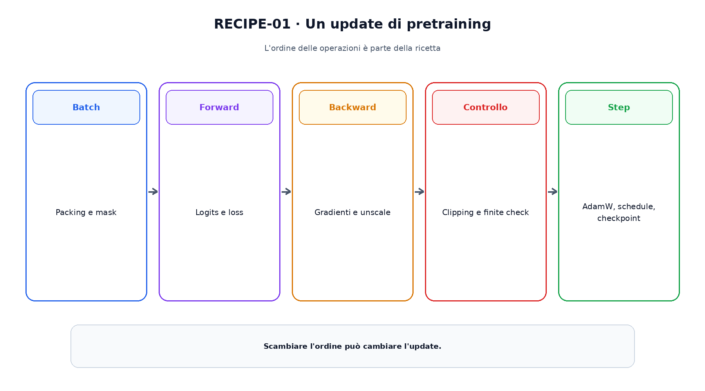
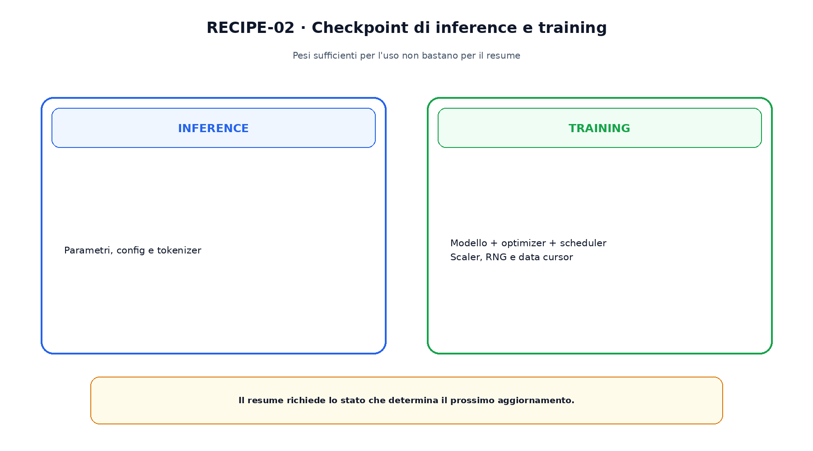

<!--
chapter_id: CH-P07-PRETRAIN-RECIPE
part_id: P07
order_key: 350
title: La ricetta di pretraining
maturity: CORE
status: candidatura completa in revisione autoriale
version: 0.2.0-rc1
last_source_check: 2026-07-31
-->

# Capitolo 35. La ricetta di pretraining

Una scaling law può suggerire dimensione e token, ma non addestra il modello. La traiettoria dipende da batch, inizializzazione, optimizer, learning rate, precisione, clipping e checkpoint.

## Batch in token

Packing e padding determinano quanti token contribuiscono realmente alla loss. La mask deve escludere padding e confini non validi.

Un errore di packing può creare dipendenze artificiali anche quando la loss scende.

## Inizializzazione

La scala dei pesi interagisce con profondità, residual e norm. Copiare una deviazione standard senza replicare l'architettura può cambiare il regime.

Inizializzazione e residual scaling devono essere documentati insieme.

## AdamW

AdamW separa weight decay e update adattivo. Learning rate, beta, epsilon e parametri esclusi dal decay fanno parte della ricetta.

Escludere bias o norm è una scelta del setup, non una legge universale.

La figura attraversa il meccanismo nell'ordine di lettura e mantiene esplicite le dipendenze.

## Warmup e schedule

Il warmup aumenta il learning rate nelle prime iterazioni; schedule cosine o lineari lo riducono. Il contatore può essere in step o token.

Un resume con contatore errato applica un learning rate differente pur usando gli stessi pesi.

## Clipping e precisione

Clipping, unscale e optimizer step devono avere un ordine dichiarato. Il clipping contiene uno spike ma non ne identifica la causa.

Loss scaling e dtype seguono il contratto numerico del Capitolo 9.

## Checkpoint completo

Per riprendere servono modello, optimizer, scheduler, scaler, RNG, contatori e posizione nel data stream.

I soli pesi bastano per l'inference, non per ricostruire la stessa traiettoria.

Il confronto separa ciò che cambia da ciò che rimane invariato.

## Uno snippet eseguibile

Il file [`code/snip_recipe_001.py`](code/snip_recipe_001.py) rende osservabile il contratto centrale. I test controllano determinismo, output e invarianti.

## Riepilogo

La ricetta collega dati, batch, optimizer, schedule, precisione e checkpoint. Il Capitolo 36 distribuisce lo stesso update su più dispositivi e introduce il continued pretraining.

### Verifica della comprensione

1. Ricostruisci il problema che apre il capitolo.
2. Indica l'operazione centrale e il suo output.
3. Spiega un limite o failure mode.
4. Collega il risultato al capitolo successivo.
5. Modifica una variabile nello snippet e prevedi l'effetto prima di eseguirlo.

## Fonti e materiali verificabili

Fonti, claim, codice, output e audit sono raccolti nei file del capitolo.
