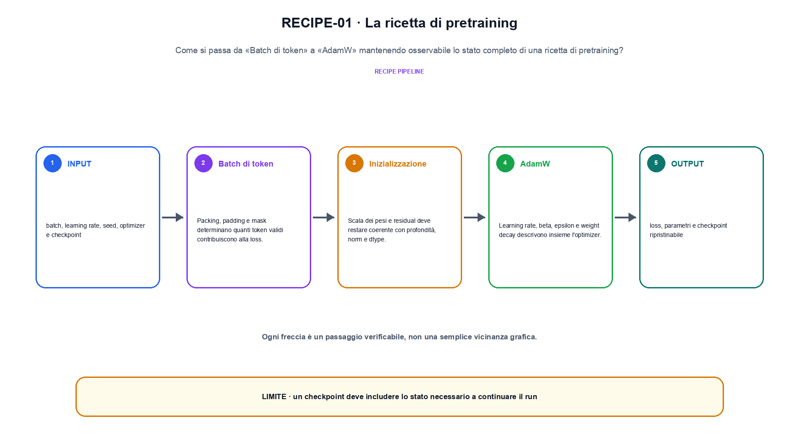
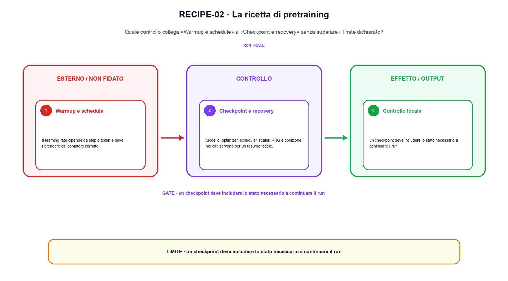

<!--
chapter_id: CH-P07-PRETRAIN-RECIPE
part_id: P07
order_key: 350
title: La ricetta di pretraining
maturity: CORE
status: revisione editoriale v2, approvazione autoriale aperta
version: 0.5.0-draft3
last_source_check: 4 agosto 2026
environment: Python 3.13.12, CPU
code_policy: reference
deferred: benchmark applicativi non eseguiti e approvazione autoriale delle visuali
-->

# Capitolo 35. La ricetta di pretraining

La domanda pratica di la ricetta di pretraining è che cosa cambia nei record tra «Batch di token» e «Checkpoint e recovery» e come lo possiamo dimostrare. L'oggetto osservato è lo stato completo di una ricetta di pretraining. Il contratto locale dichiara input, batch, learning rate, seed, optimizer e checkpoint; operazione, forward, backward, update, schedule e recovery; output, loss, parametri e checkpoint ripristinabile. Per fissare il riferimento usiamo Un prefisso corto con ID, lunghezza, posizione e output del token successivo dichiarati. Il limite da non nascondere è: un checkpoint deve includere lo stato necessario a continuare il run.

## Batch di token

Packing, padding e mask determinano quanti token validi contribuiscono alla loss. [SRC-35-001]

Optimizer, schedule e stato del checkpoint formano una sola ricetta.

**Caso da seguire.** Un prefisso corto con ID, lunghezza, posizione e output del token successivo dichiarati.

**Controllo.** Per «Batch di token», conserva record iniziale, regola applicata e record finale; un conteggio aggregato non basta a spiegare la trasformazione.


La relazione centrale può essere scritta come:

$$
theta_t = AdamW(theta_{t-1}, grad_t, lr_t)
$$

Optimizer, schedule e stato del checkpoint formano una sola ricetta. [SRC-35-001]




La prima figura segue il percorso da «Batch di token» a «AdamW».


## Inizializzazione

Scala dei pesi e residual deve restare coerente con profondità, norm e dtype. [SRC-35-002]

**Caso da seguire.** Warmup di quattro step e ripresa dal contatore salvato.

**Controllo.** Esegui «Inizializzazione» due volte sullo stesso manifest e confronta identificatori, ordine, split e checksum.


## AdamW

Learning rate, beta, epsilon e weight decay descrivono insieme l'optimizer. [SRC-35-003]

**Caso da seguire.** Un caso in cui un checkpoint deve includere lo stato necessario a continuare il run.

**Controllo.** Per «AdamW», aggiungi un record che deve essere escluso e verifica che l'output conservi anche il motivo dell'esclusione.


## Esempio Python eseguito

La prova locale di la ricetta di pretraining parte da un esempio minimo, registrato nel repository insieme ai suoi test. Per «La ricetta di pretraining», il caso di default usa valori piccoli per isolare il meccanismo. La prova negativa riguarda proprio «la ricetta di pretraining» e interrompe l'interpretazione prima dell'output.

```python
def contract(case: str = "default"):
    if case != "default":
        raise ValueError("only the documented default case is supported")
    base_lr = 0.001
    warmup_steps = 4
    steps = [0, 1, 4, 8]
    rates = [round(base_lr * min(1.0, step / warmup_steps), 6) for step in steps]
    return {"learning_rates": rates, "invariant": "the scheduler is indexed by the declared step counter"}
```

Esecuzione con `python snip_35_contract.py`:

```text
{"invariant": "the scheduler is indexed by the declared step counter", "learning_rates": [0.0, 0.00025, 0.001, 0.001]}
```

Il test associato è [`code/test_35_contract.py`](code/test_35_contract.py); l'output versionato è [`code/outputs/SNIP-35-001.txt`](code/outputs/SNIP-35-001.txt).


## Warmup e schedule

Il learning rate dipende da step o token e deve riprendere dal contatore corretto. [SRC-35-004]

**Caso da seguire.** Due ricette con budget di token dichiarato, compute comparabile e loss osservata nello stesso intervallo.

**Controllo.** Per «Warmup e schedule», modifica una sola regola della pipeline e misura quali record cambiano, evitando di confrontare raccolte di origine diversa.


## Checkpoint e recovery

Modello, optimizer, scheduler, scaler, RNG e posizione nei dati servono per un resume fedele. [SRC-35-001]

**Caso da seguire.** Una metrica del compito nuovo confrontata con la stessa metrica sul comportamento precedente.

**Controllo.** Per «Checkpoint e recovery», descrivi ciò che la pipeline perde oltre a ciò che produce. Nel caso «Checkpoint e recovery», il limite locale è: Modello, optimizer, scheduler, scaler, RNG e posizione nei dati servono per un resume fedele.




La seconda figura mette a confronto «Warmup e schedule» e il limite discusso in «Checkpoint e recovery».


## Come si collegano i passaggi

- **Da «Batch di token» a «Inizializzazione».** Packing, padding e mask determinano quanti token validi contribuiscono alla loss. Scala dei pesi e residual deve restare coerente con profondità, norm e dtype. «Batch di token» identifica il record e «Inizializzazione» dichiara la trasformazione sulla popolazione osservata. Da «Batch di token» a «Inizializzazione» cambia la domanda osservabile. [SRC-35-001; SRC-35-002]

- **Da «Inizializzazione» a «AdamW».** Scala dei pesi e residual deve restare coerente con profondità, norm e dtype. Learning rate, beta, epsilon e weight decay descrivono insieme l'optimizer. Il passaggio da «Inizializzazione» a «AdamW» conserva configurazione, conteggi e artefatti intermedi. Il passaggio successivo rende misurabile «AdamW». [SRC-35-002; SRC-35-003]

- **Da «AdamW» a «Warmup e schedule».** Learning rate, beta, epsilon e weight decay descrivono insieme l'optimizer. Il learning rate dipende da step o token e deve riprendere dal contatore corretto. Con «Warmup e schedule» la pipeline può selezionare o usare dati senza confonderli con una modifica del modello. Da «AdamW» a «Warmup e schedule» cambia la domanda osservabile. [SRC-35-003; SRC-35-004]

- **Da «Warmup e schedule» a «Checkpoint e recovery».** Il learning rate dipende da step o token e deve riprendere dal contatore corretto. Modello, optimizer, scheduler, scaler, RNG e posizione nei dati servono per un resume fedele. «Checkpoint e recovery» porta il risultato alla valutazione e rende visibili record, slice e failure esclusi. Il passaggio successivo rende misurabile «Checkpoint e recovery». [SRC-35-004; SRC-35-001]

La catena completa produce loss, parametri e checkpoint ripristinabile a partire da batch, learning rate, seed, optimizer e checkpoint. Ogni collegamento conserva un oggetto osservabile diverso; per questo il risultato non può essere esteso oltre il limite dichiarato: un checkpoint deve includere lo stato necessario a continuare il run.


## Esercizi sulla tracciabilità

1. Ricostruisci «Batch di token» con un esempio diverso da quello mostrato e indica l'output atteso prima del calcolo.
2. Nel passaggio «Inizializzazione», cambia una sola ipotesi e spiega quale risultato non è più confrontabile.
3. Collega «AdamW» a una riga dello snippet oppure motiva perché la prova deve essere documentale.
4. Progetta un caso limite per «Warmup e schedule» che produca una failure riconoscibile.
5. Per «Checkpoint e recovery», separa una conclusione sostenuta dal caso locale da una che richiederebbe nuovi dati o un benchmark.


## L'artefatto che deve sopravvivere

La lezione parte da «batch, learning rate, seed, optimizer e checkpoint» e arriva fino a «loss, parametri e checkpoint ripristinabile». Il limite da conservare è questo: un checkpoint deve includere lo stato necessario a continuare il run. Per «Checkpoint e recovery», provenienza e trasformazioni sono registrate in [`FONTI_PRIMARIE.md`](FONTI_PRIMARIE.md), [`CLAIMS.md`](CLAIMS.md) e negli artefatti di `code/`.
