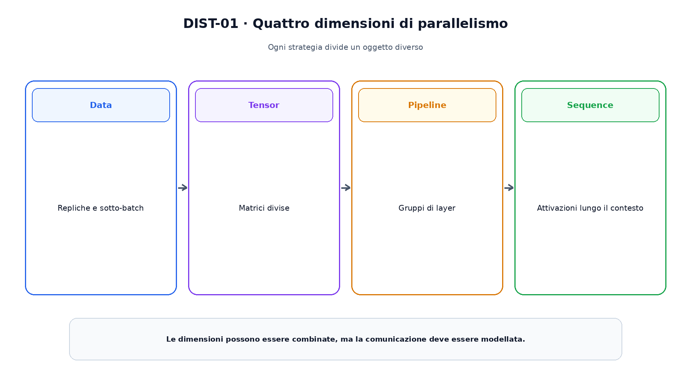
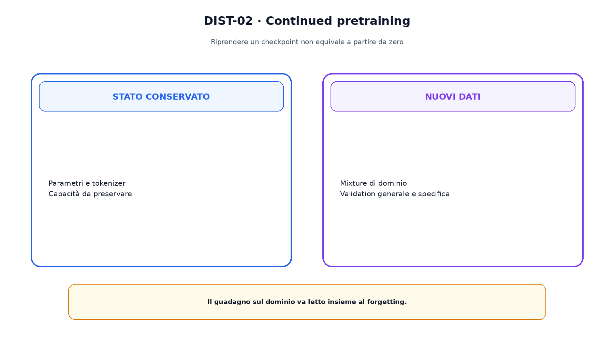

<!--
chapter_id: CH-P07-DISTRIBUTED-TRAINING
part_id: P07
order_key: 360
title: Training distribuito e continued pretraining
maturity: CORE
status: candidatura completa in revisione autoriale
version: 0.2.0-rc1
last_source_check: 2026-07-31
-->

# Capitolo 36. Training distribuito e continued pretraining

Quando il modello o il batch superano la memoria di un dispositivo, lo stesso update deve essere distribuito senza cambiarne silenziosamente il significato. La distribuzione riguarda calcolo, memoria e comunicazione; il continued pretraining riprende invece un checkpoint su nuovi dati.

## Data parallelism

Ogni replica contiene il modello e riceve un sotto-batch. I gradienti vengono aggregati, tipicamente con all-reduce.

Ordine delle riduzioni e arrotondamenti possono cambiare; loss e batch globali devono essere definiti coerentemente.

## ZeRO e FSDP

Parametri, gradienti e stato dell'optimizer vengono shardati. I parametri necessari possono essere ricostruiti temporaneamente prima del calcolo.

La memoria scende per worker, mentre comunicazione e checkpoint diventano più complessi.

## Tensor parallelism

Una matrice viene divisa per righe o colonne e le operazioni successive usano collectives per ricomporre output o gradienti.

La partizione deve rispettare l'algebra del layer.

La figura attraversa il meccanismo nell'ordine di lettura e mantiene esplicite le dipendenze.

## Pipeline parallelism

Gruppi di layer vengono assegnati a stadi e i microbatch attraversano la pipeline. Le bolle rappresentano stadi inattivi.

Schedule differenti scambiano memoria, latenza e semplicità.

## Sequence e context parallelism

Con sequenze lunghe si distribuiscono attivazioni o parti del contesto. Comunicazione e mask devono conservare il meccanismo globale.

Queste tecniche non rendono gratuita l'attention.

## Continued pretraining

Un checkpoint viene ripreso su dati generali o di dominio. Mixture, learning rate, durata e replay determinano adattamento e forgetting.

La valutazione deve includere il dominio nuovo e le capacità da conservare.

Il confronto separa ciò che cambia da ciò che rimane invariato.

## Uno snippet eseguibile

Il file [`code/snip_dist_001.py`](code/snip_dist_001.py) rende osservabile il contratto centrale. I test controllano determinismo, output e invarianti.

## Riepilogo

Il training distribuito divide repliche, parametri, layer o sequenze e introduce collectives. Il continued pretraining modifica la distribuzione dei dati mantenendo uno stato iniziale appreso. Il Capitolo 37 torna al blocco prodotto dal training.

### Verifica della comprensione

1. Ricostruisci il problema che apre il capitolo.
2. Indica l'operazione centrale e il suo output.
3. Spiega un limite o failure mode.
4. Collega il risultato al capitolo successivo.
5. Modifica una variabile nello snippet e prevedi l'effetto prima di eseguirlo.

## Fonti e materiali verificabili

Fonti, claim, codice, output e audit sono raccolti nei file del capitolo.
