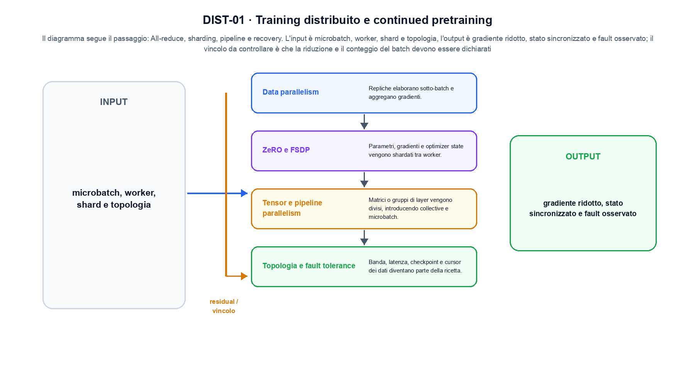
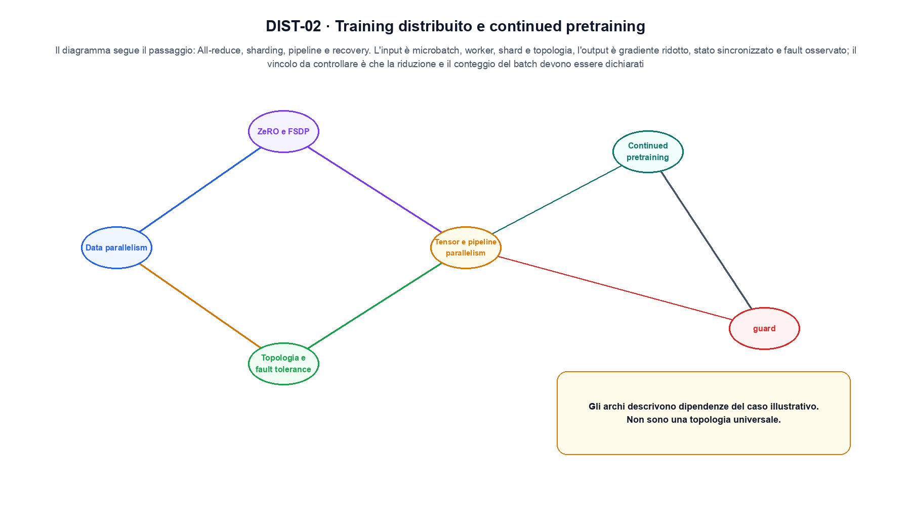

<!--
chapter_id: CH-P07-DISTRIBUTED-TRAINING
part_id: P07
order_key: 360
title: Training distribuito e continued pretraining
maturity: CORE
status: candidatura completa in revisione autoriale
version: 0.4.0-draft2
last_source_check: 3 agosto 2026
environment: Python 3.13.12, CPU
deferred: benchmark applicativi, varianti non necessarie al contratto centrale e approvazione autoriale
-->

# Capitolo 36. Training distribuito e continued pretraining

Finora abbiamo potuto descrivere gradienti e stato distribuiti tra worker. La richiesta «Il pacco non è arrivato» resta lo scenario condiviso: nel Capitolo 36 prendiamo l'input «microbatch, worker, shard e topologia» e lo seguiamo fino all'output «gradiente ridotto, stato sincronizzato e fault osservato», dichiarando prima il contratto e poi il limite.

## Data parallelism

Repliche elaborano sotto-batch e aggregano gradienti. Media e loss reduction devono essere coerenti. [SRC-36-001]

Per capire «Data parallelism» partiamo da questo caso: due record con ID, testo, licenza e timestamp che attraversano una sola trasformazione registrata. Il caso rende osservabile il punto centrale: «Repliche elaborano sotto-batch e aggregano gradienti».

Nel contratto locale, l'input «microbatch, worker, shard e topologia» entra, l'operazione «all-reduce, sharding, pipeline e recovery» modifica il percorso e l'output «gradiente ridotto, stato sincronizzato e fault osservato» è ciò che osserviamo. Qui cambia soprattutto il passaggio «Data parallelism»; resta da controllare che la riduzione e il conteggio del batch devono essere dichiarati. La domanda locale è «Repliche elaborano sotto-batch e aggregano gradienti».

Il passaggio da seguire in «Data parallelism» è quello descritto dalla frase «Repliche elaborano sotto-batch e aggregano gradienti»: l'esempio rende osservabile la trasformazione, mentre il contratto del capitolo ne delimita l'interpretazione. Per «Data parallelism» il controllo cambia una sola premessa della frase «Repliche elaborano sotto-batch e aggregano gradienti» e conserva input, output e criterio di successo, così la differenza resta attribuibile. La verifica resta ancorata a «Repliche elaborano sotto-batch e aggregano gradienti». [SRC-36-001]

La lettura va fatta in ordine: prima il caso, poi la trasformazione, quindi la conseguenza. Media e loss reduction devono essere coerenti. Il piccolo risultato resta un'illustrazione di «Repliche elaborano sotto-batch e aggregano gradienti», non una promessa generale.

Per verificare «Data parallelism» cambiamo una sola condizione vicina alla frase «Repliche elaborano sotto-batch e aggregano gradienti», teniamo fermo il resto e registriamo l'output «gradiente ridotto, stato sincronizzato e fault osservato». Il caso negativo deve rendere riconoscibile la failure, non soltanto produrre un numero diverso. La sezione successiva, «ZeRO e FSDP», riceve l'output «gradiente ridotto, stato sincronizzato e fault osservato» come base, ma dovrà formulare e verificare la propria distinzione.

## ZeRO e FSDP

Parametri, gradienti e optimizer state vengono shardati tra worker. [SRC-36-002]

Il caso minimo di «ZeRO e FSDP» si presenta così: due worker con gradienti diversi e media esplicita. Non lo usiamo come decorazione: serve a rendere osservabile la frase «Parametri, gradienti e optimizer state vengono shardati tra worker».

La sezione usa l'input «microbatch, worker, shard e topologia» come punto di partenza e l'output «gradiente ridotto, stato sincronizzato e fault osservato» come traccia d'uscita. La trasformazione concreta è «all-reduce, sharding, pipeline e recovery»; il caso non è completo se non dichiariamo anche che la riduzione e il conteggio del batch devono essere dichiarati. La condizione da isolare è «Parametri, gradienti e optimizer state vengono shardati tra worker».

Il calcolo distribuito divide dati, parametri, stati o layer e introduce comunicazione tra worker. La riduzione dei gradienti e il recovery devono restare coerenti con la partizione realmente usata. Per «ZeRO e FSDP» il controllo cambia una sola premessa della frase «Parametri, gradienti e optimizer state vengono shardati tra worker» e conserva input, output e criterio di successo, così la differenza resta attribuibile. La verifica resta ancorata a «Parametri, gradienti e optimizer state vengono shardati tra worker». [SRC-36-002]

Se cambiamo una premessa, dobbiamo riaprire l'interpretazione. Per «ZeRO e FSDP» conserviamo l'osservazione collegata a «Parametri, gradienti e optimizer state vengono shardati tra worker» e lasciamo esplicitamente fuori ciò che non è stato misurato.

Il controllo minimo di «ZeRO e FSDP» confronta il caso dichiarato con una variazione che rompe la sua ipotesi. Se la failure non è distinguibile dall'esito valido, manca un'osservazione nel contratto di popolazione, manifest e stato del run. Da «ZeRO e FSDP» portiamo l'output «gradiente ridotto, stato sincronizzato e fault osservato»; non portiamo invece una conclusione oltre il caso locale.

La figura DIST-01 usa la famiglia architecture. Il diagramma segue il passaggio: All-reduce, sharding, pipeline e recovery. L'input è microbatch, worker, shard e topologia, l'output è gradiente ridotto, stato sincronizzato e fault osservato; il vincolo da controllare è che la riduzione e il conteggio del batch devono essere dichiarati.

## Tensor e pipeline parallelism

Matrici o gruppi di layer vengono divisi, introducendo collective e microbatch. [SRC-36-003]

Prima del nome tecnico fissiamo la situazione: consideriamo un caso in cui la riduzione e il conteggio del batch devono essere dichiarati. Da qui possiamo leggere la conseguenza dichiarata da «Matrici o gruppi di layer vengono divisi, introducendo collective e microbatch».

Per ricostruire «Tensor e pipeline parallelism» annotiamo l'input «microbatch, worker, shard e topologia», poi l'operazione «all-reduce, sharding, pipeline e recovery», infine l'output «gradiente ridotto, stato sincronizzato e fault osservato». Questa sequenza impedisce di scambiare una forma compatibile per il comportamento descritto dalla fonte. Il controllo parte da «Matrici o gruppi di layer vengono divisi, introducendo collective e microbatch».

Il calcolo distribuito divide dati, parametri, stati o layer e introduce comunicazione tra worker. La riduzione dei gradienti e il recovery devono restare coerenti con la partizione realmente usata. Per «Tensor e pipeline parallelism» il controllo cambia una sola premessa della frase «Matrici o gruppi di layer vengono divisi, introducendo collective e microbatch» e conserva input, output e criterio di successo, così la differenza resta attribuibile. La verifica resta ancorata a «Matrici o gruppi di layer vengono divisi, introducendo collective e microbatch». [SRC-36-003]

Il punto didattico di «Tensor e pipeline parallelism» è separare ciò che la fonte afferma da ciò che il piccolo caso illustra. L'output «gradiente ridotto, stato sincronizzato e fault osservato» mostra il contratto locale, ma non sostituisce una misura sul sistema completo.

La prova di «Tensor e pipeline parallelism» conserva input, operazione e output; poi esplicita quale parte di «Matrici o gruppi di layer vengono divisi, introducendo collective e microbatch» non è stata misurata. Così il test separa l'evidenza dall'inferenza. Il passaggio successivo, «Topologia e fault tolerance», potrà cambiare una sola condizione, dichiarando il nuovo setup prima di interpretare il risultato.

## Topologia e fault tolerance

Banda, latenza, checkpoint e cursor dei dati diventano parte della ricetta. [SRC-36-004]

Per capire «Topologia e fault tolerance» partiamo da questo caso: due ricette con budget di token dichiarato, compute comparabile e loss osservata nello stesso intervallo. Il caso rende osservabile il punto centrale: «Banda, latenza, checkpoint e cursor dei dati diventano parte della ricetta».

Nel contratto locale, l'input «microbatch, worker, shard e topologia» entra, l'operazione «all-reduce, sharding, pipeline e recovery» modifica il percorso e l'output «gradiente ridotto, stato sincronizzato e fault osservato» è ciò che osserviamo. Qui cambia soprattutto il passaggio «Topologia e fault tolerance»; resta da controllare che la riduzione e il conteggio del batch devono essere dichiarati. La domanda locale è «Banda, latenza, checkpoint e cursor dei dati diventano parte della ricetta».

Il calcolo distribuito divide dati, parametri, stati o layer e introduce comunicazione tra worker. La riduzione dei gradienti e il recovery devono restare coerenti con la partizione realmente usata. Per «Topologia e fault tolerance» il controllo cambia una sola premessa della frase «Banda, latenza, checkpoint e cursor dei dati diventano parte della ricetta» e conserva input, output e criterio di successo, così la differenza resta attribuibile. La verifica resta ancorata a «Banda, latenza, checkpoint e cursor dei dati diventano parte della ricetta». [SRC-36-004]

La lettura va fatta in ordine: prima il caso, poi la trasformazione, quindi la conseguenza. Il piccolo risultato resta un'illustrazione di «Banda, latenza, checkpoint e cursor dei dati diventano parte della ricetta», non una promessa generale.

Per verificare «Topologia e fault tolerance» cambiamo una sola condizione vicina alla frase «Banda, latenza, checkpoint e cursor dei dati diventano parte della ricetta», teniamo fermo il resto e registriamo l'output «gradiente ridotto, stato sincronizzato e fault osservato». Il caso negativo deve rendere riconoscibile la failure, non soltanto produrre un numero diverso. La sezione successiva, «Continued pretraining», riceve l'output «gradiente ridotto, stato sincronizzato e fault osservato» come base, ma dovrà formulare e verificare la propria distinzione.

## Continued pretraining

Un checkpoint viene adattato a nuovi dati con learning rate, mixture e valutazioni di regressione dichiarate. [SRC-36-001]

Il caso minimo di «Continued pretraining» si presenta così: due vettori con shape compatibile confrontati prima e dopo il blocco, osservando separatamente scala e percorso residuale in «Continued pretraining». Non lo usiamo come decorazione: serve a rendere osservabile la frase «Un checkpoint viene adattato a nuovi dati con learning rate, mixture e valutazioni di regressione dichiarate».

La sezione usa l'input «microbatch, worker, shard e topologia» come punto di partenza e l'output «gradiente ridotto, stato sincronizzato e fault osservato» come traccia d'uscita. La trasformazione concreta è «all-reduce, sharding, pipeline e recovery»; il caso non è completo se non dichiariamo anche che la riduzione e il conteggio del batch devono essere dichiarati. La condizione da isolare è «Un checkpoint viene adattato a nuovi dati con learning rate, mixture e valutazioni di regressione dichiarate».

Il passaggio da seguire in «Continued pretraining» è quello descritto dalla frase «Un checkpoint viene adattato a nuovi dati con learning rate, mixture e valutazioni di regressione dichiarate»: l'esempio rende osservabile la trasformazione, mentre il contratto del capitolo ne delimita l'interpretazione. Per «Continued pretraining» il controllo cambia una sola premessa della frase «Un checkpoint viene adattato a nuovi dati con learning rate, mixture e valutazioni di regressione dichiarate» e conserva input, output e criterio di successo, così la differenza resta attribuibile. La verifica resta ancorata a «Un checkpoint viene adattato a nuovi dati con learning rate, mixture e valutazioni di regressione dichiarate». [SRC-36-001]

Se cambiamo una premessa, dobbiamo riaprire l'interpretazione. Per «Continued pretraining» conserviamo l'osservazione collegata a «Un checkpoint viene adattato a nuovi dati con learning rate, mixture e valutazioni di regressione dichiarate» e lasciamo esplicitamente fuori ciò che non è stato misurato.

Il controllo minimo di «Continued pretraining» confronta il caso dichiarato con una variazione che rompe la sua ipotesi. Se la failure non è distinguibile dall'esito valido, manca un'osservazione nel contratto di popolazione, manifest e stato del run. La conclusione resta ancorata al protocollo osservato, non al nome della tecnica.

## Una traiettoria controllata: Data parallelism

Il caso intero parte dall'input «microbatch, worker, shard e topologia», applica l'operazione «all-reduce, sharding, pipeline e recovery» e osserva l'output «gradiente ridotto, stato sincronizzato e fault osservato». Un esempio controllato: due worker con gradienti diversi e media esplicita. La formula locale è:

$$
g = (1 / W) sum_w g_w
$$

La riduzione dei gradienti deve essere coerente con worker, batch e loss reduction. [SRC-36-001]

La figura DIST-02 cambia composizione rispetto alla prima. Il diagramma segue il passaggio: All-reduce, sharding, pipeline e recovery. L'input è microbatch, worker, shard e topologia, l'output è gradiente ridotto, stato sincronizzato e fault osservato; il vincolo da controllare è che la riduzione e il conteggio del batch devono essere dichiarati.

## Il passaggio eseguito in Python: ZeRO e FSDP

Il file `code/snip_36_contract.py` collega il contratto del capitolo alla frase «Un checkpoint viene adattato a nuovi dati con learning rate, mixture e valutazioni di regressione dichiarate». Il test controlla l'invariante, la risposta valida e il caso negativo; `code/outputs/SNIP-36-001.txt` conserva il risultato ripetibile del caso locale.

## Prima di generalizzare: Continued pretraining

Il meccanismo di «Training distribuito e continued pretraining» resta legato al contratto locale. La riduzione e il conteggio del batch devono essere dichiarati. Prima di generalizzare la frase «Un checkpoint viene adattato a nuovi dati con learning rate, mixture e valutazioni di regressione dichiarate», servono un nuovo setup, un protocollo dichiarato e una misura ripetibile.

## Dalla lezione al capitolo seguente: Training distribuito e continued pretraining

Abbiamo seguito gradienti e stato distribuiti tra worker, partendo dall'input «microbatch, worker, shard e topologia» e arrivando all'output «gradiente ridotto, stato sincronizzato e fault osservato». Le sezioni «Data parallelism», «ZeRO e FSDP», «Continued pretraining» hanno isolato le proprie frasi chiave senza confondere il meccanismo con il risultato applicativo. L'invariante da portare avanti è: la riduzione e il conteggio del batch devono essere dichiarati. Il Capitolo 37, Anatomia del blocco moderno, può partire da questo output e dichiarare la propria domanda.

### Domande per ricostruire il percorso: Data parallelism

1. Ricostruisci l'oggetto continuo a partire da «Data parallelism» e indica quale parte della frase «Repliche elaborano sotto-batch e aggregano gradienti» entra nel caso.
2. Spiega quale trasformazione collega «Data parallelism» a «Continued pretraining» e quale output osserviamo nel passaggio.
3. Usa lo snippet per controllare l'invariante del contratto: la riduzione e il conteggio del batch devono essere dichiarati.
4. Separa una definizione sostenuta da una fonte, un esempio illustrativo e un risultato locale del caso guida.
5. Indica quale parte della frase «Un checkpoint viene adattato a nuovi dati con learning rate, mixture e valutazioni di regressione dichiarate» richiederebbe una misura nuova prima di essere estesa oltre il caso osservato.

### Esercizi sul failure mode: Continued pretraining

1. Ricostruisci input e output di «Data parallelism» usando un esempio di tre righe.
2. Modifica una sola variabile in «ZeRO e FSDP» e anticipa l'invariante che dovrebbe restare.
3. Metti «Tensor e pipeline parallelism» a confronto con il caso base e descrivi il failure mode più vicino.
4. Scrivi un test minimo per rendere osservabile il confine di «Topologia e fault tolerance».
5. Formula per «Continued pretraining» una domanda che separi meccanismo e qualità del sistema.

## Dossier delle fonti e materiali: Training distribuito e continued pretraining

Il dossier di «Training distribuito e continued pretraining» in `FONTI_PRIMARIE.md` separa definizioni, risultati e conteggi, split e trasformazioni registrate; la data di consultazione è registrata accanto ai riferimenti. `CLAIMS.md` separa definizioni e risultati locali; codice, ambiente, test e output sono nella cartella `code/`, con attenzione a popolazione, manifest e stato del run.
