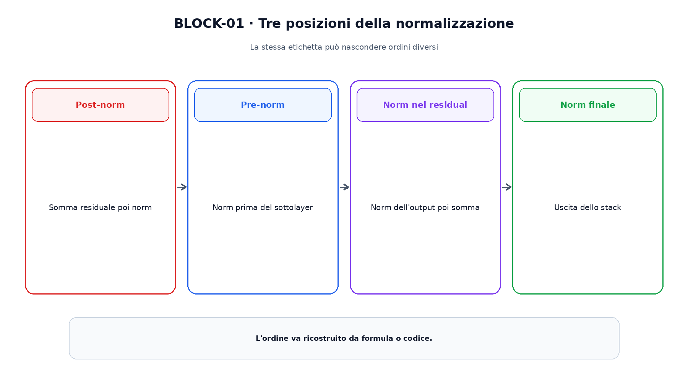
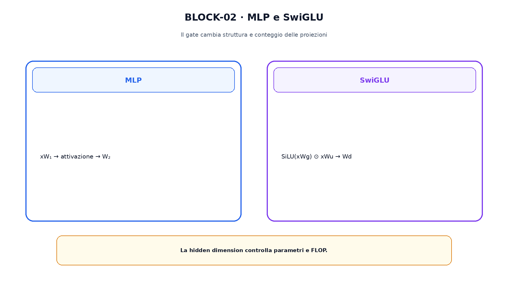

<!--
chapter_id: CH-P08-MODERN-BLOCK
part_id: P08
order_key: 370
title: Anatomia del blocco moderno
maturity: CORE
status: candidatura completa in revisione autoriale
version: 0.2.0-rc1
last_source_check: 2026-07-31
-->

# Capitolo 37. Anatomia del blocco moderno

I decoder moderni conservano attention, feed-forward, residual e normalizzazione, ma ne modificano spesso ordine e parametrizzazione. Questo capitolo costruisce una mappa per leggere pre-norm, post-norm, RMSNorm, SwiGLU e rami paralleli.

## Residual stream

$y=x+F(x)$ conserva un percorso identità. Il residual facilita il flusso, ma non stabilizza automaticamente qualunque sottolayer.

La scala dell'update deve essere letta insieme a norm e inizializzazione.

## Post-norm e pre-norm

Il Transformer originale usa $\mathrm{LN}(x+F(x))$; il pre-norm usa $x+F(\mathrm{Norm}(x))$.

Le due forme hanno gradienti e scale differenti e non sono intercambiabili senza modificare il setup.

## RMSNorm

RMSNorm divide per la radice della media quadratica senza sottrarre la media: $g\odot x/\sqrt{\mathrm{mean}(x^2)+\epsilon}$.

Non è equivalente a LayerNorm.

La figura attraversa il meccanismo nell'ordine di lettura e mantiene esplicite le dipendenze.

## SwiGLU

SwiGLU usa $\mathrm{SiLU}(xW_g)\odot(xW_u)$ e una proiezione down. Introduce un ramo gate e un ramo value.

La hidden dimension viene spesso adattata per controllare parametri e FLOP.

## Sequenziale e parallelo

Alcuni blocchi applicano attention e MLP in sequenza; altri calcolano rami dallo stesso input normalizzato e ne sommano gli output.

Il nome Transformer block non ricostruisce l'ordine.

## Norm dentro il residual

OLMo 2 applica norm all'output del sottolayer prima della somma residuale. È distinta da pre-norm e post-norm classici.

La posizione esatta deve essere verificata nel paper o nel codice.

Il confronto separa ciò che cambia da ciò che rimane invariato.

## Uno snippet eseguibile

Il file [`code/snip_block_001.py`](code/snip_block_001.py) rende osservabile il contratto centrale. I test controllano determinismo, output e invarianti.

## Riepilogo

Un blocco moderno è una composizione di residual, norm, attention e MLP. Le posizioni della norm e la struttura del gate devono essere esplicite. Il Capitolo 38 aggiunge informazione posizionale ai confronti.

### Verifica della comprensione

1. Ricostruisci il problema che apre il capitolo.
2. Indica l'operazione centrale e il suo output.
3. Spiega un limite o failure mode.
4. Collega il risultato al capitolo successivo.
5. Modifica una variabile nello snippet e prevedi l'effetto prima di eseguirlo.

## Fonti e materiali verificabili

Fonti, claim, codice, output e audit sono raccolti nei file del capitolo.
