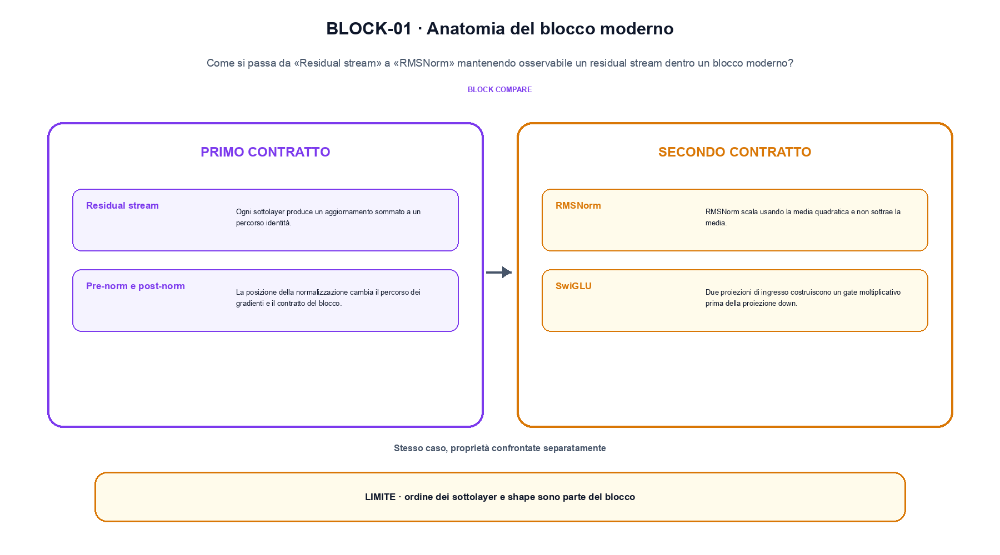
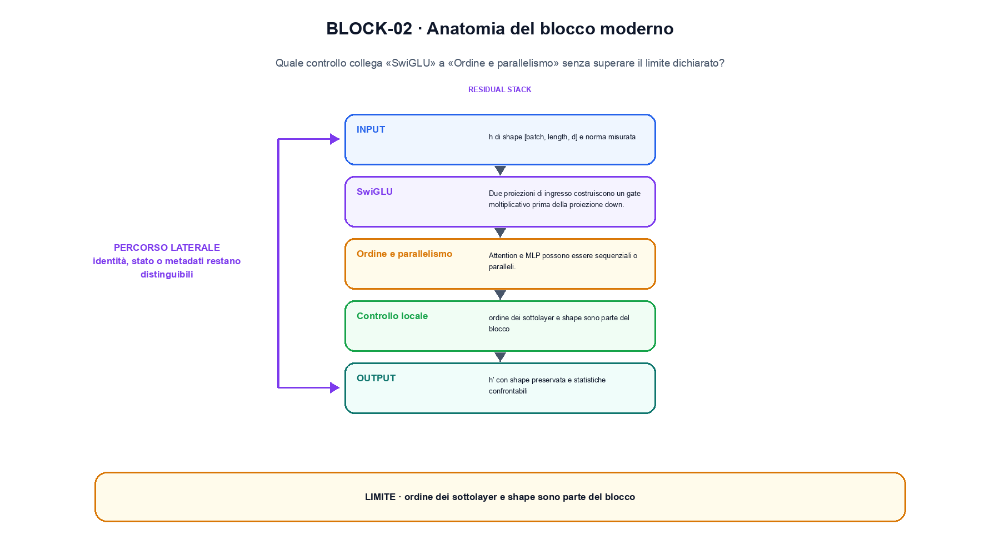

<!--
chapter_id: CH-P08-MODERN-BLOCK
part_id: P08
order_key: 370
title: Anatomia del blocco moderno
maturity: CORE
status: revisione editoriale v2, approvazione autoriale aperta
version: 0.5.0-draft3
last_source_check: 4 agosto 2026
environment: Python 3.13.12, CPU
code_policy: reference
deferred: benchmark applicativi non eseguiti e approvazione autoriale delle visuali
-->

# Capitolo 37. Anatomia del blocco moderno

Qui anatomia del blocco moderno viene osservato come un meccanismo: il percorso va da «Residual stream» a «Ordine e parallelismo». L'oggetto osservato è un residual stream dentro un blocco moderno. Il contratto locale dichiara input, h di shape [batch, length, d] e norma misurata; operazione, norm, attention, MLP e gating nell'ordine scelto; output, h' con shape preservata e statistiche confrontabili. Il caso di partenza è Due vettori con shape compatibile confrontati prima e dopo il blocco, osservando separatamente scala e percorso residuale in «Residual stream». Il limite da non nascondere è: ordine dei sottolayer e shape sono parte del blocco.

## Residual stream

Ogni sottolayer produce un aggiornamento sommato a un percorso identità. [SRC-37-001]

La posizione della norm e il percorso residuale sono parte del contratto del blocco.

**Caso da seguire.** Due vettori con shape compatibile confrontati prima e dopo il blocco, osservando separatamente scala e percorso residuale in «Residual stream».

**Controllo.** Per «Residual stream», scrivi il risultato atteso prima del calcolo, modifica una sola quantità e localizza il primo passaggio che cambia. Nel caso «Residual stream», il vincolo da conservare è: Ogni sottolayer produce un aggiornamento sommato a un percorso identità.


## Pre-norm e post-norm

La posizione della normalizzazione cambia il percorso dei gradienti e il contratto del blocco. [SRC-37-002]

**Caso da seguire.** Pre-norm e residuale su un vettore di due coordinate.

**Controllo.** Per «Pre-norm e post-norm», ricalcola il caso a mano e con lo snippet. Nel caso «Pre-norm e post-norm», se i risultati divergono, confronta prima i valori intermedi e soltanto dopo l'output finale.


La relazione centrale può essere scritta come:

$$
h' = h + MLP(Norm(h))
$$

La posizione della norm e il percorso residuale sono parte del contratto del blocco. [SRC-37-001]




La prima figura segue il percorso da «Residual stream» a «RMSNorm».


## RMSNorm

RMSNorm scala usando la media quadratica e non sottrae la media. [SRC-37-003]

**Caso da seguire.** Un caso in cui ordine dei sottolayer e shape sono parte del blocco.

**Controllo.** Per «RMSNorm», aggiungi un valore limite e verifica separatamente forma, valore e ipotesi. Una shape valida non dimostra da sola «RMSNorm».


## SwiGLU

Due proiezioni di ingresso costruiscono un gate moltiplicativo prima della proiezione down. [SRC-37-004]

**Caso da seguire.** Un blocco viene confrontato a parità di input e shape. Il vantaggio dichiarato resta un'ipotesi finché non viene misurato sullo stesso setup.

**Controllo.** Per «SwiGLU», mantieni fisso l'input e sostituisci soltanto il meccanismo discusso nella sezione. Nel caso «SwiGLU», il confronto deve attribuire la differenza a quel passaggio, non al setup.


## Esempio Python eseguito

Il caso computazionale di anatomia del blocco moderno è riportato senza trasformazioni: il file e l'output sono quelli verificati. Per «Anatomia del blocco moderno», il caso di default usa valori piccoli per isolare il meccanismo. La suite conserva inoltre una failure esplicita per separare il contratto osservato da «anatomia del blocco moderno».

```python
def contract(case: str = "default"):
    if case != "default":
        raise ValueError("only the documented default case is supported")
    state = [1.0, -2.0]
    update = [0.25, 0.5]
    output = [left + right for left, right in zip(state, update)]
    return {"output": output, "shape": [2], "invariant": "the residual stream keeps the declared dimension"}
```

Esecuzione con `python snip_37_contract.py`:

```text
{"invariant": "the residual stream keeps the declared dimension", "output": [1.25, -1.5], "shape": [2]}
```

Il test associato è [`code/test_37_contract.py`](code/test_37_contract.py); l'output versionato è [`code/outputs/SNIP-37-001.txt`](code/outputs/SNIP-37-001.txt).


## Ordine e parallelismo

Attention e MLP possono essere sequenziali o paralleli; il nome del modello non basta a ricostruire l'ordine. [SRC-37-001]

**Caso da seguire.** Per «Ordine e parallelismo» si mantiene l'input del capitolo e si isola questa condizione: Attention e MLP possono essere sequenziali o paralleli; il nome del modello non basta a ricostruire l'ordine.

**Controllo.** Per «Ordine e parallelismo», costruisci un controesempio che rispetti il tipo di dato ma violi l'ipotesi centrale. Il test deve rendere riconoscibile perché «Ordine e parallelismo» non si applica.




La seconda figura mette a confronto «SwiGLU» e il limite discusso in «Ordine e parallelismo».


## Come si collegano i passaggi

- **Da «Residual stream» a «Pre-norm e post-norm».** Ogni sottolayer produce un aggiornamento sommato a un percorso identità. La posizione della normalizzazione cambia il percorso dei gradienti e il contratto del blocco. Tra «Residual stream» e «Pre-norm e post-norm» l'ingresso viene fissato prima della regola che produce il valore. Da «Residual stream» a «Pre-norm e post-norm» cambia la domanda osservabile. [SRC-37-001; SRC-37-002]

- **Da «Pre-norm e post-norm» a «RMSNorm».** La posizione della normalizzazione cambia il percorso dei gradienti e il contratto del blocco. RMSNorm scala usando la media quadratica e non sottrae la media. Nel caso «RMSNorm» il componente diventa il punto in cui localizzare l'errore. Il passaggio successivo rende misurabile «RMSNorm». [SRC-37-002; SRC-37-003]

- **Da «RMSNorm» a «SwiGLU».** RMSNorm scala usando la media quadratica e non sottrae la media. Due proiezioni di ingresso costruiscono un gate moltiplicativo prima della proiezione down. Dopo «RMSNorm», la variante di «SwiGLU» cambia una proprietà alla volta. Da «RMSNorm» a «SwiGLU» cambia la domanda osservabile. [SRC-37-003; SRC-37-004]

- **Da «SwiGLU» a «Ordine e parallelismo».** Due proiezioni di ingresso costruiscono un gate moltiplicativo prima della proiezione down. Attention e MLP possono essere sequenziali o paralleli; il nome del modello non basta a ricostruire l'ordine. Da «Ordine e parallelismo» in poi la misura resta distinta dalla correttezza locale del calcolo. Il passaggio successivo rende misurabile «Ordine e parallelismo». [SRC-37-004; SRC-37-001]

La catena completa produce h' con shape preservata e statistiche confrontabili a partire da h di shape [batch, length, d] e norma misurata. Ogni collegamento conserva un oggetto osservabile diverso; per questo il risultato non può essere esteso oltre il limite dichiarato: ordine dei sottolayer e shape sono parte del blocco.


## Esercizi sul meccanismo

1. Ricostruisci «Residual stream» con un esempio diverso da quello mostrato e indica l'output atteso prima del calcolo.
2. Nel passaggio «Pre-norm e post-norm», cambia una sola ipotesi e spiega quale risultato non è più confrontabile.
3. Collega «RMSNorm» a una riga dello snippet oppure motiva perché la prova deve essere documentale.
4. Progetta un caso limite per «SwiGLU» che produca una failure riconoscibile.
5. Per «Ordine e parallelismo», separa una conclusione sostenuta dal caso locale da una che richiederebbe nuovi dati o un benchmark.


## Che cosa deve restare chiaro

La lezione parte da «h di shape [batch, length, d] e norma misurata» e arriva fino a «h' con shape preservata e statistiche confrontabili». Il limite da conservare è questo: ordine dei sottolayer e shape sono parte del blocco. La formula e il codice collegati a «Ordine e parallelismo» sono rintracciabili in [`FONTI_PRIMARIE.md`](FONTI_PRIMARIE.md), [`CLAIMS.md`](CLAIMS.md) e `code/`.
