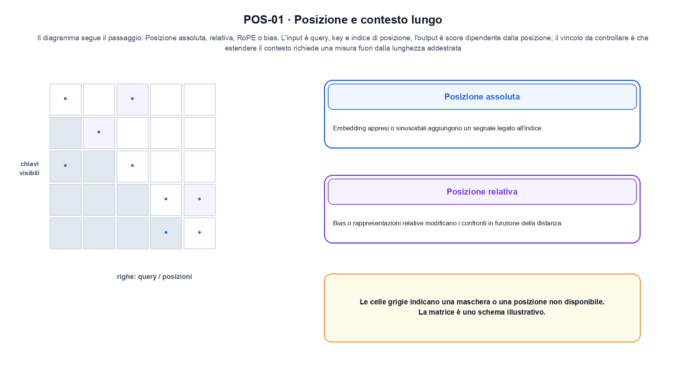
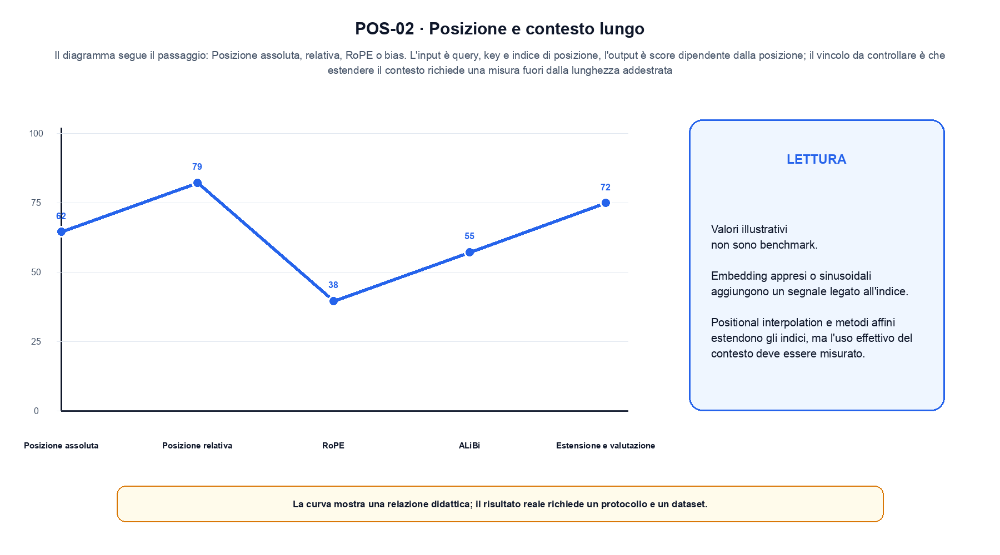

<!--
chapter_id: CH-P08-POSITION-CONTEXT
part_id: P08
order_key: 380
title: Posizione e contesto lungo
maturity: CORE
status: candidatura completa in revisione autoriale
version: 0.4.0-draft2
last_source_check: 3 agosto 2026
environment: Python 3.13.12, CPU
deferred: benchmark applicativi, varianti non necessarie al contratto centrale e approvazione autoriale
-->

# Capitolo 38. Posizione e contesto lungo

La richiesta «Il pacco non è arrivato» resta il caso guida. In questo capitolo la usiamo per distinguere la relazione tra posizione e rappresentazione del token, trasformazione e risultato, senza nascondere i dettagli tecnici.

## Posizione assoluta

Embedding appresi o sinusoidali aggiungono un segnale legato all'indice. [SRC-38-001]

Prima del nome tecnico fissiamo la situazione: consideriamo un prefisso corto con ID, lunghezza, posizione e output del token successivo dichiarati. Da qui possiamo leggere la conseguenza dichiarata da «Embedding appresi o sinusoidali aggiungono un segnale legato all'indice».

La sezione usa l'input «query, key e indice di posizione» come punto di partenza e l'output «score dipendente dalla posizione» come traccia d'uscita. La trasformazione concreta è «posizione assoluta, relativa, RoPE o bias»; il caso non è completo se non dichiariamo anche che estendere il contesto richiede una misura fuori dalla lunghezza addestrata. La condizione da isolare è «Embedding appresi o sinusoidali aggiungono un segnale legato all'indice».

Questa variante cambia un punto preciso del blocco o del segnale posizionale. Per confrontarla bisogna fissare ordine, shape, mask e condizioni di training, altrimenti si attribuisce alla variante una differenza nata dal setup. La variabile da isolare è il pattern di visibilità o di riuso: la stessa shape può corrispondere a dipendenze e costi diversi. La verifica resta ancorata a «Embedding appresi o sinusoidali aggiungono un segnale legato all'indice». [SRC-38-001]

Se cambiamo una premessa, dobbiamo riaprire l'interpretazione. Per «Posizione assoluta» conserviamo l'osservazione collegata a «Embedding appresi o sinusoidali aggiungono un segnale legato all'indice» e lasciamo esplicitamente fuori ciò che non è stato misurato.

La prova di «Posizione assoluta» conserva input, operazione e output; poi esplicita quale parte di «Embedding appresi o sinusoidali aggiungono un segnale legato all'indice» non è stata misurata. Così il test separa l'evidenza dall'inferenza. Il passaggio successivo, «Posizione relativa», potrà cambiare una sola condizione, dichiarando il nuovo setup prima di interpretare il risultato.

## Posizione relativa

Bias o rappresentazioni relative modificano i confronti in funzione della distanza. [SRC-38-002]

Per capire «Posizione relativa» partiamo da questo caso: un prefisso corto con ID, lunghezza, posizione e output del token successivo dichiarati. Il caso rende osservabile il punto centrale: «Bias o rappresentazioni relative modificano i confronti in funzione della distanza».

Per ricostruire «Posizione relativa» annotiamo l'input «query, key e indice di posizione», poi l'operazione «posizione assoluta, relativa, RoPE o bias», infine l'output «score dipendente dalla posizione». Questa sequenza impedisce di scambiare una forma compatibile per il comportamento descritto dalla fonte. Il controllo parte da «Bias o rappresentazioni relative modificano i confronti in funzione della distanza».

Questa variante cambia un punto preciso del blocco o del segnale posizionale. Per confrontarla bisogna fissare ordine, shape, mask e condizioni di training, altrimenti si attribuisce alla variante una differenza nata dal setup. La variabile da isolare è il pattern di visibilità o di riuso: la stessa shape può corrispondere a dipendenze e costi diversi. La verifica resta ancorata a «Bias o rappresentazioni relative modificano i confronti in funzione della distanza». [SRC-38-002]

Il punto didattico di «Posizione relativa» è separare ciò che la fonte afferma da ciò che il piccolo caso illustra. L'output «score dipendente dalla posizione» mostra il contratto locale, ma non sostituisce una misura sul sistema completo.

Per verificare «Posizione relativa» cambiamo una sola condizione vicina alla frase «Bias o rappresentazioni relative modificano i confronti in funzione della distanza», teniamo fermo il resto e registriamo l'output «score dipendente dalla posizione». Il caso negativo deve rendere riconoscibile la failure, non soltanto produrre un numero diverso. La sezione successiva, «RoPE», riceve l'output «score dipendente dalla posizione» come base, ma dovrà formulare e verificare la propria distinzione.

## RoPE

Rotazioni di query e key rendono il prodotto scalare dipendente dall'offset relativo. [SRC-38-003]

Il caso minimo di «RoPE» si presenta così: un caso in cui estendere il contesto richiede una misura fuori dalla lunghezza addestrata. Non lo usiamo come decorazione: serve a rendere osservabile la frase «Rotazioni di query e key rendono il prodotto scalare dipendente dall'offset relativo».

Nel contratto locale, l'input «query, key e indice di posizione» entra, l'operazione «posizione assoluta, relativa, RoPE o bias» modifica il percorso e l'output «score dipendente dalla posizione» è ciò che osserviamo. Qui cambia soprattutto il passaggio «RoPE»; resta da controllare che estendere il contesto richiede una misura fuori dalla lunghezza addestrata. La domanda locale è «Rotazioni di query e key rendono il prodotto scalare dipendente dall'offset relativo».

Questa variante cambia un punto preciso del blocco o del segnale posizionale. Per confrontarla bisogna fissare ordine, shape, mask e condizioni di training, altrimenti si attribuisce alla variante una differenza nata dal setup. Per «RoPE» il controllo cambia una sola premessa della frase «Rotazioni di query e key rendono il prodotto scalare dipendente dall'offset relativo» e conserva input, output e criterio di successo, così la differenza resta attribuibile. La verifica resta ancorata a «Rotazioni di query e key rendono il prodotto scalare dipendente dall'offset relativo». [SRC-38-003]

La lettura va fatta in ordine: prima il caso, poi la trasformazione, quindi la conseguenza. Il piccolo risultato resta un'illustrazione di «Rotazioni di query e key rendono il prodotto scalare dipendente dall'offset relativo», non una promessa generale.

Il controllo minimo di «RoPE» confronta il caso dichiarato con una variazione che rompe la sua ipotesi. Se la failure non è distinguibile dall'esito valido, manca un'osservazione nel contratto di ordine, posizione e memoria contestuale. Da «RoPE» portiamo l'output «score dipendente dalla posizione»; non portiamo invece una conclusione oltre il caso locale.

## ALiBi

Bias lineari penalizzano distanze maggiori con slope per head. [SRC-38-004]

Prima del nome tecnico fissiamo la situazione: consideriamo un blocco viene confrontato a parità di input e shape. Il vantaggio dichiarato resta un'ipotesi finché non viene misurato sullo stesso setup. Da qui possiamo leggere la conseguenza dichiarata da «Bias lineari penalizzano distanze maggiori con slope per head».

La sezione usa l'input «query, key e indice di posizione» come punto di partenza e l'output «score dipendente dalla posizione» come traccia d'uscita. La trasformazione concreta è «posizione assoluta, relativa, RoPE o bias»; il caso non è completo se non dichiariamo anche che estendere il contesto richiede una misura fuori dalla lunghezza addestrata. La condizione da isolare è «Bias lineari penalizzano distanze maggiori con slope per head».

Questa variante cambia un punto preciso del blocco o del segnale posizionale. Per confrontarla bisogna fissare ordine, shape, mask e condizioni di training, altrimenti si attribuisce alla variante una differenza nata dal setup. Per «ALiBi» il controllo cambia una sola premessa della frase «Bias lineari penalizzano distanze maggiori con slope per head» e conserva input, output e criterio di successo, così la differenza resta attribuibile. La verifica resta ancorata a «Bias lineari penalizzano distanze maggiori con slope per head». [SRC-38-004]

Se cambiamo una premessa, dobbiamo riaprire l'interpretazione. Per «ALiBi» conserviamo l'osservazione collegata a «Bias lineari penalizzano distanze maggiori con slope per head» e lasciamo esplicitamente fuori ciò che non è stato misurato.

La prova di «ALiBi» conserva input, operazione e output; poi esplicita quale parte di «Bias lineari penalizzano distanze maggiori con slope per head» non è stata misurata. Così il test separa l'evidenza dall'inferenza. Il passaggio successivo, «Estensione e valutazione», potrà cambiare una sola condizione, dichiarando il nuovo setup prima di interpretare il risultato.

La figura POS-01 usa la famiglia matrix. Il diagramma segue il passaggio: Posizione assoluta, relativa, RoPE o bias. L'input è query, key e indice di posizione, l'output è score dipendente dalla posizione; il vincolo da controllare è che estendere il contesto richiede una misura fuori dalla lunghezza addestrata.

## Estensione e valutazione

Positional interpolation e metodi affini estendono gli indici, ma l'uso effettivo del contesto deve essere misurato. [SRC-38-001]

Per capire «Estensione e valutazione» partiamo da questo caso: un blocco viene confrontato a parità di input e shape. Il vantaggio dichiarato resta un'ipotesi finché non viene misurato sullo stesso setup. Il caso rende osservabile il punto centrale: «Positional interpolation e metodi affini estendono gli indici, ma l'uso effettivo del contesto deve essere misurato».

Per ricostruire «Estensione e valutazione» annotiamo l'input «query, key e indice di posizione», poi l'operazione «posizione assoluta, relativa, RoPE o bias», infine l'output «score dipendente dalla posizione». Questa sequenza impedisce di scambiare una forma compatibile per il comportamento descritto dalla fonte. Il controllo parte da «Positional interpolation e metodi affini estendono gli indici, ma l'uso effettivo del contesto deve essere misurato».

Una valutazione deve collegare claim, popolazione, protocollo e decisione. Media, slice, failure, giudice e incertezza misurano aspetti diversi e non diventano intercambiabili perché condividono una tabella. Il controllo separa raccolta di traiettorie e confronto delle policy, riportando ritorno, dispersione e vincoli come misure diverse. La verifica resta ancorata a «Positional interpolation e metodi affini estendono gli indici, ma l'uso effettivo del contesto deve essere misurato». [SRC-38-001]

Il punto didattico di «Estensione e valutazione» è separare ciò che la fonte afferma da ciò che il piccolo caso illustra. L'output «score dipendente dalla posizione» mostra il contratto locale, ma non sostituisce una misura sul sistema completo.

Per verificare «Estensione e valutazione» cambiamo una sola condizione vicina alla frase «Positional interpolation e metodi affini estendono gli indici, ma l'uso effettivo del contesto deve essere misurato», teniamo fermo il resto e registriamo l'output «score dipendente dalla posizione». Il caso negativo deve rendere riconoscibile la failure, non soltanto produrre un numero diverso. Il percorso si chiude lasciando espliciti la misura locale e ciò che richiederebbe una prova ulteriore.

## Il caso minimo e la sua variante: Posizione assoluta

Il caso intero parte dall'input «query, key e indice di posizione», applica l'operazione «posizione assoluta, relativa, RoPE o bias» e osserva l'output «score dipendente dalla posizione». Un esempio controllato: lo stesso vettore ruotato a due posizioni diverse. La formula locale è:

$$
q'_m = R(theta_m) q_m
$$

Una rotazione di query e key rende il prodotto dipendente dalla posizione relativa. [SRC-38-001]

La figura POS-02 cambia composizione rispetto alla prima. Il diagramma segue il passaggio: Posizione assoluta, relativa, RoPE o bias. L'input è query, key e indice di posizione, l'output è score dipendente dalla posizione; il vincolo da controllare è che estendere il contesto richiede una misura fuori dalla lunghezza addestrata.

## Che cosa osserva lo snippet: Posizione relativa

Nel run Python rendiamo osservabile la frase «Embedding appresi o sinusoidali aggiungono un segnale legato all'indice» con valori piccoli e leggibili. Il test associato verifica determinismo, output e rifiuto di una condizione incoerente; il file di output `code/outputs/SNIP-38-001.txt` documenta il caso senza pretendere una misura generale.

## Che cosa non dimostra: Estensione e valutazione

Il meccanismo di «Posizione e contesto lungo» non garantisce da solo che il sistema funzioni fuori dal caso guida. Estendere il contesto richiede una misura fuori dalla lunghezza addestrata. Il limite osservato riguarda la frase «Embedding appresi o sinusoidali aggiungono un segnale legato all'indice»; per trasferire il concetto occorre riaprire la verifica quando cambiano dati, scala o ambiente.

## La mappa delle condizioni: Posizione e contesto lungo

Il percorso ha tenuto insieme la relazione tra posizione e rappresentazione del token, l'operazione «posizione assoluta, relativa, RoPE o bias» e l'output «score dipendente dalla posizione». Le sezioni «Posizione assoluta», «Posizione relativa», «Estensione e valutazione» mostrano come il protocollo osservato delimiti ciò che il capitolo può sostenere. L'invariante da portare avanti è: estendere il contesto richiede una misura fuori dalla lunghezza addestrata. Il Capitolo 39, Varianti dell'attention e gestione KV, può partire da questo output e dichiarare la propria domanda.

### Cinque domande di controllo: Posizione assoluta

1. Ricostruisci l'oggetto continuo a partire da «Posizione assoluta» e indica quale parte della frase «Embedding appresi o sinusoidali aggiungono un segnale legato all'indice» entra nel caso.
2. Spiega quale trasformazione collega «Posizione assoluta» a «Estensione e valutazione» e quale output osserviamo nel passaggio.
3. Usa lo snippet per controllare l'invariante del contratto: estendere il contesto richiede una misura fuori dalla lunghezza addestrata.
4. Separa una definizione sostenuta da una fonte, un esempio illustrativo e un risultato locale del caso guida.
5. Indica quale parte della frase «Positional interpolation e metodi affini estendono gli indici, ma l'uso effettivo del contesto deve essere misurato» richiederebbe una misura nuova prima di essere estesa oltre il caso osservato.

### Esercizi per cambiare una condizione: Estensione e valutazione

1. Ricostruisci input e output di «Posizione assoluta» usando un esempio di tre righe.
2. Modifica una sola variabile in «Posizione relativa» e anticipa l'invariante che dovrebbe restare.
3. Metti «RoPE» a confronto con il caso base e descrivi il failure mode più vicino.
4. Scrivi un test minimo per rendere osservabile il confine di «ALiBi».
5. Formula per «Estensione e valutazione» una domanda che separi meccanismo e qualità del sistema.

## Fonti e risultati locali: Posizione e contesto lungo

Per «Posizione e contesto lungo», le fonti portanti, i limiti dei claim e la data di consultazione sono raccolti in `FONTI_PRIMARIE.md`; la ricerca riguarda soprattutto ordine, posizione e memoria contestuale. `CLAIMS.md` separa definizioni e risultati locali; codice, ambiente, test e output sono nella cartella `code/`, con attenzione a ordine, posizione e memoria contestuale.
