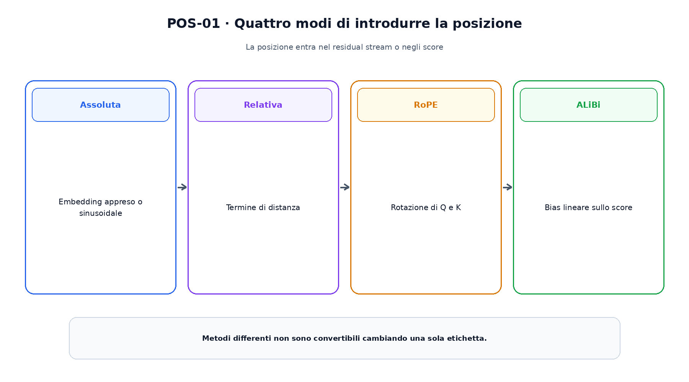
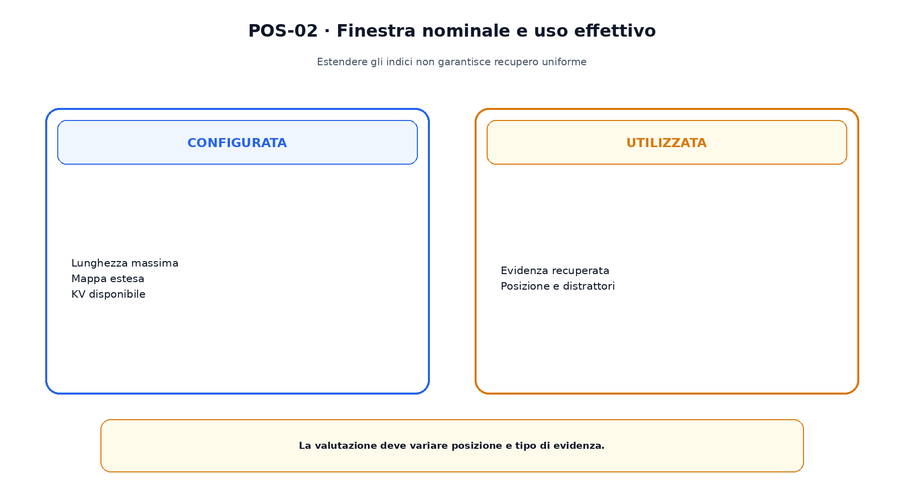

<!--
chapter_id: CH-P08-POSITION-CONTEXT
part_id: P08
order_key: 380
title: Posizione e contesto lungo
maturity: CORE
status: candidatura completa in revisione autoriale
version: 0.2.0-rc1
last_source_check: 2026-07-31
-->

# Capitolo 38. Posizione e contesto lungo

Le rappresentazioni descrivono contenuto, ma l'ordine modifica il significato. Senza un segnale posizionale, la self-attention standard è equivariant rispetto a una permutazione coerente. La finestra dichiarata più lunga non garantisce inoltre uso uniforme dell'informazione.

## Posizioni assolute

Il Transformer originale somma embedding sinusoidali; altri modelli apprendono un vettore per indice.

Una tabella appresa non definisce automaticamente posizioni oltre l'intervallo di training.

## Posizioni relative

Shaw aggiunge termini dipendenti dalla distanza; Transformer-XL combina recurrence e codifica relativa.

La stessa relazione di distanza può riapparire in segmenti differenti.

## RoPE

RoPE ruota coppie di coordinate di query e key. Il prodotto scalare dipende dalla differenza di posizione e la rotazione preserva la norma.

RoPE modifica Q e K prima del prodotto scalare, non somma un vettore al residual stream.

La figura attraversa il meccanismo nell'ordine di lettura e mantiene esplicite le dipendenze.

## ALiBi

ALiBi aggiunge un bias lineare negativo allo score in funzione della distanza, con slope per head.

La semplicità non elimina la necessità di validare l'extrapolazione.

## Context extension

Positional Interpolation comprime gli indici; YaRN e LongRoPE modificano frequenze e schedule per estensioni più lunghe.

Questi metodi richiedono adattamento e non creano memoria illimitata.

## Uso effettivo

Lost in the Middle mostra, nei modelli studiati, sensibilità alla posizione dell'evidenza. Finestra configurata e uso effettivo sono quantità differenti.

La valutazione deve variare posizione, lunghezza e distrattori.

Il confronto separa ciò che cambia da ciò che rimane invariato.

## Uno snippet eseguibile

Il file [`code/snip_pos_001.py`](code/snip_pos_001.py) rende osservabile il contratto centrale. I test controllano determinismo, output e invarianti.

## Riepilogo

La posizione entra come embedding, relazione, rotazione o bias. Estendere la mappa non garantisce uso uniforme e aumenta cache e compute. Il Capitolo 39 studia il numero di KV heads e la memoria della cache.

### Verifica della comprensione

1. Ricostruisci il problema che apre il capitolo.
2. Indica l'operazione centrale e il suo output.
3. Spiega un limite o failure mode.
4. Collega il risultato al capitolo successivo.
5. Modifica una variabile nello snippet e prevedi l'effetto prima di eseguirlo.

## Fonti e materiali verificabili

Fonti, claim, codice, output e audit sono raccolti nei file del capitolo.
