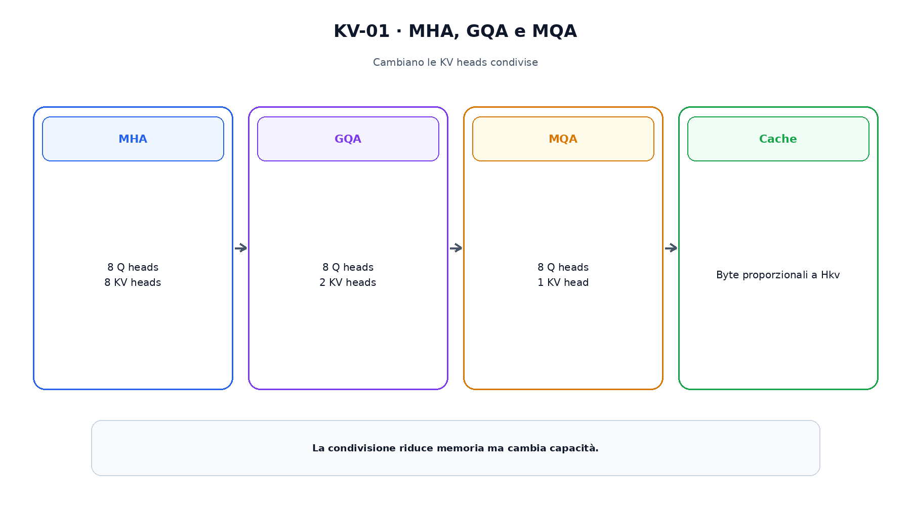
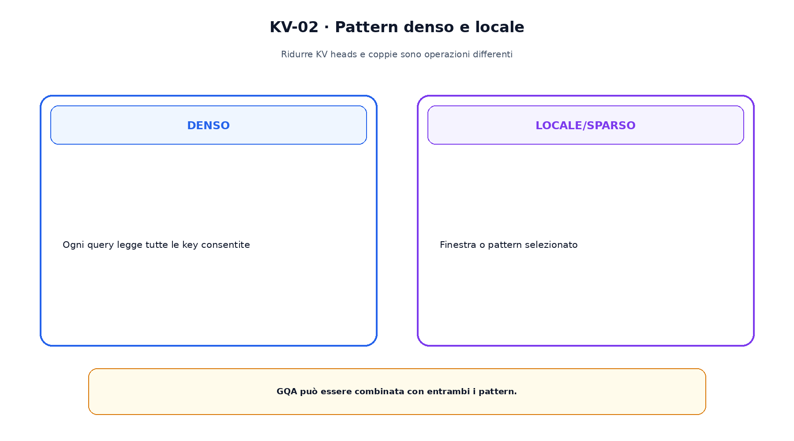

<!--
chapter_id: CH-P08-ATTENTION-KV
part_id: P08
order_key: 390
title: Varianti dell'attention e gestione KV
maturity: CORE
status: candidatura completa in revisione autoriale
version: 0.2.0-rc1
last_source_check: 2026-07-31
-->

# Capitolo 39. Varianti dell'attention e gestione KV

Nel multi-head attention classico ogni head possiede query, key e value. Durante il decoding, key e value dei token precedenti vengono conservate. La cache può dominare la memoria; varianti diverse riducono o strutturano K e V con contratti differenti.

## MHA e shape

Query ha shape $[B,h_q,L_q,d_h]$; nel MHA key e value usano lo stesso numero di head.

La cache contiene K e V per layer, batch e token.

## MQA

Multi-query attention mantiene molte query heads ma una sola key head e value head condivise.

La cache si riduce a parità di layer, lunghezza e dtype, ma cambia il grado di libertà.

## GQA

Grouped-query attention usa un numero intermedio di KV heads. Se $h_q=32$ e $h_{kv}=8$, quattro query heads condividono una coppia.

La ripetizione logica non deve materializzare copie.

La figura attraversa il meccanismo nell'ordine di lettura e mantiene esplicite le dipendenze.

## Local e sparse attention

Sliding-window, Longformer e BigBird modificano il pattern delle coppie. Più layer possono propagare informazione, ma il cammino non equivale a una attention globale singola.

Ridurre le coppie e ridurre le KV heads sono operazioni indipendenti.

## MLA

DeepSeek-V2 comprime rappresentazioni K,V in uno spazio latente e ricostruisce componenti necessarie. Questo contratto è distinto da GQA.

La compatibilità posizionale richiede la decomposizione descritta nel report.

## Contare i byte

Una stima base è $2BLN_{layer}h_{kv}d_hs$, con il fattore 2 per K e V.

Allocator, paginazione, quantizzazione e prefix cache restano fuori dalla formula base.

Il confronto separa ciò che cambia da ciò che rimane invariato.

## Uno snippet eseguibile

Il file [`code/snip_kv_001.py`](code/snip_kv_001.py) rende osservabile il contratto centrale. I test controllano determinismo, output e invarianti.

## Riepilogo

MHA usa una coppia KV per query head; MQA la condivide, GQA la condivide per gruppi. Pattern locali e MLA modificano altre dimensioni. Il Capitolo 40 manterrà l'operatore e cambierà il movimento dei dati.

### Verifica della comprensione

1. Ricostruisci il problema che apre il capitolo.
2. Indica l'operazione centrale e il suo output.
3. Spiega un limite o failure mode.
4. Collega il risultato al capitolo successivo.
5. Modifica una variabile nello snippet e prevedi l'effetto prima di eseguirlo.

## Fonti e materiali verificabili

Fonti, claim, codice, output e audit sono raccolti nei file del capitolo.
