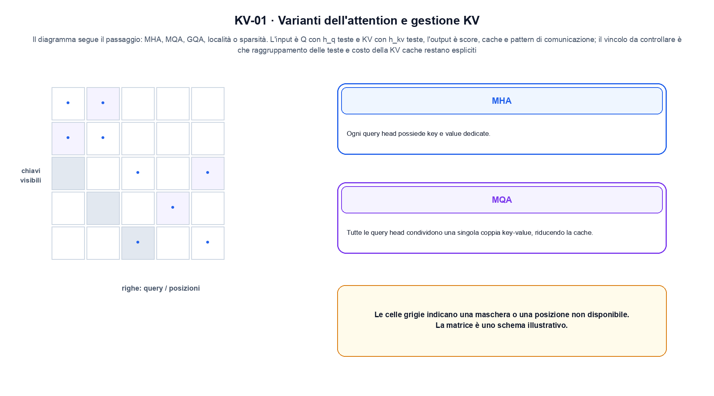
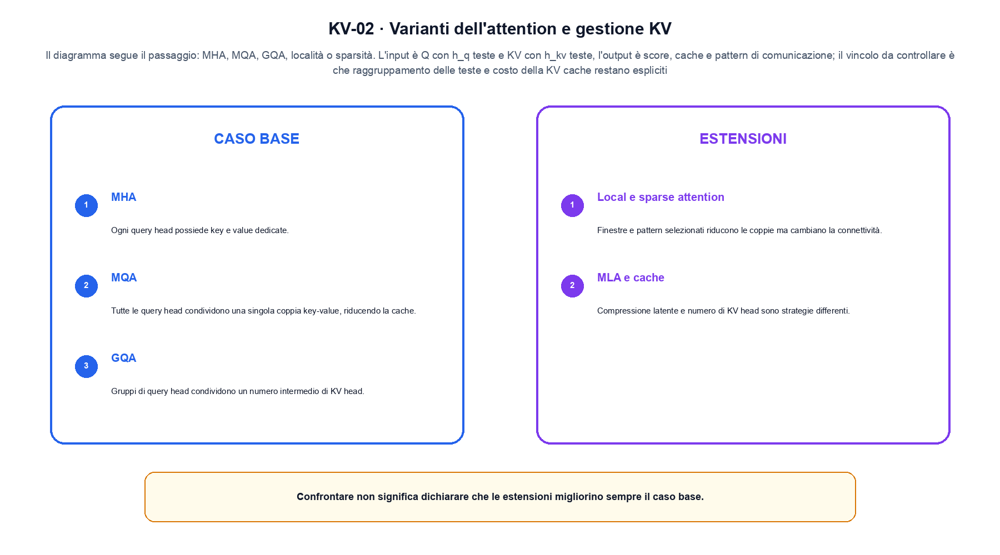

<!--
chapter_id: CH-P08-ATTENTION-KV
part_id: P08
order_key: 390
title: Varianti dell'attention e gestione KV
maturity: CORE
status: candidatura completa in revisione autoriale
version: 0.4.0-draft2
last_source_check: 3 agosto 2026
environment: Python 3.13.12, CPU
deferred: benchmark applicativi, varianti non necessarie al contratto centrale e approvazione autoriale
-->

# Capitolo 39. Varianti dell'attention e gestione KV

Una frase plausibile non basta a spiegare varianti dell'attention e gestione kv. L'oggetto è le teste di query e key-value che alimentano l'attention; riprendiamo la richiesta «Il pacco non è arrivato» come contesto comune, partiamo da un input piccolo, rendiamo visibile l'operazione e fissiamo che cosa non possiamo concludere.

## MHA

Ogni query head possiede key e value dedicate. [SRC-39-001]

Per capire «MHA» partiamo da questo caso: un caso minimo con input Q con h_q teste e KV con h_kv teste e output «score, cache e pattern di comunicazione». Il caso rende osservabile il punto centrale: «Ogni query head possiede key e value dedicate».

Nel contratto locale, l'input «Q con h_q teste e KV con h_kv teste» entra, l'operazione «MHA, MQA, GQA, località o sparsità» modifica il percorso e l'output «score, cache e pattern di comunicazione» è ciò che osserviamo. Qui cambia soprattutto il passaggio «MHA»; resta da controllare che raggruppamento delle teste e costo della KV cache restano espliciti. La domanda locale è «Ogni query head possiede key e value dedicate».

L'attention determina quali coppie di posizioni possono contribuire e come vengono organizzate key e value. Il numero di head, il pattern di visibilità e la cache cambiano memoria e connettività, non soltanto il nome del blocco. Per «MHA» il controllo cambia una sola premessa della frase «Ogni query head possiede key e value dedicate» e conserva input, output e criterio di successo, così la differenza resta attribuibile. La verifica resta ancorata a «Ogni query head possiede key e value dedicate». [SRC-39-001]

La lettura va fatta in ordine: prima il caso, poi la trasformazione, quindi la conseguenza. Il piccolo risultato resta un'illustrazione di «Ogni query head possiede key e value dedicate», non una promessa generale.

Per verificare «MHA» cambiamo una sola condizione vicina alla frase «Ogni query head possiede key e value dedicate», teniamo fermo il resto e registriamo l'output «score, cache e pattern di comunicazione». Il caso negativo deve rendere riconoscibile la failure, non soltanto produrre un numero diverso. La sezione successiva, «MQA», riceve l'output «score, cache e pattern di comunicazione» come base, ma dovrà formulare e verificare la propria distinzione.

## MQA

Tutte le query head condividono una singola coppia key-value, riducendo la cache. [SRC-39-002]

Il caso minimo di «MQA» si presenta così: quattro query head condividono due KV head. Non lo usiamo come decorazione: serve a rendere osservabile la frase «Tutte le query head condividono una singola coppia key-value, riducendo la cache».

La sezione usa l'input «Q con h_q teste e KV con h_kv teste» come punto di partenza e l'output «score, cache e pattern di comunicazione» come traccia d'uscita. La trasformazione concreta è «MHA, MQA, GQA, località o sparsità»; il caso non è completo se non dichiariamo anche che raggruppamento delle teste e costo della KV cache restano espliciti. La condizione da isolare è «Tutte le query head condividono una singola coppia key-value, riducendo la cache».

L'attention determina quali coppie di posizioni possono contribuire e come vengono organizzate key e value. Il numero di head, il pattern di visibilità e la cache cambiano memoria e connettività, non soltanto il nome del blocco. Per «MQA» il controllo cambia una sola premessa della frase «Tutte le query head condividono una singola coppia key-value, riducendo la cache» e conserva input, output e criterio di successo, così la differenza resta attribuibile. La verifica resta ancorata a «Tutte le query head condividono una singola coppia key-value, riducendo la cache». [SRC-39-002]

Se cambiamo una premessa, dobbiamo riaprire l'interpretazione. Per «MQA» conserviamo l'osservazione collegata a «Tutte le query head condividono una singola coppia key-value, riducendo la cache» e lasciamo esplicitamente fuori ciò che non è stato misurato.

Il controllo minimo di «MQA» confronta il caso dichiarato con una variazione che rompe la sua ipotesi. Se la failure non è distinguibile dall'esito valido, manca un'osservazione nel contratto di ordine, posizione e memoria contestuale. Da «MQA» portiamo l'output «score, cache e pattern di comunicazione»; non portiamo invece una conclusione oltre il caso locale.

La figura KV-01 usa la famiglia matrix. Il diagramma segue il passaggio: MHA, MQA, GQA, località o sparsità. L'input è Q con h_q teste e KV con h_kv teste, l'output è score, cache e pattern di comunicazione; il vincolo da controllare è che raggruppamento delle teste e costo della KV cache restano espliciti.

## GQA

Gruppi di query head condividono un numero intermedio di KV head. [SRC-39-003]

Prima del nome tecnico fissiamo la situazione: consideriamo un caso in cui raggruppamento delle teste e costo della KV cache restano espliciti. Da qui possiamo leggere la conseguenza dichiarata da «Gruppi di query head condividono un numero intermedio di KV head».

Per ricostruire «GQA» annotiamo l'input «Q con h_q teste e KV con h_kv teste», poi l'operazione «MHA, MQA, GQA, località o sparsità», infine l'output «score, cache e pattern di comunicazione». Questa sequenza impedisce di scambiare una forma compatibile per il comportamento descritto dalla fonte. Il controllo parte da «Gruppi di query head condividono un numero intermedio di KV head».

L'attention determina quali coppie di posizioni possono contribuire e come vengono organizzate key e value. Il numero di head, il pattern di visibilità e la cache cambiano memoria e connettività, non soltanto il nome del blocco. Per «GQA» il controllo cambia una sola premessa della frase «Gruppi di query head condividono un numero intermedio di KV head» e conserva input, output e criterio di successo, così la differenza resta attribuibile. La verifica resta ancorata a «Gruppi di query head condividono un numero intermedio di KV head». [SRC-39-003]

Il punto didattico di «GQA» è separare ciò che la fonte afferma da ciò che il piccolo caso illustra. L'output «score, cache e pattern di comunicazione» mostra il contratto locale, ma non sostituisce una misura sul sistema completo.

La prova di «GQA» conserva input, operazione e output; poi esplicita quale parte di «Gruppi di query head condividono un numero intermedio di KV head» non è stata misurata. Così il test separa l'evidenza dall'inferenza. Il passaggio successivo, «Local e sparse attention», potrà cambiare una sola condizione, dichiarando il nuovo setup prima di interpretare il risultato.

## Local e sparse attention

Finestre e pattern selezionati riducono le coppie ma cambiano la connettività. [SRC-39-004]

Per capire «Local e sparse attention» partiamo da questo caso: un blocco viene confrontato a parità di input e shape. Il vantaggio dichiarato resta un'ipotesi finché non viene misurato sullo stesso setup. Il caso rende osservabile il punto centrale: «Finestre e pattern selezionati riducono le coppie ma cambiano la connettività».

Nel contratto locale, l'input «Q con h_q teste e KV con h_kv teste» entra, l'operazione «MHA, MQA, GQA, località o sparsità» modifica il percorso e l'output «score, cache e pattern di comunicazione» è ciò che osserviamo. Qui cambia soprattutto il passaggio «Local e sparse attention»; resta da controllare che raggruppamento delle teste e costo della KV cache restano espliciti. La domanda locale è «Finestre e pattern selezionati riducono le coppie ma cambiano la connettività».

L'attention determina quali coppie di posizioni possono contribuire e come vengono organizzate key e value. Il numero di head, il pattern di visibilità e la cache cambiano memoria e connettività, non soltanto il nome del blocco. La variabile da isolare è il pattern di visibilità o di riuso: la stessa shape può corrispondere a dipendenze e costi diversi. La verifica resta ancorata a «Finestre e pattern selezionati riducono le coppie ma cambiano la connettività». [SRC-39-004]

La lettura va fatta in ordine: prima il caso, poi la trasformazione, quindi la conseguenza. Il piccolo risultato resta un'illustrazione di «Finestre e pattern selezionati riducono le coppie ma cambiano la connettività», non una promessa generale.

Per verificare «Local e sparse attention» cambiamo una sola condizione vicina alla frase «Finestre e pattern selezionati riducono le coppie ma cambiano la connettività», teniamo fermo il resto e registriamo l'output «score, cache e pattern di comunicazione». Il caso negativo deve rendere riconoscibile la failure, non soltanto produrre un numero diverso. La sezione successiva, «MLA e cache», riceve l'output «score, cache e pattern di comunicazione» come base, ma dovrà formulare e verificare la propria distinzione.

## MLA e cache

Compressione latente e numero di KV head sono strategie differenti. La memoria dipende anche da layer, dtype, batch e lunghezza. [SRC-39-001]

Il caso minimo di «MLA e cache» si presenta così: un prefill che scrive key e value e un decode che aggiunge una sola posizione senza ricomputare il prefisso. Non lo usiamo come decorazione: serve a rendere osservabile la frase «Compressione latente e numero di KV head sono strategie differenti».

La sezione usa l'input «Q con h_q teste e KV con h_kv teste» come punto di partenza e l'output «score, cache e pattern di comunicazione» come traccia d'uscita. La trasformazione concreta è «MHA, MQA, GQA, località o sparsità»; il caso non è completo se non dichiariamo anche che raggruppamento delle teste e costo della KV cache restano espliciti. La condizione da isolare è «Compressione latente e numero di KV head sono strategie differenti».

Il passaggio da seguire in «MLA e cache» è quello descritto dalla frase «Compressione latente e numero di KV head sono strategie differenti»: l'esempio rende osservabile la trasformazione, mentre il contratto del capitolo ne delimita l'interpretazione. La variabile da isolare è il pattern di visibilità o di riuso: la stessa shape può corrispondere a dipendenze e costi diversi. La verifica resta ancorata a «Compressione latente e numero di KV head sono strategie differenti». [SRC-39-001]

Se cambiamo una premessa, dobbiamo riaprire l'interpretazione. Per «MLA e cache» conserviamo l'osservazione collegata a «Compressione latente e numero di KV head sono strategie differenti» e lasciamo esplicitamente fuori ciò che non è stato misurato.

Il controllo minimo di «MLA e cache» confronta il caso dichiarato con una variazione che rompe la sua ipotesi. Se la failure non è distinguibile dall'esito valido, manca un'osservazione nel contratto di ordine, posizione e memoria contestuale. La conclusione resta ancorata al protocollo osservato, non al nome della tecnica.

## Una traiettoria controllata: MHA

Il caso intero parte dall'input «Q con h_q teste e KV con h_kv teste», applica l'operazione «MHA, MQA, GQA, località o sparsità» e osserva l'output «score, cache e pattern di comunicazione». Un esempio controllato: quattro query head condividono due KV head. La formula locale è:

$$
M = softmax(Q K^T / sqrt(d_k)) V
$$

Numero di KV head e pattern di attenzione cambiano memoria e connettività. [SRC-39-001]

La figura KV-02 cambia composizione rispetto alla prima. Il diagramma segue il passaggio: MHA, MQA, GQA, località o sparsità. L'input è Q con h_q teste e KV con h_kv teste, l'output è score, cache e pattern di comunicazione; il vincolo da controllare è che raggruppamento delle teste e costo della KV cache restano espliciti.

## Il passaggio eseguito in Python: MQA

Nel run Python rendiamo osservabile la frase «Ogni query head possiede key e value dedicate» con valori piccoli e leggibili. Il test associato verifica determinismo, output e rifiuto di una condizione incoerente; il file di output `code/outputs/SNIP-39-001.txt` documenta il caso senza pretendere una misura generale.

## Prima di generalizzare: MLA e cache

Il meccanismo di «Varianti dell'attention e gestione KV» non garantisce da solo che il sistema funzioni fuori dal caso guida. Raggruppamento delle teste e costo della kv cache restano espliciti. Il limite osservato riguarda la frase «Ogni query head possiede key e value dedicate»; per trasferire il concetto occorre riaprire la verifica quando cambiano dati, scala o ambiente.

## Dalla lezione al capitolo seguente: Varianti dell'attention e gestione KV

Il percorso ha tenuto insieme le teste di query e key-value che alimentano l'attention, l'operazione «MHA, MQA, GQA, località o sparsità» e l'output «score, cache e pattern di comunicazione». Le sezioni «MHA», «MQA», «MLA e cache» mostrano come il protocollo osservato delimiti ciò che il capitolo può sostenere. L'invariante da portare avanti è: raggruppamento delle teste e costo della KV cache restano espliciti. Il Capitolo 40, Attention hardware-aware, può partire da questo output e dichiarare la propria domanda.

### Domande per ricostruire il percorso: MHA

1. Ricostruisci l'oggetto continuo a partire da «MHA» e indica quale parte della frase «Ogni query head possiede key e value dedicate» entra nel caso.
2. Spiega quale trasformazione collega «MHA» a «MLA e cache» e quale output osserviamo nel passaggio.
3. Usa lo snippet per controllare l'invariante del contratto: raggruppamento delle teste e costo della KV cache restano espliciti.
4. Separa una definizione sostenuta da una fonte, un esempio illustrativo e un risultato locale del caso guida.
5. Indica quale parte della frase «Compressione latente e numero di KV head sono strategie differenti» richiederebbe una misura nuova prima di essere estesa oltre il caso osservato.

### Esercizi sul failure mode: MLA e cache

1. Racconta «MHA» come una trasformazione: che cosa entra e che cosa esce?
2. Confronta due esecuzioni di «MQA» mantenendo il resto del setup invariato.
3. Per «GQA», separa l'esempio locale dal limite che impedisce di generalizzarlo.
4. Progetta una prova per «Local e sparse attention» che renda visibile il suo confine.
5. Scrivi una metrica o una domanda per valutare «MLA e cache» senza confondere livelli diversi.

## Dossier delle fonti e materiali: Varianti dell'attention e gestione KV

Per «Varianti dell'attention e gestione KV», le fonti portanti, i limiti dei claim e la data di consultazione sono raccolti in `FONTI_PRIMARIE.md`; la ricerca riguarda soprattutto ordine, posizione e memoria contestuale. `CLAIMS.md` separa definizioni e risultati locali; codice, ambiente, test e output sono nella cartella `code/`, con attenzione a ordine, posizione e memoria contestuale.
