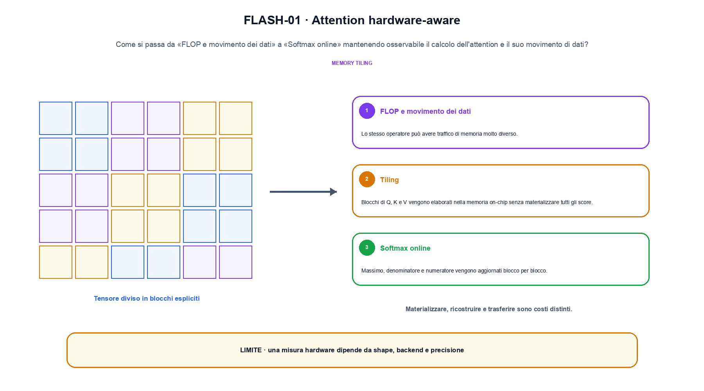
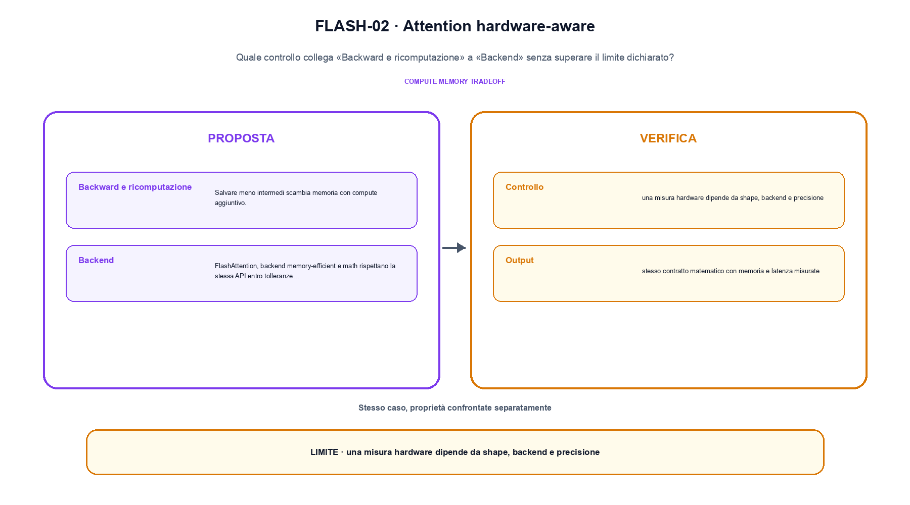

<!--
chapter_id: CH-P08-HARDWARE-AWARE-ATTENTION
part_id: P08
order_key: 400
title: Attention hardware-aware
maturity: ESTABLISHED
status: revisione editoriale v2, approvazione autoriale aperta
version: 0.5.0-draft3
last_source_check: 4 agosto 2026
environment: Python 3.13.12, CPU
code_policy: reference
deferred: benchmark applicativi non eseguiti e approvazione autoriale delle visuali
-->

# Capitolo 40. Attention hardware-aware

La domanda guida di questa lezione è come collegare «FLOP e movimento dei dati» e «Backend» senza perdere il contratto tecnico di attention hardware-aware. L'oggetto osservato è il calcolo dell'attention e il suo movimento di dati. Il contratto locale è: input, tile di Q, K, V, dtype e device; operazione, tiling, softmax online e ricomputazione; output, stesso contratto matematico con memoria e latenza misurate. Il caso guida è questo: Un caso minimo con input tile di Q, K, V, dtype e device e output «stesso contratto matematico con memoria e latenza misurate». Il confine da mantenere esplicito è: una misura hardware dipende da shape, backend e precisione.

## FLOP e movimento dei dati

Lo stesso operatore può avere traffico di memoria molto diverso. [SRC-40-001]

Il tiling cambia il movimento dei dati senza cambiare automaticamente il contratto matematico.

**Caso da seguire.** Un caso minimo con input tile di Q, K, V, dtype e device e output «stesso contratto matematico con memoria e latenza misurate».

**Controllo.** Scrivi il risultato atteso prima del calcolo, modifica una sola quantità e localizza il primo passaggio che cambia. Il vincolo da conservare è: Lo stesso operatore può avere traffico di memoria molto diverso.


## Tiling

Blocchi di Q, K e V vengono elaborati nella memoria on-chip senza materializzare tutti gli score. [SRC-40-002]

**Caso da seguire.** Softmax stabile su due tile con massimo per riga.

**Controllo.** Ricalcola il caso a mano e con lo snippet. Se i risultati divergono, confronta prima i valori intermedi e soltanto dopo l'output finale.




La prima figura segue il percorso da «FLOP e movimento dei dati» a «Softmax online».


## Softmax online

Massimo, denominatore e numeratore vengono aggiornati blocco per blocco. [SRC-40-003]

**Caso da seguire.** Un caso in cui una misura hardware dipende da shape, backend e precisione.

**Controllo.** Aggiungi un valore limite e verifica separatamente forma, valore e ipotesi. Una shape valida non dimostra da sola «Softmax online».


## Backward e ricomputazione

Salvare meno intermedi scambia memoria con compute aggiuntivo. [SRC-40-004]

**Caso da seguire.** Un blocco viene confrontato a parità di input e shape. Il vantaggio dichiarato resta un'ipotesi finché non viene misurato sullo stesso setup.

**Controllo.** Mantieni fisso l'input e sostituisci soltanto il meccanismo discusso nella sezione. Il confronto deve attribuire la differenza a quel passaggio, non al setup.


## Esempio Python eseguito

Il frammento seguente è lo stesso conservato nel repository. Usa valori piccoli perché l'obiettivo è osservare il meccanismo, non simulare una scala che non abbiamo eseguito.

```python
def contract():
    scores = [[1.0, 2.0], [0.0, 3.0]]
    row_maxima = [max(row) for row in scores]
    exp_sums = [sum(math.exp(value - maximum) for value in row) for row, maximum in zip(scores, row_maxima)]
    return {"row_maxima": row_maxima, "exp_sums": [round(value, 6) for value in exp_sums], "invariant": "softmax normalization is stable within each row"}
```

Esecuzione con `python snip_40_contract.py`:

```text
{"exp_sums": [1.367879, 1.049787], "invariant": "softmax normalization is stable within each row", "row_maxima": [2.0, 3.0]}
```

Il test associato è [`code/test_40_contract.py`](code/test_40_contract.py); l'output versionato è [`code/outputs/SNIP-40-001.txt`](code/outputs/SNIP-40-001.txt).


## Backend

FlashAttention, backend memory-efficient e math rispettano la stessa API entro tolleranze numeriche e condizioni diverse. [SRC-40-001]

**Caso da seguire.** Per «Backend» si mantiene l'input del capitolo e si isola questa condizione: FlashAttention, backend memory-efficient e math rispettano la stessa API entro tolleranze numeriche e condizioni diverse.

**Controllo.** Costruisci un controesempio che rispetti il tipo di dato ma violi l'ipotesi centrale. Il test deve rendere riconoscibile perché «Backend» non si applica.




La seconda figura mette a confronto «Backward e ricomputazione» e il limite discusso in «Backend».


## Come si collegano i passaggi

- **Da «FLOP e movimento dei dati» a «Tiling».** Lo stesso operatore può avere traffico di memoria molto diverso. Blocchi di Q, K e V vengono elaborati nella memoria on-chip senza materializzare tutti gli score. Il primo passaggio definisce che cosa entra nel calcolo; il secondo stabilisce la regola che produce il valore osservabile. [SRC-40-001; SRC-40-002]

- **Da «Tiling» a «Softmax online».** Blocchi di Q, K e V vengono elaborati nella memoria on-chip senza materializzare tutti gli score. Massimo, denominatore e numeratore vengono aggiornati blocco per blocco. La regola generale viene poi letta dentro il componente: questa separazione permette di localizzare un errore prima di attribuirlo all'intero modello. [SRC-40-002; SRC-40-003]

- **Da «Softmax online» a «Backward e ricomputazione».** Massimo, denominatore e numeratore vengono aggiornati blocco per blocco. Salvare meno intermedi scambia memoria con compute aggiuntivo. Dopo avere reso visibile il componente, il percorso introduce la variante o l'ottimizzazione senza cambiare di nascosto il caso di partenza. [SRC-40-003; SRC-40-004]

- **Da «Backward e ricomputazione» a «Backend».** Salvare meno intermedi scambia memoria con compute aggiuntivo. FlashAttention, backend memory-efficient e math rispettano la stessa API entro tolleranze numeriche e condizioni diverse. L'ultimo passaggio sposta l'attenzione dal funzionamento locale alla misura: correttezza del calcolo e qualità applicativa restano domande distinte. [SRC-40-004; SRC-40-001]

La catena completa produce stesso contratto matematico con memoria e latenza misurate a partire da tile di Q, K, V, dtype e device. Ogni collegamento conserva un oggetto osservabile diverso; per questo il risultato non può essere esteso oltre il limite dichiarato: una misura hardware dipende da shape, backend e precisione.


## Esercizi sul meccanismo

1. Ricostruisci «FLOP e movimento dei dati» con un esempio diverso da quello mostrato e indica l'output atteso prima del calcolo.
2. Nel passaggio «Tiling», cambia una sola ipotesi e spiega quale risultato non è più confrontabile.
3. Collega «Softmax online» a una riga dello snippet oppure motiva perché la prova deve essere documentale.
4. Progetta un caso limite per «Backward e ricomputazione» che produca una failure riconoscibile.
5. Per «Backend», separa una conclusione sostenuta dal caso locale da una che richiederebbe nuovi dati o un benchmark.


## Che cosa deve restare chiaro

La lezione parte da «tile di Q, K, V, dtype e device» e arriva fino a «stesso contratto matematico con memoria e latenza misurate». Il limite da conservare è questo: una misura hardware dipende da shape, backend e precisione. Definizioni e risultati citati sono rintracciabili in [`FONTI_PRIMARIE.md`](FONTI_PRIMARIE.md); la mappa dei claim è in [`CLAIMS.md`](CLAIMS.md).
