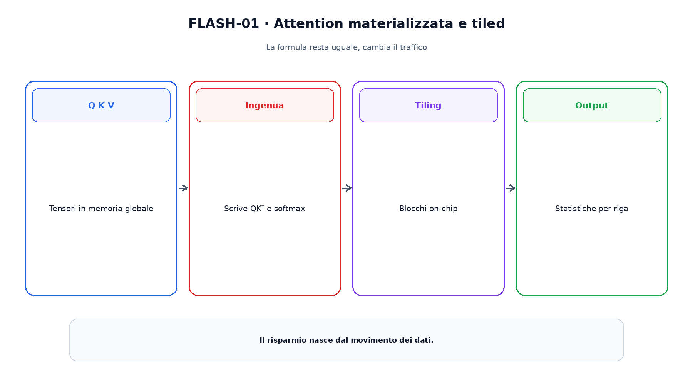
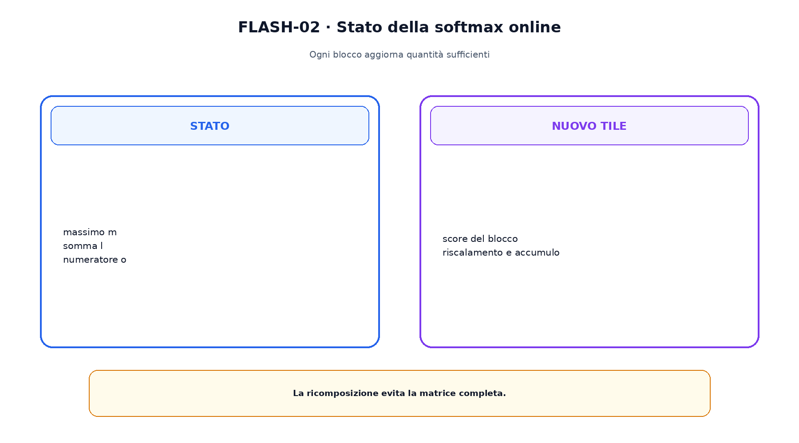

<!--
chapter_id: CH-P08-HARDWARE-AWARE-ATTENTION
part_id: P08
order_key: 400
title: Attention hardware-aware
maturity: ESTABLISHED
status: candidatura completa in revisione autoriale
version: 0.2.0-rc1
last_source_check: 2026-07-31
-->

# Capitolo 40. Attention hardware-aware

Due programmi possono calcolare la stessa attention con costi di memoria differenti. La versione didattica materializza gli score; su sequenze lunghe, scriverli e rileggerli può dominare il tempo. Gli algoritmi hardware-aware cambiano ordine e movimento dei dati mantenendo l'operatore.

## FLOP e IO

Memoria globale e memoria on-chip hanno capacità e banda differenti. Due kernel con gli stessi FLOP possono trasferire quantità diverse di dati.

Il collo di bottiglia va misurato sull'hardware reale.

## Tiling

FlashAttention divide Q, K e V in blocchi che entrano on-chip e attraversa K,V senza scrivere l'intera matrice degli score.

Tile size dipende da hardware, dtype e head dimension.

## Softmax online

Per ogni riga si mantengono massimo, denominatore e numeratore. Quando arriva un massimo maggiore, il contributo precedente viene riscalato.

Queste statistiche sono sufficienti per ricomporre la softmax entro l'aritmetica dichiarata.

La figura attraversa il meccanismo nell'ordine di lettura e mantiene esplicite le dipendenze.

## Backward

Salvare meno intermedi può richiedere ricomputare score nel backward. Il trade-off scambia compute e traffico di memoria.

Dropout, mask e gradienti devono restare coerenti.

## FlashAttention 2 e 3

Le versioni successive migliorano partizione del lavoro e sfruttano caratteristiche hardware specifiche, inclusa Hopper in FlashAttention-3.

I guadagni quantitativi non si trasferiscono automaticamente ad altri dispositivi.

## PyTorch SDPA e FlexAttention

SDPA può selezionare backend flash, memory-efficient o math secondo device e condizioni. FlexAttention descrive score modification e block mask mantenendo kernel specializzati.

API comune non significa identità bitwise tra backend.

Il confronto separa ciò che cambia da ciò che rimane invariato.

## Uno snippet eseguibile

Il file [`code/snip_flash_001.py`](code/snip_flash_001.py) rende osservabile il contratto centrale. I test controllano determinismo, output e invarianti.

## Riepilogo

Attention hardware-aware mantiene l'operatore e cambia l'algoritmo. Tiling e softmax online riducono gli intermedi. Il Capitolo 41 cambia invece la formula usando kernel fattorizzabili.

### Verifica della comprensione

1. Ricostruisci il problema che apre il capitolo.
2. Indica l'operazione centrale e il suo output.
3. Spiega un limite o failure mode.
4. Collega il risultato al capitolo successivo.
5. Modifica una variabile nello snippet e prevedi l'effetto prima di eseguirlo.

## Fonti e materiali verificabili

Fonti, claim, codice, output e audit sono raccolti nei file del capitolo.
