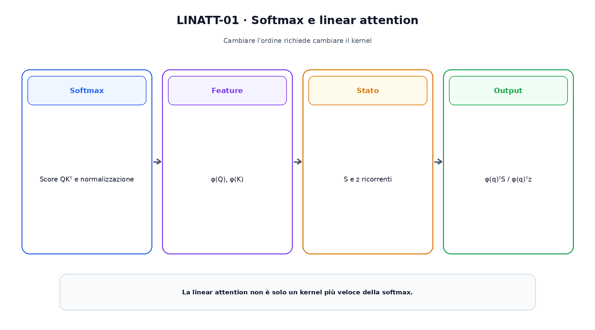
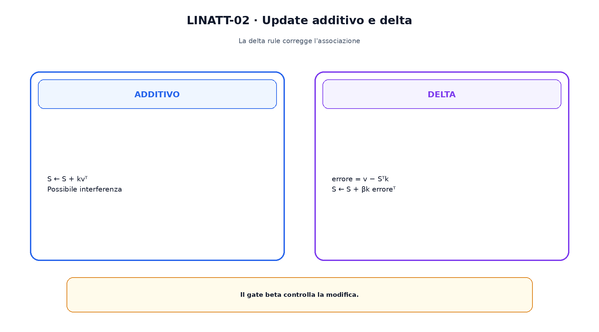

<!--
chapter_id: CH-P08-LINEAR-ATTENTION
part_id: P08
order_key: 410
title: Linear attention, fast weights e delta rule
maturity: ESTABLISHED
status: candidatura completa in revisione autoriale
version: 0.2.0-rc1
last_source_check: 2026-07-31
-->

# Capitolo 41. Linear attention, fast weights e delta rule

FlashAttention esegue meglio la softmax attention, ma non cambia il numero di coppie. La linear attention modifica l'operatore usando feature map fattorizzabili. Produce uno stato compatto, ma non è in generale equivalente alla softmax.

## Kernel fattorizzabile

Sostituendo $\exp(q^Tk)$ con $\phi(q)^T\phi(k)$ possiamo riassociare $\phi(Q)(\phi(K)^TV)$.

La scelta di phi determina positività, capacità e stabilità.

## Forma causale

Manteniamo $S_t=S_{t-1}+\phi(k_t)v_t^T$ e $z_t=z_{t-1}+\phi(k_t)$; l'output è $\phi(q_t)^TS_t/(\phi(q_t)^Tz_t)$.

Lo stato dipende da feature e value, non dalla lunghezza.

## Normalizzazione

Il denominatore controlla la scala. Se diventa vicino a zero servono epsilon e controlli.

Non ogni feature map produce un buon sostituto della softmax.

La figura attraversa il meccanismo nell'ordine di lettura e mantiene esplicite le dipendenze.

## Performer

Performer usa random feature positive per approssimare il kernel softmax. Numero di feature e seed controllano varianza e memoria.

La garanzia è probabilistica e legata al metodo.

## Fast weights

La matrice S può essere letta come memoria associativa aggiornata da coppie key-value.

Aggiornamenti additivi possono interferire quando molte associazioni condividono lo stato.

## Delta rule

La delta rule usa l'errore $v-S^T\phi(k)$ per correggere la memoria. DeltaNet e Gated Delta Networks sviluppano questa idea.

Il gate controlla quanto la nuova associazione modifica lo stato.

Il confronto separa ciò che cambia da ciò che rimane invariato.

## Uno snippet eseguibile

Il file [`code/snip_linatt_001.py`](code/snip_linatt_001.py) rende osservabile il contratto centrale. I test controllano determinismo, output e invarianti.

## Riepilogo

Linear attention riassocia un kernel e mantiene statistiche ricorrenti. Fast weights e delta rule forniscono letture di memoria e correzione. Il Capitolo 42 estende il confronto a SSM, recurrence e long convolution.

### Verifica della comprensione

1. Ricostruisci il problema che apre il capitolo.
2. Indica l'operazione centrale e il suo output.
3. Spiega un limite o failure mode.
4. Collega il risultato al capitolo successivo.
5. Modifica una variabile nello snippet e prevedi l'effetto prima di eseguirlo.

## Fonti e materiali verificabili

Fonti, claim, codice, output e audit sono raccolti nei file del capitolo.
