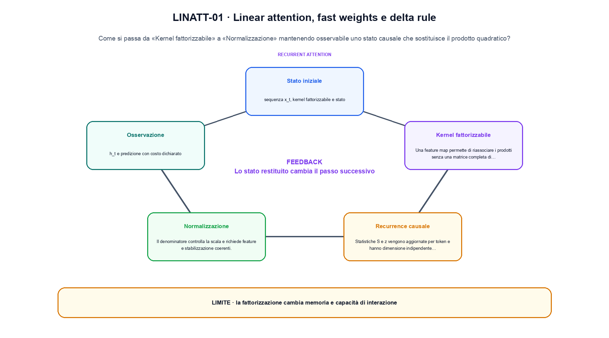
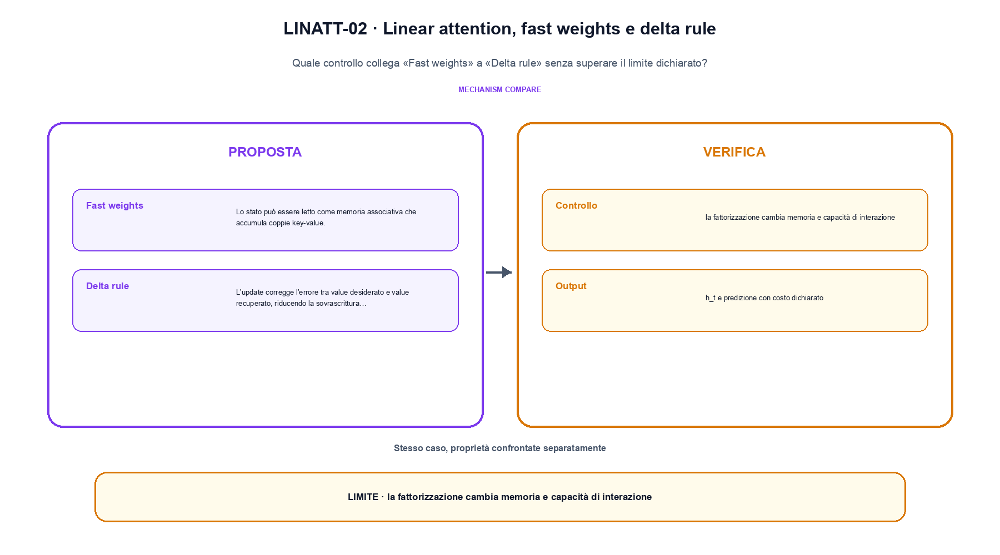

<!--
chapter_id: CH-P08-LINEAR-ATTENTION
part_id: P08
order_key: 410
title: Linear attention, fast weights e delta rule
maturity: ESTABLISHED
status: revisione editoriale v2, approvazione autoriale aperta
version: 0.5.0-draft3
last_source_check: 4 agosto 2026
environment: Python 3.13.12, CPU
code_policy: reference
deferred: benchmark applicativi non eseguiti e approvazione autoriale delle visuali
-->

# Capitolo 41. Linear attention, fast weights e delta rule

La domanda guida di questa lezione è come collegare «Kernel fattorizzabile» e «Delta rule» senza perdere il contratto tecnico di linear attention, fast weights e delta rule. L'oggetto osservato è uno stato causale che sostituisce il prodotto quadratico. Il contratto locale è: input, sequenza x_t, kernel fattorizzabile e stato; operazione, recurrence, normalizzazione e fast weights; output, h_t e predizione con costo dichiarato. Il caso guida è questo: La stessa operazione misurata separando bytes mossi, tempo del kernel e latenza end-to-end. Il confine da mantenere esplicito è: la fattorizzazione cambia memoria e capacità di interazione.

## Kernel fattorizzabile

Una feature map permette di riassociare i prodotti senza una matrice completa di score. [SRC-41-001]

Una forma fattorizzata sostituisce una matrice completa con uno stato aggiornato.

**Caso da seguire.** La stessa operazione misurata separando bytes mossi, tempo del kernel e latenza end-to-end.

**Controllo.** Scrivi il risultato atteso prima del calcolo, modifica una sola quantità e localizza il primo passaggio che cambia. Il vincolo da conservare è: Una feature map permette di riassociare i prodotti senza una matrice completa di score.


## Recurrence causale

Statistiche S e z vengono aggiornate per token e hanno dimensione indipendente dalla lunghezza. [SRC-41-002]

**Caso da seguire.** Una matrice di visibilità in cui la posizione futura resta esclusa anche se la shape dei tensori è compatibile.

**Controllo.** Ricalcola il caso a mano e con lo snippet. Se i risultati divergono, confronta prima i valori intermedi e soltanto dopo l'output finale.


La relazione centrale può essere scritta come:

$$
h_t = h_{t-1} + phi(x_t)
$$

Una forma fattorizzata sostituisce una matrice completa con uno stato aggiornato. [SRC-41-001]




La prima figura segue il percorso da «Kernel fattorizzabile» a «Normalizzazione».


## Normalizzazione

Il denominatore controlla la scala e richiede feature e stabilizzazione coerenti. [SRC-41-003]

**Caso da seguire.** Due vettori con shape compatibile confrontati prima e dopo il blocco, osservando separatamente scala e percorso residuale in «Normalizzazione».

**Controllo.** Aggiungi un valore limite e verifica separatamente forma, valore e ipotesi. Una shape valida non dimostra da sola «Normalizzazione».


## Fast weights

Lo stato può essere letto come memoria associativa che accumula coppie key-value. [SRC-41-004]

**Caso da seguire.** Un blocco viene confrontato a parità di input e shape. Il vantaggio dichiarato resta un'ipotesi finché non viene misurato sullo stesso setup.

**Controllo.** Mantieni fisso l'input e sostituisci soltanto il meccanismo discusso nella sezione. Il confronto deve attribuire la differenza a quel passaggio, non al setup.


## Esempio Python eseguito

Il frammento seguente è lo stesso conservato nel repository. Usa valori piccoli perché l'obiettivo è osservare il meccanismo, non simulare una scala che non abbiamo eseguito.

```python
def contract():
    state = 0.0
    inputs = [1.0, -0.5, 2.0]
    for value in inputs:
        state = 0.7 * state + 0.3 * value
    return {"state": round(state, 6), "steps": len(inputs), "invariant": "the recurrence reuses one state in input order"}
```

Esecuzione con `python snip_41_contract.py`:

```text
{"invariant": "the recurrence reuses one state in input order", "state": 0.642, "steps": 3}
```

Il test associato è [`code/test_41_contract.py`](code/test_41_contract.py); l'output versionato è [`code/outputs/SNIP-41-001.txt`](code/outputs/SNIP-41-001.txt).


## Delta rule

L'update corregge l'errore tra value desiderato e value recuperato, riducendo la sovrascrittura cieca. [SRC-41-001]

**Caso da seguire.** Per «Delta rule» si mantiene l'input del capitolo e si isola questa condizione: L'update corregge l'errore tra value desiderato e value recuperato, riducendo la sovrascrittura cieca.

**Controllo.** Costruisci un controesempio che rispetti il tipo di dato ma violi l'ipotesi centrale. Il test deve rendere riconoscibile perché «Delta rule» non si applica.




La seconda figura mette a confronto «Fast weights» e il limite discusso in «Delta rule».


## Come si collegano i passaggi

- **Da «Kernel fattorizzabile» a «Recurrence causale».** Una feature map permette di riassociare i prodotti senza una matrice completa di score. Statistiche S e z vengono aggiornate per token e hanno dimensione indipendente dalla lunghezza. Il primo passaggio definisce che cosa entra nel calcolo; il secondo stabilisce la regola che produce il valore osservabile. [SRC-41-001; SRC-41-002]

- **Da «Recurrence causale» a «Normalizzazione».** Statistiche S e z vengono aggiornate per token e hanno dimensione indipendente dalla lunghezza. Il denominatore controlla la scala e richiede feature e stabilizzazione coerenti. La regola generale viene poi letta dentro il componente: questa separazione permette di localizzare un errore prima di attribuirlo all'intero modello. [SRC-41-002; SRC-41-003]

- **Da «Normalizzazione» a «Fast weights».** Il denominatore controlla la scala e richiede feature e stabilizzazione coerenti. Lo stato può essere letto come memoria associativa che accumula coppie key-value. Dopo avere reso visibile il componente, il percorso introduce la variante o l'ottimizzazione senza cambiare di nascosto il caso di partenza. [SRC-41-003; SRC-41-004]

- **Da «Fast weights» a «Delta rule».** Lo stato può essere letto come memoria associativa che accumula coppie key-value. L'update corregge l'errore tra value desiderato e value recuperato, riducendo la sovrascrittura cieca. L'ultimo passaggio sposta l'attenzione dal funzionamento locale alla misura: correttezza del calcolo e qualità applicativa restano domande distinte. [SRC-41-004; SRC-41-001]

La catena completa produce h_t e predizione con costo dichiarato a partire da sequenza x_t, kernel fattorizzabile e stato. Ogni collegamento conserva un oggetto osservabile diverso; per questo il risultato non può essere esteso oltre il limite dichiarato: la fattorizzazione cambia memoria e capacità di interazione.


## Esercizi sul meccanismo

1. Ricostruisci «Kernel fattorizzabile» con un esempio diverso da quello mostrato e indica l'output atteso prima del calcolo.
2. Nel passaggio «Recurrence causale», cambia una sola ipotesi e spiega quale risultato non è più confrontabile.
3. Collega «Normalizzazione» a una riga dello snippet oppure motiva perché la prova deve essere documentale.
4. Progetta un caso limite per «Fast weights» che produca una failure riconoscibile.
5. Per «Delta rule», separa una conclusione sostenuta dal caso locale da una che richiederebbe nuovi dati o un benchmark.


## Che cosa deve restare chiaro

La lezione parte da «sequenza x_t, kernel fattorizzabile e stato» e arriva fino a «h_t e predizione con costo dichiarato». Il limite da conservare è questo: la fattorizzazione cambia memoria e capacità di interazione. Definizioni e risultati citati sono rintracciabili in [`FONTI_PRIMARIE.md`](FONTI_PRIMARIE.md); la mappa dei claim è in [`CLAIMS.md`](CLAIMS.md).
