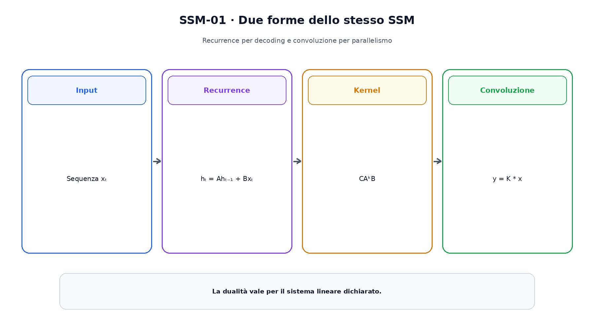
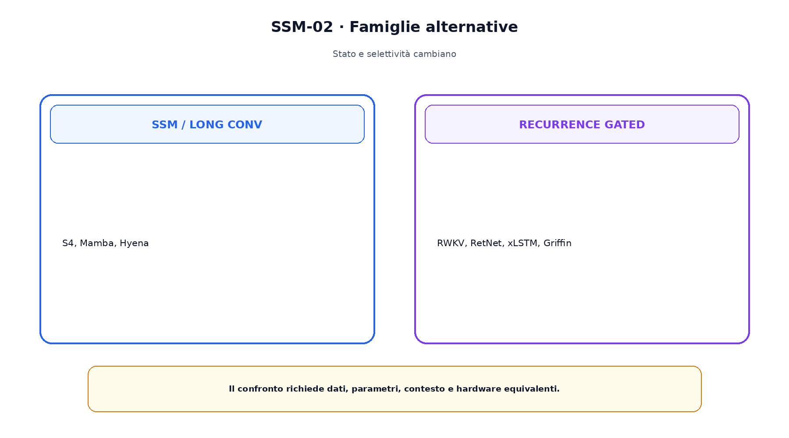

<!--
chapter_id: CH-P08-SEQUENCE-ALTERNATIVES
part_id: P08
order_key: 420
title: State-space model, recurrence e long convolution
maturity: ESTABLISHED
status: candidatura completa in revisione autoriale
version: 0.2.0-rc1
last_source_check: 2026-07-31
-->

# Capitolo 42. State-space model, recurrence e long convolution

State-space model, recurrence gated e long convolution costruiscono dipendenze lunghe con stati differenti. Il confronto deve distinguere training parallelo, decoding ricorrente, selettività e hardware.

## Sistema lineare di stato

$h_t=Ah_{t-1}+Bx_t$ e $y_t=Ch_t+Dx_t$. La dinamica lineare ammette una forma convoluzionale con kernel derivato da A, B e C.

La recurrence è naturale nel decoding; la convoluzione nel training parallelo.

## S4

S4 usa una parametrizzazione strutturata dello stato e calcola kernel lunghi in modo efficiente.

La struttura di A è parte del metodo e non equivale a una RNN generica.

## Mamba e Mamba-2

Mamba rende parametri selettivi dipendenti dall'input e usa una scan hardware-aware. Mamba-2 collega la famiglia alla Structured State Space Duality.

La selettività rompe la semplice convoluzione tempo-invariante.

La figura attraversa il meccanismo nell'ordine di lettura e mantiene esplicite le dipendenze.

## Hyena

Hyena usa convoluzioni lunghe implicite, gate e proiezioni per collegare posizioni distanti.

Il kernel condiviso possiede una selettività diversa dall'attention.

## Recurrence moderne

RWKV, RetNet e xLSTM propongono aggiornamenti ricorrenti e forme parallele con equazioni e stabilizzazioni differenti.

L'etichetta recurrent non definisce una architettura unica.

## Griffin

Griffin combina gated linear recurrence e local attention. La finestra offre confronti precisi vicini; lo stato trasporta informazione oltre la finestra.

Questo apre il tema delle architetture ibride del Capitolo 43.

Il confronto separa ciò che cambia da ciò che rimane invariato.

## Uno snippet eseguibile

Il file [`code/snip_ssm_001.py`](code/snip_ssm_001.py) rende osservabile il contratto centrale. I test controllano determinismo, output e invarianti.

## Riepilogo

SSM e recurrence mantengono uno stato compatto; alcune forme ammettono convoluzione parallela, altre selettività. Il Capitolo 43 combina percorsi e introduce memoria interna esplicita.

### Verifica della comprensione

1. Ricostruisci il problema che apre il capitolo.
2. Indica l'operazione centrale e il suo output.
3. Spiega un limite o failure mode.
4. Collega il risultato al capitolo successivo.
5. Modifica una variabile nello snippet e prevedi l'effetto prima di eseguirlo.

## Fonti e materiali verificabili

Fonti, claim, codice, output e audit sono raccolti nei file del capitolo.
