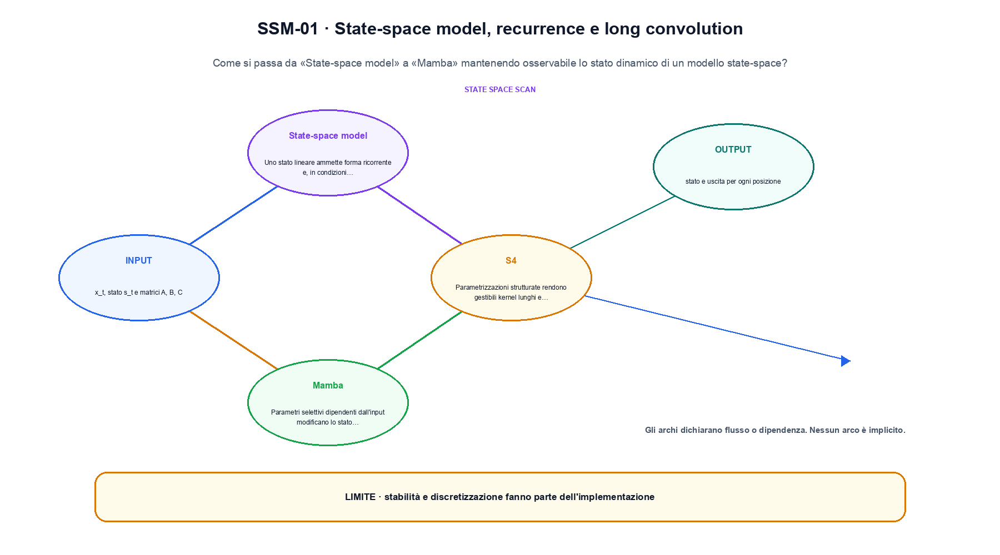
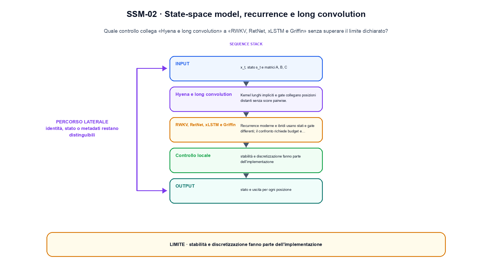

<!--
chapter_id: CH-P08-SEQUENCE-ALTERNATIVES
part_id: P08
order_key: 420
title: State-space model, recurrence e long convolution
maturity: ESTABLISHED
status: revisione editoriale v2, approvazione autoriale aperta
version: 0.5.0-draft3
last_source_check: 4 agosto 2026
environment: Python 3.13.12, CPU
code_policy: reference
deferred: benchmark applicativi non eseguiti e approvazione autoriale delle visuali
-->

# Capitolo 42. State-space model, recurrence e long convolution

La domanda guida di questa lezione è come collegare «State-space model» e «RWKV, RetNet, xLSTM e Griffin» senza perdere il contratto tecnico di state-space model, recurrence e long convolution. L'oggetto osservato è lo stato dinamico di un modello state-space. Il contratto locale è: input, x_t, stato s_t e matrici A, B, C; operazione, recurrence, convolutione lunga o selezione; output, stato e uscita per ogni posizione. Il caso guida è questo: Un caso minimo con input x_t, stato s_t e matrici A, B, C e output «stato e uscita per ogni posizione». Il confine da mantenere esplicito è: stabilità e discretizzazione fanno parte dell'implementazione.

## State-space model

Uno stato lineare ammette forma ricorrente e, in condizioni tempo-invarianti, forma convoluzionale. [SRC-42-001]

La ricorrenza espone stato, input e dinamica prima della scelta implementativa.

**Caso da seguire.** Un caso minimo con input x_t, stato s_t e matrici A, B, C e output «stato e uscita per ogni posizione».

**Controllo.** Scrivi il risultato atteso prima del calcolo, modifica una sola quantità e localizza il primo passaggio che cambia. Il vincolo da conservare è: Uno stato lineare ammette forma ricorrente e, in condizioni tempo-invarianti, forma convoluzionale.


## S4

Parametrizzazioni strutturate rendono gestibili kernel lunghi e dinamiche stabili. [SRC-42-002]

**Caso da seguire.** Tre passi di una dinamica lineare con stato osservabile.

**Controllo.** Ricalcola il caso a mano e con lo snippet. Se i risultati divergono, confronta prima i valori intermedi e soltanto dopo l'output finale.


La relazione centrale può essere scritta come:

$$
x_{t+1} = A x_t + B u_t
$$

La ricorrenza espone stato, input e dinamica prima della scelta implementativa. [SRC-42-001]




La prima figura segue il percorso da «State-space model» a «Mamba».


## Mamba

Parametri selettivi dipendenti dall'input modificano lo stato mediante una scan hardware-aware. [SRC-42-003]

**Caso da seguire.** Un caso in cui stabilità e discretizzazione fanno parte dell'implementazione.

**Controllo.** Aggiungi un valore limite e verifica separatamente forma, valore e ipotesi. Una shape valida non dimostra da sola «Mamba».


## Hyena e long convolution

Kernel lunghi impliciti e gate collegano posizioni distanti senza score pairwise. [SRC-42-004]

**Caso da seguire.** Una griglia 3x3 e un kernel 2x2 in cui una sola posizione dell'output viene calcolata a mano.

**Controllo.** Mantieni fisso l'input e sostituisci soltanto il meccanismo discusso nella sezione. Il confronto deve attribuire la differenza a quel passaggio, non al setup.


## Esempio Python eseguito

Il frammento seguente è lo stesso conservato nel repository. Usa valori piccoli perché l'obiettivo è osservare il meccanismo, non simulare una scala che non abbiamo eseguito.

```python
def contract():
    state = 0.0
    inputs = [1.0, 0.0, -1.0]
    outputs = []
    for value in inputs:
        state = 0.8 * state + 0.4 * value
        outputs.append(round(state, 6))
    return {"outputs": outputs, "invariant": "the state update is explicit before each emitted value"}
```

Esecuzione con `python snip_42_contract.py`:

```text
{"invariant": "the state update is explicit before each emitted value", "outputs": [0.4, 0.32, -0.144]}
```

Il test associato è [`code/test_42_contract.py`](code/test_42_contract.py); l'output versionato è [`code/outputs/SNIP-42-001.txt`](code/outputs/SNIP-42-001.txt).


## RWKV, RetNet, xLSTM e Griffin

Recurrence moderne e ibridi usano stati e gate differenti; il confronto richiede budget e hardware equivalenti. [SRC-42-001]

**Caso da seguire.** Tre passi in cui lo stato precedente viene consumato prima di produrre il successivo.

**Controllo.** Costruisci un controesempio che rispetti il tipo di dato ma violi l'ipotesi centrale. Il test deve rendere riconoscibile perché «RWKV, RetNet, xLSTM e Griffin» non si applica.




La seconda figura mette a confronto «Hyena e long convolution» e il limite discusso in «RWKV, RetNet, xLSTM e Griffin».


## Come si collegano i passaggi

- **Da «State-space model» a «S4».** Uno stato lineare ammette forma ricorrente e, in condizioni tempo-invarianti, forma convoluzionale. Parametrizzazioni strutturate rendono gestibili kernel lunghi e dinamiche stabili. Il primo passaggio definisce che cosa entra nel calcolo; il secondo stabilisce la regola che produce il valore osservabile. [SRC-42-001; SRC-42-002]

- **Da «S4» a «Mamba».** Parametrizzazioni strutturate rendono gestibili kernel lunghi e dinamiche stabili. Parametri selettivi dipendenti dall'input modificano lo stato mediante una scan hardware-aware. La regola generale viene poi letta dentro il componente: questa separazione permette di localizzare un errore prima di attribuirlo all'intero modello. [SRC-42-002; SRC-42-003]

- **Da «Mamba» a «Hyena e long convolution».** Parametri selettivi dipendenti dall'input modificano lo stato mediante una scan hardware-aware. Kernel lunghi impliciti e gate collegano posizioni distanti senza score pairwise. Dopo avere reso visibile il componente, il percorso introduce la variante o l'ottimizzazione senza cambiare di nascosto il caso di partenza. [SRC-42-003; SRC-42-004]

- **Da «Hyena e long convolution» a «RWKV, RetNet, xLSTM e Griffin».** Kernel lunghi impliciti e gate collegano posizioni distanti senza score pairwise. Recurrence moderne e ibridi usano stati e gate differenti; il confronto richiede budget e hardware equivalenti. L'ultimo passaggio sposta l'attenzione dal funzionamento locale alla misura: correttezza del calcolo e qualità applicativa restano domande distinte. [SRC-42-004; SRC-42-001]

La catena completa produce stato e uscita per ogni posizione a partire da x_t, stato s_t e matrici A, B, C. Ogni collegamento conserva un oggetto osservabile diverso; per questo il risultato non può essere esteso oltre il limite dichiarato: stabilità e discretizzazione fanno parte dell'implementazione.


## Esercizi sul meccanismo

1. Ricostruisci «State-space model» con un esempio diverso da quello mostrato e indica l'output atteso prima del calcolo.
2. Nel passaggio «S4», cambia una sola ipotesi e spiega quale risultato non è più confrontabile.
3. Collega «Mamba» a una riga dello snippet oppure motiva perché la prova deve essere documentale.
4. Progetta un caso limite per «Hyena e long convolution» che produca una failure riconoscibile.
5. Per «RWKV, RetNet, xLSTM e Griffin», separa una conclusione sostenuta dal caso locale da una che richiederebbe nuovi dati o un benchmark.


## Che cosa deve restare chiaro

La lezione parte da «x_t, stato s_t e matrici A, B, C» e arriva fino a «stato e uscita per ogni posizione». Il limite da conservare è questo: stabilità e discretizzazione fanno parte dell'implementazione. Definizioni e risultati citati sono rintracciabili in [`FONTI_PRIMARIE.md`](FONTI_PRIMARIE.md); la mappa dei claim è in [`CLAIMS.md`](CLAIMS.md).
