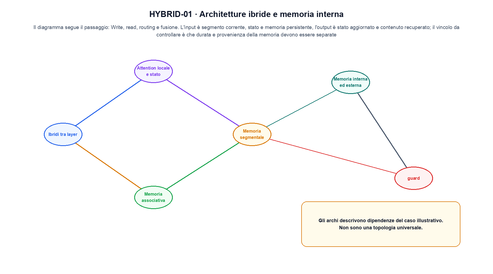
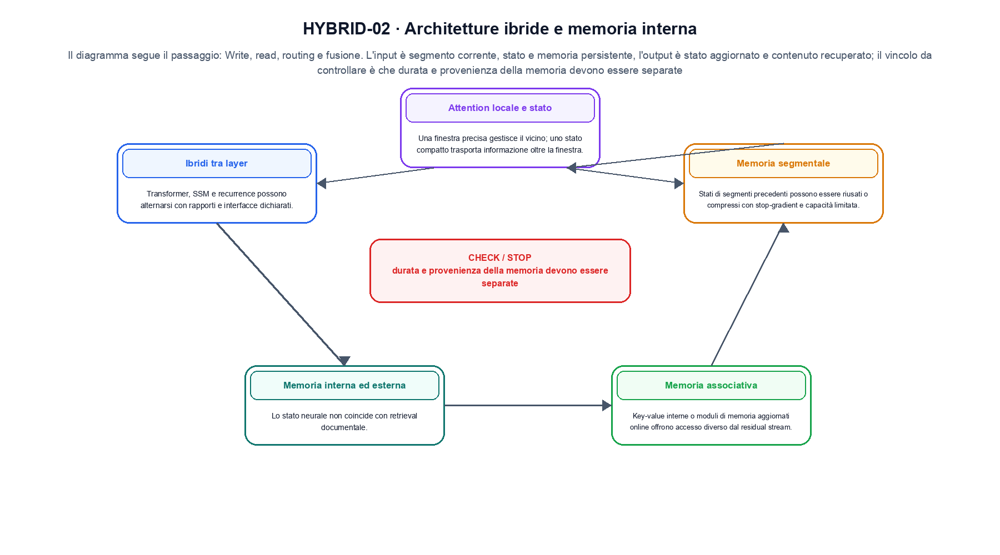

<!--
chapter_id: CH-P08-HYBRID-MEMORY
part_id: P08
order_key: 430
title: Architetture ibride e memoria interna
maturity: ESTABLISHED
status: candidatura completa in revisione autoriale
version: 0.4.0-draft2
last_source_check: 3 agosto 2026
environment: Python 3.13.12, CPU
deferred: benchmark applicativi, varianti non necessarie al contratto centrale e approvazione autoriale
-->

# Capitolo 43. Architetture ibride e memoria interna

La richiesta «Il pacco non è arrivato» resta il caso guida. In questo capitolo la usiamo per distinguere informazione distribuita tra attenzione locale e memoria, trasformazione e risultato, senza nascondere i dettagli tecnici.

## Ibridi tra layer

Transformer, SSM e recurrence possono alternarsi con rapporti e interfacce dichiarati. [SRC-43-001]

Il caso minimo di «Ibridi tra layer» si presenta così: due vettori con shape compatibile confrontati prima e dopo il blocco, osservando separatamente scala e percorso residuale in «Ibridi tra layer». Non lo usiamo come decorazione: serve a rendere osservabile la frase «Transformer, SSM e recurrence possono alternarsi con rapporti e interfacce dichiarati».

Per ricostruire «Ibridi tra layer» annotiamo l'input «segmento corrente, stato e memoria persistente», poi l'operazione «write, read, routing e fusione», infine l'output «stato aggiornato e contenuto recuperato». Questa sequenza impedisce di scambiare una forma compatibile per il comportamento descritto dalla fonte. Il controllo parte da «Transformer, SSM e recurrence possono alternarsi con rapporti e interfacce dichiarati».

Il passaggio da seguire in «Ibridi tra layer» è quello descritto dalla frase «Transformer, SSM e recurrence possono alternarsi con rapporti e interfacce dichiarati»: l'esempio rende osservabile la trasformazione, mentre il contratto del capitolo ne delimita l'interpretazione. Per «Ibridi tra layer» il controllo cambia una sola premessa della frase «Transformer, SSM e recurrence possono alternarsi con rapporti e interfacce dichiarati» e conserva input, output e criterio di successo, così la differenza resta attribuibile. La verifica resta ancorata a «Transformer, SSM e recurrence possono alternarsi con rapporti e interfacce dichiarati». [SRC-43-001]

Il punto didattico di «Ibridi tra layer» è separare ciò che la fonte afferma da ciò che il piccolo caso illustra. L'output «stato aggiornato e contenuto recuperato» mostra il contratto locale, ma non sostituisce una misura sul sistema completo.

Il controllo minimo di «Ibridi tra layer» confronta il caso dichiarato con una variazione che rompe la sua ipotesi. Se la failure non è distinguibile dall'esito valido, manca un'osservazione nel contratto di ordine, posizione e memoria contestuale. Da «Ibridi tra layer» portiamo l'output «stato aggiornato e contenuto recuperato»; non portiamo invece una conclusione oltre il caso locale.

## Attention locale e stato

Una finestra precisa gestisce il vicino; uno stato compatto trasporta informazione oltre la finestra. [SRC-43-002]

Prima del nome tecnico fissiamo la situazione: consideriamo un fatto stabile e due elementi recenti con letture diverse. Da qui possiamo leggere la conseguenza dichiarata da «Una finestra precisa gestisce il vicino; uno stato compatto trasporta informazione oltre la finestra».

Nel contratto locale, l'input «segmento corrente, stato e memoria persistente» entra, l'operazione «write, read, routing e fusione» modifica il percorso e l'output «stato aggiornato e contenuto recuperato» è ciò che osserviamo. Qui cambia soprattutto il passaggio «Attention locale e stato»; resta da controllare che durata e provenienza della memoria devono essere separate. La domanda locale è «Una finestra precisa gestisce il vicino; uno stato compatto trasporta informazione oltre la finestra».

L'attention determina quali coppie di posizioni possono contribuire e come vengono organizzate key e value. Il numero di head, il pattern di visibilità e la cache cambiano memoria e connettività, non soltanto il nome del blocco. La variabile da isolare è il pattern di visibilità o di riuso: la stessa shape può corrispondere a dipendenze e costi diversi. La verifica resta ancorata a «Una finestra precisa gestisce il vicino; uno stato compatto trasporta informazione oltre la finestra». [SRC-43-002]

La lettura va fatta in ordine: prima il caso, poi la trasformazione, quindi la conseguenza. Il piccolo risultato resta un'illustrazione di «Una finestra precisa gestisce il vicino; uno stato compatto trasporta informazione oltre la finestra», non una promessa generale.

La prova di «Attention locale e stato» conserva input, operazione e output; poi esplicita quale parte di «Una finestra precisa gestisce il vicino; uno stato compatto trasporta informazione oltre la finestra» non è stata misurata. Così il test separa l'evidenza dall'inferenza. Il passaggio successivo, «Memoria segmentale», potrà cambiare una sola condizione, dichiarando il nuovo setup prima di interpretare il risultato.

## Memoria segmentale

Stati di segmenti precedenti possono essere riusati o compressi con stop-gradient e capacità limitata. [SRC-43-003]

Per capire «Memoria segmentale» partiamo da questo caso: una query confrontata con tre documenti, conservando ranking, chunk entrati nel contesto e risposta finale. Il caso rende osservabile il punto centrale: «Stati di segmenti precedenti possono essere riusati o compressi con stop-gradient e capacità limitata».

La sezione usa l'input «segmento corrente, stato e memoria persistente» come punto di partenza e l'output «stato aggiornato e contenuto recuperato» come traccia d'uscita. La trasformazione concreta è «write, read, routing e fusione»; il caso non è completo se non dichiariamo anche che durata e provenienza della memoria devono essere separate. La condizione da isolare è «Stati di segmenti precedenti possono essere riusati o compressi con stop-gradient e capacità limitata».

La pipeline separa query, ranking, contesto recuperato e risposta. Un errore può nascere nel recupero, nella selezione del contesto o nella generazione, quindi la provenienza va conservata a ogni passaggio. La prova conserva ranking, segmenti entrati nel contesto e risposta, così un errore di recupero non viene attribuito alla generazione. La verifica resta ancorata a «Stati di segmenti precedenti possono essere riusati o compressi con stop-gradient e capacità limitata». [SRC-43-003]

Se cambiamo una premessa, dobbiamo riaprire l'interpretazione. Per «Memoria segmentale» conserviamo l'osservazione collegata a «Stati di segmenti precedenti possono essere riusati o compressi con stop-gradient e capacità limitata» e lasciamo esplicitamente fuori ciò che non è stato misurato.

Per verificare «Memoria segmentale» cambiamo una sola condizione vicina alla frase «Stati di segmenti precedenti possono essere riusati o compressi con stop-gradient e capacità limitata», teniamo fermo il resto e registriamo l'output «stato aggiornato e contenuto recuperato». Il caso negativo deve rendere riconoscibile la failure, non soltanto produrre un numero diverso. La sezione successiva, «Memoria associativa», riceve l'output «stato aggiornato e contenuto recuperato» come base, ma dovrà formulare e verificare la propria distinzione.

La figura HYBRID-01 usa la famiglia graph. Il diagramma segue il passaggio: Write, read, routing e fusione. L'input è segmento corrente, stato e memoria persistente, l'output è stato aggiornato e contenuto recuperato; il vincolo da controllare è che durata e provenienza della memoria devono essere separate.

## Memoria associativa

Key-value interne o moduli di memoria aggiornati online offrono accesso diverso dal residual stream. [SRC-43-004]

Il caso minimo di «Memoria associativa» si presenta così: una query confrontata con tre documenti, conservando ranking, chunk entrati nel contesto e risposta finale. Non lo usiamo come decorazione: serve a rendere osservabile la frase «Key-value interne o moduli di memoria aggiornati online offrono accesso diverso dal residual stream».

Per ricostruire «Memoria associativa» annotiamo l'input «segmento corrente, stato e memoria persistente», poi l'operazione «write, read, routing e fusione», infine l'output «stato aggiornato e contenuto recuperato». Questa sequenza impedisce di scambiare una forma compatibile per il comportamento descritto dalla fonte. Il controllo parte da «Key-value interne o moduli di memoria aggiornati online offrono accesso diverso dal residual stream».

La pipeline separa query, ranking, contesto recuperato e risposta. Un errore può nascere nel recupero, nella selezione del contesto o nella generazione, quindi la provenienza va conservata a ogni passaggio. La prova conserva ranking, segmenti entrati nel contesto e risposta, così un errore di recupero non viene attribuito alla generazione. La verifica resta ancorata a «Key-value interne o moduli di memoria aggiornati online offrono accesso diverso dal residual stream». [SRC-43-004]

Il punto didattico di «Memoria associativa» è separare ciò che la fonte afferma da ciò che il piccolo caso illustra. L'output «stato aggiornato e contenuto recuperato» mostra il contratto locale, ma non sostituisce una misura sul sistema completo.

Il controllo minimo di «Memoria associativa» confronta il caso dichiarato con una variazione che rompe la sua ipotesi. Se la failure non è distinguibile dall'esito valido, manca un'osservazione nel contratto di ordine, posizione e memoria contestuale. Da «Memoria associativa» portiamo l'output «stato aggiornato e contenuto recuperato»; non portiamo invece una conclusione oltre il caso locale.

## Memoria interna ed esterna

Lo stato neurale non coincide con retrieval documentale. Reset, isolamento e provenienza hanno contratti differenti. [SRC-43-001]

Prima del nome tecnico fissiamo la situazione: consideriamo una query confrontata con tre documenti, conservando ranking, chunk entrati nel contesto e risposta finale. Da qui possiamo leggere la conseguenza dichiarata da «Lo stato neurale non coincide con retrieval documentale».

Nel contratto locale, l'input «segmento corrente, stato e memoria persistente» entra, l'operazione «write, read, routing e fusione» modifica il percorso e l'output «stato aggiornato e contenuto recuperato» è ciò che osserviamo. Qui cambia soprattutto il passaggio «Memoria interna ed esterna»; resta da controllare che durata e provenienza della memoria devono essere separate. La domanda locale è «Lo stato neurale non coincide con retrieval documentale».

La pipeline separa query, ranking, contesto recuperato e risposta. Un errore può nascere nel recupero, nella selezione del contesto o nella generazione, quindi la provenienza va conservata a ogni passaggio. La prova conserva ranking, segmenti entrati nel contesto e risposta, così un errore di recupero non viene attribuito alla generazione. La verifica resta ancorata a «Lo stato neurale non coincide con retrieval documentale». [SRC-43-001]

La lettura va fatta in ordine: prima il caso, poi la trasformazione, quindi la conseguenza. Reset, isolamento e provenienza hanno contratti differenti. Il piccolo risultato resta un'illustrazione di «Lo stato neurale non coincide con retrieval documentale», non una promessa generale.

La prova di «Memoria interna ed esterna» conserva input, operazione e output; poi esplicita quale parte di «Lo stato neurale non coincide con retrieval documentale» non è stata misurata. Così il test separa l'evidenza dall'inferenza. Il caso finale consegna l'output «stato aggiornato e contenuto recuperato» come evidenza locale e conserva il vincolo che impedisce di leggere il futuro come domanda aperta.

## Una traiettoria controllata: Ibridi tra layer

Il caso intero parte dall'input «segmento corrente, stato e memoria persistente», applica l'operazione «write, read, routing e fusione» e osserva l'output «stato aggiornato e contenuto recuperato». Un esempio controllato: un fatto stabile e due elementi recenti con letture diverse. La formula locale è:

$$
h' = read(write(h, segment))
$$

Memoria locale, stato e memoria esterna hanno letture e durate differenti. [SRC-43-001]

La figura HYBRID-02 cambia composizione rispetto alla prima. Il diagramma segue il passaggio: Write, read, routing e fusione. L'input è segmento corrente, stato e memoria persistente, l'output è stato aggiornato e contenuto recuperato; il vincolo da controllare è che durata e provenienza della memoria devono essere separate.

## Il passaggio eseguito in Python: Attention locale e stato

Il file `code/snip_43_contract.py` collega il contratto del capitolo alla frase «Lo stato neurale non coincide con retrieval documentale». Il test controlla l'invariante, la risposta valida e il caso negativo; `code/outputs/SNIP-43-001.txt` conserva il risultato ripetibile del caso locale.

## Prima di generalizzare: Memoria interna ed esterna

Il meccanismo di «Architetture ibride e memoria interna» resta legato al contratto locale. Durata e provenienza della memoria devono essere separate. Prima di generalizzare la frase «Lo stato neurale non coincide con retrieval documentale», servono un nuovo setup, un protocollo dichiarato e una misura ripetibile.

## Dalla lezione al capitolo seguente: Architetture ibride e memoria interna

Abbiamo seguito informazione distribuita tra attenzione locale e memoria, partendo dall'input «segmento corrente, stato e memoria persistente» e arrivando all'output «stato aggiornato e contenuto recuperato». Le sezioni «Ibridi tra layer», «Attention locale e stato», «Memoria interna ed esterna» hanno isolato le proprie frasi chiave senza confondere il meccanismo con il risultato applicativo. L'invariante da portare avanti è: durata e provenienza della memoria devono essere separate. Il Capitolo 44, Mixture of Experts e calcolo condizionale, può partire da questo output e dichiarare la propria domanda.

### Domande per ricostruire il percorso: Ibridi tra layer

1. Ricostruisci l'oggetto continuo a partire da «Ibridi tra layer» e indica quale parte della frase «Transformer, SSM e recurrence possono alternarsi con rapporti e interfacce dichiarati» entra nel caso.
2. Spiega quale trasformazione collega «Ibridi tra layer» a «Memoria interna ed esterna» e quale output osserviamo nel passaggio.
3. Usa lo snippet per controllare l'invariante del contratto: durata e provenienza della memoria devono essere separate.
4. Separa una definizione sostenuta da una fonte, un esempio illustrativo e un risultato locale del caso guida.
5. Indica quale parte della frase «Lo stato neurale non coincide con retrieval documentale» richiederebbe una misura nuova prima di essere estesa oltre il caso osservato.

### Esercizi sul failure mode: Memoria interna ed esterna

1. Ricostruisci «Ibridi tra layer» senza usare il nome della tecnica, soltanto con input, operazione e output.
2. Sostituisci una condizione di «Attention locale e stato» e prevedi che cosa non dovrebbe cambiare.
3. Cerca un controesempio per «Memoria segmentale» e annota quale ipotesi viene rotta.
4. Trasforma il limite di «Memoria associativa» in un test ripetibile.
5. Spiega come trasferire «Memoria interna ed esterna» senza portare con sé una promessa non misurata.

## Dossier delle fonti e materiali: Architetture ibride e memoria interna

Il dossier di «Architetture ibride e memoria interna» in `FONTI_PRIMARIE.md` separa definizioni, risultati e la storia disponibile a ogni passo; la data di consultazione è registrata accanto ai riferimenti. `CLAIMS.md` separa definizioni e risultati locali; codice, ambiente, test e output sono nella cartella `code/`, con attenzione a ordine, posizione e memoria contestuale.
