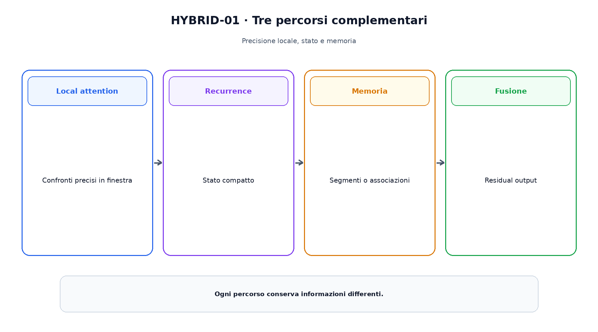
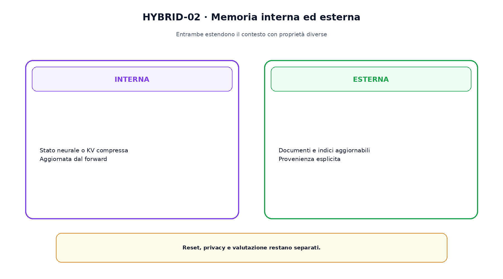

<!--
chapter_id: CH-P08-HYBRID-MEMORY
part_id: P08
order_key: 430
title: Architetture ibride e memoria interna
maturity: ESTABLISHED
status: candidatura completa in revisione autoriale
version: 0.2.0-rc1
last_source_check: 2026-07-31
-->

# Capitolo 43. Architetture ibride e memoria interna

Le architetture ibride combinano operatori complementari. Attention può selezionare contenuto; recurrence mantiene stato; una memoria compressa estende il passato. Qui memoria indica stato interno al forward, non database esterni.

## Ibridi per layer o head

Un modello può alternare layer Transformer e Mamba, come Jamba, oppure combinare percorsi nello stesso blocco.

Il rapporto tra layer non basta: servono dimensioni, residual e routing.

## Local attention più recurrence

Griffin usa local attention e gated linear recurrence. La finestra gestisce confronti vicini, lo stato trasporta una compressione del passato.

Lo stato non conserva ogni token in forma fedele.

## Memoria segmentale

Transformer-XL riusa stati di segmenti precedenti; Compressive Transformer aggiunge una memoria compressa per rappresentazioni più vecchie.

Stop-gradient, lunghezza e compressione determinano ciò che resta disponibile.

La figura attraversa il meccanismo nell'ordine di lettura e mantiene esplicite le dipendenze.

## Memoria associativa

Memorizing Transformers aggiunge coppie key-value consultate con nearest neighbor; Infini-attention combina attention locale e memoria compressiva online.

Reset e isolamento diventano parte del contratto.

## Titans

Titans esplora moduli di memoria neurale aggiornati durante l'uso con un segnale di sorpresa. Il lavoro resta FRONTIER e va letto nel setup dichiarato.

Aggiornare stato al test time non equivale sempre a modificare permanentemente tutti i pesi.

## Interna ed esterna

Memoria interna è aggiornata dal modello e spesso non espone documenti leggibili. Retrieval esterno restituisce artefatti aggiornabili e può conservare provenienza.

Le due forme possono coesistere e richiedono audit differenti.

Il confronto separa ciò che cambia da ciò che rimane invariato.

## Uno snippet eseguibile

Il file [`code/snip_hybrid_001.py`](code/snip_hybrid_001.py) rende osservabile il contratto centrale. I test controllano determinismo, output e invarianti.

## Riepilogo

Le architetture ibride combinano attention, recurrence, SSM e memoria. Capacità, reset e isolamento sono proprietà operative. Il Capitolo 44 attiverà invece soltanto una parte dei parametri con Mixture of Experts.

### Verifica della comprensione

1. Ricostruisci il problema che apre il capitolo.
2. Indica l'operazione centrale e il suo output.
3. Spiega un limite o failure mode.
4. Collega il risultato al capitolo successivo.
5. Modifica una variabile nello snippet e prevedi l'effetto prima di eseguirlo.

## Fonti e materiali verificabili

Fonti, claim, codice, output e audit sono raccolti nei file del capitolo.
