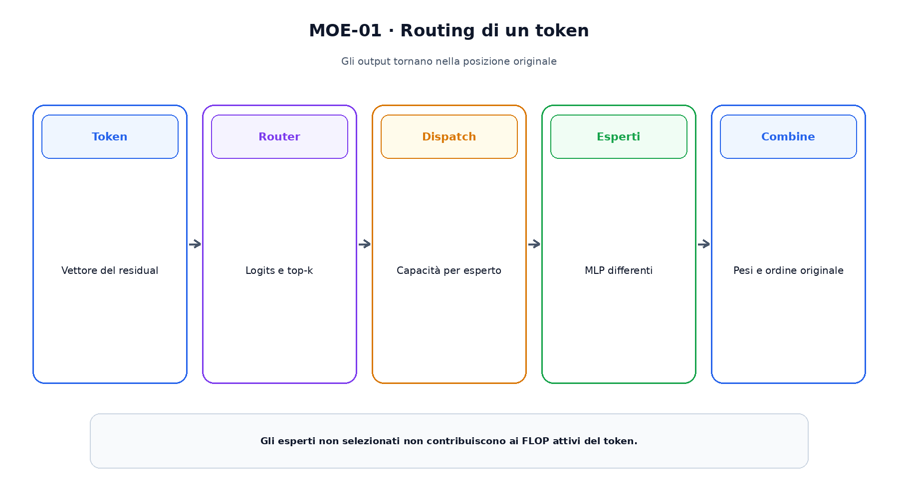
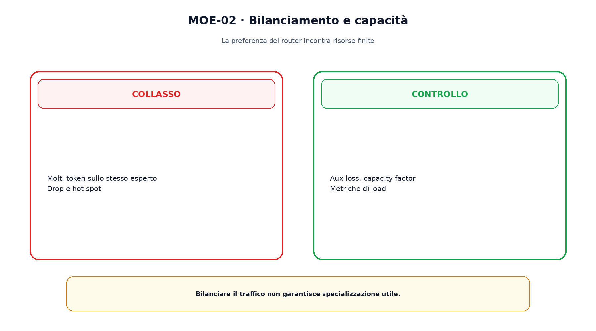

<!--
chapter_id: CH-P08-MOE-CONDITIONAL
part_id: P08
order_key: 440
title: Mixture of Experts e calcolo condizionale
maturity: CORE
status: candidatura completa in revisione autoriale
version: 0.2.0-rc1
last_source_check: 2026-07-31
-->

# Capitolo 44. Mixture of Experts e calcolo condizionale

Una Mixture of Experts aumenta i parametri totali senza attivarli tutti per token. Un router sceglie pochi esperti, spesso nel feed-forward. Parametri totali, attivi, FLOP e memoria non coincidono.

## Router e top-k

Il router produce logits sugli esperti e top-k seleziona i percorsi: $y=\sum_{e\in TopK}p_eE_e(x)$.

Top-1 e top-2 hanno calcolo e robustezza differenti.

## Capacità

Ogni esperto riceve un numero massimo di token. Se il limite viene superato, il sistema può scartare, deviare o aumentare capacità.

Il capacity factor scambia memoria e token dropping.

## Load balancing

Loss ausiliarie incoraggiano una distribuzione più uniforme usando probabilità del router e frazioni di token.

Bilanciare troppo può ostacolare la specializzazione; troppo poco crea hot spot.

La figura attraversa il meccanismo nell'ordine di lettura e mantiene esplicite le dipendenze.

## Expert parallelism

Gli esperti sono distribuiti tra dispositivi e i token viaggiano con all-to-all communication.

Un MoE con pochi FLOP attivi può essere limitato dalla rete.

## Varianti

Expert Choice lascia che gli esperti selezionino token; DeepSeekMoE usa esperti più granulari e shared experts.

Queste forme cambiano direzione della scelta e capacità, non sono semplici valori di top-k.

## Sparse decoder

Mixtral usa top-2 routing nei blocchi MoE e distingue parametri totali e attivi.

Il confronto con un dense model richiede FLOP, dati, memoria e serving dichiarati.

Il confronto separa ciò che cambia da ciò che rimane invariato.

## Uno snippet eseguibile

Il file [`code/snip_moe_001.py`](code/snip_moe_001.py) rende osservabile il contratto centrale. I test controllano determinismo, output e invarianti.

## Riepilogo

Un MoE usa routing condizionale. Capacità, load balancing e comunicazione determinano quali token vengono elaborati. Il Capitolo 45 chiude la parte architetturale cambiando unità e obiettivo di predizione.

### Verifica della comprensione

1. Ricostruisci il problema che apre il capitolo.
2. Indica l'operazione centrale e il suo output.
3. Spiega un limite o failure mode.
4. Collega il risultato al capitolo successivo.
5. Modifica una variabile nello snippet e prevedi l'effetto prima di eseguirlo.

## Fonti e materiali verificabili

Fonti, claim, codice, output e audit sono raccolti nei file del capitolo.
