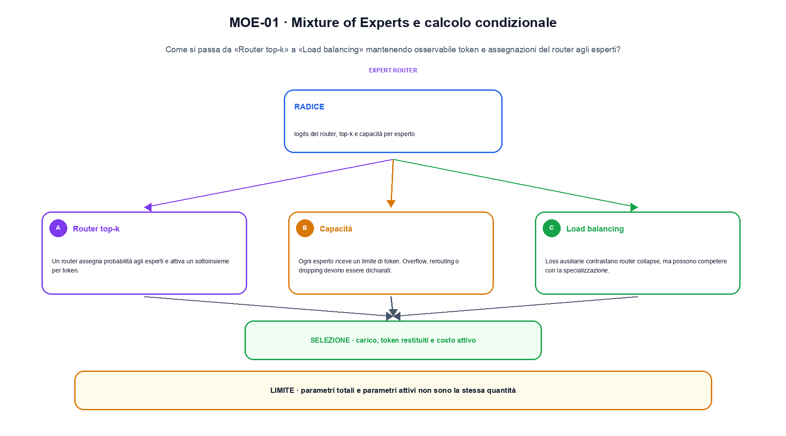
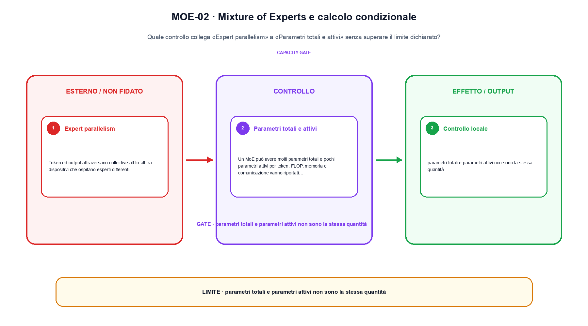

<!--
chapter_id: CH-P08-MOE-CONDITIONAL
part_id: P08
order_key: 440
title: Mixture of Experts e calcolo condizionale
maturity: CORE
status: revisione editoriale v2, approvazione autoriale aperta
version: 0.5.0-draft3
last_source_check: 4 agosto 2026
environment: Python 3.13.12, CPU
code_policy: reference
deferred: benchmark applicativi non eseguiti e approvazione autoriale delle visuali
-->

# Capitolo 44. Mixture of Experts e calcolo condizionale

La domanda guida di questa lezione è come collegare «Router top-k» e «Parametri totali e attivi» senza perdere il contratto tecnico di mixture of experts e calcolo condizionale. L'oggetto osservato è token e assegnazioni del router agli esperti. Il contratto locale è: input, logits del router, top-k e capacità per esperto; operazione, routing, dispatch, expert compute e combine; output, carico, token restituiti e costo attivo. Il caso guida è questo: Un caso minimo con input logits del router, top-k e capacità per esperto e output «carico, token restituiti e costo attivo». Il confine da mantenere esplicito è: parametri totali e parametri attivi non sono la stessa quantità.

## Router top-k

Un router assegna probabilità agli esperti e attiva un sottoinsieme per token. [SRC-44-001]

Il router deve bilanciare carico e capacità senza perdere il contratto dei token.

**Caso da seguire.** Un caso minimo con input logits del router, top-k e capacità per esperto e output «carico, token restituiti e costo attivo».

**Controllo.** Scrivi il risultato atteso prima del calcolo, modifica una sola quantità e localizza il primo passaggio che cambia. Il vincolo da conservare è: Un router assegna probabilità agli esperti e attiva un sottoinsieme per token.


## Capacità

Ogni esperto riceve un limite di token. Overflow, rerouting o dropping devono essere dichiarati. [SRC-44-002]

**Caso da seguire.** X=[1,2] passato in una trasformazione affine e poi in una non linearità, con shape e confine espliciti.

**Controllo.** Ricalcola il caso a mano e con lo snippet. Se i risultati divergono, confronta prima i valori intermedi e soltanto dopo l'output finale.


La relazione centrale può essere scritta come:

$$
load_e = sum_i 1[router(i)=e]
$$

Il router deve bilanciare carico e capacità senza perdere il contratto dei token. [SRC-44-001]




La prima figura segue il percorso da «Router top-k» a «Load balancing».


## Load balancing

Loss ausiliarie contrastano router collapse, ma possono competere con la specializzazione. [SRC-44-003]

**Caso da seguire.** Un caso in cui parametri totali e parametri attivi non sono la stessa quantità.

**Controllo.** Aggiungi un valore limite e verifica separatamente forma, valore e ipotesi. Una shape valida non dimostra da sola «Load balancing».


## Expert parallelism

Token ed output attraversano collective all-to-all tra dispositivi che ospitano esperti differenti. [SRC-44-004]

**Caso da seguire.** Un blocco viene confrontato a parità di input e shape. Il vantaggio dichiarato resta un'ipotesi finché non viene misurato sullo stesso setup.

**Controllo.** Mantieni fisso l'input e sostituisci soltanto il meccanismo discusso nella sezione. Il confronto deve attribuire la differenza a quel passaggio, non al setup.


## Esempio Python eseguito

Il frammento seguente è lo stesso conservato nel repository. Usa valori piccoli perché l'obiettivo è osservare il meccanismo, non simulare una scala che non abbiamo eseguito.

```python
def contract():
    logits = [0.2, 1.1, 0.7, -0.3]
    top_indices = sorted(range(len(logits)), key=logits.__getitem__, reverse=True)[:2]
    loads = [int(index in top_indices) for index in range(len(logits))]
    return {"selected_experts": top_indices, "loads": loads, "invariant": "top-k routing and capacity accounting are explicit"}
```

Esecuzione con `python snip_44_contract.py`:

```text
{"invariant": "top-k routing and capacity accounting are explicit", "loads": [0, 1, 1, 0], "selected_experts": [1, 2]}
```

Il test associato è [`code/test_44_contract.py`](code/test_44_contract.py); l'output versionato è [`code/outputs/SNIP-44-001.txt`](code/outputs/SNIP-44-001.txt).


## Parametri totali e attivi

Un MoE può avere molti parametri totali e pochi parametri attivi per token. FLOP, memoria e comunicazione vanno riportati separatamente. [SRC-44-001]

**Caso da seguire.** Per «Parametri totali e attivi» si mantiene l'input del capitolo e si isola questa condizione: Un MoE può avere molti parametri totali e pochi parametri attivi per token.

**Controllo.** Costruisci un controesempio che rispetti il tipo di dato ma violi l'ipotesi centrale. Il test deve rendere riconoscibile perché «Parametri totali e attivi» non si applica.




La seconda figura mette a confronto «Expert parallelism» e il limite discusso in «Parametri totali e attivi».


## Come si collegano i passaggi

- **Da «Router top-k» a «Capacità».** Un router assegna probabilità agli esperti e attiva un sottoinsieme per token. Ogni esperto riceve un limite di token. Il primo passaggio definisce che cosa entra nel calcolo; il secondo stabilisce la regola che produce il valore osservabile. [SRC-44-001; SRC-44-002]

- **Da «Capacità» a «Load balancing».** Ogni esperto riceve un limite di token. Loss ausiliarie contrastano router collapse, ma possono competere con la specializzazione. La regola generale viene poi letta dentro il componente: questa separazione permette di localizzare un errore prima di attribuirlo all'intero modello. [SRC-44-002; SRC-44-003]

- **Da «Load balancing» a «Expert parallelism».** Loss ausiliarie contrastano router collapse, ma possono competere con la specializzazione. Token ed output attraversano collective all-to-all tra dispositivi che ospitano esperti differenti. Dopo avere reso visibile il componente, il percorso introduce la variante o l'ottimizzazione senza cambiare di nascosto il caso di partenza. [SRC-44-003; SRC-44-004]

- **Da «Expert parallelism» a «Parametri totali e attivi».** Token ed output attraversano collective all-to-all tra dispositivi che ospitano esperti differenti. Un MoE può avere molti parametri totali e pochi parametri attivi per token. L'ultimo passaggio sposta l'attenzione dal funzionamento locale alla misura: correttezza del calcolo e qualità applicativa restano domande distinte. [SRC-44-004; SRC-44-001]

La catena completa produce carico, token restituiti e costo attivo a partire da logits del router, top-k e capacità per esperto. Ogni collegamento conserva un oggetto osservabile diverso; per questo il risultato non può essere esteso oltre il limite dichiarato: parametri totali e parametri attivi non sono la stessa quantità.


## Esercizi sul meccanismo

1. Ricostruisci «Router top-k» con un esempio diverso da quello mostrato e indica l'output atteso prima del calcolo.
2. Nel passaggio «Capacità», cambia una sola ipotesi e spiega quale risultato non è più confrontabile.
3. Collega «Load balancing» a una riga dello snippet oppure motiva perché la prova deve essere documentale.
4. Progetta un caso limite per «Expert parallelism» che produca una failure riconoscibile.
5. Per «Parametri totali e attivi», separa una conclusione sostenuta dal caso locale da una che richiederebbe nuovi dati o un benchmark.


## Che cosa deve restare chiaro

La lezione parte da «logits del router, top-k e capacità per esperto» e arriva fino a «carico, token restituiti e costo attivo». Il limite da conservare è questo: parametri totali e parametri attivi non sono la stessa quantità. Definizioni e risultati citati sono rintracciabili in [`FONTI_PRIMARIE.md`](FONTI_PRIMARIE.md); la mappa dei claim è in [`CLAIMS.md`](CLAIMS.md).
