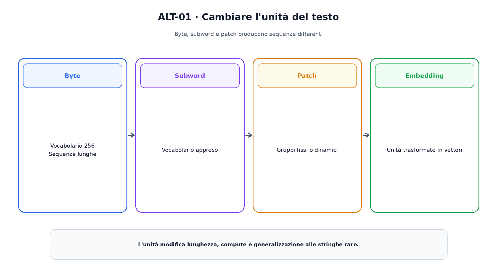
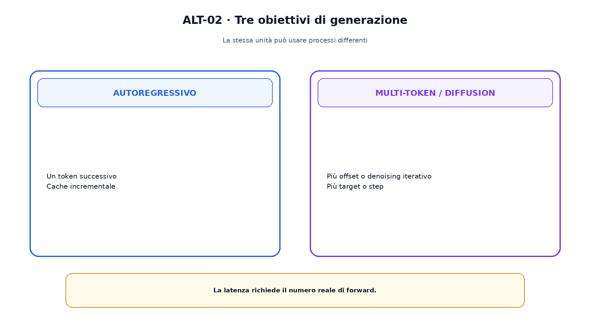

<!--
chapter_id: CH-P08-ALTERNATIVE-PREDICTION
part_id: P08
order_key: 450
title: Byte, predizione multi-token e language diffusion
maturity: FRONTIER
status: candidatura completa in revisione autoriale
version: 0.2.0-rc1
last_source_check: 2026-07-31
-->

# Capitolo 45. Byte, predizione multi-token e language diffusion

I capitoli precedenti hanno assunto token subword e next-token prediction. Possiamo cambiare l'unità di input, predire più posizioni o formulare la generazione come denoising iterativo. Queste alternative risolvono problemi differenti e hanno maturità diverse.

## Byte e caratteri

UTF-8 rappresenta il testo come byte. Il vocabolario è piccolo e copre qualunque sequenza, ma la lunghezza cresce. ByT5 e CANINE studiano setup senza subword tradizionali.

Copertura universale dei byte non implica comprensione uniforme delle lingue.

## Gerarchie di byte

MegaByte divide la sequenza in patch e usa modelli globali e locali. BLT sceglie patch dinamiche secondo la complessità del flusso.

La patch riduce la lunghezza globale ma introduce una seconda struttura.

## Predizione multi-token

Head aggiuntive predicono offset futuri con $L=\sum_k\lambda_kL_k$. Durante l'inference si può conservare la head principale o usare le altre in procedure specifiche.

Il training usa più output e memoria.

La figura attraversa il meccanismo nell'ordine di lettura e mantiene esplicite le dipendenze.

## Diffusion-LM

Diffusion-LM applica rumore e denoising in uno spazio continuo associato ai token.

La discretizzazione finale riporta le rappresentazioni al vocabolario.

## Diffusione discreta

SEDD e masked diffusion definiscono processi su stati discreti o maschere. LLaDA esplora masked diffusion su larga scala.

La famiglia resta FRONTIER rispetto all'autoregressione matura.

## Confronto

Autoregressione possiede cache incrementale e fattorizzazione sinistra-destra. Diffusion può rivedere più posizioni ma richiede uno schedule e più forward.

Non autoregressivo non significa automaticamente più veloce.

Il confronto separa ciò che cambia da ciò che rimane invariato.

## Uno snippet eseguibile

Il file [`code/snip_alt_001.py`](code/snip_alt_001.py) rende osservabile il contratto centrale. I test controllano determinismo, output e invarianti.

## Riepilogo

Byte, subword e patch cambiano l'unità; multi-token e diffusion cambiano l'obiettivo o il processo. La Parte P09 userà modelli preaddestrati e studierà come adattarne il comportamento.

### Verifica della comprensione

1. Ricostruisci il problema che apre il capitolo.
2. Indica l'operazione centrale e il suo output.
3. Spiega un limite o failure mode.
4. Collega il risultato al capitolo successivo.
5. Modifica una variabile nello snippet e prevedi l'effetto prima di eseguirlo.

## Fonti e materiali verificabili

Fonti, claim, codice, output e audit sono raccolti nei file del capitolo.
