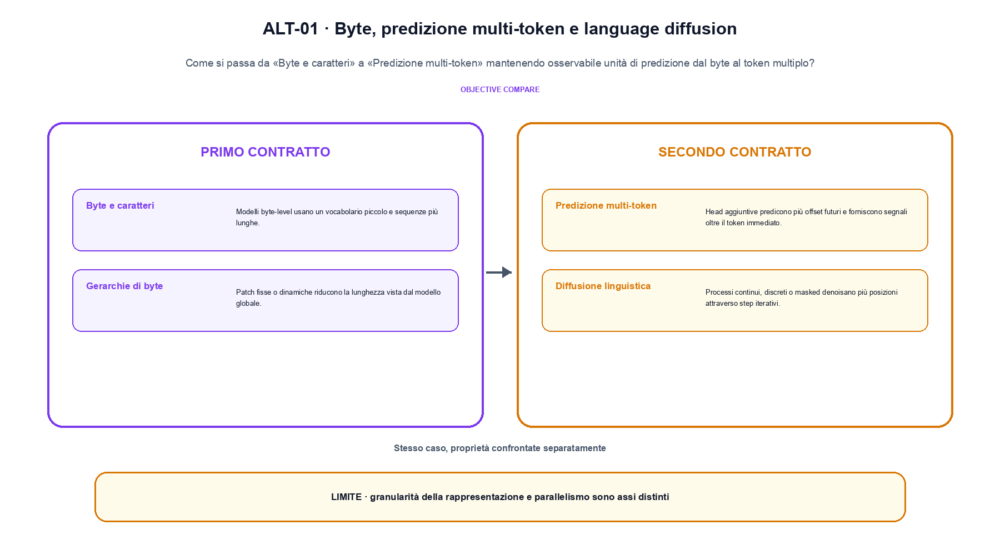
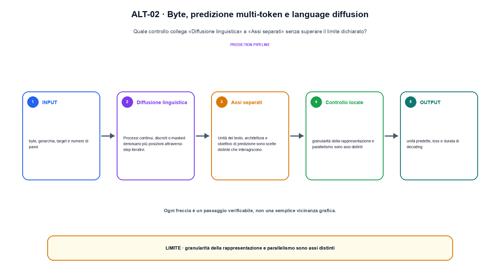

<!--
chapter_id: CH-P08-ALTERNATIVE-PREDICTION
part_id: P08
order_key: 450
title: Byte, predizione multi-token e language diffusion
maturity: FRONTIER
status: revisione editoriale v2, approvazione autoriale aperta
version: 0.5.0-draft3
last_source_check: 4 agosto 2026
environment: Python 3.13.12, CPU
code_policy: reference
deferred: benchmark applicativi non eseguiti e approvazione autoriale delle visuali
-->

# Capitolo 45. Byte, predizione multi-token e language diffusion

La domanda guida di questa lezione è come collegare «Byte e caratteri» e «Assi separati» senza perdere il contratto tecnico di byte, predizione multi-token e language diffusion. L'oggetto osservato è unità di predizione dal byte al token multiplo. Il contratto locale è: input, byte, gerarchia, target e numero di passi; operazione, raggruppamento, multi-token prediction o diffusione discreta; output, unità predette, loss e durata di decoding. Il caso guida è questo: La stessa stringa convertita prima in code point e poi in byte UTF-8, conservando la reversibilità. Il confine da mantenere esplicito è: granularità della rappresentazione e parallelismo sono assi distinti.

## Byte e caratteri

Modelli byte-level usano un vocabolario piccolo e sequenze più lunghe. [SRC-45-001]

Byte, unità gerarchiche e numero di passi sono assi separati del design.

**Caso da seguire.** La stessa stringa convertita prima in code point e poi in byte UTF-8, conservando la reversibilità.

**Controllo.** Classifica lo stesso caso lungo un solo asse alla volta e annota quale proprietà non è stata misurata.


## Gerarchie di byte

Patch fisse o dinamiche riducono la lunghezza vista dal modello globale. [SRC-45-002]

**Caso da seguire.** Per «Gerarchie di byte» si mantiene l'input del capitolo e si isola questa condizione: Patch fisse o dinamiche riducono la lunghezza vista dal modello globale.

**Controllo.** Cambia la proprietà che distingue «Gerarchie di byte» dalle categorie vicine. Se la classificazione non cambia, la distinzione va formulata meglio.


## Predizione multi-token

Head aggiuntive predicono più offset futuri e forniscono segnali oltre il token immediato. [SRC-45-003]

**Caso da seguire.** Un prefisso corto con ID, lunghezza, posizione e output del token successivo dichiarati.

**Controllo.** Confronta un caso positivo e uno di confine usando la medesima definizione; non trasformare l'esempio in una graduatoria generale.




La prima figura segue il percorso da «Byte e caratteri» a «Predizione multi-token».


## Diffusione linguistica

Processi continui, discreti o masked denoisano più posizioni attraverso step iterativi. [SRC-45-004]

**Caso da seguire.** Tre probabilità che sommano a 1 prima del campionamento, distinguendo plausibilità del campione e copertura.

**Controllo.** Indica quale osservazione smentirebbe l'assegnazione del caso a «Diffusione linguistica» e quale invece sarebbe irrilevante.


## Assi separati

Unità del testo, architettura e obiettivo di predizione sono scelte distinte che interagiscono. [SRC-45-001]

**Caso da seguire.** Un messaggio con ruolo, contenuto e maschera che assegna il gradiente soltanto alla risposta.

**Controllo.** Limita la conclusione alla proprietà dichiarata: Unità del testo, architettura e obiettivo di predizione sono scelte distinte che interagiscono. Le dimensioni non osservate restano aperte.


## Esempio Python eseguito

Il frammento seguente è lo stesso conservato nel repository. Usa valori piccoli perché l'obiettivo è osservare il meccanismo, non simulare una scala che non abbiamo eseguito.

```python
def contract():
    payload = "AI"
    encoded = list(payload.encode("utf-8"))
    groups = [encoded[index:index + 2] for index in range(0, len(encoded), 2)]
    return {"bytes": encoded, "groups": groups, "invariant": "byte grouping is explicit before any higher-level prediction"}
```

Esecuzione con `python snip_45_contract.py`:

```text
{"bytes": [65, 73], "groups": [[65, 73]], "invariant": "byte grouping is explicit before any higher-level prediction"}
```

Il test associato è [`code/test_45_contract.py`](code/test_45_contract.py); l'output versionato è [`code/outputs/SNIP-45-001.txt`](code/outputs/SNIP-45-001.txt).




La seconda figura mette a confronto «Diffusione linguistica» e il limite discusso in «Assi separati».


## Come si collegano i passaggi

- **Da «Byte e caratteri» a «Gerarchie di byte».** Modelli byte-level usano un vocabolario piccolo e sequenze più lunghe. Patch fisse o dinamiche riducono la lunghezza vista dal modello globale. La definizione iniziale stabilisce l'asse del confronto; la categoria successiva aggiunge una proprietà senza creare una classifica implicita. [SRC-45-001; SRC-45-002]

- **Da «Gerarchie di byte» a «Predizione multi-token».** Patch fisse o dinamiche riducono la lunghezza vista dal modello globale. Head aggiuntive predicono più offset futuri e forniscono segnali oltre il token immediato. Il terzo passaggio verifica se le categorie restano distinguibili sullo stesso caso e impedisce che termini vicini diventino sinonimi. [SRC-45-002; SRC-45-003]

- **Da «Predizione multi-token» a «Diffusione linguistica».** Head aggiuntive predicono più offset futuri e forniscono segnali oltre il token immediato. Processi continui, discreti o masked denoisano più posizioni attraverso step iterativi. La quarta sezione introduce il punto in cui l'asse scelto smette di bastare e richiede una nuova osservazione. [SRC-45-003; SRC-45-004]

- **Da «Diffusione linguistica» a «Assi separati».** Processi continui, discreti o masked denoisano più posizioni attraverso step iterativi. Unità del testo, architettura e obiettivo di predizione sono scelte distinte che interagiscono. La sezione finale riunisce le dimensioni della valutazione, ma conserva i limiti di ciascuna invece di fonderle in un unico punteggio. [SRC-45-004; SRC-45-001]

La catena completa produce unità predette, loss e durata di decoding a partire da byte, gerarchia, target e numero di passi. Ogni collegamento conserva un oggetto osservabile diverso; per questo il risultato non può essere esteso oltre il limite dichiarato: granularità della rappresentazione e parallelismo sono assi distinti.


## Domande per distinguere le categorie

1. Ricostruisci «Byte e caratteri» con un esempio diverso da quello mostrato e indica l'output atteso prima del calcolo.
2. Nel passaggio «Gerarchie di byte», cambia una sola ipotesi e spiega quale risultato non è più confrontabile.
3. Collega «Predizione multi-token» a una riga dello snippet oppure motiva perché la prova deve essere documentale.
4. Progetta un caso limite per «Diffusione linguistica» che produca una failure riconoscibile.
5. Per «Assi separati», separa una conclusione sostenuta dal caso locale da una che richiederebbe nuovi dati o un benchmark.


## Una mappa, non una graduatoria

La lezione parte da «byte, gerarchia, target e numero di passi» e arriva fino a «unità predette, loss e durata di decoding». Il limite da conservare è questo: granularità della rappresentazione e parallelismo sono assi distinti. Definizioni e risultati citati sono rintracciabili in [`FONTI_PRIMARIE.md`](FONTI_PRIMARIE.md); la mappa dei claim è in [`CLAIMS.md`](CLAIMS.md).
