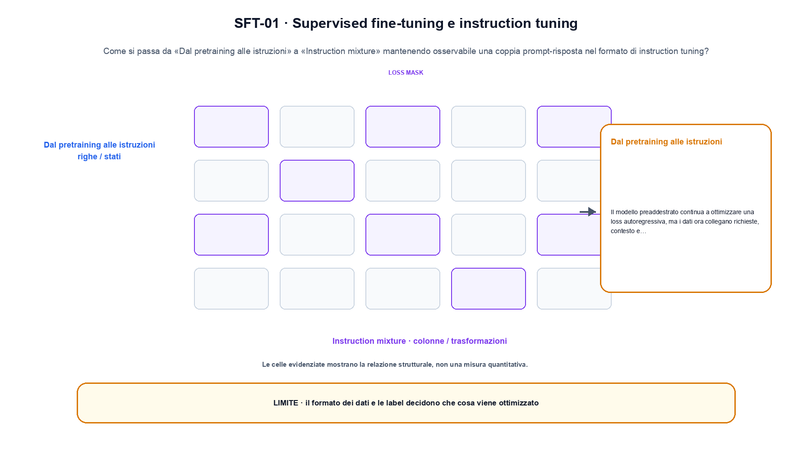
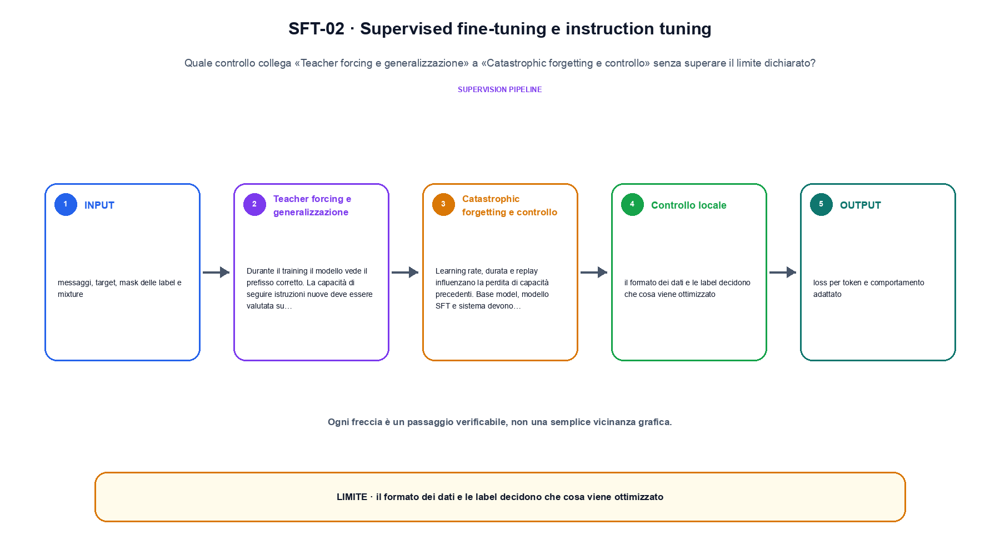

<!--
chapter_id: CH-P09-SFT
part_id: P09
order_key: 460
title: Supervised fine-tuning e instruction tuning
maturity: CORE
status: revisione editoriale v2, approvazione autoriale aperta
version: 0.5.0-draft3
last_source_check: 4 agosto 2026
environment: Python 3.13.12, CPU
code_policy: reference
deferred: benchmark applicativi non eseguiti e approvazione autoriale delle visuali
-->

# Capitolo 46. Supervised fine-tuning e instruction tuning

La domanda guida di questa lezione è come collegare «Dal pretraining alle istruzioni» e «Catastrophic forgetting e controllo» senza perdere il contratto tecnico di supervised fine-tuning e instruction tuning. L'oggetto osservato è una coppia prompt-risposta nel formato di instruction tuning. Il contratto locale è: input, messaggi, target, mask delle label e mixture; operazione, teacher forcing e aggiornamento supervisionato; output, loss per token e comportamento adattato. Il caso guida è questo: Una conversazione con quattro token assegna la loss soltanto ai due token della risposta. Il confine da mantenere esplicito è: il formato dei dati e le label decidono che cosa viene ottimizzato.

## Dal pretraining alle istruzioni

Il modello preaddestrato continua a ottimizzare una loss autoregressiva, ma i dati ora collegano richieste, contesto e risposte desiderate. [SRC-46-001]

SFT assegna target espliciti, ma la qualità dipende da dati, formato e copertura.

**Caso da seguire.** Una conversazione con quattro token assegna la loss soltanto ai due token della risposta.

**Controllo.** Scrivi il risultato atteso prima del calcolo, modifica una sola quantità e localizza il primo passaggio che cambia. Il vincolo da conservare è: Il modello preaddestrato continua a ottimizzare una loss autoregressiva, ma i dati ora collegano richieste, contesto e risposte desiderate.


## Formati conversazionali

Ruoli, separatori, system message e loss mask definiscono quali token sono input e quali producono gradiente. [SRC-46-002]

**Caso da seguire.** Un messaggio utente e una risposta con loss solo sulla risposta.

**Controllo.** Ricalcola il caso a mano e con lo snippet. Se i risultati divergono, confronta prima i valori intermedi e soltanto dopo l'output finale.


La relazione centrale può essere scritta come:

$$
L = -sum_t log p_theta(y_t | x, y_<t)
$$

SFT assegna target espliciti, ma la qualità dipende da dati, formato e copertura. [SRC-46-001]




La prima figura segue il percorso da «Dal pretraining alle istruzioni» a «Instruction mixture».


## Instruction mixture

Compiti e domini vengono mescolati con pesi espliciti. La quantità di esempi non coincide automaticamente con il loro contributo utile. [SRC-46-003]

**Caso da seguire.** Due sorgenti con conteggi diversi confrontate dopo una regola di campionamento dichiarata.

**Controllo.** Aggiungi un valore limite e verifica separatamente forma, valore e ipotesi. Una shape valida non dimostra da sola «Instruction mixture».


## Teacher forcing e generalizzazione

Durante il training il modello vede il prefisso corretto. La capacità di seguire istruzioni nuove deve essere valutata su template e domini separati. [SRC-46-004]

**Caso da seguire.** Un prefisso corretto confrontato con lo stesso prefisso dopo che il modello ha prodotto il token precedente.

**Controllo.** Mantieni fisso l'input e sostituisci soltanto il meccanismo discusso nella sezione. Il confronto deve attribuire la differenza a quel passaggio, non al setup.


## Esempio Python eseguito

Il frammento seguente è lo stesso conservato nel repository. Usa valori piccoli perché l'obiettivo è osservare il meccanismo, non simulare una scala che non abbiamo eseguito.

```python
def contract():
    tokens = ["utente", "domanda", "assistente", "risposta"]
    labels = [False, False, True, True]
    supervised = [token for token, include in zip(tokens, labels) if include]
    return {"supervised_tokens": supervised, "label_count": sum(labels), "invariant": "loss masking distinguishes prompt tokens from target tokens"}
```

Esecuzione con `python snip_46_contract.py`:

```text
{"invariant": "loss masking distinguishes prompt tokens from target tokens", "label_count": 2, "supervised_tokens": ["assistente", "risposta"]}
```

Il test associato è [`code/test_46_contract.py`](code/test_46_contract.py); l'output versionato è [`code/outputs/SNIP-46-001.txt`](code/outputs/SNIP-46-001.txt).


## Catastrophic forgetting e controllo

Learning rate, durata e replay influenzano la perdita di capacità precedenti. Base model, modello SFT e sistema devono restare identificabili. [SRC-46-001]

**Caso da seguire.** Una metrica del compito nuovo confrontata con la stessa metrica sul comportamento precedente.

**Controllo.** Costruisci un controesempio che rispetti il tipo di dato ma violi l'ipotesi centrale. Il test deve rendere riconoscibile perché «Catastrophic forgetting e controllo» non si applica.




La seconda figura mette a confronto «Teacher forcing e generalizzazione» e il limite discusso in «Catastrophic forgetting e controllo».


## Come si collegano i passaggi

- **Da «Dal pretraining alle istruzioni» a «Formati conversazionali».** Il modello preaddestrato continua a ottimizzare una loss autoregressiva, ma i dati ora collegano richieste, contesto e risposte desiderate. Ruoli, separatori, system message e loss mask definiscono quali token sono input e quali producono gradiente. Il primo passaggio definisce che cosa entra nel calcolo; il secondo stabilisce la regola che produce il valore osservabile. [SRC-46-001; SRC-46-002]

- **Da «Formati conversazionali» a «Instruction mixture».** Ruoli, separatori, system message e loss mask definiscono quali token sono input e quali producono gradiente. Compiti e domini vengono mescolati con pesi espliciti. La regola generale viene poi letta dentro il componente: questa separazione permette di localizzare un errore prima di attribuirlo all'intero modello. [SRC-46-002; SRC-46-003]

- **Da «Instruction mixture» a «Teacher forcing e generalizzazione».** Compiti e domini vengono mescolati con pesi espliciti. Durante il training il modello vede il prefisso corretto. Dopo avere reso visibile il componente, il percorso introduce la variante o l'ottimizzazione senza cambiare di nascosto il caso di partenza. [SRC-46-003; SRC-46-004]

- **Da «Teacher forcing e generalizzazione» a «Catastrophic forgetting e controllo».** Durante il training il modello vede il prefisso corretto. Learning rate, durata e replay influenzano la perdita di capacità precedenti. L'ultimo passaggio sposta l'attenzione dal funzionamento locale alla misura: correttezza del calcolo e qualità applicativa restano domande distinte. [SRC-46-004; SRC-46-001]

La catena completa produce loss per token e comportamento adattato a partire da messaggi, target, mask delle label e mixture. Ogni collegamento conserva un oggetto osservabile diverso; per questo il risultato non può essere esteso oltre il limite dichiarato: il formato dei dati e le label decidono che cosa viene ottimizzato.


## Esercizi sul meccanismo

1. Ricostruisci «Dal pretraining alle istruzioni» con un esempio diverso da quello mostrato e indica l'output atteso prima del calcolo.
2. Nel passaggio «Formati conversazionali», cambia una sola ipotesi e spiega quale risultato non è più confrontabile.
3. Collega «Instruction mixture» a una riga dello snippet oppure motiva perché la prova deve essere documentale.
4. Progetta un caso limite per «Teacher forcing e generalizzazione» che produca una failure riconoscibile.
5. Per «Catastrophic forgetting e controllo», separa una conclusione sostenuta dal caso locale da una che richiederebbe nuovi dati o un benchmark.


## Che cosa deve restare chiaro

La lezione parte da «messaggi, target, mask delle label e mixture» e arriva fino a «loss per token e comportamento adattato». Il limite da conservare è questo: il formato dei dati e le label decidono che cosa viene ottimizzato. Definizioni e risultati citati sono rintracciabili in [`FONTI_PRIMARIE.md`](FONTI_PRIMARIE.md); la mappa dei claim è in [`CLAIMS.md`](CLAIMS.md).
