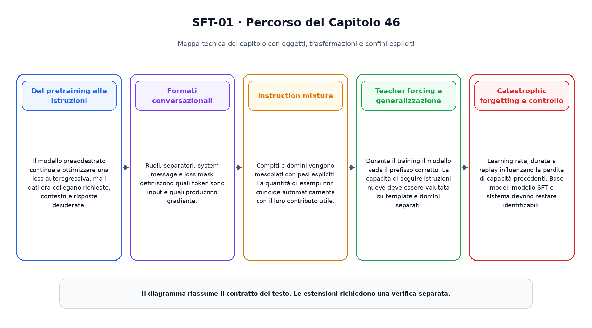
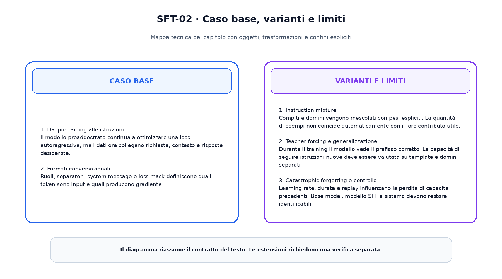

<!--
chapter_id: CH-P09-SFT
part_id: P09
order_key: 460
title: Supervised fine-tuning e instruction tuning
maturity: CORE
status: candidatura completa in revisione autoriale
version: 0.2.0-rc1
last_source_check: 2026-08-02
-->

# Capitolo 46. Supervised fine-tuning e instruction tuning

Il capitolo precedente ha consegnato il prerequisito immediato. Ora riprendiamo lo stesso oggetto continuo, la richiesta «Il pacco non è arrivato», e aggiungiamo una sola nuova capacità. Il caso concreto precede i termini tecnici e le formule.

## Dal pretraining alle istruzioni

Il modello preaddestrato continua a ottimizzare una loss autoregressiva, ma i dati ora collegano richieste, contesto e risposte desiderate.

Per leggere questo passaggio conviene distinguere l'oggetto disponibile, l'operazione applicata e il risultato osservabile. La descrizione non attribuisce al modello proprietà che non sono state misurate. Il limite dichiarato prepara il passaggio successivo senza trasformarlo in un prerequisito nascosto.
## Formati conversazionali

Ruoli, separatori, system message e loss mask definiscono quali token sono input e quali producono gradiente.

Per leggere questo passaggio conviene distinguere l'oggetto disponibile, l'operazione applicata e il risultato osservabile. La descrizione non attribuisce al modello proprietà che non sono state misurate. Il limite dichiarato prepara il passaggio successivo senza trasformarlo in un prerequisito nascosto.
## Instruction mixture

Compiti e domini vengono mescolati con pesi espliciti. La quantità di esempi non coincide automaticamente con il loro contributo utile.

Per leggere questo passaggio conviene distinguere l'oggetto disponibile, l'operazione applicata e il risultato osservabile. La descrizione non attribuisce al modello proprietà che non sono state misurate. Il limite dichiarato prepara il passaggio successivo senza trasformarlo in un prerequisito nascosto.
## Teacher forcing e generalizzazione

Durante il training il modello vede il prefisso corretto. La capacità di seguire istruzioni nuove deve essere valutata su template e domini separati.

Per leggere questo passaggio conviene distinguere l'oggetto disponibile, l'operazione applicata e il risultato osservabile. La descrizione non attribuisce al modello proprietà che non sono state misurate. Il limite dichiarato prepara il passaggio successivo senza trasformarlo in un prerequisito nascosto.
## Catastrophic forgetting e controllo

Learning rate, durata e replay influenzano la perdita di capacità precedenti. Base model, modello SFT e sistema devono restare identificabili.

Per leggere questo passaggio conviene distinguere l'oggetto disponibile, l'operazione applicata e il risultato osservabile. La descrizione non attribuisce al modello proprietà che non sono state misurate. Il limite dichiarato prepara il passaggio successivo senza trasformarlo in un prerequisito nascosto.

La prima figura mostra il percorso causale del capitolo.

La seconda figura mantiene separati il caso base e le estensioni.

## Snippet verificabile

Il file [`code/snip_46_contract.py`](code/snip_46_contract.py) rende osservabile un contratto numerico minimo. È un esempio didattico e non un benchmark di produzione.

## Riepilogo

Abbiamo costruito supervised fine-tuning e instruction tuning a partire dai prerequisiti disponibili. Oggetti, trasformazioni, varianti e limiti restano distinti. Il risultato viene consegnato al capitolo successivo.

### Verifica della comprensione ed esercizi

1. Ricostruisci l'ordine dei passaggi senza consultare la figura.
2. Indica quale oggetto cambia e quale rimane invariato.
3. Modifica lo snippet e verifica un caso limite.
4. Distingui il meccanismo base da una variante citata.
5. Formula un claim che non superi l'evidenza disponibile.

## Fonti e materiali verificabili

Le fonti e i limiti d'uso sono in [`FONTI_PRIMARIE.md`](FONTI_PRIMARIE.md). Claim, codice, test e output sono versionati nella cartella del capitolo.
