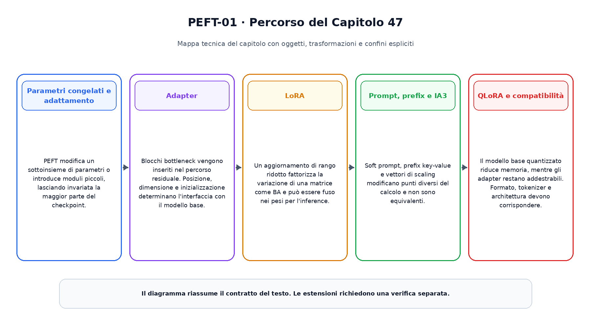
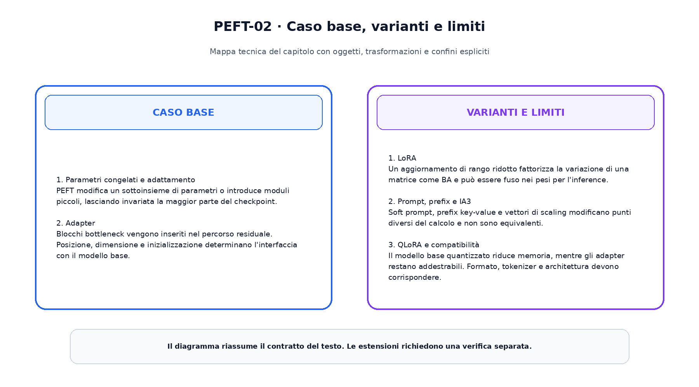

<!--
chapter_id: CH-P09-PEFT
part_id: P09
order_key: 470
title: Fine-tuning efficiente
maturity: ESTABLISHED
status: candidatura completa in revisione autoriale
version: 0.2.0-rc1
last_source_check: 2026-08-02
-->

# Capitolo 47. Fine-tuning efficiente

Il capitolo precedente ha consegnato il prerequisito immediato. Ora riprendiamo lo stesso oggetto continuo, la richiesta «Il pacco non è arrivato», e aggiungiamo una sola nuova capacità. Il caso concreto precede i termini tecnici e le formule.

## Parametri congelati e adattamento

PEFT modifica un sottoinsieme di parametri o introduce moduli piccoli, lasciando invariata la maggior parte del checkpoint.

Per leggere questo passaggio conviene distinguere l'oggetto disponibile, l'operazione applicata e il risultato osservabile. La descrizione non attribuisce al modello proprietà che non sono state misurate. Il limite dichiarato prepara il passaggio successivo senza trasformarlo in un prerequisito nascosto.
## Adapter

Blocchi bottleneck vengono inseriti nel percorso residuale. Posizione, dimensione e inizializzazione determinano l'interfaccia con il modello base.

Per leggere questo passaggio conviene distinguere l'oggetto disponibile, l'operazione applicata e il risultato osservabile. La descrizione non attribuisce al modello proprietà che non sono state misurate. Il limite dichiarato prepara il passaggio successivo senza trasformarlo in un prerequisito nascosto.
## LoRA

Un aggiornamento di rango ridotto fattorizza la variazione di una matrice come BA e può essere fuso nei pesi per l'inference.

Per leggere questo passaggio conviene distinguere l'oggetto disponibile, l'operazione applicata e il risultato osservabile. La descrizione non attribuisce al modello proprietà che non sono state misurate. Il limite dichiarato prepara il passaggio successivo senza trasformarlo in un prerequisito nascosto.
## Prompt, prefix e IA3

Soft prompt, prefix key-value e vettori di scaling modificano punti diversi del calcolo e non sono equivalenti.

Per leggere questo passaggio conviene distinguere l'oggetto disponibile, l'operazione applicata e il risultato osservabile. La descrizione non attribuisce al modello proprietà che non sono state misurate. Il limite dichiarato prepara il passaggio successivo senza trasformarlo in un prerequisito nascosto.
## QLoRA e compatibilità

Il modello base quantizzato riduce memoria, mentre gli adapter restano addestrabili. Formato, tokenizer e architettura devono corrispondere.

Per leggere questo passaggio conviene distinguere l'oggetto disponibile, l'operazione applicata e il risultato osservabile. La descrizione non attribuisce al modello proprietà che non sono state misurate. Il limite dichiarato prepara il passaggio successivo senza trasformarlo in un prerequisito nascosto.

La prima figura mostra il percorso causale del capitolo.

La seconda figura mantiene separati il caso base e le estensioni.

## Snippet verificabile

Il file [`code/snip_47_contract.py`](code/snip_47_contract.py) rende osservabile un contratto numerico minimo. È un esempio didattico e non un benchmark di produzione.

## Riepilogo

Abbiamo costruito fine-tuning efficiente a partire dai prerequisiti disponibili. Oggetti, trasformazioni, varianti e limiti restano distinti. Il risultato viene consegnato al capitolo successivo.

### Verifica della comprensione ed esercizi

1. Ricostruisci l'ordine dei passaggi senza consultare la figura.
2. Indica quale oggetto cambia e quale rimane invariato.
3. Modifica lo snippet e verifica un caso limite.
4. Distingui il meccanismo base da una variante citata.
5. Formula un claim che non superi l'evidenza disponibile.

## Fonti e materiali verificabili

Le fonti e i limiti d'uso sono in [`FONTI_PRIMARIE.md`](FONTI_PRIMARIE.md). Claim, codice, test e output sono versionati nella cartella del capitolo.
