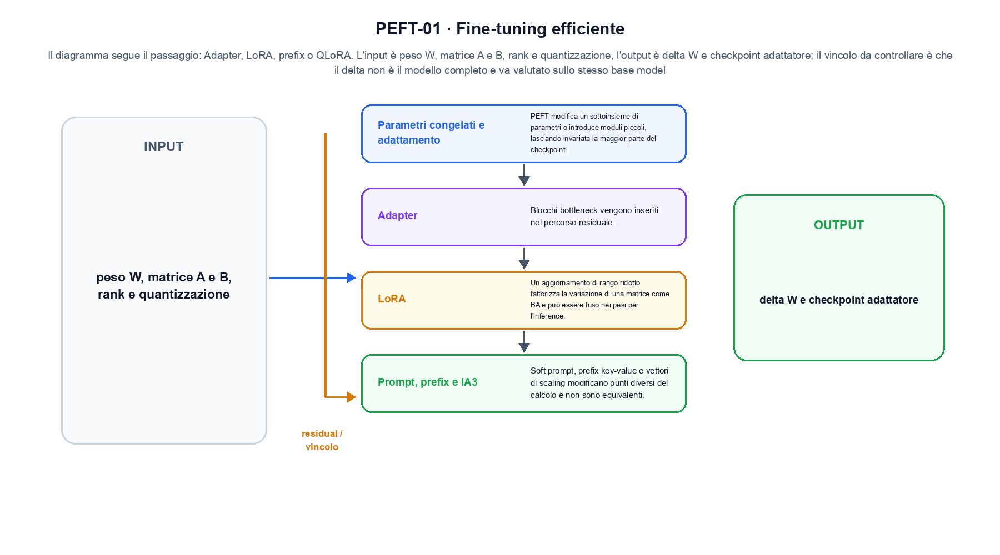

<!--
chapter_id: CH-P09-PEFT
part_id: P09
order_key: 470
title: Fine-tuning efficiente
maturity: ESTABLISHED
status: candidatura completa in revisione autoriale
version: 0.4.0-draft2
last_source_check: 3 agosto 2026
environment: Python 3.13.12, CPU
deferred: benchmark applicativi, varianti non necessarie al contratto centrale e approvazione autoriale
-->

# Capitolo 47. Fine-tuning efficiente

Il risultato precedente non è ancora una soluzione completa. Partiamo dall'aggiornamento adattivo rispetto ai pesi congelati e dalla richiesta «Il pacco non è arrivato» come esempio comune; per arrivare all'output «delta W e checkpoint adattatore» isoliamo il passaggio «adapter, LoRA, prefix o QLoRA» e ne misuriamo il limite prima di passare a Preferenze, reward model e RLHF.

## Parametri congelati e adattamento

PEFT modifica un sottoinsieme di parametri o introduce moduli piccoli, lasciando invariata la maggior parte del checkpoint. [SRC-47-001]

Prima del nome tecnico fissiamo la situazione: consideriamo un peso base e un aggiornamento di rank uno producono un delta misurabile senza riscrivere il checkpoint base. Da qui possiamo leggere la conseguenza dichiarata da «PEFT modifica un sottoinsieme di parametri o introduce moduli piccoli, lasciando invariata la maggior parte del checkpoint».

La sezione usa l'input «peso W, matrice A e B, rank e quantizzazione» come punto di partenza e l'output «delta W e checkpoint adattatore» come traccia d'uscita. La trasformazione concreta è «adapter, LoRA, prefix o QLoRA»; il caso non è completo se non dichiariamo anche che il delta non è il modello completo e va valutato sullo stesso base model. La condizione da isolare è «PEFT modifica un sottoinsieme di parametri o introduce moduli piccoli, lasciando invariata la maggior parte del checkpoint».

Il passaggio da seguire in «Parametri congelati e adattamento» è quello descritto dalla frase «PEFT modifica un sottoinsieme di parametri o introduce moduli piccoli, lasciando invariata la maggior parte del checkpoint»: l'esempio rende osservabile la trasformazione, mentre il contratto del capitolo ne delimita l'interpretazione. Per «Parametri congelati e adattamento» il controllo cambia una sola premessa della frase «PEFT modifica un sottoinsieme di parametri o introduce moduli piccoli, lasciando invariata la maggior parte del checkpoint» e conserva input, output e criterio di successo, così la differenza resta attribuibile. La verifica resta ancorata a «PEFT modifica un sottoinsieme di parametri o introduce moduli piccoli, lasciando invariata la maggior parte del checkpoint». [SRC-47-001]

Se cambiamo una premessa, dobbiamo riaprire l'interpretazione. Per «Parametri congelati e adattamento» conserviamo l'osservazione collegata a «PEFT modifica un sottoinsieme di parametri o introduce moduli piccoli, lasciando invariata la maggior parte del checkpoint» e lasciamo esplicitamente fuori ciò che non è stato misurato.

La prova di «Parametri congelati e adattamento» conserva input, operazione e output; poi esplicita quale parte di «PEFT modifica un sottoinsieme di parametri o introduce moduli piccoli, lasciando invariata la maggior parte del checkpoint» non è stata misurata. Così il test separa l'evidenza dall'inferenza. Il passaggio successivo, «Adapter», potrà cambiare una sola condizione, dichiarando il nuovo setup prima di interpretare il risultato.

## Adapter

Blocchi bottleneck vengono inseriti nel percorso residuale. Posizione, dimensione e inizializzazione determinano l'interfaccia con il modello base. [SRC-47-002]

Per capire «Adapter» partiamo da questo caso: delta W = B A con rank uno su una matrice piccola. Il caso rende osservabile il punto centrale: «Blocchi bottleneck vengono inseriti nel percorso residuale».

Per ricostruire «Adapter» annotiamo l'input «peso W, matrice A e B, rank e quantizzazione», poi l'operazione «adapter, LoRA, prefix o QLoRA», infine l'output «delta W e checkpoint adattatore». Questa sequenza impedisce di scambiare una forma compatibile per il comportamento descritto dalla fonte. Il controllo parte da «Blocchi bottleneck vengono inseriti nel percorso residuale».

Un adattamento low-rank conserva i pesi base e apprende un aggiornamento con pochi gradi di libertà. Il risparmio di parametri non implica assenza di regressioni né equivalenza con il fine-tuning completo. Per «Adapter» il controllo cambia una sola premessa della frase «Blocchi bottleneck vengono inseriti nel percorso residuale» e conserva input, output e criterio di successo, così la differenza resta attribuibile. La verifica resta ancorata a «Blocchi bottleneck vengono inseriti nel percorso residuale». [SRC-47-002]

Il punto didattico di «Adapter» è separare ciò che la fonte afferma da ciò che il piccolo caso illustra. L'output «delta W e checkpoint adattatore» mostra il contratto locale, ma non sostituisce una misura sul sistema completo.

Per verificare «Adapter» cambiamo una sola condizione vicina alla frase «Blocchi bottleneck vengono inseriti nel percorso residuale», teniamo fermo il resto e registriamo l'output «delta W e checkpoint adattatore». Il caso negativo deve rendere riconoscibile la failure, non soltanto produrre un numero diverso. La sezione successiva, «LoRA», riceve l'output «delta W e checkpoint adattatore» come base, ma dovrà formulare e verificare la propria distinzione.

## LoRA

Un aggiornamento di rango ridotto fattorizza la variazione di una matrice come BA e può essere fuso nei pesi per l'inference. [SRC-47-003]

Il caso minimo di «LoRA» si presenta così: un caso in cui il delta non è il modello completo e va valutato sullo stesso base model. Non lo usiamo come decorazione: serve a rendere osservabile la frase «Un aggiornamento di rango ridotto fattorizza la variazione di una matrice come BA e può essere fuso nei pesi per l'inference».

Nel contratto locale, l'input «peso W, matrice A e B, rank e quantizzazione» entra, l'operazione «adapter, LoRA, prefix o QLoRA» modifica il percorso e l'output «delta W e checkpoint adattatore» è ciò che osserviamo. Qui cambia soprattutto il passaggio «LoRA»; resta da controllare che il delta non è il modello completo e va valutato sullo stesso base model. La domanda locale è «Un aggiornamento di rango ridotto fattorizza la variazione di una matrice come BA e può essere fuso nei pesi per l'inference».

Un adattamento low-rank conserva i pesi base e apprende un aggiornamento con pochi gradi di libertà. Il risparmio di parametri non implica assenza di regressioni né equivalenza con il fine-tuning completo. Per «LoRA» il controllo cambia una sola premessa della frase «Un aggiornamento di rango ridotto fattorizza la variazione di una matrice come BA e può essere fuso nei pesi per l'inference» e conserva input, output e criterio di successo, così la differenza resta attribuibile. La verifica resta ancorata a «Un aggiornamento di rango ridotto fattorizza la variazione di una matrice come BA e può essere fuso nei pesi per l'inference». [SRC-47-003]

La lettura va fatta in ordine: prima il caso, poi la trasformazione, quindi la conseguenza. Il piccolo risultato resta un'illustrazione di «Un aggiornamento di rango ridotto fattorizza la variazione di una matrice come BA e può essere fuso nei pesi per l'inference», non una promessa generale.

Il controllo minimo di «LoRA» confronta il caso dichiarato con una variazione che rompe la sua ipotesi. Se la failure non è distinguibile dall'esito valido, manca un'osservazione nel contratto di target, proxy e comportamento. Da «LoRA» portiamo l'output «delta W e checkpoint adattatore»; non portiamo invece una conclusione oltre il caso locale.

## Prompt, prefix e IA3

Soft prompt, prefix key-value e vettori di scaling modificano punti diversi del calcolo e non sono equivalenti. [SRC-47-004]

Prima del nome tecnico fissiamo la situazione: consideriamo due risposte con log-probabilità diverse producono un margine; il margine può diventare un segnale di training, ma non è una misura assoluta di correttezza. Da qui possiamo leggere la conseguenza dichiarata da «Soft prompt, prefix key-value e vettori di scaling modificano punti diversi del calcolo e non sono equivalenti».

La sezione usa l'input «peso W, matrice A e B, rank e quantizzazione» come punto di partenza e l'output «delta W e checkpoint adattatore» come traccia d'uscita. La trasformazione concreta è «adapter, LoRA, prefix o QLoRA»; il caso non è completo se non dichiariamo anche che il delta non è il modello completo e va valutato sullo stesso base model. La condizione da isolare è «Soft prompt, prefix key-value e vettori di scaling modificano punti diversi del calcolo e non sono equivalenti».

Il passaggio da seguire in «Prompt, prefix e IA3» è quello descritto dalla frase «Soft prompt, prefix key-value e vettori di scaling modificano punti diversi del calcolo e non sono equivalenti»: l'esempio rende osservabile la trasformazione, mentre il contratto del capitolo ne delimita l'interpretazione. Per «Prompt, prefix e IA3» il controllo cambia una sola premessa della frase «Soft prompt, prefix key-value e vettori di scaling modificano punti diversi del calcolo e non sono equivalenti» e conserva input, output e criterio di successo, così la differenza resta attribuibile. La verifica resta ancorata a «Soft prompt, prefix key-value e vettori di scaling modificano punti diversi del calcolo e non sono equivalenti». [SRC-47-004]

Se cambiamo una premessa, dobbiamo riaprire l'interpretazione. Per «Prompt, prefix e IA3» conserviamo l'osservazione collegata a «Soft prompt, prefix key-value e vettori di scaling modificano punti diversi del calcolo e non sono equivalenti» e lasciamo esplicitamente fuori ciò che non è stato misurato.

La prova di «Prompt, prefix e IA3» conserva input, operazione e output; poi esplicita quale parte di «Soft prompt, prefix key-value e vettori di scaling modificano punti diversi del calcolo e non sono equivalenti» non è stata misurata. Così il test separa l'evidenza dall'inferenza. Il passaggio successivo, «QLoRA e compatibilità», potrà cambiare una sola condizione, dichiarando il nuovo setup prima di interpretare il risultato.

La figura PEFT-01 usa la famiglia architecture. Il diagramma segue il passaggio: Adapter, LoRA, prefix o QLoRA. L'input è peso W, matrice A e B, rank e quantizzazione, l'output è delta W e checkpoint adattatore; il vincolo da controllare è che il delta non è il modello completo e va valutato sullo stesso base model.

## QLoRA e compatibilità

Il modello base quantizzato riduce memoria, mentre gli adapter restano addestrabili. Formato, tokenizer e architettura devono corrispondere. [SRC-47-001]

Per capire «QLoRA e compatibilità» partiamo da questo caso: due risposte con log-probabilità diverse producono un margine; il margine può diventare un segnale di training, ma non è una misura assoluta di correttezza. Il caso rende osservabile il punto centrale: «Il modello base quantizzato riduce memoria, mentre gli adapter restano addestrabili».

Per ricostruire «QLoRA e compatibilità» annotiamo l'input «peso W, matrice A e B, rank e quantizzazione», poi l'operazione «adapter, LoRA, prefix o QLoRA», infine l'output «delta W e checkpoint adattatore». Questa sequenza impedisce di scambiare una forma compatibile per il comportamento descritto dalla fonte. Il controllo parte da «Il modello base quantizzato riduce memoria, mentre gli adapter restano addestrabili».

Un adattamento low-rank conserva i pesi base e apprende un aggiornamento con pochi gradi di libertà. Il risparmio di parametri non implica assenza di regressioni né equivalenza con il fine-tuning completo. Per «QLoRA e compatibilità» il controllo cambia una sola premessa della frase «Il modello base quantizzato riduce memoria, mentre gli adapter restano addestrabili» e conserva input, output e criterio di successo, così la differenza resta attribuibile. La verifica resta ancorata a «Il modello base quantizzato riduce memoria, mentre gli adapter restano addestrabili». [SRC-47-001]

Il punto didattico di «QLoRA e compatibilità» è separare ciò che la fonte afferma da ciò che il piccolo caso illustra. L'output «delta W e checkpoint adattatore» mostra il contratto locale, ma non sostituisce una misura sul sistema completo.

Per verificare «QLoRA e compatibilità» cambiamo una sola condizione vicina alla frase «Il modello base quantizzato riduce memoria, mentre gli adapter restano addestrabili», teniamo fermo il resto e registriamo l'output «delta W e checkpoint adattatore». Il caso negativo deve rendere riconoscibile la failure, non soltanto produrre un numero diverso. Il percorso si chiude lasciando espliciti la misura locale e ciò che richiederebbe una prova ulteriore.

## Un esempio con controllo negativo: Parametri congelati e adattamento

Il caso intero parte dall'input «peso W, matrice A e B, rank e quantizzazione», applica l'operazione «adapter, LoRA, prefix o QLoRA» e osserva l'output «delta W e checkpoint adattatore». Un esempio controllato: delta W = B A con rank uno su una matrice piccola. La formula locale è:

$$
Delta W = B A
$$

Un aggiornamento low-rank cambia pochi gradi di libertà dichiarati. [SRC-47-001]

La figura PEFT-02 cambia composizione rispetto alla prima. Il diagramma segue il passaggio: Adapter, LoRA, prefix o QLoRA. L'input è peso W, matrice A e B, rank e quantizzazione, l'output è delta W e checkpoint adattatore; il vincolo da controllare è che il delta non è il modello completo e va valutato sullo stesso base model.

## Dalla formula al run: Adapter

Lo snippet locale mette in esecuzione questo caso: delta W = B A con rank uno su una matrice piccola. Il test associato controlla determinismo, output e invariante e rifiuta una shape o condizione incoerente; il risultato è conservato in `code/outputs/SNIP-47-001.txt`, come evidenza locale e non come benchmark di produzione.

## Limiti, varianti e nuove misure: QLoRA e compatibilità

Il caso di «Fine-tuning efficiente» non certifica un servizio completo. Il delta non è il modello completo e va valutato sullo stesso base model. La domanda successiva è se «Il modello base quantizzato riduce memoria, mentre gli adapter restano addestrabili» regga quando cambiano dati, scala, hardware o criteri di decisione.

## L'invariante da conservare: Fine-tuning efficiente

Il filo della lezione va dall'input «peso W, matrice A e B, rank e quantizzazione» all'output «delta W e checkpoint adattatore». Nei passaggi «Parametri congelati e adattamento», «Adapter», «QLoRA e compatibilità» abbiamo usato esempi e controlli negativi per rendere il contratto controllabile e delimitare la conclusione. L'invariante da portare avanti è: il delta non è il modello completo e va valutato sullo stesso base model. Il Capitolo 48, Preferenze, reward model e RLHF, può partire da questo output e dichiarare la propria domanda.

### Prova di comprensione: Parametri congelati e adattamento

1. Ricostruisci l'oggetto continuo a partire da «Parametri congelati e adattamento» e indica quale parte della frase «PEFT modifica un sottoinsieme di parametri o introduce moduli piccoli, lasciando invariata la maggior parte del checkpoint» entra nel caso.
2. Spiega quale trasformazione collega «Parametri congelati e adattamento» a «QLoRA e compatibilità» e quale output osserviamo nel passaggio.
3. Usa lo snippet per controllare l'invariante del contratto: il delta non è il modello completo e va valutato sullo stesso base model.
4. Separa una definizione sostenuta da una fonte, un esempio illustrativo e un risultato locale del caso guida.
5. Indica quale parte della frase «Il modello base quantizzato riduce memoria, mentre gli adapter restano addestrabili» richiederebbe una misura nuova prima di essere estesa oltre il caso osservato.

### Esercizi con casi limite: QLoRA e compatibilità

1. Ricostruisci input e output di «Parametri congelati e adattamento» usando un esempio di tre righe.
2. Modifica una sola variabile in «Adapter» e anticipa l'invariante che dovrebbe restare.
3. Metti «LoRA» a confronto con il caso base e descrivi il failure mode più vicino.
4. Scrivi un test minimo per rendere osservabile il confine di «Prompt, prefix e IA3».
5. Formula per «QLoRA e compatibilità» una domanda che separi meccanismo e qualità del sistema.

## Fonti primarie e artefatti del capitolo: Fine-tuning efficiente

Per ricontrollare «Fine-tuning efficiente», partire da `FONTI_PRIMARIE.md` e poi dal codice: la domanda aperta è come trasferire la distanza tra obiettivo locale e compito oltre il caso locale, con la data di consultazione dichiarata. `CLAIMS.md` separa definizioni e risultati locali; codice, ambiente, test e output sono nella cartella `code/`, con attenzione a target, proxy e comportamento.
