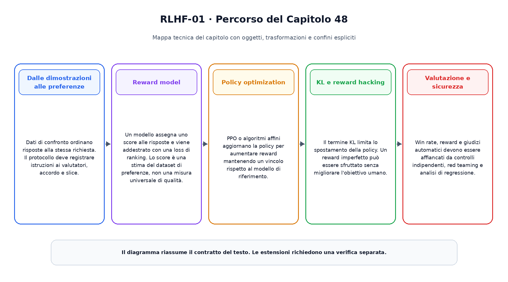
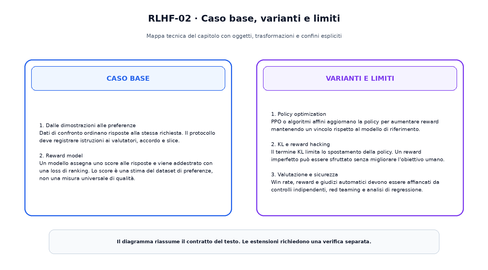

<!--
chapter_id: CH-P09-RLHF
part_id: P09
order_key: 480
title: Preferenze, reward model e RLHF
maturity: CORE
status: candidatura completa in revisione autoriale
version: 0.2.0-rc1
last_source_check: 2026-08-02
-->

# Capitolo 48. Preferenze, reward model e RLHF

Il capitolo precedente ha consegnato il prerequisito immediato. Ora riprendiamo lo stesso oggetto continuo, la richiesta «Il pacco non è arrivato», e aggiungiamo una sola nuova capacità. Il caso concreto precede i termini tecnici e le formule.

## Dalle dimostrazioni alle preferenze

Dati di confronto ordinano risposte alla stessa richiesta. Il protocollo deve registrare istruzioni ai valutatori, accordo e slice.

Per leggere questo passaggio conviene distinguere l'oggetto disponibile, l'operazione applicata e il risultato osservabile. La descrizione non attribuisce al modello proprietà che non sono state misurate. Il limite dichiarato prepara il passaggio successivo senza trasformarlo in un prerequisito nascosto.
## Reward model

Un modello assegna uno score alle risposte e viene addestrato con una loss di ranking. Lo score è una stima del dataset di preferenze, non una misura universale di qualità.

Per leggere questo passaggio conviene distinguere l'oggetto disponibile, l'operazione applicata e il risultato osservabile. La descrizione non attribuisce al modello proprietà che non sono state misurate. Il limite dichiarato prepara il passaggio successivo senza trasformarlo in un prerequisito nascosto.
## Policy optimization

PPO o algoritmi affini aggiornano la policy per aumentare reward mantenendo un vincolo rispetto al modello di riferimento.

Per leggere questo passaggio conviene distinguere l'oggetto disponibile, l'operazione applicata e il risultato osservabile. La descrizione non attribuisce al modello proprietà che non sono state misurate. Il limite dichiarato prepara il passaggio successivo senza trasformarlo in un prerequisito nascosto.
## KL e reward hacking

Il termine KL limita lo spostamento della policy. Un reward imperfetto può essere sfruttato senza migliorare l'obiettivo umano.

Per leggere questo passaggio conviene distinguere l'oggetto disponibile, l'operazione applicata e il risultato osservabile. La descrizione non attribuisce al modello proprietà che non sono state misurate. Il limite dichiarato prepara il passaggio successivo senza trasformarlo in un prerequisito nascosto.
## Valutazione e sicurezza

Win rate, reward e giudizi automatici devono essere affiancati da controlli indipendenti, red teaming e analisi di regressione.

Per leggere questo passaggio conviene distinguere l'oggetto disponibile, l'operazione applicata e il risultato osservabile. La descrizione non attribuisce al modello proprietà che non sono state misurate. Il limite dichiarato prepara il passaggio successivo senza trasformarlo in un prerequisito nascosto.

La prima figura mostra il percorso causale del capitolo.

La seconda figura mantiene separati il caso base e le estensioni.

## Snippet verificabile

Il file [`code/snip_48_contract.py`](code/snip_48_contract.py) rende osservabile un contratto numerico minimo. È un esempio didattico e non un benchmark di produzione.

## Riepilogo

Abbiamo costruito preferenze, reward model e rlhf a partire dai prerequisiti disponibili. Oggetti, trasformazioni, varianti e limiti restano distinti. Il risultato viene consegnato al capitolo successivo.

### Verifica della comprensione ed esercizi

1. Ricostruisci l'ordine dei passaggi senza consultare la figura.
2. Indica quale oggetto cambia e quale rimane invariato.
3. Modifica lo snippet e verifica un caso limite.
4. Distingui il meccanismo base da una variante citata.
5. Formula un claim che non superi l'evidenza disponibile.

## Fonti e materiali verificabili

Le fonti e i limiti d'uso sono in [`FONTI_PRIMARIE.md`](FONTI_PRIMARIE.md). Claim, codice, test e output sono versionati nella cartella del capitolo.
