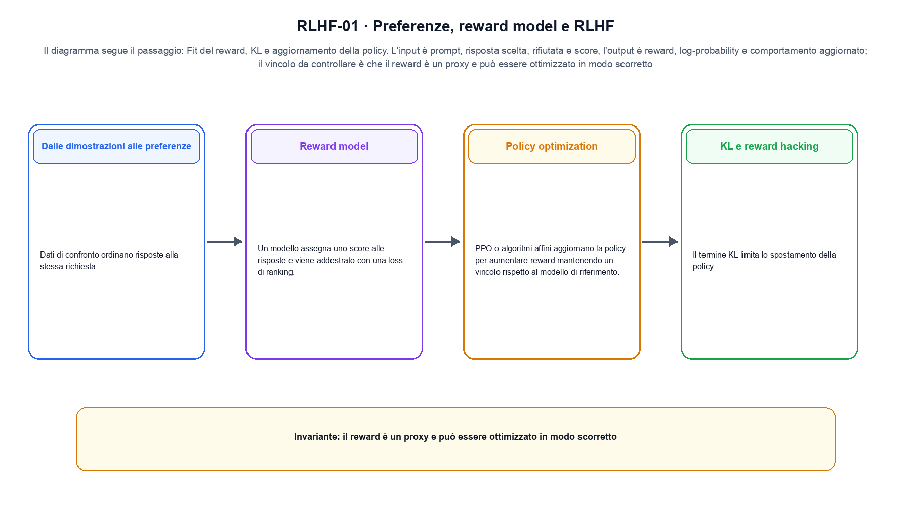
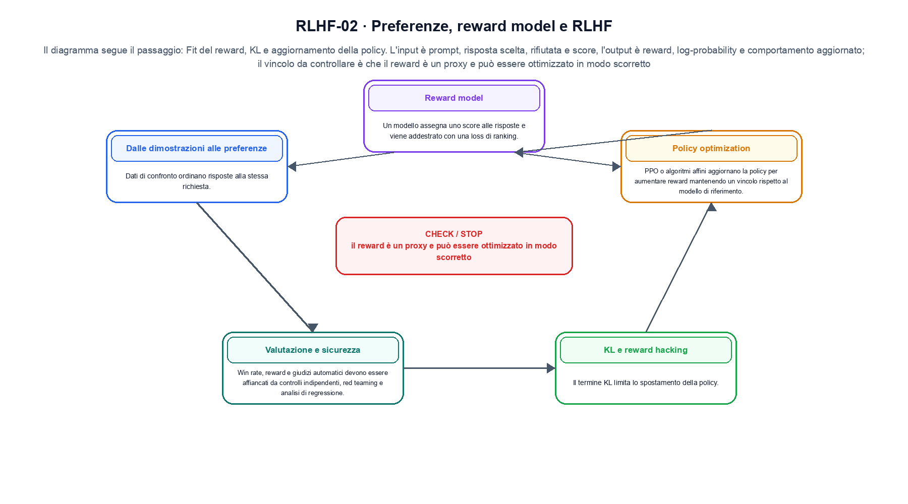

<!--
chapter_id: CH-P09-RLHF
part_id: P09
order_key: 480
title: Preferenze, reward model e RLHF
maturity: CORE
status: candidatura completa in revisione autoriale
version: 0.4.0-draft2
last_source_check: 3 agosto 2026
environment: Python 3.13.12, CPU
deferred: benchmark applicativi, varianti non necessarie al contratto centrale e approvazione autoriale
-->

# Capitolo 48. Preferenze, reward model e RLHF

La richiesta «Il pacco non è arrivato» resta il caso guida. In questo capitolo la usiamo per distinguere dimostrazioni, preferenze, reward model e policy, trasformazione e risultato, senza nascondere i dettagli tecnici.

## Dalle dimostrazioni alle preferenze

Dati di confronto ordinano risposte alla stessa richiesta. Il protocollo deve registrare istruzioni ai valutatori, accordo e slice. [SRC-48-001]

Per capire «Dalle dimostrazioni alle preferenze» partiamo da questo caso: due risposte per lo stesso prompt ricevono score di reward diversi e una penalità KL separata. Il caso rende osservabile il punto centrale: «Dati di confronto ordinano risposte alla stessa richiesta».

Nel contratto locale, l'input «prompt, risposta scelta, rifiutata e score» entra, l'operazione «fit del reward, KL e aggiornamento della policy» modifica il percorso e l'output «reward, log-probability e comportamento aggiornato» è ciò che osserviamo. Qui cambia soprattutto il passaggio «Dalle dimostrazioni alle preferenze»; resta da controllare che il reward è un proxy e può essere ottimizzato in modo scorretto. La domanda locale è «Dati di confronto ordinano risposte alla stessa richiesta».

Il passaggio da seguire in «Dalle dimostrazioni alle preferenze» è quello descritto dalla frase «Dati di confronto ordinano risposte alla stessa richiesta»: l'esempio rende osservabile la trasformazione, mentre il contratto del capitolo ne delimita l'interpretazione. Per «Dalle dimostrazioni alle preferenze» il controllo cambia una sola premessa della frase «Dati di confronto ordinano risposte alla stessa richiesta» e conserva input, output e criterio di successo, così la differenza resta attribuibile. La verifica resta ancorata a «Dati di confronto ordinano risposte alla stessa richiesta». [SRC-48-001]

La lettura va fatta in ordine: prima il caso, poi la trasformazione, quindi la conseguenza. Il protocollo deve registrare istruzioni ai valutatori, accordo e slice. Il piccolo risultato resta un'illustrazione di «Dati di confronto ordinano risposte alla stessa richiesta», non una promessa generale.

Per verificare «Dalle dimostrazioni alle preferenze» cambiamo una sola condizione vicina alla frase «Dati di confronto ordinano risposte alla stessa richiesta», teniamo fermo il resto e registriamo l'output «reward, log-probability e comportamento aggiornato». Il caso negativo deve rendere riconoscibile la failure, non soltanto produrre un numero diverso. La sezione successiva, «Reward model», riceve l'output «reward, log-probability e comportamento aggiornato» come base, ma dovrà formulare e verificare la propria distinzione.

## Reward model

Un modello assegna uno score alle risposte e viene addestrato con una loss di ranking. Lo score è una stima del dataset di preferenze, non una misura universale di qualità. [SRC-48-002]

Il caso minimo di «Reward model» si presenta così: una traiettoria di due passi in cui l'azione scelta modifica lo stato successivo prima del reward. Non lo usiamo come decorazione: serve a rendere osservabile la frase «Un modello assegna uno score alle risposte e viene addestrato con una loss di ranking».

La sezione usa l'input «prompt, risposta scelta, rifiutata e score» come punto di partenza e l'output «reward, log-probability e comportamento aggiornato» come traccia d'uscita. La trasformazione concreta è «fit del reward, KL e aggiornamento della policy»; il caso non è completo se non dichiariamo anche che il reward è un proxy e può essere ottimizzato in modo scorretto. La condizione da isolare è «Un modello assegna uno score alle risposte e viene addestrato con una loss di ranking».

Un flow rende esplicito il percorso invertibile tra spazio semplice e dati. La densità deve tenere conto del Jacobiano, mentre il costo dipende dalla trasformazione o dalla soluzione numerica scelta. Per «Reward model» il controllo cambia una sola premessa della frase «Un modello assegna uno score alle risposte e viene addestrato con una loss di ranking» e conserva input, output e criterio di successo, così la differenza resta attribuibile. La verifica resta ancorata a «Un modello assegna uno score alle risposte e viene addestrato con una loss di ranking». [SRC-48-002]

Se cambiamo una premessa, dobbiamo riaprire l'interpretazione. Per «Reward model» conserviamo l'osservazione collegata a «Un modello assegna uno score alle risposte e viene addestrato con una loss di ranking» e lasciamo esplicitamente fuori ciò che non è stato misurato.

Il controllo minimo di «Reward model» confronta il caso dichiarato con una variazione che rompe la sua ipotesi. Se la failure non è distinguibile dall'esito valido, manca un'osservazione nel contratto di target, proxy e comportamento. Da «Reward model» portiamo l'output «reward, log-probability e comportamento aggiornato»; non portiamo invece una conclusione oltre il caso locale.

La figura RLHF-01 usa la famiglia pipeline. Il diagramma segue il passaggio: Fit del reward, KL e aggiornamento della policy. L'input è prompt, risposta scelta, rifiutata e score, l'output è reward, log-probability e comportamento aggiornato; il vincolo da controllare è che il reward è un proxy e può essere ottimizzato in modo scorretto.

## Policy optimization

PPO o algoritmi affini aggiornano la policy per aumentare reward mantenendo un vincolo rispetto al modello di riferimento. [SRC-48-003]

Prima del nome tecnico fissiamo la situazione: consideriamo una traiettoria di due passi in cui l'azione scelta modifica lo stato successivo prima del reward. Da qui possiamo leggere la conseguenza dichiarata da «PPO o algoritmi affini aggiornano la policy per aumentare reward mantenendo un vincolo rispetto al modello di riferimento».

Per ricostruire «Policy optimization» annotiamo l'input «prompt, risposta scelta, rifiutata e score», poi l'operazione «fit del reward, KL e aggiornamento della policy», infine l'output «reward, log-probability e comportamento aggiornato». Questa sequenza impedisce di scambiare una forma compatibile per il comportamento descritto dalla fonte. Il controllo parte da «PPO o algoritmi affini aggiornano la policy per aumentare reward mantenendo un vincolo rispetto al modello di riferimento».

Il passaggio da seguire in «Policy optimization» è quello descritto dalla frase «PPO o algoritmi affini aggiornano la policy per aumentare reward mantenendo un vincolo rispetto al modello di riferimento»: l'esempio rende osservabile la trasformazione, mentre il contratto del capitolo ne delimita l'interpretazione. Per «Policy optimization» il controllo cambia una sola premessa della frase «PPO o algoritmi affini aggiornano la policy per aumentare reward mantenendo un vincolo rispetto al modello di riferimento» e conserva input, output e criterio di successo, così la differenza resta attribuibile. La verifica resta ancorata a «PPO o algoritmi affini aggiornano la policy per aumentare reward mantenendo un vincolo rispetto al modello di riferimento». [SRC-48-003]

Il punto didattico di «Policy optimization» è separare ciò che la fonte afferma da ciò che il piccolo caso illustra. L'output «reward, log-probability e comportamento aggiornato» mostra il contratto locale, ma non sostituisce una misura sul sistema completo.

La prova di «Policy optimization» conserva input, operazione e output; poi esplicita quale parte di «PPO o algoritmi affini aggiornano la policy per aumentare reward mantenendo un vincolo rispetto al modello di riferimento» non è stata misurata. Così il test separa l'evidenza dall'inferenza. Il passaggio successivo, «KL e reward hacking», potrà cambiare una sola condizione, dichiarando il nuovo setup prima di interpretare il risultato.

## KL e reward hacking

Il termine KL limita lo spostamento della policy. Un reward imperfetto può essere sfruttato senza migliorare l'obiettivo umano. [SRC-48-004]

Per capire «KL e reward hacking» partiamo da questo caso: una traiettoria di due passi in cui l'azione scelta modifica lo stato successivo prima del reward. Il caso rende osservabile il punto centrale: «Il termine KL limita lo spostamento della policy».

Nel contratto locale, l'input «prompt, risposta scelta, rifiutata e score» entra, l'operazione «fit del reward, KL e aggiornamento della policy» modifica il percorso e l'output «reward, log-probability e comportamento aggiornato» è ciò che osserviamo. Qui cambia soprattutto il passaggio «KL e reward hacking»; resta da controllare che il reward è un proxy e può essere ottimizzato in modo scorretto. La domanda locale è «Il termine KL limita lo spostamento della policy».

Il passaggio da seguire in «KL e reward hacking» è quello descritto dalla frase «Il termine KL limita lo spostamento della policy»: l'esempio rende osservabile la trasformazione, mentre il contratto del capitolo ne delimita l'interpretazione. Per «KL e reward hacking» il controllo cambia una sola premessa della frase «Il termine KL limita lo spostamento della policy» e conserva input, output e criterio di successo, così la differenza resta attribuibile. La verifica resta ancorata a «Il termine KL limita lo spostamento della policy». [SRC-48-004]

La lettura va fatta in ordine: prima il caso, poi la trasformazione, quindi la conseguenza. Un reward imperfetto può essere sfruttato senza migliorare l'obiettivo umano. Il piccolo risultato resta un'illustrazione di «Il termine KL limita lo spostamento della policy», non una promessa generale.

Per verificare «KL e reward hacking» cambiamo una sola condizione vicina alla frase «Il termine KL limita lo spostamento della policy», teniamo fermo il resto e registriamo l'output «reward, log-probability e comportamento aggiornato». Il caso negativo deve rendere riconoscibile la failure, non soltanto produrre un numero diverso. La sezione successiva, «Valutazione e sicurezza», riceve l'output «reward, log-probability e comportamento aggiornato» come base, ma dovrà formulare e verificare la propria distinzione.

## Valutazione e sicurezza

Win rate, reward e giudizi automatici devono essere affiancati da controlli indipendenti, red teaming e analisi di regressione. [SRC-48-001]

Il caso minimo di «Valutazione e sicurezza» si presenta così: due risposte con log-probabilità diverse producono un margine; il margine può diventare un segnale di training, ma non è una misura assoluta di correttezza. Non lo usiamo come decorazione: serve a rendere osservabile la frase «Win rate, reward e giudizi automatici devono essere affiancati da controlli indipendenti, red teaming e analisi di regressione».

La sezione usa l'input «prompt, risposta scelta, rifiutata e score» come punto di partenza e l'output «reward, log-probability e comportamento aggiornato» come traccia d'uscita. La trasformazione concreta è «fit del reward, KL e aggiornamento della policy»; il caso non è completo se non dichiariamo anche che il reward è un proxy e può essere ottimizzato in modo scorretto. La condizione da isolare è «Win rate, reward e giudizi automatici devono essere affiancati da controlli indipendenti, red teaming e analisi di regressione».

Una valutazione deve collegare claim, popolazione, protocollo e decisione. Media, slice, failure, giudice e incertezza misurano aspetti diversi e non diventano intercambiabili perché condividono una tabella. Il controllo separa raccolta di traiettorie e confronto delle policy, riportando ritorno, dispersione e vincoli come misure diverse. La verifica resta ancorata a «Win rate, reward e giudizi automatici devono essere affiancati da controlli indipendenti, red teaming e analisi di regressione». [SRC-48-001]

Se cambiamo una premessa, dobbiamo riaprire l'interpretazione. Per «Valutazione e sicurezza» conserviamo l'osservazione collegata a «Win rate, reward e giudizi automatici devono essere affiancati da controlli indipendenti, red teaming e analisi di regressione» e lasciamo esplicitamente fuori ciò che non è stato misurato.

Il controllo minimo di «Valutazione e sicurezza» confronta il caso dichiarato con una variazione che rompe la sua ipotesi. Se la failure non è distinguibile dall'esito valido, manca un'osservazione nel contratto di target, proxy e comportamento. La conclusione resta ancorata al protocollo osservato, non al nome della tecnica.

## La definizione messa alla prova: Dalle dimostrazioni alle preferenze

Il caso intero parte dall'input «prompt, risposta scelta, rifiutata e score», applica l'operazione «fit del reward, KL e aggiornamento della policy» e osserva l'output «reward, log-probability e comportamento aggiornato». Un esempio controllato: due risposte con margine di reward e penalità KL. La formula locale è:

$$
r_theta = log pi_theta(y|x) - log pi_ref(y|x)
$$

Il confronto tra policy richiede una policy di riferimento e uno stesso prompt. [SRC-48-001]

La figura RLHF-02 cambia composizione rispetto alla prima. Il diagramma segue il passaggio: Fit del reward, KL e aggiornamento della policy. L'input è prompt, risposta scelta, rifiutata e score, l'output è reward, log-probability e comportamento aggiornato; il vincolo da controllare è che il reward è un proxy e può essere ottimizzato in modo scorretto.

## Un esperimento piccolo ma leggibile: Reward model

Nel run Python rendiamo osservabile la frase «Dati di confronto ordinano risposte alla stessa richiesta» con valori piccoli e leggibili. Il test associato verifica determinismo, output e rifiuto di una condizione incoerente; il file di output `code/outputs/SNIP-48-001.txt` documenta il caso senza pretendere una misura generale.

## Il confine del caso guida: Valutazione e sicurezza

Il meccanismo di «Preferenze, reward model e RLHF» non garantisce da solo che il sistema funzioni fuori dal caso guida. Il reward è un proxy e può essere ottimizzato in modo scorretto. Il limite osservato riguarda la frase «Dati di confronto ordinano risposte alla stessa richiesta»; per trasferire il concetto occorre riaprire la verifica quando cambiano dati, scala o ambiente.

## Il contratto che rimane: Preferenze, reward model e RLHF

Il percorso ha tenuto insieme dimostrazioni, preferenze, reward model e policy, l'operazione «fit del reward, KL e aggiornamento della policy» e l'output «reward, log-probability e comportamento aggiornato». Le sezioni «Dalle dimostrazioni alle preferenze», «Reward model», «Valutazione e sicurezza» mostrano come il protocollo osservato delimiti ciò che il capitolo può sostenere. L'invariante da portare avanti è: il reward è un proxy e può essere ottimizzato in modo scorretto. Il Capitolo 49, Ottimizzazione diretta delle preferenze, può partire da questo output e dichiarare la propria domanda.

### Controllo finale della lezione: Dalle dimostrazioni alle preferenze

1. Ricostruisci l'oggetto continuo a partire da «Dalle dimostrazioni alle preferenze» e indica quale parte della frase «Dati di confronto ordinano risposte alla stessa richiesta» entra nel caso.
2. Spiega quale trasformazione collega «Dalle dimostrazioni alle preferenze» a «Valutazione e sicurezza» e quale output osserviamo nel passaggio.
3. Usa lo snippet per controllare l'invariante del contratto: il reward è un proxy e può essere ottimizzato in modo scorretto.
4. Separa una definizione sostenuta da una fonte, un esempio illustrativo e un risultato locale del caso guida.
5. Indica quale parte della frase «Win rate, reward e giudizi automatici devono essere affiancati da controlli indipendenti, red teaming e analisi di regressione» richiederebbe una misura nuova prima di essere estesa oltre il caso osservato.

### Prove da rifare e modificare: Valutazione e sicurezza

1. Ricostruisci «Dalle dimostrazioni alle preferenze» senza usare il nome della tecnica, soltanto con input, operazione e output.
2. Sostituisci una condizione di «Reward model» e prevedi che cosa non dovrebbe cambiare.
3. Cerca un controesempio per «Policy optimization» e annota quale ipotesi viene rotta.
4. Trasforma il limite di «KL e reward hacking» in un test ripetibile.
5. Spiega come trasferire «Valutazione e sicurezza» senza portare con sé una promessa non misurata.

## Riferimenti e prove riproducibili: Preferenze, reward model e RLHF

Per «Preferenze, reward model e RLHF», le fonti portanti, i limiti dei claim e la data di consultazione sono raccolti in `FONTI_PRIMARIE.md`; la ricerca riguarda soprattutto target, proxy e comportamento. `CLAIMS.md` separa definizioni e risultati locali; codice, ambiente, test e output sono nella cartella `code/`, con attenzione a target, proxy e comportamento.
