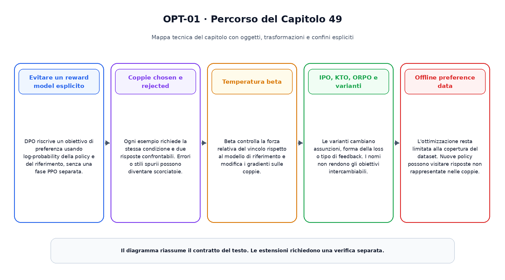
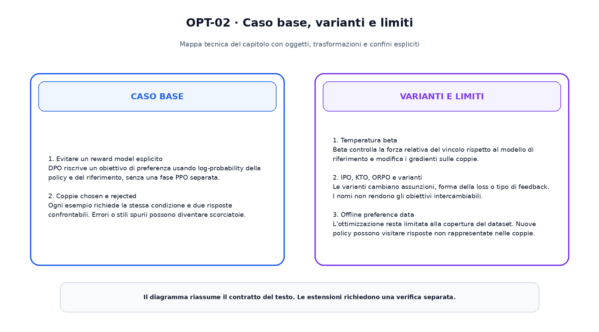

<!--
chapter_id: CH-P09-PREFERENCE-OPT
part_id: P09
order_key: 490
title: Ottimizzazione diretta delle preferenze
maturity: ESTABLISHED
status: candidatura completa in revisione autoriale
version: 0.2.0-rc1
last_source_check: 2026-08-02
-->

# Capitolo 49. Ottimizzazione diretta delle preferenze

Il capitolo precedente ha consegnato il prerequisito immediato. Ora riprendiamo lo stesso oggetto continuo, la richiesta «Il pacco non è arrivato», e aggiungiamo una sola nuova capacità. Il caso concreto precede i termini tecnici e le formule.

## Evitare un reward model esplicito

DPO riscrive un obiettivo di preferenza usando log-probability della policy e del riferimento, senza una fase PPO separata.

Per leggere questo passaggio conviene distinguere l'oggetto disponibile, l'operazione applicata e il risultato osservabile. La descrizione non attribuisce al modello proprietà che non sono state misurate. Il limite dichiarato prepara il passaggio successivo senza trasformarlo in un prerequisito nascosto.
## Coppie chosen e rejected

Ogni esempio richiede la stessa condizione e due risposte confrontabili. Errori o stili spurii possono diventare scorciatoie.

Per leggere questo passaggio conviene distinguere l'oggetto disponibile, l'operazione applicata e il risultato osservabile. La descrizione non attribuisce al modello proprietà che non sono state misurate. Il limite dichiarato prepara il passaggio successivo senza trasformarlo in un prerequisito nascosto.
## Temperatura beta

Beta controlla la forza relativa del vincolo rispetto al modello di riferimento e modifica i gradienti sulle coppie.

Per leggere questo passaggio conviene distinguere l'oggetto disponibile, l'operazione applicata e il risultato osservabile. La descrizione non attribuisce al modello proprietà che non sono state misurate. Il limite dichiarato prepara il passaggio successivo senza trasformarlo in un prerequisito nascosto.
## IPO, KTO, ORPO e varianti

Le varianti cambiano assunzioni, forma della loss o tipo di feedback. I nomi non rendono gli obiettivi intercambiabili.

Per leggere questo passaggio conviene distinguere l'oggetto disponibile, l'operazione applicata e il risultato osservabile. La descrizione non attribuisce al modello proprietà che non sono state misurate. Il limite dichiarato prepara il passaggio successivo senza trasformarlo in un prerequisito nascosto.
## Offline preference data

L'ottimizzazione resta limitata alla copertura del dataset. Nuove policy possono visitare risposte non rappresentate nelle coppie.

Per leggere questo passaggio conviene distinguere l'oggetto disponibile, l'operazione applicata e il risultato osservabile. La descrizione non attribuisce al modello proprietà che non sono state misurate. Il limite dichiarato prepara il passaggio successivo senza trasformarlo in un prerequisito nascosto.

La prima figura mostra il percorso causale del capitolo.

La seconda figura mantiene separati il caso base e le estensioni.

## Snippet verificabile

Il file [`code/snip_49_contract.py`](code/snip_49_contract.py) rende osservabile un contratto numerico minimo. È un esempio didattico e non un benchmark di produzione.

## Riepilogo

Abbiamo costruito ottimizzazione diretta delle preferenze a partire dai prerequisiti disponibili. Oggetti, trasformazioni, varianti e limiti restano distinti. Il risultato viene consegnato al capitolo successivo.

### Verifica della comprensione ed esercizi

1. Ricostruisci l'ordine dei passaggi senza consultare la figura.
2. Indica quale oggetto cambia e quale rimane invariato.
3. Modifica lo snippet e verifica un caso limite.
4. Distingui il meccanismo base da una variante citata.
5. Formula un claim che non superi l'evidenza disponibile.

## Fonti e materiali verificabili

Le fonti e i limiti d'uso sono in [`FONTI_PRIMARIE.md`](FONTI_PRIMARIE.md). Claim, codice, test e output sono versionati nella cartella del capitolo.
