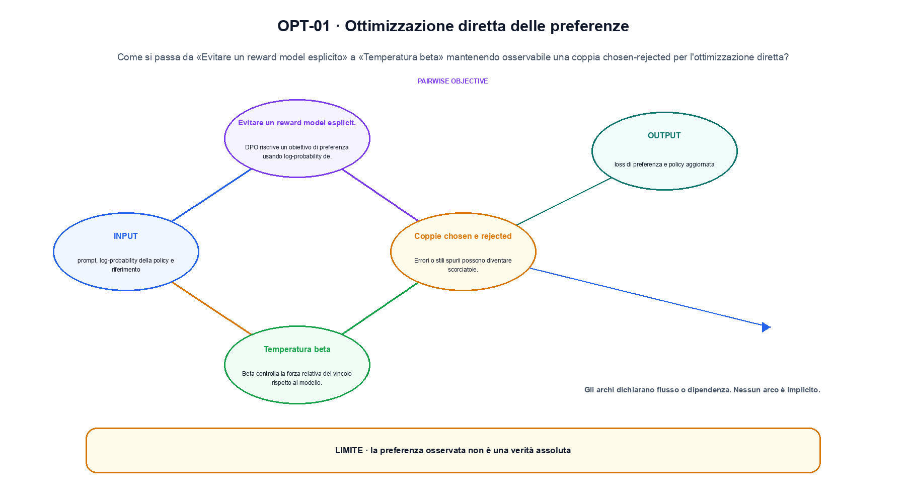
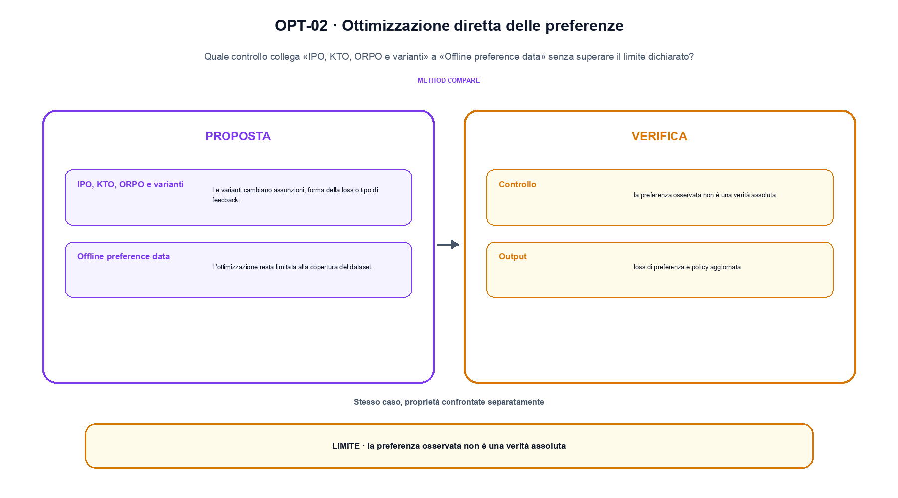

<!--
chapter_id: CH-P09-PREFERENCE-OPT
part_id: P09
order_key: 490
title: Ottimizzazione diretta delle preferenze
maturity: ESTABLISHED
status: revisione editoriale v2, approvazione autoriale aperta
version: 0.5.0-draft3
last_source_check: 4 agosto 2026
environment: Python 3.13.12, CPU
code_policy: reference
deferred: benchmark applicativi non eseguiti e approvazione autoriale delle visuali
-->

# Capitolo 49. Ottimizzazione diretta delle preferenze

Qui ottimizzazione diretta delle preferenze viene osservato come un meccanismo: il percorso va da «Evitare un reward model esplicito» a «Offline preference data». L'oggetto osservato è una coppia chosen-rejected per l'ottimizzazione diretta. Il contratto locale dichiara input, prompt, log-probability della policy e riferimento; operazione, margine DPO, beta e variante offline; output, loss di preferenza e policy aggiornata. Il primo esempio osservabile è Un margine di policy pari a 0,8, un margine di riferimento pari a 0,2 e beta pari a 0,5 producono un logit di preferenza pari a 0,3. Il limite da non nascondere è: la preferenza osservata non è una verità assoluta.

## Evitare un reward model esplicito

DPO riscrive un obiettivo di preferenza usando log-probability della policy e del riferimento, senza una fase PPO separata. [SRC-49-001]

DPO usa il margine di preferenza senza presentarlo come verità assoluta.

**Caso da seguire.** Un margine di policy pari a 0,8, un margine di riferimento pari a 0,2 e beta pari a 0,5 producono un logit di preferenza pari a 0,3.

**Controllo.** Per «Evitare un reward model esplicito», scrivi il risultato atteso prima del calcolo, modifica una sola quantità e localizza il primo passaggio che cambia. Nel caso «Evitare un reward model esplicito», il vincolo da conservare è: DPO riscrive un obiettivo di preferenza usando log-probability della policy e del riferimento, senza una fase PPO separata.


## Coppie chosen e rejected

Ogni esempio richiede la stessa condizione e due risposte confrontabili. Errori o stili spurii possono diventare scorciatoie. [SRC-49-002]

**Caso da seguire.** Margine 0,8 con beta dichiarato e riferimento invariato.

**Controllo.** Per «Coppie chosen e rejected», ricalcola il caso a mano e con lo snippet. Nel caso «Coppie chosen e rejected», se i risultati divergono, confronta prima i valori intermedi e soltanto dopo l'output finale.


La relazione centrale può essere scritta come:

$$
L_DPO = -log sigma(beta (r_c - r_r))
$$

DPO usa il margine di preferenza senza presentarlo come verità assoluta. [SRC-49-001]




La prima figura segue il percorso da «Evitare un reward model esplicito» a «Temperatura beta».


## Temperatura beta

Beta controlla la forza relativa del vincolo rispetto al modello di riferimento e modifica i gradienti sulle coppie. [SRC-49-003]

**Caso da seguire.** Un caso in cui la preferenza osservata non è una verità assoluta.

**Controllo.** Per «Temperatura beta», aggiungi un valore limite e verifica separatamente forma, valore e ipotesi. Una shape valida non dimostra da sola «Temperatura beta».


## IPO, KTO, ORPO e varianti

Le varianti cambiano assunzioni, forma della loss o tipo di feedback. I nomi non rendono gli obiettivi intercambiabili. [SRC-49-004]

**Caso da seguire.** Due risposte con log-probabilità diverse producono un margine; il margine può diventare un segnale di training, ma non è una misura assoluta di correttezza.

**Controllo.** Per «IPO, KTO, ORPO e varianti», mantieni fisso l'input e sostituisci soltanto il meccanismo discusso nella sezione. Nel caso «IPO, KTO, ORPO e varianti», il confronto deve attribuire la differenza a quel passaggio, non al setup.


## Esempio Python eseguito

Il caso computazionale di ottimizzazione diretta delle preferenze è riportato senza trasformazioni: il file e l'output sono quelli verificati. Per «Ottimizzazione diretta delle preferenze», il caso di default usa valori piccoli per isolare il meccanismo. La suite conserva inoltre una failure esplicita per separare il contratto osservato da «ottimizzazione diretta delle preferenze».

```python
def contract(case: str = "default"):
    if case != "default":
        raise ValueError("only the documented default case is supported")
    policy_margin = 0.8
    reference_margin = 0.2
    beta = 0.5
    preference_logit = beta * (policy_margin - reference_margin)
    loss = math.log1p(math.exp(-preference_logit))
    return {"preference_logit": round(preference_logit, 6), "loss": round(loss, 6), "invariant": "DPO uses a policy-versus-reference margin"}
```

Esecuzione con `python snip_49_contract.py`:

```text
{"invariant": "DPO uses a policy-versus-reference margin", "loss": 0.554355, "preference_logit": 0.3}
```

Il test associato è [`code/test_49_contract.py`](code/test_49_contract.py); l'output versionato è [`code/outputs/SNIP-49-001.txt`](code/outputs/SNIP-49-001.txt).


## Offline preference data

L'ottimizzazione resta limitata alla copertura del dataset. Nuove policy possono visitare risposte non rappresentate nelle coppie. [SRC-49-001]

**Caso da seguire.** Due record con ID, testo, licenza e timestamp che attraversano una sola trasformazione registrata.

**Controllo.** Per «Offline preference data», costruisci un controesempio che rispetti il tipo di dato ma violi l'ipotesi centrale. Il test deve rendere riconoscibile perché «Offline preference data» non si applica.




La seconda figura mette a confronto «IPO, KTO, ORPO e varianti» e il limite discusso in «Offline preference data».


## Come si collegano i passaggi

- **Da «Evitare un reward model esplicito» a «Coppie chosen e rejected».** DPO riscrive un obiettivo di preferenza usando log-probability della policy e del riferimento, senza una fase PPO separata. Ogni esempio richiede la stessa condizione e due risposte confrontabili. Tra «Evitare un reward model esplicito» e «Coppie chosen e rejected» l'ingresso viene fissato prima della regola che produce il valore. Da «Evitare un reward model esplicito» a «Coppie chosen e rejected» cambia la domanda osservabile. [SRC-49-001; SRC-49-002]

- **Da «Coppie chosen e rejected» a «Temperatura beta».** Ogni esempio richiede la stessa condizione e due risposte confrontabili. Beta controlla la forza relativa del vincolo rispetto al modello di riferimento e modifica i gradienti sulle coppie. Nel caso «Temperatura beta» il componente diventa il punto in cui localizzare l'errore. Il passaggio successivo rende misurabile «Temperatura beta». [SRC-49-002; SRC-49-003]

- **Da «Temperatura beta» a «IPO, KTO, ORPO e varianti».** Beta controlla la forza relativa del vincolo rispetto al modello di riferimento e modifica i gradienti sulle coppie. Le varianti cambiano assunzioni, forma della loss o tipo di feedback. Dopo «Temperatura beta», la variante di «IPO, KTO, ORPO e varianti» cambia una proprietà alla volta. Da «Temperatura beta» a «IPO, KTO, ORPO e varianti» cambia la domanda osservabile. [SRC-49-003; SRC-49-004]

- **Da «IPO, KTO, ORPO e varianti» a «Offline preference data».** Le varianti cambiano assunzioni, forma della loss o tipo di feedback. L'ottimizzazione resta limitata alla copertura del dataset. Da «Offline preference data» in poi la misura resta distinta dalla correttezza locale del calcolo. Il passaggio successivo rende misurabile «Offline preference data». [SRC-49-004; SRC-49-001]

La catena completa produce loss di preferenza e policy aggiornata a partire da prompt, log-probability della policy e riferimento. Ogni collegamento conserva un oggetto osservabile diverso; per questo il risultato non può essere esteso oltre il limite dichiarato: la preferenza osservata non è una verità assoluta.


## Esercizi sul meccanismo

1. Ricostruisci «Evitare un reward model esplicito» con un esempio diverso da quello mostrato e indica l'output atteso prima del calcolo.
2. Nel passaggio «Coppie chosen e rejected», cambia una sola ipotesi e spiega quale risultato non è più confrontabile.
3. Collega «Temperatura beta» a una riga dello snippet oppure motiva perché la prova deve essere documentale.
4. Progetta un caso limite per «IPO, KTO, ORPO e varianti» che produca una failure riconoscibile.
5. Per «Offline preference data», separa una conclusione sostenuta dal caso locale da una che richiederebbe nuovi dati o un benchmark.


## Che cosa deve restare chiaro

La lezione parte da «prompt, log-probability della policy e riferimento» e arriva fino a «loss di preferenza e policy aggiornata». Il limite da conservare è questo: la preferenza osservata non è una verità assoluta. La formula e il codice collegati a «Offline preference data» sono rintracciabili in [`FONTI_PRIMARIE.md`](FONTI_PRIMARIE.md), [`CLAIMS.md`](CLAIMS.md) e `code/`.
