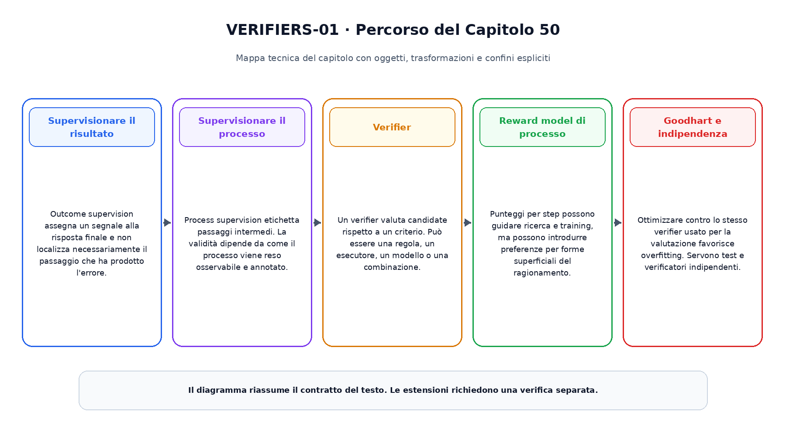
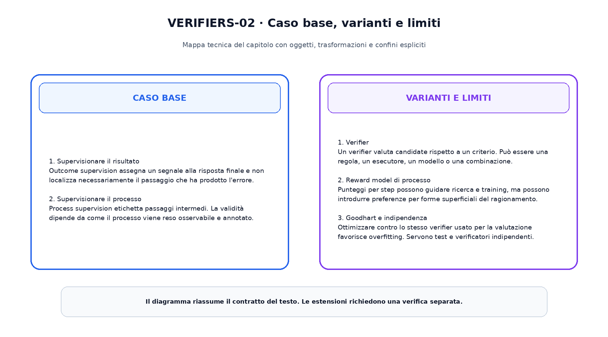

<!--
chapter_id: CH-P09-SUPERVISION-VERIFIERS
part_id: P09
order_key: 500
title: Process supervision, outcome supervision e verifier
maturity: ESTABLISHED
status: candidatura completa in revisione autoriale
version: 0.2.0-rc1
last_source_check: 2026-08-02
-->

# Capitolo 50. Process supervision, outcome supervision e verifier

Il capitolo precedente ha consegnato il prerequisito immediato. Ora riprendiamo lo stesso oggetto continuo, la richiesta «Il pacco non è arrivato», e aggiungiamo una sola nuova capacità. Il caso concreto precede i termini tecnici e le formule.

## Supervisionare il risultato

Outcome supervision assegna un segnale alla risposta finale e non localizza necessariamente il passaggio che ha prodotto l'errore.

Per leggere questo passaggio conviene distinguere l'oggetto disponibile, l'operazione applicata e il risultato osservabile. La descrizione non attribuisce al modello proprietà che non sono state misurate. Il limite dichiarato prepara il passaggio successivo senza trasformarlo in un prerequisito nascosto.
## Supervisionare il processo

Process supervision etichetta passaggi intermedi. La validità dipende da come il processo viene reso osservabile e annotato.

Per leggere questo passaggio conviene distinguere l'oggetto disponibile, l'operazione applicata e il risultato osservabile. La descrizione non attribuisce al modello proprietà che non sono state misurate. Il limite dichiarato prepara il passaggio successivo senza trasformarlo in un prerequisito nascosto.
## Verifier

Un verifier valuta candidate rispetto a un criterio. Può essere una regola, un esecutore, un modello o una combinazione.

Per leggere questo passaggio conviene distinguere l'oggetto disponibile, l'operazione applicata e il risultato osservabile. La descrizione non attribuisce al modello proprietà che non sono state misurate. Il limite dichiarato prepara il passaggio successivo senza trasformarlo in un prerequisito nascosto.
## Reward model di processo

Punteggi per step possono guidare ricerca e training, ma possono introdurre preferenze per forme superficiali del ragionamento.

Per leggere questo passaggio conviene distinguere l'oggetto disponibile, l'operazione applicata e il risultato osservabile. La descrizione non attribuisce al modello proprietà che non sono state misurate. Il limite dichiarato prepara il passaggio successivo senza trasformarlo in un prerequisito nascosto.
## Goodhart e indipendenza

Ottimizzare contro lo stesso verifier usato per la valutazione favorisce overfitting. Servono test e verificatori indipendenti.

Per leggere questo passaggio conviene distinguere l'oggetto disponibile, l'operazione applicata e il risultato osservabile. La descrizione non attribuisce al modello proprietà che non sono state misurate. Il limite dichiarato prepara il passaggio successivo senza trasformarlo in un prerequisito nascosto.

La prima figura mostra il percorso causale del capitolo.

La seconda figura mantiene separati il caso base e le estensioni.

## Snippet verificabile

Il file [`code/snip_50_contract.py`](code/snip_50_contract.py) rende osservabile un contratto numerico minimo. È un esempio didattico e non un benchmark di produzione.

## Riepilogo

Abbiamo costruito process supervision, outcome supervision e verifier a partire dai prerequisiti disponibili. Oggetti, trasformazioni, varianti e limiti restano distinti. Il risultato viene consegnato al capitolo successivo.

### Verifica della comprensione ed esercizi

1. Ricostruisci l'ordine dei passaggi senza consultare la figura.
2. Indica quale oggetto cambia e quale rimane invariato.
3. Modifica lo snippet e verifica un caso limite.
4. Distingui il meccanismo base da una variante citata.
5. Formula un claim che non superi l'evidenza disponibile.

## Fonti e materiali verificabili

Le fonti e i limiti d'uso sono in [`FONTI_PRIMARIE.md`](FONTI_PRIMARIE.md). Claim, codice, test e output sono versionati nella cartella del capitolo.
