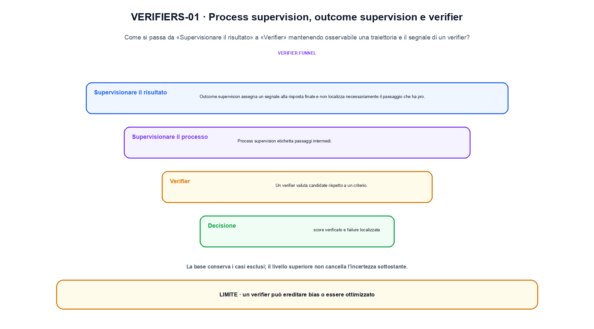
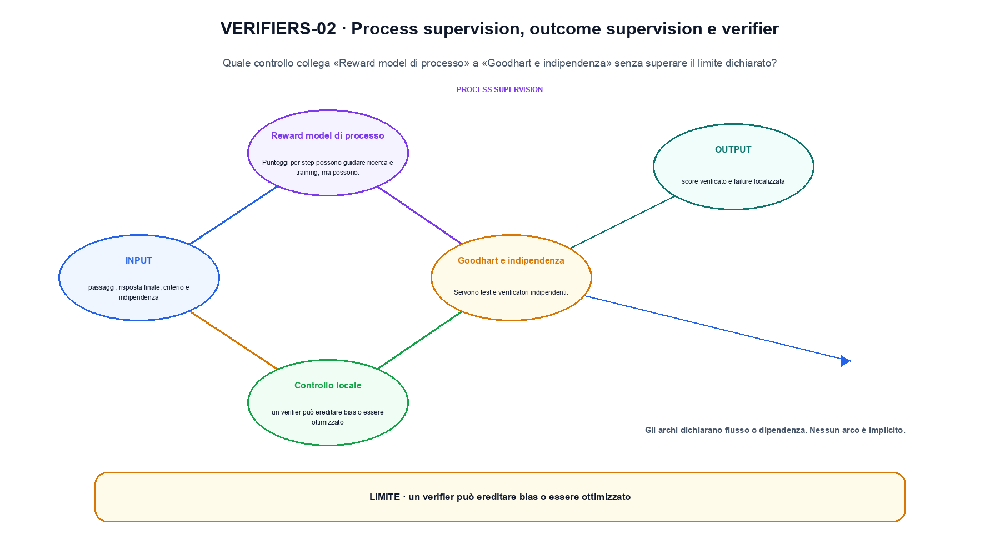

<!--
chapter_id: CH-P09-SUPERVISION-VERIFIERS
part_id: P09
order_key: 500
title: Process supervision, outcome supervision e verifier
maturity: ESTABLISHED
status: revisione editoriale v2, approvazione autoriale aperta
version: 0.5.0-draft3
last_source_check: 4 agosto 2026
environment: Python 3.13.12, CPU
code_policy: reference
deferred: benchmark applicativi non eseguiti e approvazione autoriale delle visuali
-->

# Capitolo 50. Process supervision, outcome supervision e verifier

La lezione prende un caso piccolo e lo accompagna da «Supervisionare il risultato» fino a «Goodhart e indipendenza», senza saltare i passaggi. L'oggetto osservato è una traiettoria e il segnale di un verifier. Il contratto locale dichiara input, passaggi, risposta finale, criterio e indipendenza; operazione, process supervision, outcome supervision e verifica; output, score verificato e failure localizzata. Per fissare il riferimento usiamo Tre risposte passano davanti a un verifier che accetta soltanto il risultato corretto. Il limite da non nascondere è: un verifier può ereditare bias o essere ottimizzato.

## Supervisionare il risultato

Outcome supervision assegna un segnale alla risposta finale e non localizza necessariamente il passaggio che ha prodotto l'errore. [SRC-50-001]

Un verificatore di processo può osservare passaggi, esito o entrambi.

**Caso da seguire.** Tre risposte passano davanti a un verifier che accetta soltanto il risultato corretto.

**Controllo.** Per «Supervisionare il risultato», scrivi il risultato atteso prima del calcolo, modifica una sola quantità e localizza il primo passaggio che cambia. Nel caso «Supervisionare il risultato», il vincolo da conservare è: Outcome supervision assegna un segnale alla risposta finale e non localizza necessariamente il passaggio che ha prodotto l'errore.


## Supervisionare il processo

Process supervision etichetta passaggi intermedi. La validità dipende da come il processo viene reso osservabile e annotato. [SRC-50-002]

**Caso da seguire.** Una griglia 3x3 e un kernel 2x2 in cui una sola posizione dell'output viene calcolata a mano.

**Controllo.** Per «Supervisionare il processo», ricalcola il caso a mano e con lo snippet. Nel caso «Supervisionare il processo», se i risultati divergono, confronta prima i valori intermedi e soltanto dopo l'output finale.


La relazione centrale può essere scritta come:

$$
score = verify(trace, outcome)
$$

Un verificatore di processo può osservare passaggi, esito o entrambi. [SRC-50-001]




La prima figura segue il percorso da «Supervisionare il risultato» a «Verifier».


## Verifier

Un verifier valuta candidate rispetto a un criterio. Può essere una regola, un esecutore, un modello o una combinazione. [SRC-50-003]

**Caso da seguire.** Un caso in cui un verifier può ereditare bias o essere ottimizzato.

**Controllo.** Per «Verifier», aggiungi un valore limite e verifica separatamente forma, valore e ipotesi. Una shape valida non dimostra da sola «Verifier».


## Reward model di processo

Punteggi per step possono guidare ricerca e training, ma possono introdurre preferenze per forme superficiali del ragionamento. [SRC-50-004]

**Caso da seguire.** Una traiettoria di due passi in cui l'azione scelta modifica lo stato successivo prima del reward.

**Controllo.** Per «Reward model di processo», mantieni fisso l'input e sostituisci soltanto il meccanismo discusso nella sezione. Nel caso «Reward model di processo», il confronto deve attribuire la differenza a quel passaggio, non al setup.


## Esempio Python eseguito

Questa sezione apre il contratto Python di process supervision, outcome supervision e verifier: il lettore può eseguire lo stesso file e confrontare il risultato. Per «Process supervision, outcome supervision e verifier», il caso di default usa valori piccoli per isolare il meccanismo. Il caso non supportato viene provato separatamente, così «process supervision, outcome supervision e verifier» non viene generalizzato oltre l'esempio.

```python
def contract(case: str = "default"):
    if case != "default":
        raise ValueError("only the documented default case is supported")
    answers = ["4", "5", "4"]
    def verifier(answer):
        return answer == "4"
    accepted = [answer for answer in answers if verifier(answer)]
    return {"accepted": accepted, "acceptance_rate": len(accepted) / len(answers), "invariant": "a verifier is an explicit signal with its own error surface"}
```

Esecuzione con `python snip_50_contract.py`:

```text
{"acceptance_rate": 0.6666666666666666, "accepted": ["4", "4"], "invariant": "a verifier is an explicit signal with its own error surface"}
```

Il test associato è [`code/test_50_contract.py`](code/test_50_contract.py); l'output versionato è [`code/outputs/SNIP-50-001.txt`](code/outputs/SNIP-50-001.txt).


## Goodhart e indipendenza

Ottimizzare contro lo stesso verifier usato per la valutazione favorisce overfitting. Servono test e verificatori indipendenti. [SRC-50-001]

**Caso da seguire.** Due risposte con log-probabilità diverse producono un margine; il margine può diventare un segnale di training, ma non è una misura assoluta di correttezza.

**Controllo.** Per «Goodhart e indipendenza», costruisci un controesempio che rispetti il tipo di dato ma violi l'ipotesi centrale. Il test deve rendere riconoscibile perché «Goodhart e indipendenza» non si applica.




La seconda figura mette a confronto «Reward model di processo» e il limite discusso in «Goodhart e indipendenza».


## Come si collegano i passaggi

- **Da «Supervisionare il risultato» a «Supervisionare il processo».** Outcome supervision assegna un segnale alla risposta finale e non localizza necessariamente il passaggio che ha prodotto l'errore. Process supervision etichetta passaggi intermedi. Tra «Supervisionare il risultato» e «Supervisionare il processo» l'ingresso viene fissato prima della regola che produce il valore. Il passaggio successivo rende misurabile «Supervisionare il processo». [SRC-50-001; SRC-50-002]

- **Da «Supervisionare il processo» a «Verifier».** Process supervision etichetta passaggi intermedi. Un verifier valuta candidate rispetto a un criterio. Nel caso «Verifier» il componente diventa il punto in cui localizzare l'errore. Da «Supervisionare il processo» a «Verifier» cambia la domanda osservabile. [SRC-50-002; SRC-50-003]

- **Da «Verifier» a «Reward model di processo».** Un verifier valuta candidate rispetto a un criterio. Punteggi per step possono guidare ricerca e training, ma possono introdurre preferenze per forme superficiali del ragionamento. Dopo «Verifier», la variante di «Reward model di processo» cambia una proprietà alla volta. Il passaggio successivo rende misurabile «Reward model di processo». [SRC-50-003; SRC-50-004]

- **Da «Reward model di processo» a «Goodhart e indipendenza».** Punteggi per step possono guidare ricerca e training, ma possono introdurre preferenze per forme superficiali del ragionamento. Ottimizzare contro lo stesso verifier usato per la valutazione favorisce overfitting. Da «Goodhart e indipendenza» in poi la misura resta distinta dalla correttezza locale del calcolo. Da «Reward model di processo» a «Goodhart e indipendenza» cambia la domanda osservabile. [SRC-50-004; SRC-50-001]

La catena completa produce score verificato e failure localizzata a partire da passaggi, risposta finale, criterio e indipendenza. Ogni collegamento conserva un oggetto osservabile diverso; per questo il risultato non può essere esteso oltre il limite dichiarato: un verifier può ereditare bias o essere ottimizzato.


## Esercizi sul meccanismo

1. Ricostruisci «Supervisionare il risultato» con un esempio diverso da quello mostrato e indica l'output atteso prima del calcolo.
2. Nel passaggio «Supervisionare il processo», cambia una sola ipotesi e spiega quale risultato non è più confrontabile.
3. Collega «Verifier» a una riga dello snippet oppure motiva perché la prova deve essere documentale.
4. Progetta un caso limite per «Reward model di processo» che produca una failure riconoscibile.
5. Per «Goodhart e indipendenza», separa una conclusione sostenuta dal caso locale da una che richiederebbe nuovi dati o un benchmark.


## Che cosa deve restare chiaro

La lezione parte da «passaggi, risposta finale, criterio e indipendenza» e arriva fino a «score verificato e failure localizzata». Il limite da conservare è questo: un verifier può ereditare bias o essere ottimizzato. La formula e il codice collegati a «Goodhart e indipendenza» sono rintracciabili in [`FONTI_PRIMARIE.md`](FONTI_PRIMARIE.md), [`CLAIMS.md`](CLAIMS.md) e `code/`.
