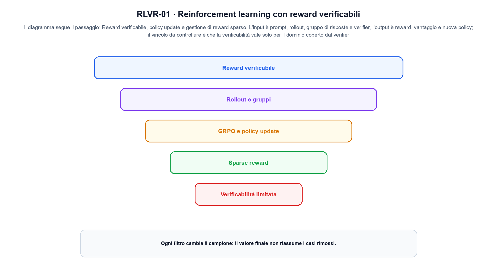
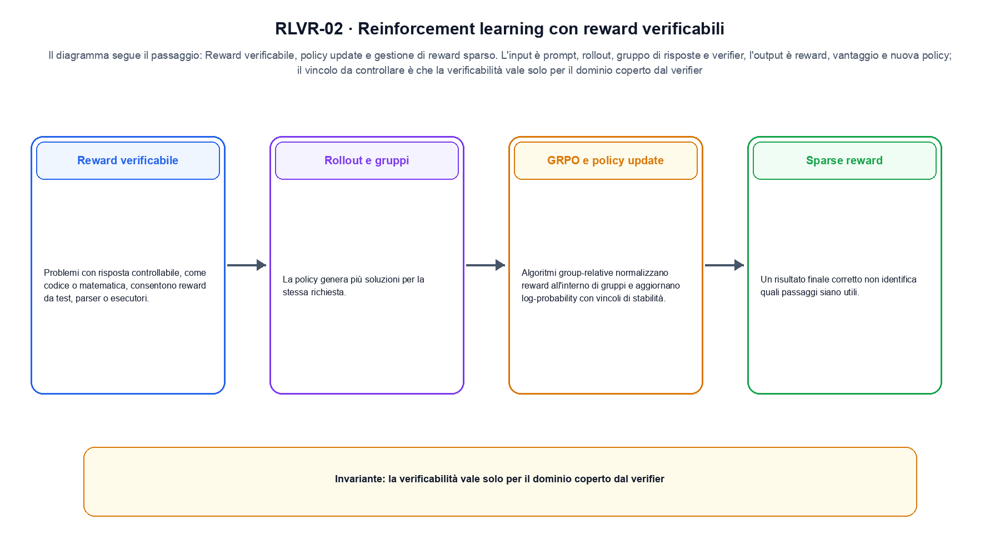

<!--
chapter_id: CH-P09-RLVR
part_id: P09
order_key: 510
title: Reinforcement learning con reward verificabili
maturity: ESTABLISHED
status: candidatura completa in revisione autoriale
version: 0.4.0-draft2
last_source_check: 3 agosto 2026
environment: Python 3.13.12, CPU
deferred: benchmark applicativi, varianti non necessarie al contratto centrale e approvazione autoriale
-->

# Capitolo 51. Reinforcement learning con reward verificabili

Finora abbiamo potuto descrivere una risposta valutata da una regola verificabile. La richiesta «Il pacco non è arrivato» resta lo scenario condiviso: nel Capitolo 51 prendiamo l'input «prompt, rollout, gruppo di risposte e verifier» e lo seguiamo fino all'output «reward, vantaggio e nuova policy», dichiarando prima il contratto e poi il limite.

## Reward verificabile

Problemi con risposta controllabile, come codice o matematica, consentono reward da test, parser o esecutori. [SRC-51-001]

Per capire «Reward verificabile» partiamo da questo caso: tre rollout ricevono reward 1, 0 e 1; il vantaggio viene centrato sulla media del gruppo. Il caso rende osservabile il punto centrale: «Problemi con risposta controllabile, come codice o matematica, consentono reward da test, parser o esecutori».

Nel contratto locale, l'input «prompt, rollout, gruppo di risposte e verifier» entra, l'operazione «reward verificabile, policy update e gestione di reward sparso» modifica il percorso e l'output «reward, vantaggio e nuova policy» è ciò che osserviamo. Qui cambia soprattutto il passaggio «Reward verificabile»; resta da controllare che la verificabilità vale solo per il dominio coperto dal verifier. La domanda locale è «Problemi con risposta controllabile, come codice o matematica, consentono reward da test, parser o esecutori».

Il passaggio da seguire in «Reward verificabile» è quello descritto dalla frase «Problemi con risposta controllabile, come codice o matematica, consentono reward da test, parser o esecutori»: l'esempio rende osservabile la trasformazione, mentre il contratto del capitolo ne delimita l'interpretazione. Per «Reward verificabile» il controllo cambia una sola premessa della frase «Problemi con risposta controllabile, come codice o matematica, consentono reward da test, parser o esecutori» e conserva input, output e criterio di successo, così la differenza resta attribuibile. La verifica resta ancorata a «Problemi con risposta controllabile, come codice o matematica, consentono reward da test, parser o esecutori». [SRC-51-001]

La lettura va fatta in ordine: prima il caso, poi la trasformazione, quindi la conseguenza. Il piccolo risultato resta un'illustrazione di «Problemi con risposta controllabile, come codice o matematica, consentono reward da test, parser o esecutori», non una promessa generale.

Per verificare «Reward verificabile» cambiamo una sola condizione vicina alla frase «Problemi con risposta controllabile, come codice o matematica, consentono reward da test, parser o esecutori», teniamo fermo il resto e registriamo l'output «reward, vantaggio e nuova policy». Il caso negativo deve rendere riconoscibile la failure, non soltanto produrre un numero diverso. La sezione successiva, «Rollout e gruppi», riceve l'output «reward, vantaggio e nuova policy» come base, ma dovrà formulare e verificare la propria distinzione.

## Rollout e gruppi

La policy genera più soluzioni per la stessa richiesta. Il reward confronta traiettorie e costruisce advantage o ranking. [SRC-51-001]

Il caso minimo di «Rollout e gruppi» si presenta così: tre passi in cui lo stato precedente viene consumato prima di produrre il successivo. Non lo usiamo come decorazione: serve a rendere osservabile la frase «La policy genera più soluzioni per la stessa richiesta».

La sezione usa l'input «prompt, rollout, gruppo di risposte e verifier» come punto di partenza e l'output «reward, vantaggio e nuova policy» come traccia d'uscita. La trasformazione concreta è «reward verificabile, policy update e gestione di reward sparso»; il caso non è completo se non dichiariamo anche che la verificabilità vale solo per il dominio coperto dal verifier. La condizione da isolare è «La policy genera più soluzioni per la stessa richiesta».

Una rete ricorrente riusa lo stato e gli stessi parametri a ogni passo. Srotolare il calcolo rende visibile il percorso dei gradienti; gate e direzione della sequenza cambiano quali informazioni possono sopravvivere. Per «Rollout e gruppi» il controllo cambia una sola premessa della frase «La policy genera più soluzioni per la stessa richiesta» e conserva input, output e criterio di successo, così la differenza resta attribuibile. La verifica resta ancorata a «La policy genera più soluzioni per la stessa richiesta». [SRC-51-001]

Se cambiamo una premessa, dobbiamo riaprire l'interpretazione. Per «Rollout e gruppi» conserviamo l'osservazione collegata a «La policy genera più soluzioni per la stessa richiesta» e lasciamo esplicitamente fuori ciò che non è stato misurato.

Il controllo minimo di «Rollout e gruppi» confronta il caso dichiarato con una variazione che rompe la sua ipotesi. Se la failure non è distinguibile dall'esito valido, manca un'osservazione nel contratto di target, proxy e comportamento. Da «Rollout e gruppi» portiamo l'output «reward, vantaggio e nuova policy»; non portiamo invece una conclusione oltre il caso locale.

La figura RLVR-01 usa la famiglia funnel. Il diagramma segue il passaggio: Reward verificabile, policy update e gestione di reward sparso. L'input è prompt, rollout, gruppo di risposte e verifier, l'output è reward, vantaggio e nuova policy; il vincolo da controllare è che la verificabilità vale solo per il dominio coperto dal verifier.

## GRPO e policy update

Algoritmi group-relative normalizzano reward all'interno di gruppi e aggiornano log-probability con vincoli di stabilità. [SRC-51-002]

Prima del nome tecnico fissiamo la situazione: consideriamo una traiettoria di due passi in cui l'azione scelta modifica lo stato successivo prima del reward. Da qui possiamo leggere la conseguenza dichiarata da «Algoritmi group-relative normalizzano reward all'interno di gruppi e aggiornano log-probability con vincoli di stabilità».

Per ricostruire «GRPO e policy update» annotiamo l'input «prompt, rollout, gruppo di risposte e verifier», poi l'operazione «reward verificabile, policy update e gestione di reward sparso», infine l'output «reward, vantaggio e nuova policy». Questa sequenza impedisce di scambiare una forma compatibile per il comportamento descritto dalla fonte. Il controllo parte da «Algoritmi group-relative normalizzano reward all'interno di gruppi e aggiornano log-probability con vincoli di stabilità».

Il passaggio da seguire in «GRPO e policy update» è quello descritto dalla frase «Algoritmi group-relative normalizzano reward all'interno di gruppi e aggiornano log-probability con vincoli di stabilità»: l'esempio rende osservabile la trasformazione, mentre il contratto del capitolo ne delimita l'interpretazione. Per «GRPO e policy update» il controllo cambia una sola premessa della frase «Algoritmi group-relative normalizzano reward all'interno di gruppi e aggiornano log-probability con vincoli di stabilità» e conserva input, output e criterio di successo, così la differenza resta attribuibile. La verifica resta ancorata a «Algoritmi group-relative normalizzano reward all'interno di gruppi e aggiornano log-probability con vincoli di stabilità». [SRC-51-002]

Il punto didattico di «GRPO e policy update» è separare ciò che la fonte afferma da ciò che il piccolo caso illustra. L'output «reward, vantaggio e nuova policy» mostra il contratto locale, ma non sostituisce una misura sul sistema completo.

La prova di «GRPO e policy update» conserva input, operazione e output; poi esplicita quale parte di «Algoritmi group-relative normalizzano reward all'interno di gruppi e aggiornano log-probability con vincoli di stabilità» non è stata misurata. Così il test separa l'evidenza dall'inferenza. Il passaggio successivo, «Sparse reward», potrà cambiare una sola condizione, dichiarando il nuovo setup prima di interpretare il risultato.

## Sparse reward

Un risultato finale corretto non identifica quali passaggi siano utili. Exploration, curriculum e shaping cambiano la densità del segnale. [SRC-51-003]

Per capire «Sparse reward» partiamo da questo caso: una traiettoria di due passi in cui l'azione scelta modifica lo stato successivo prima del reward. Il caso rende osservabile il punto centrale: «Un risultato finale corretto non identifica quali passaggi siano utili».

Nel contratto locale, l'input «prompt, rollout, gruppo di risposte e verifier» entra, l'operazione «reward verificabile, policy update e gestione di reward sparso» modifica il percorso e l'output «reward, vantaggio e nuova policy» è ciò che osserviamo. Qui cambia soprattutto il passaggio «Sparse reward»; resta da controllare che la verificabilità vale solo per il dominio coperto dal verifier. La domanda locale è «Un risultato finale corretto non identifica quali passaggi siano utili».

L'attention determina quali coppie di posizioni possono contribuire e come vengono organizzate key e value. Il numero di head, il pattern di visibilità e la cache cambiano memoria e connettività, non soltanto il nome del blocco. Per «Sparse reward» il controllo cambia una sola premessa della frase «Un risultato finale corretto non identifica quali passaggi siano utili» e conserva input, output e criterio di successo, così la differenza resta attribuibile. La verifica resta ancorata a «Un risultato finale corretto non identifica quali passaggi siano utili». [SRC-51-003]

La lettura va fatta in ordine: prima il caso, poi la trasformazione, quindi la conseguenza. Exploration, curriculum e shaping cambiano la densità del segnale. Il piccolo risultato resta un'illustrazione di «Un risultato finale corretto non identifica quali passaggi siano utili», non una promessa generale.

Per verificare «Sparse reward» cambiamo una sola condizione vicina alla frase «Un risultato finale corretto non identifica quali passaggi siano utili», teniamo fermo il resto e registriamo l'output «reward, vantaggio e nuova policy». Il caso negativo deve rendere riconoscibile la failure, non soltanto produrre un numero diverso. La sezione successiva, «Verificabilità limitata», riceve l'output «reward, vantaggio e nuova policy» come base, ma dovrà formulare e verificare la propria distinzione.

## Verificabilità limitata

Un test incompleto può premiare exploit. Il reward verificabile è affidabile soltanto nel perimetro del verificatore. [SRC-51-004]

Il caso minimo di «Verificabilità limitata» si presenta così: due risposte con log-probabilità diverse producono un margine; il margine può diventare un segnale di training, ma non è una misura assoluta di correttezza. Non lo usiamo come decorazione: serve a rendere osservabile la frase «Un test incompleto può premiare exploit».

La sezione usa l'input «prompt, rollout, gruppo di risposte e verifier» come punto di partenza e l'output «reward, vantaggio e nuova policy» come traccia d'uscita. La trasformazione concreta è «reward verificabile, policy update e gestione di reward sparso»; il caso non è completo se non dichiariamo anche che la verificabilità vale solo per il dominio coperto dal verifier. La condizione da isolare è «Un test incompleto può premiare exploit».

Il passaggio da seguire in «Verificabilità limitata» è quello descritto dalla frase «Un test incompleto può premiare exploit»: l'esempio rende osservabile la trasformazione, mentre il contratto del capitolo ne delimita l'interpretazione. Per «Verificabilità limitata» il controllo cambia una sola premessa della frase «Un test incompleto può premiare exploit» e conserva input, output e criterio di successo, così la differenza resta attribuibile. La verifica resta ancorata a «Un test incompleto può premiare exploit». [SRC-51-004]

Se cambiamo una premessa, dobbiamo riaprire l'interpretazione. Per «Verificabilità limitata» conserviamo l'osservazione collegata a «Un test incompleto può premiare exploit» e lasciamo esplicitamente fuori ciò che non è stato misurato.

Il controllo minimo di «Verificabilità limitata» confronta il caso dichiarato con una variazione che rompe la sua ipotesi. Se la failure non è distinguibile dall'esito valido, manca un'osservazione nel contratto di target, proxy e comportamento. La conclusione resta ancorata al protocollo osservato, non al nome della tecnica.

## Il caso minimo e la sua variante: Reward verificabile

Il caso intero parte dall'input «prompt, rollout, gruppo di risposte e verifier», applica l'operazione «reward verificabile, policy update e gestione di reward sparso» e osserva l'output «reward, vantaggio e nuova policy». Un esempio controllato: tre rollout con due risposte che passano una regola. La formula locale è:

$$
R = verifier(answer)
$$

RLVR lega il segnale a una procedura di verifica esplicita e delimitata. [SRC-51-001]

La figura RLVR-02 cambia composizione rispetto alla prima. Il diagramma segue il passaggio: Reward verificabile, policy update e gestione di reward sparso. L'input è prompt, rollout, gruppo di risposte e verifier, l'output è reward, vantaggio e nuova policy; il vincolo da controllare è che la verificabilità vale solo per il dominio coperto dal verifier.

## Che cosa osserva lo snippet: Rollout e gruppi

Nel run Python rendiamo osservabile la frase «Problemi con risposta controllabile, come codice o matematica, consentono reward da test, parser o esecutori» con valori piccoli e leggibili. Il test associato verifica determinismo, output e rifiuto di una condizione incoerente; il file di output `code/outputs/SNIP-51-001.txt` documenta il caso senza pretendere una misura generale.

## Che cosa non dimostra: Verificabilità limitata

Il meccanismo di «Reinforcement learning con reward verificabili» non garantisce da solo che il sistema funzioni fuori dal caso guida. La verificabilità vale solo per il dominio coperto dal verifier. Il limite osservato riguarda la frase «Problemi con risposta controllabile, come codice o matematica, consentono reward da test, parser o esecutori»; per trasferire il concetto occorre riaprire la verifica quando cambiano dati, scala o ambiente.

## La mappa delle condizioni: Reinforcement learning con reward verificabili

Il percorso ha tenuto insieme una risposta valutata da una regola verificabile, l'operazione «reward verificabile, policy update e gestione di reward sparso» e l'output «reward, vantaggio e nuova policy». Le sezioni «Reward verificabile», «Rollout e gruppi», «Verificabilità limitata» mostrano come il protocollo osservato delimiti ciò che il capitolo può sostenere. L'invariante da portare avanti è: la verificabilità vale solo per il dominio coperto dal verifier. Il Capitolo 52, Addestrare e distillare il reasoning, può partire da questo output e dichiarare la propria domanda.

### Cinque domande di controllo: Reward verificabile

1. Ricostruisci l'oggetto continuo a partire da «Reward verificabile» e indica quale parte della frase «Problemi con risposta controllabile, come codice o matematica, consentono reward da test, parser o esecutori» entra nel caso.
2. Spiega quale trasformazione collega «Reward verificabile» a «Verificabilità limitata» e quale output osserviamo nel passaggio.
3. Usa lo snippet per controllare l'invariante del contratto: la verificabilità vale solo per il dominio coperto dal verifier.
4. Separa una definizione sostenuta da una fonte, un esempio illustrativo e un risultato locale del caso guida.
5. Indica quale parte della frase «Un test incompleto può premiare exploit» richiederebbe una misura nuova prima di essere estesa oltre il caso osservato.

### Esercizi per cambiare una condizione: Verificabilità limitata

1. Racconta «Reward verificabile» come una trasformazione: che cosa entra e che cosa esce?
2. Confronta due esecuzioni di «Rollout e gruppi» mantenendo il resto del setup invariato.
3. Per «GRPO e policy update», separa l'esempio locale dal limite che impedisce di generalizzarlo.
4. Progetta una prova per «Sparse reward» che renda visibile il suo confine.
5. Scrivi una metrica o una domanda per valutare «Verificabilità limitata» senza confondere livelli diversi.

## Fonti e risultati locali: Reinforcement learning con reward verificabili

Per «Reinforcement learning con reward verificabili», le fonti portanti, i limiti dei claim e la data di consultazione sono raccolti in `FONTI_PRIMARIE.md`; la ricerca riguarda soprattutto target, proxy e comportamento. `CLAIMS.md` separa definizioni e risultati locali; codice, ambiente, test e output sono nella cartella `code/`, con attenzione a target, proxy e comportamento.
